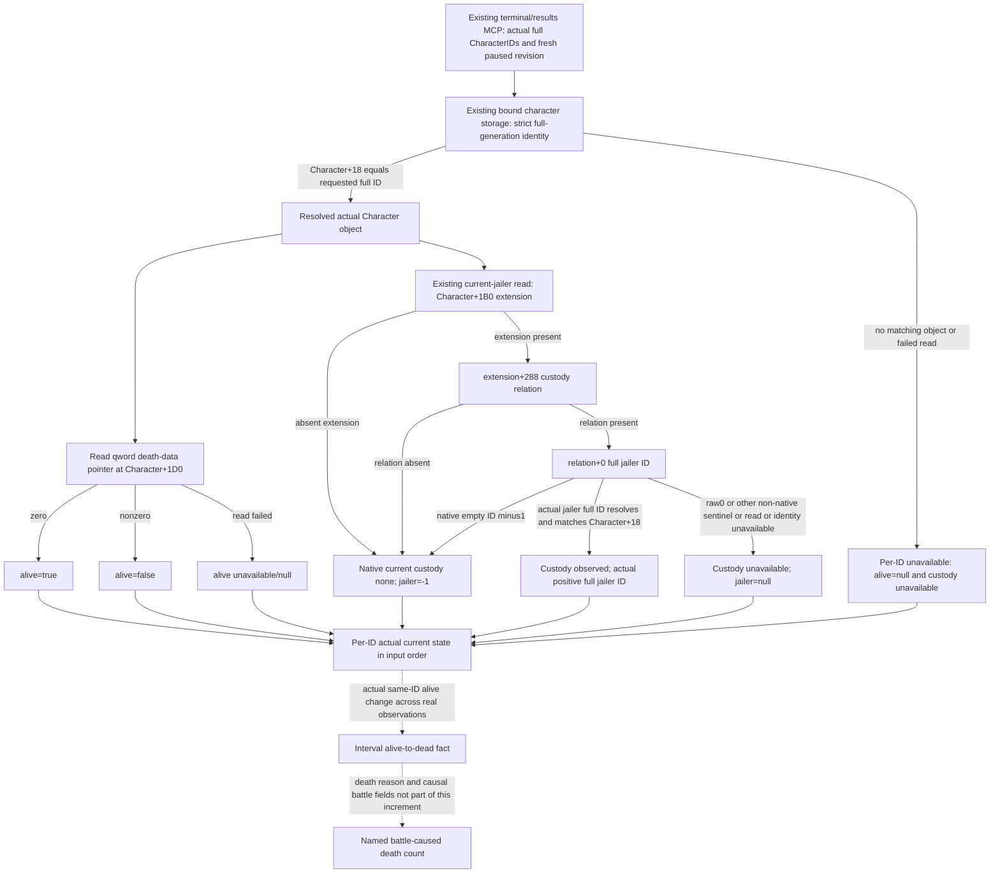

# Arbitrary actual character alive and current jailer — CK3 1.20.0.3

2026-10-04. Native input tree for adding per-full-CharacterID observations to the existing terminal/results MCP. Exact game is CK3 **1.20.0.3 / Steam25652598**, EXE SHA-256 `94B55397ABB687A3DCD436805A5D885E6BE90FA6C693FEB44A9E3BBEEADE02A6`. Source input is the readonly `Z:/g49` preimage. Native input research is file-only; Root owns shared source, Git, SDK, full builds and actual game/window operations.

First input is the already-frozen `battle-player-next-capabilities-v46/terminal-totals/TREE.md`. Adopted final-survivor and saved-character/current-jailer production components remain the basis. This increment accepts already genuinely observed actual full IDs, including retained real-side knight IDs, through the existing terminal/results query; it adds no separate module, MCP tool, flag or action gate. It does not require a terminal event to have occurred. Root reports zero actual player battles at this research entry; that context is not a new live sample by this lane.

## Native observation tree



Alive and custody are independent properties of the same strictly resolved character. A dead character is still a valid object for current state observation. Roster absence or failed full-ID lookup is not death. No result-object lifetime or stock `.1002` completion is required for a current character read.

## Exact alive leaf and object identity

The exact `.3` foundation ledger `native_bridge/research/ck3_1_20_0_3_foundation.json` already pins native consumer RVA **0x28EE9BA**, bytes `48 83 B9 D0 01 00 00 00`, instruction `cmp qword ptr [rcx+0x1D0],0`. The ledger's `CCharacter.death_data` semantics are **zero=alive, nonzero=dead**. This is a **64-bit pointer comparison**, not an int32 flag or an integer death count. The query only reads the pointer value; it does not dereference death data. No standalone native alive callback needs to be bound or called.

Current source primitives agree: `include/xar_bridge/ck3_12002.hpp` declares `kCharacterDeathDataOffset=0x1D0`; `.3` `ck3_12003.hpp` aliases it; `ck3_12002_family.cpp` checks `character != nullptr && Load<void*>(character,kCharacterDeathDataOffset)==nullptr`. That internal bool helper returns false for a null object through short circuit. The public per-ID observer must preserve **unavailable/null** for a missing/unresolved object instead of reporting that helper's false as a death. A successful field read returning numeric pointer zero is an observed live character; a failed read is not numeric zero.

Use the existing `BattleBindings.character_storage_slot` and strict resolver. The frozen `.3` foundation separately pins storage RVA0x5C67568, slots+0x20, capacity int32+0x2C, index mask0x00FFFFFF, stride0x10 and object pointer+0x08, then full-generation equality at Character+0x18 (native consumer0x28EE7D0). Slot-index equality alone cannot identify the requested actual character. The current production resolver supplies this identity; the increment does not change the binder.

## Actual current jailer and legal absence

Reuse the adopted current-jailer observer and its exact previously closed native getter **0x289E830**:

```text
strict requested full CharacterID -> Character+0x18 identity
Character+0x1B0 -> extension
extension+0x288 -> custody relation
relation+0x00 -> full jailer CharacterID
strict jailer Character+0x18 identity
```

An absent extension/relation or native empty jailer identity **-1** is **legal native none**, represented by the existing `none/-1` custody contract. Raw jailer0 or another non-native sentinel, a positive jailer identity that fails strict generation resolution, or a field read failure is **unavailable/null**. A resolved actual jailer is `observed/positive full ID`. Read custody even when alive=false; death status does not create an invented custody value. A capture candidate row is not current imprisonment, and current custody does not establish capture cause or completion of deferred effects.

## Minimal provider entry and delivery boundary

Extend the existing terminal/results query with actual full `character_ids` and its existing expected-revision observation contract. In the current battle provider, reuse strict character resolution and the adopted current-jailer read, add the one qword/null alive comparison, and return per-ID status, nullable alive, custody status and actual jailer. Read requested IDs independently of whether a Combat/Result or a terminal journal event currently resolves. Preserve caller order and use actual full IDs, not a reconstructed old foreign set. Existing terminal-character observations may reuse the same local read function to avoid divergent null semantics.

Native input readiness here is **research closed**. Producer implementation, the single focused source fixture and static readiness are separate receipts. A genuine paused same-MCP query is required for a production observation. No own-battle result, killed aggregate, battle-caused capture/death count, complete script execution, or complete OODA is credited by this research.

Related adopted topic: [final survivor and saved character observation](battle-terminal-final-survivor-character-observation-1.20.0.3-2026-10-03.md). External source/EXE evidence pins and native delivery receipt are under `Z:/ck3_mod_rewrite_process_assets/g2-resume-20261003/battle-casualty-outcomes/oct4-character-alive-increments/native-research/`. Existing leaf and binder-fault evidence were reused; no SDK, new native call, live window, matrix rerun or shared edit was performed by this native lane.

## 2026-10-04 provider / focused fixture 增量

现有 `BattleTerminalTransitionRequestV1` 接受 `character_ids`，同一 MCP 输出 top-level `character_observations`；复用的 custody row 追加 nullable `alive`。请求顺序保留，完整 ID 去重；原 terminal journal 中已有的 custody 行复用同一人物读取函数。新字段不依赖当前 Combat/Result 或已发生 terminal event，合法 alive false、合法 no-jailer -1 与 unavailable/null 分别保存。

唯一新 test：`ck3_autonomous_player/native_bridge/src/ck3_12002_battle_character_alive_test.cpp`。实际生产 reader → 现有 serializer 的本增量版本 → Python normalizer，使用 `/O2 /DNDEBUG /W4 /WX`，Require 检查保持启用；6 个必要 TU 并行编译，只执行这一条新 case。

一帧请求三个非 journal 名单的实际 fullIDs：`0x1000008` 的 death-data qword 为零、当前 strict jailer 为 `0x1000001`，得到 alive=true / observed；`0x1000009` 的 synthetic death-data qword 为 `0x100000000`（只 high32 非零，不解引用），得到 alive=false / none / jailer=-1；`0x2000008` 与 live ID 同 slot、generation 不匹配，得到 alive=null / unavailable / jailer=null。此处 synthetic 指针值只证明 native qword 比较，不冒充真实 RAM。

查询使用合法 character-only 请求：prior/subject 均为 absent（C++ -1，MCP 显式 None），无需伪造 combat/unit context。fixture Combat/Result 已移除、subject combat backlink 已清掉，journal 未初始化或捕获事件、snapshot latest_sequence=0；人物观察仍可用，整体 status available 与 terminal readiness=false 分别保留，wire 的 prior/removal/subject/successor 为合法 null。Python 的 `expected_character_ids` 显式核对同三个 IDs 和上述状态，没有用 roster 缺席推死亡，也没有重复旧 side/custody 矩阵。

验证 receipt：`Z:/ck3_mod_rewrite_process_assets/g2-resume-20261003/battle-casualty-outcomes/oct4-character-alive-increments/fixture-topic/focused-attempt-01/RESULT.json`；原始输出位于同级 `native-wire/actual-character-frame.json`。新增生产路径首次 focused GREEN：1 native frame / 1 Python normalization；没有 SDK、窗口、full DLL 或 shared/Git 操作。

截至此 receipt 为 **static-ready + 离线生产路径 fixture GREEN**。Root 当前玩家尚未接战、没有新的实际 per-ID paused artifact；本 lane 不计 production-live，也不计 killed/captured aggregate 或 battle-caused death。下一步由 Root 合并构建，在原普通战役的真实 paused MCP 中请求已实测的 full CharacterIDs；若要报告同一人物从 alive 到 dead，须另保存两个真实帧及相应身份，因果死亡结论仍需原生原因字段。
