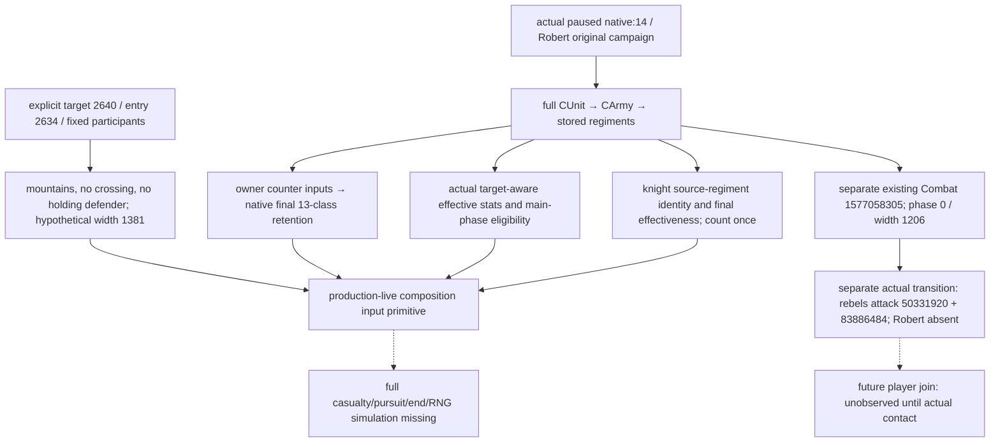

# CK3 1.20.0.3：Robert 当前战斗兵种、骑士与克制输入

本页消费一次已经完成的实际 paused v2 查询，状态为 **production-live primitive**。它观察真实军队的当前兵团与修正，并在指定省份构造假设接触；尚未证明玩家加入任何战斗，不是完整 battle OODA、胜率或战争完成。

来源为 `Z:/ck3_mod_rewrite_process_assets/g2-resume-20261003/war-battle-phase/actual-battle-discovery-v34-02/004-ck3_query_combat_simulation_inputs.json`。当前 runtime v34 冻结源提交 `5b2030b09041dbfcea11104e15d155a3b9aac1d6`，安装 build 1.20.0.3 / Steam 25652598，Root 冻结 EXE SHA-256 `94B55397ABB687A3DCD436805A5D885E6BE90FA6C693FEB44A9E3BBEEADE02A6`。查询的 source 仍保留 game_version/executable_sha256=null，精确版本来自 Root runtime freeze，不能把 null 改写成查询自行发布的版本。Robert 29829 / 原 episode `native-29829-2bc2d599f7f9`、date_raw 53236608、paused=true、native:14 / public revision 2、common_war_ids=[50331736]。

## 当前组成

| 类型 | 玩家当前/最大 | 叛军当前/最大 | 当前主战资格 |
|---|---:|---:|---|
| levy | 1657/1772 | 2880/2880 | true |
| pikemen_unit | 200/200 | 300/300 | true |
| armored_footmen | 100/100 | 0 | true |
| bowmen | 145/150 | 0 | true |
| light_horsemen | 143/150 | 0 | true |
| conrois | 75/75 | 0 | true |
| knights | 14/14 | 0 | true |
| mangonel | 0 | 10/10 | false |
| 总人数 | 2334/2461 | 3190/3190 | 玩家 2334，叛军 3180 主战 |

玩家 CUnit 83886367 对应 CArmy 50331794，实际位置 2614。叛军 CUnit [251658381,473,474] 对应 CArmy [167772260,461,462]，实际位置 2640；FullID 473/474 是合法 generation 0，按原值使用。玩家 owner 29829；叛军 owner 70766。

14 名玩家骑士武勇合计 120，最终 knight_effectiveness_raw=175000/scale=100000，每个 source_regiment_id 都已在同一军队 regiments 列表中。骑士 members 是这批兵团的身份、武勇与最终效果投影，汇总人数或 damage 时不能再加一次 members。叛军 knights.status=available 且 members=[] 是合法空集。四支被选军队 commander.status=absent，generic_advantage_points=null；available 的目标上下文 roll bounds 0/0 保留原始输出，不能把没有统帅改称读取失败。

## 原生目标上下文与克制

所有 effective_stats 都绑定 source_target_province_id=2640；例如玩家枪兵 damage=22/toughness=51.84，叛军枪兵 damage=22/toughness=40.32，当前 stat 相同的类型名不代表最终修正相同。原生最终 counter_resolutions 有 13 个 class：玩家 light_horsemen/class 4、conrois/class 5 的 damage_retention=0.10；叛军 pikemen_unit/class 1 的 retention=0.81251。其他返回 class retention=1.0。双方 owner counter_efficiency_raw/counter_resistance_raw=0 是本帧已读到的合法零；最终 context_scale_raw 分别为 100000 与 125000，不能以 owner 零值替代原生 final resolution。

假设接触的 target 2640 是 mountains，combat_width_multiplier=0.5，入口 2634→2640 crossing=none，defender_side=enemy、holding_defender=false。该 scenario 的 precontact width base=2762/final=1381，participant policy 是固定当前指定参与者、无增援；actual_route_dependency=false。Root 从真实 route preview 选择入口，并不改变此查询的假设位置合同，也不证明到达时敌军仍在此处。

同一查询另发现已有 Combat 1577058305 位于 2640，phase=0/day=0、base/final width=2412/1206、side rolls=0/0、base_advantage=-1200000/resolved_advantage=0，orientation 为 native side 0 attacker / side 1 defender。这些值属于当时已存在的战斗。玩家当前仍在 2614；v2 本身不发布该 Combat 的实际双方成员，不能将假设 attacker/defender 数组或 width=1381 套到既有 Combat。

随后已保存的独立 ID-only transition（`war-battle-phase/actual-battle-transition-v34-01/004-ck3_query_battle_transition_v1.json`，native:16 / public 2、同日 paused）确证存储顺序：attacker [251658381,473,474]，defender [50331920,83886484]。Robert CUnit 83886367 不在双方；当前 maneuver/day 0、winner/forced_winner=none、finalized=false。此闭合实际成员证据仍不能将 player-vs-rebel 假设的 commander、counter retention 或 player stats 当成现存战斗的 modifier。

## 证据边界与继续入口

`input_observation_ready=true` 表示此 v2 组成/目标上下文片段所需输入已发布。`monte_carlo_ready=false`，缺失域为 damage_to_casualty_allocation、pursuit_transition、battle_end_and_retreat_transition、phase_event_rng_and_effects。玩家 knight effectiveness_components.status=unavailable；其 modifier/operand 零数组不得当作已证零分量，已发布的 final effectiveness/damage/toughness 可直接使用。

机器字段保存在 `Z:/ck3_mod_rewrite_process_assets/g2-resume-20261003/battle-composition-actual/ACTUAL-COMPOSITION-FIELDS.json`，记录完整兵种分组、原生 retention、分量状态、stock 定义文件 SHA 与来源位置。附带的主战人数加权 damage/toughness 只按当前兵团 stats 和原生 retention 作整数算术，不含 width admission、side advantage、phase effects、casualty allocation 或未来增援，不能转述为胜率。既有 adapter `combat_input.py:306` 同样只汇总每个 regiment；`:345` 明确 current_soldiers 不能替代以后阶段的 current_fighting。

源语义定位为 frozen `ck3_12002_combat.cpp:544`（counter absent）、`:1730`（骑士 membership 去重）、`:1751`（目标地理）、`:1763`（hypothetical width）、`:1768`（native resolution）、`:1841`（先判 v2 observation ready，再追加全模拟缺口）。安装 stock 的 `00_maa_types.txt` 定义这些普通类型，`07_ep3_maa_types.txt:67` 定义 conrois；final effective stats 使用本次实际查询，不用 stock base 值覆盖。

本工作包没有新增 SDK、游戏动作、窗口操作、测试或 Git 修改；复用现有 available 实机证据。后续由 Root 消费独立 existing-combat transition，使用实际 route/horizon 决定移动，再在自然推进与真实接触后刷新组成/阶段，完成观察 → 决策 → 操作 → 验证。完整模拟缺口是施工入口，不是已撤销非战授权规则。

## 2026-10-03：v40 真实目标省军队组成只读输入

Root 于 v40 / R0019 / PID28788、frozen g42 / source `02e88d57fcef399368f34b23f497d3e8565af95d` 的 Robert29829 原普通战役，在 raw53238336 调用既有 registered `ck3_query_combat_simulation_inputs` v2：target2604、entry2605、player public CUnit83886367、current War16777231 敌军50331920。这是 explicit hypothetical contact，只将当前真实军团组成在指定目标省求值；远程敌军和 caller 指定的 attacker/defender role 不代表实际接战。

该实机叶确实返回玩家军队40条真实 RegimentID，全部 identity/kind/effective_stats 可读，native CArmy50331794、owner29829。每条 `current_soldiers` / `maximum_soldiers`、MAA type 和 `siege_value_raw` / scale100000 已逐项保留为CSV；具名 pikemen_unit、armored_footmen、bowmen 的目标省 siege raw 均15000，具名 light_horsemen/conrois、levy及无 MAA type 的相应行均为合法0。无 MAA type 的可用 men_at_arms 行不能猜成普通招募兵种或围城器械。没有将 siege raw 求和为整支军队每日围城工作。

当前实际 commander 为 Robert29829，generic advantage34，target2604 的 effective roll bounds0..10，均 status available。`input_observation_ready=true`，`monte_carlo_ready=false`；四个缺域仍为 damage_to_casualty_allocation、pursuit_transition、battle_end_and_retreat_transition、phase_event_rng_and_effects。当前部分只读输入为 production-live primitive，不是玩家战斗、实际contact、胜率或全场战斗OODA。

查询 source.game_version / executable_sha256 在此 service 结果中为真实null并保留；exact .3 / EXE SHA 的归属来自 Root 同一runtime packet和受管实机，消费者没有伪填这两个查询字段。纯文件消费者先因假设这两个元数据必非null而报 harness RED，随后根据实际返回允许并记录该合法缺失，仅重新消费同一已存在叶一次，没有重发游戏query或推进时间。

独立纯文件消费 GREEN / 96显式Require，无removable assert，未重跑已GREEN的rich-siege或旧combat矩阵。证据：`Z:/ck3_mod_rewrite_process_assets/g2-resume-20261003/runtime-preparation/v40/actual-retreat-composition-v40-01/008-ck3_query_combat_simulation_inputs.json`；消费者 `Z:/ck3_mod_rewrite_process_assets/g2-resume-20261003/siege-efficiency-inputs/production-validation/actual-composition-v40-01/ROOT-DELIVERY.json`、同目录 `ACTUAL-COMPOSITION-PROOF.json`、`ACTUAL-COMPOSITION-SUMMARY.json` 与 `PLAYER-REGIMENT-SIEGE-VALUES.csv`。

同次 Root 独立正常保存 h5034 / raw53238336 / 91,105,480B / SHA `7ebe6682539b7e5477566a4613afc2b36356e0880ed94a0d7f9c4a3b62758983`；累计3917日 / resume764 / 2026-10-03增量669保持不变。本纯文件lane 0 SDK / 0游戏 / 0窗口 / 0 Git写 / 0新日 / 0收复、战斗或战争胜利信用。将领 siege-phase modifier 新候选源码属于另外的 source/static 包，此 actual 旧口未发布该新字段，不混为已实机读回或已加速围城。

Root 同轮 R0019 / PID28788 已正常退出 `exit 0`。本文前面的 v34 表格和目标2640仍属于其原帧；本段 target2604 的当前实际输入不回填旧表。
