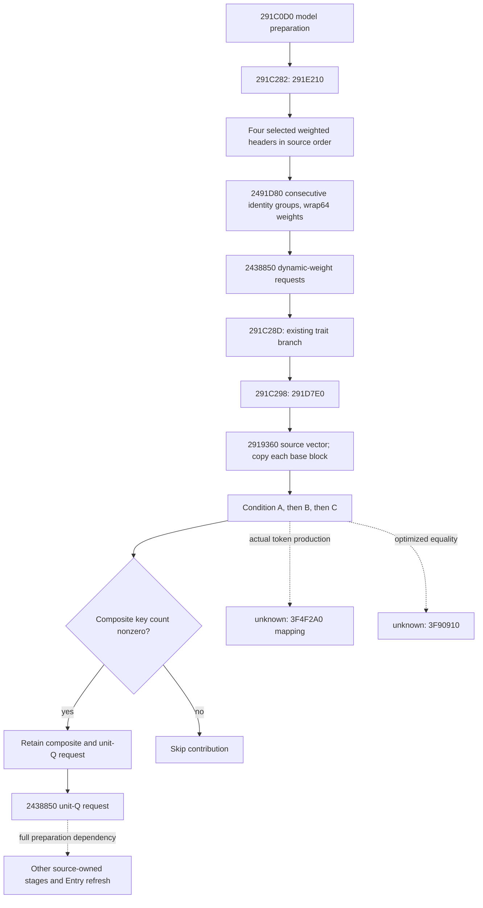

# Two actual Character context preparation branches — exact 1.20.0.3

2026-10-05 / 2026-W41. These branches supply actual modifier-context inputs
before effective Character attributes are computed. They do not directly
write Character+EC or Combat Entry slots. The `291E210` ordered request emitter
is **static-ready**; the `291D7E0` primitive input contract is **research /
source-closed**. Current input observation and complete future context remain
separate work.

Build: CK3 1.20.0.3, Steam25652598, EXE SHA-256
`94B55397ABB687A3DCD436805A5D885E6BE90FA6C693FEB44A9E3BBEEADE02A6`.
The frozen static source is
`artifacts/migrations/2026-10-02/installed-build/binaries/ck3.exe`.
Existing complete caller `291C0D0..291CF4F`, 3711 bytes, was read once by the
parent; both source lanes reused its shared ingress receipt. The caller binds
`model` to RCX, `Character=[model+8]`, and destination context to `model+10`.
Native order is `291C282→291E210`, existing trait branch
`291C28D→291D460`, then `291C298→291D7E0`. Neighbor branches
`291C2A3→291DED0` and `291C2AE→291DCE0` are Terrain-owned.

All bounded captures, bytes, disassembly, `.pdata`/unwind pins, read costs,
trees and construction APIs are under
`Z:/ck3_mod_rewrite_process_assets/g2-resume-20261005/battle-context-preparation-two-branches-v84/`.
The mutually exclusive lanes captured only necessary bodies: A read977 bytes
(705 code /204 `.pdata` /68 unwind), B read2628 bytes (2172/420/36). Total new
EXE read cost is3605 bytes. Frozen full-image SHA and existing common writer,
government getter and signed-membership contracts were reused. No whole-image
hash/scan, process/RPM, SDK, GUI or previous callback test was performed.

## 291E210: four dynamic weighted spans

Four independent selected source headers are consumed in fixed native order:

| Source | Actual selection |
| --- | --- |
| Lifestyle span | `28BB630`: Character+1B0 carrier → carrier+188; otherwise actual static header54E7288 |
| Dynasty span | Full-ID House resolve from Character+158, then Dynasty ID at House+2C → Dynasty+140 |
| House span | Selected House+168 |
| Extra House span | House+218 byte nonzero selects House+200; otherwise native empty header54E56B0 |

House/Dynasty resolution checks the complete DWORD generation and preserves
native fallback selection. The selected fallback header must be observed;
failed observation is not an empty count.

`2491D80` consumes header data at+0 and signed count at+C. Rows have stride48
hex, definition pointer at+0 and signed64 Q weight at+30. Inside each header,
only **consecutive equal definition pointers** are grouped with wrap64 addition.
Each run requests `2438850(context, Definition+40, grouped_weight)`, including
zero weight and empty PropertyContainer requests. Equal pointers in later
nonadjacent runs or different source headers remain separate. This stage does
not impose a weight of100000.

`battle_context_preparation_branch_291e210_12003.py` implements
`emit_291e210_contribution_requests_12003` with typed source rows, spans and
requests. It preserves opaque actual Definition+40 blocks by reference and
performs no aggregate application. Missing consumed required inputs raise a
path-specific ValueError; a nonpositive native count is a legal empty span;
disabled extra House input is unread.

The sole new synthetic focused case uses `-B -O`: **one emitter invocation,
seven requests, eleven explicit checks, FIRST GREEN**. It distinguishes
consecutive grouping from nonadjacent/cross-header grouping, signed wrap,
legal zero and empty blocks, actual count and disabled extra House behavior.
Original source and module/test/runner were frozen before that sole execution.
No old Entry/knight callback cases were rerun.

## 291D7E0: ordered composite sources and three conditions

Complete `2919360` selects Character+1B0 carrier+220's ordered pointer-vector
header, or actual static54E78B8. Each source supplies base U16 keys at+280
and parallel signedQ64 values at+2E8, plus retained auxiliary provenance at
+410/+430/+438. It copies that base and processes three condition vectors in
their stored order:

| Vector | Admission inputs | Selected property source |
| --- | --- | --- |
| +550, stride30 | Selector A+7A0 QWORD set contains row+20 pointer | `4212800` validates magic4744624F, finds the first row with equal object DWORD ID at+10, returns row+28 property pointer |
| +568, stride1C8 | `2549810` signed key membership in selector B's primary or any nested keyset | Embedded row+8 container |
| +580, stride1D0 | Actual condition token belongs to government+50 signed token set, XOR row+1C8 invert byte | Embedded row+8 container |

For A, native fallback is the actual container5DC21B0; it must not be assumed
empty. For C, a string name or source row key cannot substitute for the actual
signed token. `30A5FE0` calls `3F4F2A0` on token manager5CBEDE8, then performs
signed membership. Exact token production/current mapping is a concrete next
source/observer entry. The known scalar/SSE `A11F60` paths implement QWORD
equality; its delegated `3F90910` native optimized equivalence remains an
unexpanded edge. Required resolved-object provenance can be supplied without
expanding a generic registry.

After conditional merges, temporary key count+C zero skips the contribution.
A nonempty composite is retained at model+248, preserves source/Character
origin, and calls `2438850` with unit Q100000 into context+68. The existing
writer contract supplies arithmetic; Dynamic owns new-key storage handling.
This packet supplies exact normalized inputs and construction order for B,
not an implemented composite producer or current query.

The next observation increment is concrete: add A's selected spans and
distinct definition blocks, and B's ordered base/conditional sources plus
actual selector/fallback/token inputs to the existing same-frame Character
context query. Dynamic has recorded these dependencies separately from its
current precontext provider package. An old final prepared aggregate cannot
serve as the earlier prebranch baseline. Full future context, Entry timing,
battle win odds and live execution are not claimed by this increment.
