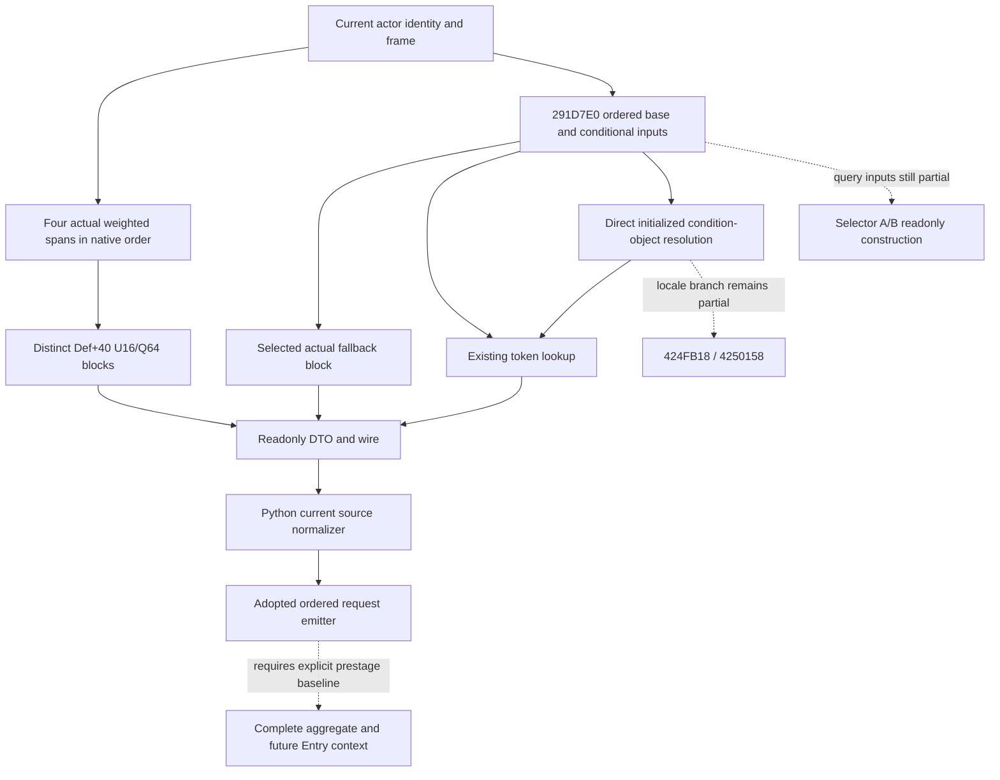

# CK3 1.20.0.3 current context source observation

This package observes the current native inputs consumed by `291E210` and `291D7E0` through the existing current-person query. It keeps the independently observed source rows separate from the context before native preparation and from future CombatEntry refreshes.

Exact source binding: CK3 1.20.0.3, Steam build 25652598, EXE SHA-256 `94B55397ABB687A3DCD436805A5D885E6BE90FA6C693FEB44A9E3BBEEADE02A6`. The frozen source identity is reused. The preceding two-branch source tree and ordered emitter were adopted at `c3c60c6f`.

## Native consumption and observation

The `291E210` source tree proves four separate weighted spans in native order. Lifestyle is selected from the current Character component at `+188`, or the actual static fallback header. Dynasty and House use native full-ID generation resolution and their actual fallback objects. The extra House span follows the actual `+218` gate. Each span publishes its signed native count and rows in their original order. A row retains its same-frame definition identity and signed Q64 weight; each distinct definition publishes the actual `Def+40` U16/Q64 property block.

The observer reads selected headers directly. It does not call lazy getters, the native preparation function, the contribution writer, or any Character/Entry writer. Observed nonpositive counts follow the native empty-consumer path. An observed empty property block and a raw zero weight remain valid values. A failed consumed read remains unavailable and records the concrete field, without constructing an empty or zero substitute.

`291D7E0` consumes an ordered current source census, base blocks, three sets of conditional rows, selector membership inputs and actual condition tokens. Its actual `5DC21B0` fallback property block must be read when selected, rather than treated as empty. The token helper `3F4F2A0` is a mutating interner: a miss creates a lowercase string/map row and appends reverse storage. Consequently a readonly query must use actual already-existing lookup state and must not invoke the interner or initialize its manager. The complete `3F51AB0` source proves a find-only path with no manager, table, initialization or allocation writes. A found node supplies its actual signed token, including zero; a miss remains unavailable because the native consumer would intern it.

The current manager's reverse census retains native token indices and stored strings; per-row observation does not need an eager census of that entire manager. The separate `3F8A6F0/3F8A800` source now proves direct readonly condition-object selection: the raw source key's masked index selects the actual initialized registry row, or its prepared static fallback. No generation test is added to this native index path. The actual string object supplies its stored bytes, length and capacity. Unprepared or in-progress initialization remains unavailable without invoking either getter.

The complete `4235FF0` source supplies a direct readonly default-locale classification recipe. Empty strings bypass prefix classification; a leading minus or nonzero native classification returns token zero before lookup. Other prepared strings use the safe existing-token lookup. The nondefault locale delegation remains an explicit partial branch with concrete `424FB18/4250158` entries. A lookup miss remains `token_not_currently_interned_would_intern`, rather than a synthetic token. For an A property block with zero keys, the value header is not consumed and may be unavailable without invalidating the empty operand. B's base-copy path separately consumes the key and value headers; its values are observed independently. The unclosed shape of source `+410` is retained only as opaque provenance and does not claim exact origin-copy parity.

## Interface separation

The new nested `current_context_source_inputs` is independent of Dynamic's `current_prior_context_inputs` and Terrain's `current_context_task_position_inputs`. The native collector, wire serializer and Python normalizer keep native order, signed Q64 values, full identities, FFFF keys and native fallback provenance. Old field absence, an unavailable read and a legitimate zero or empty consumer remain distinguishable.

The public adapter uses only the available `291E210` input branch to feed the adopted ordered request emitter. A partial `291D7E0` token/resolver leaf does not erase independently usable A inputs. Source requests do not establish an aggregate baseline, future dates, a stable Entry census or complete future battle context.

The B snapshot exposes ordered base and conditional rows, actual fallback blocks, and the prepared default-path C token and government-membership inputs. A/B selector admission fields remain explicitly partial in this implementation. Their next readonly construction entries are the Character `+B4` registry chain and selector `+7A0` QWORD set for `A11F60`, and the Character `+B0` selector with primary/nested signed sets consumed by `2549810`. These fields are independent of the now source-closed C token path; they are not filled from labels or assumed booleans.

## Evidence and remaining work

The parent delivery packet records the exact source seals, candidate and patch pins, the sole new necessary offline fixture, selected translation-unit recipes and Oct5/W41 report fields. No previous Entry, knight or V84 emitter case is repeated. Root alone adopts the shared patch and performs the full native build and any actual paused snapshot validation.

Actual readonly observation is a prepared primitive until Root validates a real paused frame. Uninitialized selected inputs, missing existing tokens and the nondefault locale path retain their actual reasons and concrete source entries. The separately supplied current source census cannot replace a native prestage context snapshot.

## Offline qualification, 2026-10-05

The unique new scenario passed on its first execution: one native collector and production serializer invocation, one actual Python normalizer/adapter/emitter crossing, 30 explicit checks and eight expected A requests. It made 156 fake-memory reads with zero read errors and left all five poison ranges untouched. The image verifies full source keys separately from native masked indices, prepared initialization guards of -2, native early token zero, a signed existing lookup result of -9, a miss retained as null/would-intern, partial selector admission, and independent B key/value counts. This is an offline production-path fixture, not a paused native snapshot.

Three necessary production translation units pass isolated `/c /W4 /WX`: the new helper, the changed battle collector and the terminal serializer consumer. The original helper C4456 local-shadow compile failure remains in attempt-01. Attempt-02 compiled the old source because the correction routing used the wrong path form; that harness failure is retained separately. Attempt-03 compiles the immutable two-line correction. Successful production units were reused. The standalone driver was rebuilt after its pre-execution guard hand-vector changed, and the corrected helper object was reused for its narrow link. No previous case, full native build, SDK operation, game day or window action was performed by this package.

Native source collection added 2864 bytes total: 2372 code, 420 pdata and 72 unwind bytes across five uniquely owned logical bodies. The frozen full EXE SHA was reused. Root owns shared adoption, full build and subsequent actual frame qualification. Readiness is static-ready; complete B admission, alternate locale, prestage aggregate and future Entry transitions remain partial.
