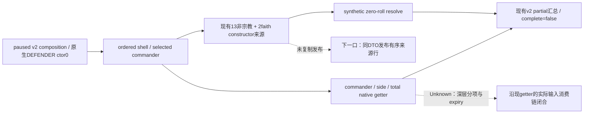

# 2619 解围投影：优势来源解释入口（2026-10-04）

以下为本日已交付研究的冻结基线（**research**）；后续13行发布实现投影与static-ready fixture结果见文末。复用 CK3 1.20.0.3 / Steam 25652598 / EXE SHA `94B55397ABB687A3DCD436805A5D885E6BE90FA6C693FEB44A9E3BBEEADE02A6`、native g54 `889821f5a8f55e5d6a2a2f724d7693e3575118a7`、Python g56 `210943a7c1fd002b4a74ba4ce891e2391d139602`。两个 lane 分别只消费已归档 NORMALIZED 与 SIDES 缓存；没有重新读取 SDK 原始叶、运行游戏、测试或修改共享源码。安装版 stock 与现有生产代码的逐文件哈希见外置 `native-quality-research/SOURCE-PINS.json`。

缓存 native866/public2 给出 target2619、plains、`holding_defender=true`、DEFENDER constructor0/null-entry。ordered attacker 为16777683/268435747（2328+151兵），defender为83886367（3728兵）；兵数是 regiment 当前士兵和，不是 fighting-only 战斗兵力。selected commander30470 的 generic21 / dynamic−9，Robert29829 的 generic33 / dynamic+41；side dynamic和target residual均0。constructor base0、synthetic zero-roll total−50只闭合 `base + side0 − side1` 的假设接战坐标，不是当前 actual CCombat、抵达、胜利或胜率。Root 的 projector 角色锚点与 v2 native866 保留各自来源，不混改 revision。

| 已闭合消费链 | 当前发布情况与边界 |
|---|---|
| 每军 `CArmy+0x120` commander；`0xC6DED0(character,-1,false)` generic | 通用基线独立发布；不是 contextual 分解。 |
| query-owned ordered sides → `0x264D790` selected identity → side+0x74 | 显式参与者的局部 native selector；不是 actual Combat side，也不发布候选排名。 |
| `0x2589E10` commander、`0x25899C0` side、`0x258A470` total；`0x258B510` zero-roll resolve | 最终 dynamic、算术 residual 与 helper equality 已发布；深层 modifier 各项尚未归因。 |
| `BuildNonReligiousAdvantagePlan` 的13来源 + 当前 faith 的2来源 | 内部已有有序 constructor ledger；v2仅发布 faith 行，没有复制13条非宗教行。 |
| holding：`0x2C09D30` predicate → province modifier0x1EB + holding aggregator0x1D6 → Rules+0xF10 points×scale | 路径已闭合；本帧逐来源 scale/贡献未发布。`holding_defender=true` 和 base0不能替代乘积或命中行。 |

faith provider 已在 g54 启用；本帧 target faith23/rite152 非 unreformed，两行 `target_faith_not_unreformed` 是有效不应用，contribution0。owner faith/rite 的 null 是短路结果。`religion_constructor_sources_ready=true`、`missing_domains=[]` 与 complete=false同时成立：现 serializer固定完整 encounter readiness=false；MC也false。旧专题的 faith pending 只保留其历史截止。

安装版声明 recently-disembarked advantage−30和 `DISEMBARK_PENALTY_DAYS=30`；隐藏 holding effect声明1，stock info允许动态乘数/代码替换。因此不能从21→−9或33→41的差值认定最近登陆或holding命中。精确 disembark active/expiry getter、时间边界及动态分项仍 **Unknown**；现有13来源 ledger不含 disembark 或 nested dynamic attribution。

最小下一口是复用 `phase.cpp:1015–1036` 已取得的 model，将13条非宗教 `constructor_sources` 原样带到现有 DTO / typed serializer / normalizer；保留 stage、side、selected/applied、effect points、scale、signed contribution、before/after、append_order与skip_reason。已有完整v3的来源 serializer可作结构参考，无需启用整套v3或新增getter。新帧可解释holding与来源抵消；旧缓存不能补造未发布行。动态深层入口继续沿 `0x2589E10` 的已知 Character martial、opposing-primary、modifier与relation/side aggregator消费链；业务名称或expiry地址未闭合时保留Unknown。

上述冻结研究只交研究与施工入口，不新增功能或门禁；其后Root已独立推进实际接战。该Root游戏进展由Root最新actual artifact记录，不把此处2619缓存更新为当前战斗。采用与后续paused新帧由Root安排。完整 getter/源码行映射在外置 `native/SOURCE-NOTES.md` 和 `native/SOURCE-PINS.json`；安装版声明在 `stock/SOURCE-NOTES.md` 与 `stock/SOURCE-PINS.json`。新增实机样本、动作、天数、测试、SDK、共享代码与Git操作均0。

## 2026-10-04：现有13条 constructor 行的 v2 发布投影

这是后续实现投影，基于上面的已冻结研究；**static-ready，native3/3与registered-MCP3/3 GREEN；尚无本扩展的新实机信用**。Root批准的最小改动只覆盖现有 DTO、`ReadContextualAdvantageInputs`、typed serializer 和 Python normalizer 四个生产文件，不新增getter、public API、MCP、flag、schema版本或current availability gate。

`ContextualAdvantageSnapshot.nonreligious_constructor_sources` 使用新增 typed `ContextualAdvantageConstructorSourceSnapshot`，复制现有 `BuildNonReligiousAdvantagePlan` 的13个非宗教来源行。Wire为同名 optional additive键：context available时发布13行，context unavailable时为null；旧wire缺键继续接受。每行原样保留stage、side、selected/applied、effect key/points、scale、signed contribution、before/after clamped accumulator、append_order与skip_reason，沿用full-v3来源行的null语义。Faith2行保持已有独立发布口，不计入13条。

来源槽为 adjacency×2、terrain×2、supply×2、holding×1、first-army gathering×2、owner debt×2、treasury debt×2。原生 `Append` 和source顺序决定累计值，逐次clamp至±10,000,000；serializer/consumer不重算或从stock声明猜命中。本扩展可解释holding实际points×scale、selected/applied与constructor来源抵消；disembark expiry和nested dynamic分项仍不在此ledger内，保持Unknown。

实施前置树、13槽与四文件计划见外置 `native-quality-research/implementation-ledger/docs/NATIVE-TREE.md`；原冻结pins仍见 `native-quality-research/SOURCE-PINS.json`。Native producer fixture与Python registered-MCP fixture已由其实现lane提供，最终receipt及harness RED见文末验证段。完整 `complete_encounter_advantage_ready=false`、Monte Carlo readiness=false保持；这个解释字段不升级完整接战readiness。

原 native866/public2 的2619缓存仍是 `hypothetical_constructor_context`，不能改标为Root当前actual battle或胜利。Root已在独立游戏工作中推进接战；当前战斗事实只回链Root最新actual artifact，本文档lane新增实机样本、动作、天数和SDK均0。共享源码采用、cold build、新paused来源观测以及commit/push由Root统筹。

## 历史实际战斗归档帧：2629 / Combat1577058310

指定的 [DAY03 cached actual帧](Z:/ck3_mod_rewrite_process_assets/g2-resume-20261003/battle-observation-schedule/v51-battle1577058310-days01-consumption/DAY03-CACHED-TERMINAL-CRITICAL.json) 已由本docs lane唯一读取一次；SHA-256 `2f2901176bf5c09dcee4bc3f93e467214daaf0ed6268d84c32579a76e4ac61c7`，读取receipt在外置 `implementation-ledger/docs/ACTUAL-BOUNDARY-CONSUMPTION.json`。未读取day01 raw，也未调用SDK、health或control查询。

该归档 actual ongoing-control 帧为 native1102/public13/date_raw53248152：玩家public CUnit83886367位于2629，Combat1577058310，defender side1；phase=main、phase_raw=1、phase_day=0。从maneuver day3进入main day0，`changed_decision_fields` 只有 `phase_raw`；不要把day0写成phase_raw0。own selected commander29829，enemy selected commander为null；两侧current roll均0。base_advantage_raw=−700000，resolved_advantage_raw=−4800000：按100000缩放为attacker视角−48，player defender视角+48仅为符号派生。

这些数是此实际战斗该帧当前control总值，不是13条constructor来源解释，也不证明任一modifier归因或完整model。`winner_side=none`、`finalized=false`，未宣布战果或胜利；该actual在2629，旧2619 ctor0缓存仍是独立hypothetical投影。采样流程因phase变化停止交回Root决策，不记为capability RED。协调者提供Root88437已沿同Combat/cursor358继续，新的代码投影不阻断其运行；本lane没有对此续跑再次观测。

本次仅消费既有actual归档，docs lane新增live样本、动作、天数、SDK和测试仍0。Native producer / Python registered-MCP fixture已达static-ready（见后文）；完整encounter与MC readiness继续false。

## 本扩展静态验证与 Root 后续进展

本扩展已达到 **static-ready**，未执行full bridge DLL/cold build、部署或新的paused来源实机验收。Native producer→DTO→owner typed serializer 的 [最终receipt](Z:/ck3_mod_rewrite_process_assets/g2-resume-20261003/battle-terrain-actual/future-engagement/capital2619-actual-ctor0-v51/native-quality-research/implementation-ledger/native/results/attempt-1791073202319501500/NATIVE-FOCUSED-RESULT.json) 为 **3/3 GREEN**：有序正负贡献与已应用faith2行排除、±10,000,000逐次clamp及zero/gathering skip、unavailable空DTO→null wire。采用 `/O2 /W4 /WX /DNDEBUG` 与explicit Require；owner初次9 TU compile GREEN，最终仅重编fixture TU并复用8个未变native objects。

Owner保留3次 **harness RED**：266字符的外置wire include路径退回旧header，另2次relative include退回旧DTO；这是fixture include解析失败。使用byte-identical的短 `fixture-wire/include` 副本修复harness，生产代码未因此改动。最终receipt中的owner wire header SHA与短副本SHA均为 `fef2bf204a24798b5fb729131b96efcca8a1b904819715a613a9b75a1109fa98`。这条知识用于复用该focused fixture：外置长路径下先采用已验收的短header副本，不把harness加载旧投影解释为生产capability RED。

Python [registered-MCP receipt](Z:/ck3_mod_rewrite_process_assets/g2-resume-20261003/battle-terrain-actual/future-engagement/capital2619-actual-ctor0-v51/native-quality-research/implementation-ledger/python/CONSTRUCTOR-LEDGER-REGISTERED-MCP-RESULT.json) 为唯一 `python -B -O` run **GREEN/exit0**（exit0由协调者记录）：3/3新native场景各通过既有 `ck3_query_combat_simulation_inputs` 一次并精确roundtrip；2个copy-transformation错误仅使context fragment unavailable，v2 composition仍available；4个schema1/2旧absence兼容case与预像相同。Native wire JSONL SHA为 `ca6c37d79bb317c548aa9e26a23723f61e18a00d186f9edf67a878e842585a80`；本docs lane只读两份receipt各一次，未读取JSONL或重跑旧matrix。

DAY03/native1102是**历史actual快照**，不是最新ongoing状态。Root随后协调消息记录：后续9个normal day已收口，`actual_subject_leftcombat`，累计4332/res1179/Oct4+307；Root latest HEAD `de894a8`。本lane没有读取后续terminal缓存，不推断winner或最终战果，不把13条constructor行完整归因到历史player +48。完整encounter与MC readiness仍false；静态扩展新增live样本/SDK/动作/天数0，Root游戏进展单独保留其证据与计数。
