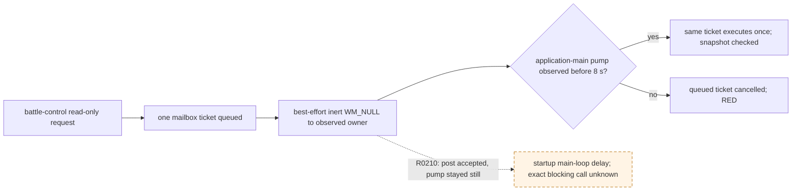

# Battle-control queued application-main wake (CK3 1.19.0.6)

The exact CK3 executable is `2D00FF3101EF70B566F2FCBAE292F09263199C80E9DC8F139B82D7D96F83DB86` (SHA-256). This note covers transport of an already submitted, read-only battle-control query. It makes no claim about combat outcome or attack authorization.

## Observed production failure

- [live-confirmed] R0194 and R0208 cold restored a paused battle but `ck3_query_battle_control_snapshot_v1` returned `application-main battle-control query timed out before execution`. In R0208, combat-v3 and actual-side readback were never called; there were zero typed actions and zero game-date change. Its immutable RED evidence is under `g2-combat-attacker-parity-R0208-red-frozen-20260923` in the process-assets root.
- [source-confirmed] The query submits one `MainThreadQueryV1` mailbox ticket. `TrySubmitMainThreadQueryV1` posts one best-effort `WM_NULL` to the observed application-main thread. `WaitForMainThreadQueryV1` has an 8,000 ms queued budget for battle-control, then cancels a ticket still queued. The battle-control executor did not run in the failed calls.
- [live-confirmed] A separate R0202 actual-side query completed on an R0194-derived paused battle. Thus the read body is reachable in some paused windows, while the two queued timeouts remain real.
- [live-confirmed] R0210 used the integrated wake-trace DLL on an ordinary/xar_off R0157 pair. All 32 repeated `WM_NULL` posts succeeded, but the application-main pump remained at epoch 5240 throughout the 8 s queued wait, and the executor never ran. The game's debug log last recorded `gamestate.cpp:311` setting up powerful vassals six seconds before the paused snapshot. This timing is consistent with startup work delaying the main loop; a thread stack was not captured, so the exact blocking call remains unknown. Raw MCP result and controlled shutdown are frozen in `g2-combat-battle-control-wake-r0157-candidate-20260923/R0210-FROZEN-INDEX.json`.
- [live-confirmed] R0211 exposed a harness mistake before any battle query: the MCP heartbeat publishes `owner_verified_pump_epochs` and `paused_main_thread_observed`, not the native-internal `paused_owner_verified_pump_epochs`. Its exact raw capability response remains frozen in the R0211 asset index (SHA-256 `BA8270133CA67C38477C73AF4069D8ED56BACA8B9840E74EF6EFE35D3A59BB34`). The checked-in regression fixture has the same JSON values with repository-normalized LF endings (blob SHA-256 `DD08DF9B6A2C7FA5EC115093B1198D5FC1695881A9E7097A4345FB1BC42CBA50`). R0211 is completed RED, with zero typed actions and zero date advance.
- [live-confirmed] R0212 used a fresh official R0157 pairing and the corrected gate. After its paused snapshot, the same owner advanced pump epoch 4607→4613 over 12 heartbeat polls. The runner then re-read the paused frame; fresh battle-control CombatID 587202560, attacker side 0, target 2638 and the proven entry 2643 matched a same-frame v3 read. Four private hard-casualty modifier raw values matched exactly: attacker own/enemy 20000/25000, defender own/enemy 0/0. The result is limited to these inputs on this frame. No win probability or attack permission was obtained. The frozen index is `g2-combat-r0157-pump-ready-v2-candidate-20260923/R0212-FROZEN-INDEX.json` (SHA-256 `509E627BE4D658C313C19A22F145EB2BDA4AB7781FD4BFE0B7138DC763ED580C`).

## Minimal transport experiment

Only this battle-control queued wait repeats the same inert wake at a bounded interval while the ticket remains queued and the original 8 s deadline remains intact. Record the pump epoch at wait start/end and each repeat post result. No query resubmission, gameplay command, alternate thread execution, deadline extension, or combat semantic change is allowed. A fixture where the owner ignores the first wake must execute the same ticket on a later wake; a no-pump fixture must still cancel without executing. If a new live attempt remains queued despite accepted posts, retain RED and investigate the exact pump readiness path.

## Package record

`COMBAT-BATTLE-CONTROL-WAKE` starts from remote master `fde0980371b73bd9e69ab330e60d4ee5cb52b7b0` in an isolated Z: worktree. The only production changes are the optional same-ticket wake trace in `main_thread_query_mailbox_v1.hpp/.cpp` and its use by the battle-control branch of `bridge.cpp`. Its focused native fixture exercises both late pump and no pump; the Python battle-control contract remains unchanged. This package does not alter any combat value, query schema, MCP tool name, strategy, or CK3 save/driver. It needs a new exact-build DLL and a fresh, bounded, read-only paused replay before the R0208 transport RED can close.

The focused static result for the wake-trace DLL was Debug/Release bridge DLL link and native mailbox plus battle-control CTest `2/2` in each configuration, with Python battle-control contract `65/65` in normal and `-O`. R0210 subsequently showed that successful wake posts alone did not make the application-main pump advance. The official R0157 ordinary/xar_off pair was then restored independently for R0211 and R0212; their frozen indexes retain the candidate identity and results.

## Post-snapshot pump readiness on the production read-only path

The R0212 gate is now applied only before an exact-build battle-control query is submitted by `NativeHeadlessGameplayDriver`. It samples the existing MCP heartbeat after the driver's paused snapshot, waits at most 40 seconds for `pump_epochs` to increase on the same bridge PID and owner TID with `owner_verified_pump_epochs` covering the new epoch, and requires the same paused date. The 40-second bound leaves room inside the existing 60-second MCP tool budget for the original 8-second native queued wait and IPC. If it does not advance, the driver raises a coded `BridgeUnavailableError` before any native ticket is sent.

After the pump advances, the driver takes another paused snapshot and checks the same episode, player, public/native revision, date, connection, selected controllable army and combat province. It submits only if those still match. CombatID is not exposed in the pre-query snapshot; its identity is checked in the returned battle-control frame, never inferred from history. This gate changes query timing only and does not alter game actions, save/driver state, battle values, probability readiness, or strategy authorization. It reuses the existing DLL; its new Python production path still requires a bounded live replay before claiming production reliability.

`COMBAT-PUMP-READINESS-SHARED` is the Python-only follow-up to R0212. Its changes are confined to the production native-driver battle-control entry, a shared heartbeat gate, the LF projection of the R0211 MCP capability fixture, focused tests and this evidence page. Normal and optimized Python tests for the two affected files each passed `72/72`. Those static tests establish that a stalled pump or changed paused frame sends zero native query tickets and that a fresh verified pump rechecks identity before one query. They do not yet establish that this integrated production path passes a new live replay.
