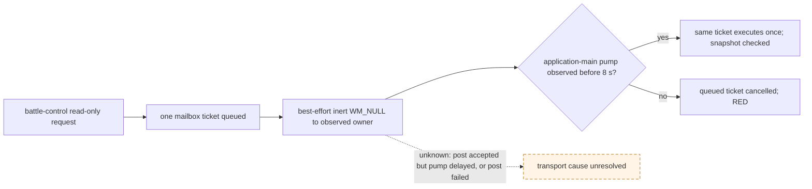

# Battle-control queued application-main wake (CK3 1.19.0.6)

The exact CK3 executable is `2D00FF3101EF70B566F2FCBAE292F09263199C80E9DC8F139B82D7D96F83DB86` (SHA-256). This note covers transport of an already submitted, read-only battle-control query. It makes no claim about combat outcome or attack authorization.

## Observed production failure

- [live-confirmed] R0194 and R0208 cold restored a paused battle but `ck3_query_battle_control_snapshot_v1` returned `application-main battle-control query timed out before execution`. In R0208, combat-v3 and actual-side readback were never called; there were zero typed actions and zero game-date change. Its immutable RED evidence is under `g2-combat-attacker-parity-R0208-red-frozen-20260923` in the process-assets root.
- [source-confirmed] The query submits one `MainThreadQueryV1` mailbox ticket. `TrySubmitMainThreadQueryV1` posts one best-effort `WM_NULL` to the observed application-main thread. `WaitForMainThreadQueryV1` has an 8,000 ms queued budget for battle-control, then cancels a ticket still queued. The battle-control executor did not run in the failed calls.
- [live-confirmed] A separate R0202 actual-side query using the same native DLL completed on an R0194-derived paused battle. Thus the read body is reachable in some paused windows, while the two queued timeouts remain real. The evidence does not establish whether the first post failed or whether the game's pump skipped the queued message.

## Minimal transport experiment

Only this battle-control queued wait repeats the same inert wake at a bounded interval while the ticket remains queued and the original 8 s deadline remains intact. Record the pump epoch at wait start/end and each repeat post result. No query resubmission, gameplay command, alternate thread execution, deadline extension, or combat semantic change is allowed. A fixture where the owner ignores the first wake must execute the same ticket on a later wake; a no-pump fixture must still cancel without executing. If a new live attempt remains queued despite accepted posts, retain RED and investigate the exact pump readiness path.

## Package record

`COMBAT-BATTLE-CONTROL-WAKE` starts from remote master `fde0980371b73bd9e69ab330e60d4ee5cb52b7b0` in an isolated Z: worktree. The only production changes are the optional same-ticket wake trace in `main_thread_query_mailbox_v1.hpp/.cpp` and its use by the battle-control branch of `bridge.cpp`. Its focused native fixture exercises both late pump and no pump; the Python battle-control contract remains unchanged. This package does not alter any combat value, query schema, MCP tool name, strategy, or CK3 save/driver. It needs a new exact-build DLL and a fresh, bounded, read-only paused replay before the R0208 transport RED can close.

The focused static result is Debug/Release bridge DLL link and native mailbox plus battle-control CTest `2/2` in each configuration, with Python battle-control contract `65/65` in normal and `-O`. These checks cover the transport change and existing query mapping, not live readiness. A separate R0157 ordinary/xar_off attacker parity candidate is staged in `g2-combat-battle-control-wake-r0157-candidate-20260923`; its status is `STAGED_NOT_READY` until final integrated source/DLL identity and official prepare/rebind/preflight are fixed.
