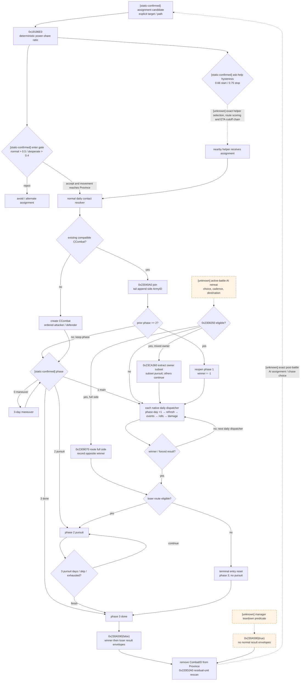
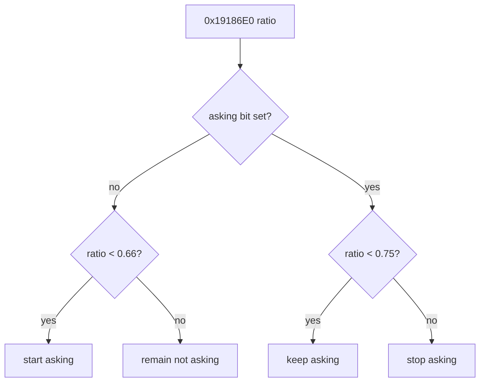
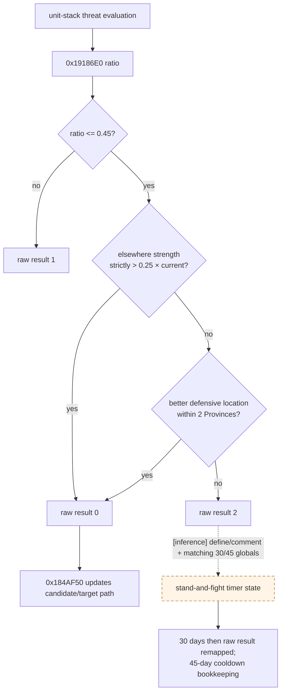
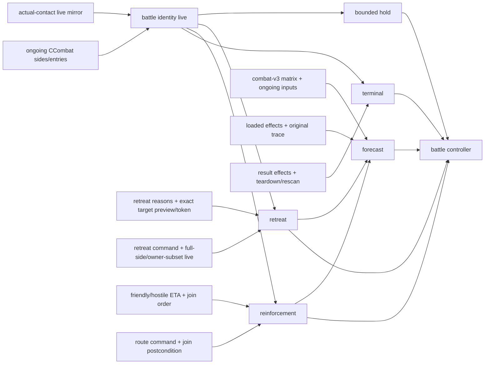

# CK3 1.19.0.6 原生 AI 战斗控制树：接战、增援、撤退与战后回收

本文只绑定 CK3 `1.19.0.6` exact build，目标是把“军队已经决定接近敌人”之后，原生 AI 与战斗引擎共同完成的控制流程拆开：

1. 接触后加入已有战斗或创建新战斗；
2. 战斗继续时何时求援、其它 stack 何时响应；
3. AI 怎样走到可撤退的 movement candidate，以及原生怎样校验、执行 full-side / mixed-owner retreat；
4. 落败后的 route、pursuit、result/finalization 与同省 residual-unit rescan；
5. 我方高智商 battle controller 要发布哪些最小 typed observation/action/readiness gate。

本文**不**把战斗数值模拟器、AI power-share ratio、GUI prediction 或简单人数比称为胜率。逐日 damage/casualty/event 的 exact 公式继续以
[battle-simulation.md](battle-simulation.md)、[combat-phase-events.md](combat-phase-events.md) 为权威；接敌顺序以
[army-contact-resolution.md](army-contact-resolution.md) 和
[actual-contact-scope.md](actual-contact-scope.md) 为权威。

## 冻结版本与证据边界

| 项 | 冻结值 |
|---|---|
| game version | `1.19.0.6` |
| `ck3.exe` | `Crusader Kings III/binaries/ck3.exe` |
| SHA-256 | `2D00FF3101EF70B566F2FCBAE292F09263199C80E9DC8F139B82D7D96F83DB86` |
| 核对日期 | 2026-08-26 |
| 原版 AI 数据 | `game/common/defines/ai/00_ai.txt` |
| 原版 combat/retreat 数据 | `game/common/defines/00_defines.txt` |

证据标签沿用 [README.md](README.md)：

- **[static-confirmed]**：原版数据、RTTI、xref 或 exact-build 反汇编可以直接证明；
- **[live-confirmed]**：在冻结 build 的 paused application-main frame 做过真实游戏对账；
- **[inference]**：多个静态锚点一致，但原生枚举名或完整 caller contract 尚未恢复；
- **[unknown]**：仍需继续逆向或实机 trace；Mermaid 中用虚线表示。

本文使用的 `CalcAICombatPredictionRatio`、`CanOrderCombatRetreat` 等名字都是研究别名，不是恢复出的原生符号。

### 三层必须分开

原生流程不是一个单独的“战斗 AI 函数”，而是三层交错：

| 层 | 已证明的职责 | 不能从该层外推的事 |
|---|---|---|
| assignment / unit-stack AI | 进入阈值、求援滞回、其它 stack 是否值得来援、受威胁 stack 的 pre-contact retreat / stand-and-fight 分支、movement candidate | 不等于真实 CCombat 的逐日结算；也不证明 active battle 的确切主动撤退触发日 |
| movement / contact resolver | normal daily arrival 顺序、已有 Combat 选择、攻守与有序 participants、join mutation | 不负责判断战斗值不值得打；query 不得调用 mutation helper |
| CCombat state machine | maneuver、main、winner、route eligibility、pursuit、result/finalization、Province rescan | 大部分转移是引擎自动执行，不是 AI 每日重新选择一个“继续战斗”按钮 |

## 一页结论

- [static-confirmed] 原生 AI 在接战前用 `0x19186E0` 的确定性 power-share ratio 做严格阈值判断：普通进入要求
  `ratio > 0.5`，desperate 进入要求 `ratio > 0.4`；`ratio < 0.625` 时会尝试避开坏 adjacency。它不是胜率。
- [static-confirmed] stack 的求援是滞回状态：未求援时 `ratio < 0.66` 才开始；已经求援时在
  `ratio < 0.75` 继续，`ratio >= 0.75` 停止。其它 stack 是否介入另走 `0x1848570`，普通门槛为
  `1.5` 倍 out-powered，打断进度至少 `0.6` 的 siege 时用更保守的 `1.7`。
- [static-confirmed] 一旦建立 CCombat，没有证据显示 AI 每日必须提交“继续战斗”命令。若没有实际提交并执行合法撤退动作或其它外部终止，
  引擎自动从 maneuver 推到 main，并逐日结算，直到一侧 fighting total 不再为正。
- [static-confirmed] `0x184B170` 的 `ratio <= 0.45`、别处兵力、两省内更好防守地形树位于 unit-stack assignment
  controller。现有 call chain 只闭合受威胁 stack 的战略退让/站定 decision，未证明它会提交 active CCombat retreat。
- [static-confirmed] active battle 的手动与 AI movement candidate 共用 `0x2308250` legality：disallow →
  第 15 whole day（除非 allow-early）→ phase 必须小于 pursuit → landless restriction。该 validator 只回答“现在能不能撤”，
  不回答“AI 何时决定撤、撤到哪里”。
- [static-confirmed] full-side retreat 会先给 CUnit 写 retreat route，再令对面成为 winner；mixed-owner side 只抽出选中
  owner，先对该 subset 同步结算 pursuit，剩余 owners 继续战斗。
- [static-confirmed] battle 内 pursuit 是 winner 已确定后的自动 phase 2，不是一个需要 AI 点击的追击动作；phase 2
  若有新 army 加入，原生会重新打开 main、清 winner。战斗后的跨省追赶才属于 army assignment/move policy。
- [live-confirmed] P0 actual-contact 已在真实 normal-daily contact 与 cold restore 上逐项对账：
  `actual_contact_scope_live_ready=true`、`actual_contact_scope_ready=true`，而且 actual-side combat-v3 两次都
  `available`。这为 P1 提供了可靠 CombatID/target/ordered sides。
- [live-confirmed] P1 ongoing battle-control frame 已从 checkpoint
  `9104CCB8AE9D5776166FBBAEDA9B43BD08CBAA2CB5C057332EB8B7A1A212CC63` 冷恢复，并完成
  maneuver day 1 → main day 0 → main day 1 → main day 2 的 bounded hold。每帧 double query 稳定，main day 1/2
  都出现真实 current/soft/hard ledger delta，managed cleanup 成立；artifact SHA-256
  `A0FC6BB7268E38026CC8EED6D6388BFD675AD5DCFB60A1A65FE1C1B64E816AC6`。因此
  `battle_identity_live_ready=true`、`battle_hold_ready=true`。
- [live-confirmed] main damage 后 side `+0x98/+0xA0` 的 tick-start cache 可以合法落后于 retained entry current sum；
  query 保留缓存值并发布 match booleans。`false` 表示这一原生时序事实，不是 `unavailable`。
- [live-confirmed] passive terminal/warscore journals 与 paused successor query 已随真实 normal terminal 工作：旧 CombatID/Province
  删除、Result retention、单场 war-score row 与玩家 `subject_retreating` 在同一 revision 闭合，artifact SHA
  `61D0D912206A90D9B34DDE3555AEC941EC3538C253DBC4DCEB9D177D7456FDB1`。
- [counter-policy] `battle_identity_live_ready`、`battle_hold_ready`、`battle_retreat_ready` 与新增
  `battle_normal_terminal_query_ready` 为 true；`battle_reinforcement_ready`、`battle_forecast_ready`、aggregate
  `battle_terminal_ready` 与总 `battle_controller_ready` 仍为 false。P1 仍在进行中，不能因单一 normal terminal 已绿就声称拥有完整 battle controller。

## 原生总控制树

实线是 exact-build 已闭合的控制/状态转移；虚线是尚未闭合的 AI 选择或 lifecycle 语义。



这张图最重要的边界是：**“无撤退动作 → 下一个 battle tick”是引擎默认行为，不是一条已经恢复的 AI keep-fighting
评分函数。** 我方 planner 的 `hold` 也应是 policy 决定：执行器请求一个游戏日并在 speed 1 运行，但后置验证必须按动作实际
报告的 paused date delta 约束 phase/day 与 ledger，而不是把“请求一日”假定成必然只观察到 `+24`，也不能伪造一个 CK3
不存在的“继续战斗 ACK”。

## 接触与参战

### 接战前阈值

[static-confirmed] `00_ai.txt:1190-1202` 与 `0x1919C69`、`0x191A076`、`0x191A4C1` 一带共同冻结：

| 场景 | exact 比较 | 边界 |
|---|---:|---|
| 普通 candidate 进入敌军附近 Province | `ratio > 0.5` | 正好 `0.5` 不进入 |
| desperate candidate | `ratio > 0.4` | 正好 `0.4` 不进入 |
| 坏 adjacency 替代路线 | `ratio < 0.625` | 正好 `0.625` 不触发此低比率分支 |

`0x19186E0` 返回的是 AI 冻结 participant/lane 下的 power share。其五个 direct callers 为
`0x184B3A4`、`0x1873003`、`0x1919C69`、`0x191A076`、`0x191A4C1`；完整输入 ABI 与不可称为概率的边界见
[combat-prediction.md](combat-prediction.md)。

### movement 到达后不再重做“值不值得打”

[static-confirmed] normal daily movement 到达后，contact resolver 按 contact queue 处理 initiator：

1. 先扫描 Province 的 CombatID stored order，保留**最后一个** relation-XOR-compatible active combat；
2. 有 compatible combat 时调用 `0x23040A0` 加入；side ArmyID 以 first-seen tail append；
3. 没有 compatible combat 时，按 Province full CUnitID 无符号升序选第一个合格 hostile seed，再构造 ordered opponents；
4. constructor 决定 `side0=attacker`、`side1=defender`；initiator 不必是 attacker。

这些是接触 resolver 的确定性结果，不是第二次 AI combat-ratio 投票。

[live-confirmed 2026-08-26] `query_actual_contact_scope_v1` 已完成 production mutation 前后与 cold-restore mirror：

- contact checkpoint SHA-256
  `40D4E73D2B45BEF7F8F94F9FC8007A5A039031840C24D72758E5D6452E1A2C6C`；
- prediction 的 subject ETA 为 `53178264`；真实 contact frame 也是 `53178264`；
- actual `CombatID=335544325`、target Province `2586`；
- attacker ordered public CUnitIDs 为 `[83886341]`，defender stored order 为 `[357,33554657]`；
- 同帧 actual-side combat-v3 为 `available`；
- first-contact artifact SHA-256
  `265D4FFCC644DCEFCFE192A273880DB6D37901B89AF733C12FA304B530597B5C`；
- cold restore 后 CombatID、target、双方有序 arrays、scope、transition 全部相等，actual-side combat-v3 仍
  `available`；restore artifact SHA-256
  `0CFFD7BDC211F8723A2E0826617450F0808BA14AA757F6B884F217BA24DD3F2C`；
- 验收后恢复 baseline checkpoint
  `12FD30A079982E3B01FAD6442574D7938E795A84A59B4EBDD53023135B04F37D` 与 driver-state
  `3C3BBFECDC6941B17B1CC946CEDA1011ABF3DD673AD511B1BFB764FC20E955A9`。

因此 P0 的 exact identity/ordered-side 输入已经可供 P1 使用；它不包含 ongoing entry ledger、active retreat 或动态增援控制。

### 已有战斗的增援加入

[static-confirmed] `0x23040A0`：

- 通过反向 relation 调用决定 incoming 加入 side0 还是 side1；
- 经 `0x23043F0` / `0x23044F0` 和 `0x23C9100` 在该 side 尾部插入 CArmyID；
- 写 `CArmy+0x128=CCombatID`，重算 totals 与 combat width；
- 若当前 phase 是 pursuit `2`，改回 main `1` 并写 `winner=-1`。

因此一个 ETA 恰好落在 pursuit 的增援不是“赶到得太晚所以无效”的固定规则；它可能让战斗重新进入 main。高智商 planner
必须预测到达日与真实 contact/join order，不能只把固定 contact participants 的 combat-v3 结果向未来外推。

## 继续战斗与每日结算

[static-confirmed] CCombat 的主状态字段为：

| 字段 | 含义 |
|---|---|
| `CCombat+0x6B0` | `0/1/2/3 = maneuver/main/pursuit/done` |
| `CCombat+0x6B4` | phase-day counter；phase 改写时随同一 qword 清零 |
| `CCombat+0x6B8` | encounter Province |
| `CCombat+0x6C0/+0x6C4` | base/final combat width |
| `CCombat+0x6D0/+0x6D4` | 当前两侧 commander roll |
| `CCombat+0x6E0` | winner side index；`-1` 尚未决定 |
| `CCombat+0x700` | forced winner override |
| `CCombat+0x704` | finalizer entered |

[static-confirmed] dispatcher `0x27FB617..0x27FB76B` 令 maneuver 持续原版
`MANEUVER_PHASE_DAYS=3`；main tick `0x2309E80` 的顺序是：

1. 重算 side0/side1 fighting totals；forced winner 优先，然后检查任一侧 total 是否不再为正；
2. side0 refresh 与 main-phase events；
3. side1 refresh 与 main-phase events；
4. cadence 命中时依次做 side0、side1 commander roll；
5. 求 resolved advantage 与双方 outgoing damage；
6. 双方 damage 都算完之后，才分别施加 casualty。

只要 winner 未决定，也没有外部合法 retreat/force-result，下一日继续同一 state machine。目前尚未找到一个 active CCombat
“每一天重新比较 `0x19186E0` 后决定继续”的 direct call chain；不得把 pre-contact predictor 定时重算臆造成原生事实。

### 2026-08-27 全寿命长跑反例：paused envelope 跨过两个日界

[production-live] 一代人正式长跑在同一 `CombatID=687865860`、同一 CArmy 与 Province 上留下两个完整 paused exact frame：

| 项 | before | after |
|---|---:|---:|
| native revision | `1594` | `1598` |
| date raw | `53195880` | `53195928` |
| phase/day | `main/32` | `main/34` |
| attacker current / soft / hard | `397120 / 34722071 / 14880809` | `0 / 35000056 / 14999944` |
| defender current / soft / hard | `16941842 / 27900826 / 11957332` | `16818259 / 27987341 / 11994400` |

中间唯一 gameplay action 是 speed 1 的 `life-advance`，自身报告 `starting_date_raw=53195880`、
`ending_date_raw=53195928`、`elapsed_days=2`、`progress_status=postcondition`。结合上面的 exact-build daily dispatcher，
`date_delta=48`、同 phase 的 `phase_day_delta=2` 与双方 casualty ledger 同向变化，证明这是两个真实 native daily ticks；
不是 phase/day 跳过、CombatID 替换或只凭 ACK 推断进展。被本次 RED 否定的是我方“请求一日就必然只观察到一个日界”的
actuator 假设。当前最小修复只允许这条已实证的两日 overshoot，并要求动作报告、date delta、同 identity/phase、
`phase_day +2` 与 exact ledger 互相一致；其它跨度继续 fail closed。

live artifact：`report.json` size `6519552`，SHA-256
`E1710E19DC4039716D3EC7A42BC6729D6245E6D99F2FDDDD0771E8FC7CC36403`；`first-blocker.json` size `4814`，
SHA-256 `DBACD2824CCB8E382CEC1EFB5649A634D305D957BEED3082144C08E1526F1470`。角色 `29829` 仍存活，最后 checkpoint
`date_raw=53195880/history=1888`，cleanup 全绿；这不是死亡结算或人生分数证据。

## 求援与增援树

### 当前 stack 的求援滞回

[static-confirmed] `CAIUnitStack+0x50 bit0` 是当前“正在求援”状态，`0x1873003` 调用 `0x19186E0` 后执行严格
`<` 比较：



所以：

- `ratio == 0.66` 时，未求援 stack 不开始；
- `0.66 <= ratio < 0.75` 是滞回区：是否求援取决于进入该区间前的状态；
- `ratio == 0.75` 时停止。

### 其它 stack 是否来援

[static-confirmed] `0x1848570` 是 other-stack help / break-siege gate，唯一 direct caller 为 `0x184684D`。原版数据与
callsite 比较共同给出：

| helper 当前任务 | 被援 stack 需要被 out-powered 到 | 额外条件 |
|---|---:|---|
| 普通任务 | `1.5` | nearby/helper 候选其它 gates 仍由 caller 决定 |
| 正在 siege，且进度 `>=0.6` | `1.7` | 更保守，避免为救援轻易放弃高进度 siege |

这里保留原版 define 的 “out-powered” 语言；`0x1848570` 两个 strength operand 的完整业务名仍未闭合，不能把
`1.5/1.7` 改写成简单 soldiers ratio。

[static-confirmed] 另有专门的 player-support 数据：目标 combat ratio `5.0`、attack target 最大距离 `400`、预计比
combat start 晚到最多 `45` 天。这是 AI 支援玩家 army 的特例，不得替换普通 stack-to-stack 的 `1.5/1.7` 树。

[unknown] 仍未闭合的中间链包括：

- asking bit 怎样传播到具体 helper stack；
- helper candidate 的完整排序、多个求援者冲突时的 tie-break；
- route cost、补给、敌方拦截与 ETA 怎样共同否决；
- helper 到达同日与 battle tick/event 的完整调度先后；
- 求援结束后 helper 怎样恢复原 siege/objective assignment。

因此当前最有价值的施工不是再加一个 `asking: bool`，而是发布“**谁会来、走哪条 route、哪一天以什么 contact order 加入哪一侧**”
的 typed reinforcement timeline。

## 三种“撤退”必须分开

| 名称 | 发生阶段 | 已闭合程度 |
|---|---|---|
| assignment-level threat retreat / stand | unit-stack target / threat selection；未证明它提交 active CCombat action | ratio 与 composite 条件已闭合；原生 enum 名仍 unknown |
| voluntary combat retreat | active CCombat 中由 movement/command 请求离场 | legality 与 apply 已闭合；AI 选择时机、目标地与完整评分 unknown |
| loser route / pursuit | winner 已决定后的 battle aftermath | route eligibility、pursuit 与 finalization 已闭合；最终 result effect 与部分业务标签仍未全闭合 |

### assignment-level `0x184B170` composite

[static-confirmed] `0x184B170` 的唯一 direct caller 是 `0x184AFCF`。它构造当前 unit-stack 的 subunit set，在
`0x184B3A4` 调 `0x19186E0`，返回 raw enum `0/1/2`：



机器边界是：

- `ratio > 0.45` 直接 raw result `1`；正好 `0.45` 继续检查其它条件；
- 别处兵力必须严格 `> 0.25 * current`；
- 防守地点搜索距离为 `2`；
- wrapper 对 raw `2` 累加 `+0x7C`，与 `STAND_AND_FIGHT_DAYS=30` 比较；离开该状态后的
  `+0x80` 与 `STAND_AND_FIGHT_COOLDOWN_DAYS=45` 比较。

[inference] 原版 define 注释与完全一致的 `30/45` 全局读取足以把 raw `2` 关联到 stand-and-fight bookkeeping，但 raw
`0/1/2` 的正式枚举名未恢复。尤其不能据此写成“active battle ratio 低于 0.45 就立刻提交 retreat”。

### active battle：已证明的是 candidate legality，不是 policy

[static-confirmed] 两个近乎相同的 AI movement candidate validator `0x18CE240` 与 `0x18CFC20`：

1. generation-safe 解析 CUnit→CArmy；
2. 若 `CArmy+0x128` 能解析 active CCombat，先做 relation/predicate；
3. 分别在 `0x18CE3A5` / `0x18CFD85` 调
   `0x2308250(combat, army, nullptr)`；
4. validator 返回 false 时拒绝该 movement candidate。

direct callers 分别是 `0x18CE566` 与 `0x18D0DDA`。这证明 active-battle AI movement path 与手动命令共享 legality；
它没有闭合上游“为何此刻生成该 candidate、候选 target 怎样评分”的 policy。

### `0x2308250` legality 的 exact 顺序

[static-confirmed] `CanOrderCombatRetreat` 按以下顺序求值：

1. 所属 side `+0xC0 disallow_retreat != 0`：拒绝；
2. 若 `+0xC1 allow_early_retreat == 0`，elapsed whole days 必须严格 `> 14`；第 14 日仍拒绝，第 15 日才可；
3. `phase >= 2`：拒绝，不能在 pursuit/done 再下 voluntary retreat；
4. owner/land-status 命中 landless restriction：拒绝。

有 error sink 时会收集对应原因；AI candidate 传 `nullptr` 时首个失败即可返回。`allow_early_retreat` 只绕过 day gate，
不会绕过 disallow、phase 或 landless。

### full-side 与 mixed-owner apply

[static-confirmed] command apply 入口为 `0x2308850(CCombat*, public CUnitID, CProvince* target)`：

- **full side**：`0x2309070` 按 side ArmyID order 给各 CUnit 写 retreat state/target route，更新 entries/totals，然后
  `0x230A010` 把对侧记为 winner；
- **mixed-owner partial**：`0x23CA360` 逆 stored order 抽出选中 owner 的 regiment/army rows，对该 subset 同步执行一次
  pursuit，清其 CArmy combat link 并写 retreat route；不写整个 CCombat winner，剩余 owners 继续战斗。

因此 typed action 不能只返回“move accepted”。它必须知道 selected CUnit 属于 full-side 还是 owner subset，并分别验证
winner/side totals 或 subset removal/backlinks。

### retreat destination：有原版评分常量，缺调用链闭合

[static-confirmed] `00_defines.txt:702-719` 发布 shattered-retreat 评分输入：

| define | 值 |
|---|---:|
| preferred provinces | `7` |
| max preferred offset penalty | `7` |
| own realm / own subrealm / own capital | `340 / 60 / 100` |
| war friend / enemy | `200 / -250` |
| same religion / same culture / coastal | `30 / 10 / 10` |
| occupied | `-60` |
| distance multiplier | `-50` |
| max provinces | `15` |
| neighbour / own / enemy unit multiplier | `0.5 / 0.05 / -0.2` |
| distance from capital | `-0.01` |

[static-confirmed] retreating movement speed 是 `4.5`，普通 movement speed 是 `3`。

[unknown] 尚未证明 active AI voluntary-retreat candidate 的 target 一定使用这套 shattered-retreat scorer，也未闭合候选 Province
枚举、不可达过滤、tie-break 与 caller。生产 controller 在此之前必须读取原生生成的合法 destination candidates，或明确调用
同一 exact command builder；不得凭上述 define 自制一个“看起来类似”的 target 后宣称 native parity。当前实现选择后一条：
由 planner 提出单 target，再用 exact `PreviewMoveArmy` validator/path builder 证明 route；这提供合法玩家动作，不声称复制原生 AI 排名。

## loser route、pursuit 与战斗结束

### winner 到 pursuit

[static-confirmed] main tick `0x2309E80` 先重算 totals；force-winner 或任一 side total 不再为正时调用
`0x230A010(combat,winner)`：

1. 写 `CCombat+0x6E0=winner`；
2. 取 loser side 首个 stored ArmyID 调同一 `0x2308250`；
3. validator false：清 loser entry current/soft state，phase 直接变 `3`，无 pursuit；在 result flag 语义全部命名前，
   不能只凭该 path 硬编码 `stack_wipe=true`；
4. validator true：冻结 loser 初始 soft pools 到 `+0x6E8/+0x6F0`，phase 变 `2`；
5. loser `skip_pursuit` 为 true 时同步跳到 finish，不施加当日 pursuit damage。

### pursuit 是自动结算

[static-confirmed] `0x230A2A0` 以 winner side 为 pursuer、相反 side 为 retreater。原版
`PURSUIT_PHASE_DAYS=3`；正常是 pursuit day `1/2/3` 各结算一次，day `4` 进入 done。pursuit/screen 的精确
Q100000 公式、两轮 remainder 分配和 soft→hard 转换见 [battle-simulation.md](battle-simulation.md)。

这意味着：

- battle controller 不需要也不应发明 `pursue_in_battle` command；
- 在 pursuit 中 arrival 的新 participant 可能通过 join path 重开 main；
- battle 完成后追赶 retreating enemy 是新的 army movement/assignment 问题，不属于 phase-2 pursuit。

### finalization 与同省再接敌

[static-confirmed] daily manager 看到 phase `3` 后：

1. 调 `0x230A590(combat,false)`；
2. 正常 result path 先消费 RNG 并发 winner envelope，再消费 RNG 并发 loser envelope；
3. 从 Province 移除 ended CombatID；
4. 更新 Province，再调 `0x220D2A0(CProvince*)` 重扫 raw-state-zero、not-retreating、not-in-combat units；
5. residual armies 可能在同一原生流程中立刻创建或加入另一场 combat。

[unknown] `0x27FBE50` 的 manager teardown predicate 可改走 `0x230A590(combat,true)`，跳过 normal result envelopes；
其业务触发语义尚未命名。[unknown] normal result effects 对 war score、角色、memory、commander replacement 与后续
assignment 的完整 live trace 也未闭合。

## 当前 bridge / MCP 到底覆盖了什么

以下状态冻结在 2026-08-26；“实现”不等于 readiness：

| 能力 | 当前实证 | 已能覆盖 | 仍缺什么 |
|---|---|---|---|
| actual-contact v1 | [live-confirmed] `actual_contact_scope_static_ready=true`、`production_query_ready=true`、`actual_contact_scope_live_ready=true`、总 ready=true | normal-daily prediction 与真实 contact date、CombatID/Province/ordered sides 对账；cold restore 后逐项相等；join-side tail append 有 exact mirror | existing-compatible join、多个 compatible combats、pursuit-reopen 等扩展 live matrix 仍可补，但不再阻塞 P0 ready |
| combat-v3 fixed/actual contact | [live-confirmed] shared combined-defensive 一场：27 Character、3 Army、15 source、`132=81 native+51 offline`，artifact SHA `EBEA36EC41811C7736B0819DC31A2D0B0ABE7205D4FBA76D1FBD7AE629535DA5`；P0 contact 与 cold restore 的 actual-side query 也均 available | explicit target/entry/sides、regiment effective stats/counters、commander/knights、terrain/crossing/holding/width、supply/gathering/debt/faith、constructor/resolved advantage 与 132 phase refs；现在可绑定真实 CombatID/ordered sides | single/combined × offensive/defensive 余下矩阵；动态 reinforcement timeline；loaded effect/original trace |
| ongoing CCombat basics | [live-confirmed] cold restore checkpoint `9104CCB8...CC63` 后，maneuver 1、main 0/1/2 均返回稳定 double-query 帧；main 1/2 出现真实 current/soft/hard ledger delta；artifact SHA `A0FC6BB7268E38026CC8EED6D6388BFD675AD5DCFB60A1A65FE1C1B64E816AC6` | production same-revision CombatID/Province/phase/day/winner/finalized、ordered sides/armies、retained entries、owner hard ledger、commander/roll/width/advantage/strength；tick-start cache 可合法 stale 并由 match booleans 显式区分 | join/leave 后动态 roster、reinforcement 同日顺序与 terminal/removal 分支 |
| AI tactical ratio | static predictor ABI 与 direct xrefs 已闭合 | normal/desperate enter、help、pre-contact retreat 阈值 | 合法 paused direct predictor query 的完整 lane/context 生命周期；仍不能当概率 |
| active retreat | [static-confirmed + full-side/owner-subset live-confirmed] validator/apply 静态闭合；production progression 证明 day 14 `too_early`、day 15/16 native true；full-side 完成 route/token/order、retreating/target/route 与旧 CombatID `main/12→pursuit/0`，SHA `21D58737...784FA`；owner-subset 只移除 CUnit `357`、保留 `33554657` 与原战斗，SHA `7780B619...01F9` | 当前帧可真实判断四 gate 与两类 scope；production composition 已绑定 target/token 并复用玩家 move command；两类真实 postcondition 均闭合，`battle_retreat_ready=true` | generic native destination scorer/AI policy 仍是 opponent-model `unknown`，但不阻塞我方动作 |
| reinforcement | [static-confirmed + query live-confirmed] [battle-reinforcement-and-join.md](battle-reinforcement-and-join.md) 已闭合 `CAISubunitStack+0x50` 求援/assigned bits、`0.66/0.75` 滞回、stored-order helper 选择、普通 route、抵达时 compatible CombatID 选择、tail append 与 pursuit reopen；production query 在 CUnit `357` 上实见 asking、parent order、route 与 active CombatID，SHA `F0A6F3C7...B1DB9C6` | `ReadBattleReinforcementAssignmentV1`/service/MCP production-live；已知 assignment 只保存 requester 当前 Province、未来 CombatID 到达时才绑定；已知到达后会加入哪边及 same-tick phase/winner 反馈 | 当前 live 样本 `assigned=false`；assigned+aligned ETA、全部友/敌 ETA、跨 manager 同日 damage order、真实 join/reopen 与玩家改派动作仍缺 |
| terminal / teardown / re-entry | [static-confirmed + normal live-confirmed] [battle-terminal-and-reentry.md](battle-terminal-and-reentry.md) 已闭合 phase-done normal result、relation invalidation no-normal-result、`+0x705` 延迟、共同 backlink/Province cleanup、residual rescan、旧 CombatID 删除及 AI lifecycle 重入；真实 normal terminal artifact SHA `61D0D912...56FDB1` | `0x230A590` entry journal、`0x222A69B` post-writer journal、paused successor query、service/MCP 已 production-live；old CombatID/Province removal、retained Result、row `2135850` 与玩家 retreat 已同帧验证；AI membership 三态不会污染 terminal core | no-normal、同省 residual 与 assignment-reopened production fixtures 尚缺；finished combat on_action identity 仍 unknown，故 aggregate gate 仍 false |
| battle simulator | main/pursuit/battle-end 多段公式已静态闭合 | research-only transition components | loaded playset proof、15 个 battle-horizon effect feedback、original trace、ongoing-frame simulator binding、dynamic participant 与主动撤退 policy；当前 `monte_carlo_ready=false` |
| planner action | [implementation + unit + live RED] in-combat branch 已接成 query→请求一日 advance→requery；历史 managed run 的两轮 `+24 / phase_day +1` 均为 `same_combat_advanced`，artifact SHA `96CE25384517F0060A58623958DE071F43C3C2F7B68AEB6E668473E986C1DD57`。本次长跑又实见 action 自报 `elapsed_days=2`、同 CombatID `main/32→34` 与 coherent ledger，却被硬编码单日上限拒绝 | native battle transition primitive 仍 live；production hold actuator 的“必为一个日界”假设已被 report SHA `E1710E19...6403` 否定，故修复与复跑前 `planner_battle_hold_live_ready=false` | 只允许已实证 `+48 / +2` correlated transition 的最小修复尚待落地；planner 仍未比较/调用 retreat，也没有 reinforcement 或通用 terminal controller；`planner_usable=false`、`active_attack_allowed=false` |

combined-defensive、P0 actual-side 与 P1 ongoing artifacts 已关闭 identity、participants、current/soft/hard ledger 和 bounded hold
observation milestone；它们没有关闭 `loaded_playset_verified`、`ast_evaluator_ready`、`original_trace_ready`、
`monte_carlo_ready` 或 `planner_usable`；retreat 已完成 full-side 与 owner-subset command/postcondition；reinforcement
assignment 查询也已 production-live，但 assigned+ETA/join 尚未完成；terminal normal lifecycle 已 production-live，no-normal、residual 与
assignment-reopened 仍只有静态树。完整边界见 [battle-terminal-and-reentry.md](battle-terminal-and-reentry.md)。

## 我方最小 typed observation：按可玩价值排序

不要先做“大而全 world snapshot”。先让每一级独立解锁一个真实战斗决策；某一级缺字段时整个该级返回
`unavailable/reasons`，不能长期用 nullable 字段冒充 ready。

### 价值 1：真实 battle identity 与可继续帧

已以 live-ready 的 `query_actual_contact_scope_v1` identity spine 发布
`query_battle_control_snapshot_v1(subject_public_cunit_id)`，没有在 service 层拼接第二套 CombatID/ordered-side reader。该级
available 时至少返回：

```text
BattleIdentityFrameV1 {
  revision, observed_date_raw,
  subject_public_cunit_id, subject_native_carmy_id,
  combat_id, province_id,
  phase: maneuver | main | pursuit | done,
  phase_raw, phase_day,
  winner_side: none | attacker | defender,
  forced_winner_side: none | attacker | defender,
  finalized, battle_result_id?,
  attacker: OrderedBattleSideV1,
  defender: OrderedBattleSideV1
}

OrderedBattleSideV1 {
  side_index, role, primary_participant_character_id,
  armies: [{
    native_carmy_id, public_cunit_id, owner_character_id,
    controllable, combat_backlink_id,
    current_province_id, retreat_state_raw,
    route_province_ids
  }],
  current_fighting_raw, soft_casualties_raw, hard_casualties_raw
}
```

最低不变量：

- CUnit↔CArmy、CArmy↔CCombat 与 side membership 三向 full-ID generation/readback 一致；
- subject 恰在一侧，双方 ordered arrays 不排序；
- Combat Province、phase/winner/finalized 在同一 paused revision；
- `winner_side=none` 是合法业务值；缺读 winner 不能伪装成 none；
- phase `done` 与 `finalized` 分开发布，不能互相推断。
- retained entry sums 是当前 casualty ledger 的权威读数；side `+0x98/+0xA0` 是 tick-start cache，合法 stale 时保留
  原值并令对应 match boolean 为 false，不能因此把整帧降为 unavailable。

本轮 artifact `A0FC6BB7268E38026CC8EED6D6388BFD675AD5DCFB60A1A65FE1C1B64E816AC6` 已使这一级
live-ready，并解锁“正在打哪一场、还有谁、现在应 bounded hold 还是进入退/援评估”的真实价值。

### 价值 2：可执行 retreat frame

在同一 snapshot 增加 discriminated `retreat_control`：

```text
ActiveCombatRetreatPreviewV1 {
  selected_public_cunit_id,
  selected_owner_character_id,
  scope: full_side | owner_subset,
  affected_public_cunit_ids_in_stored_order,
  unaffected_same_side_public_cunit_ids_in_stored_order,
  elapsed_whole_days,
  disallow_retreat, allow_early_retreat,
  phase_allows_retreat, landless_allows_retreat,
  legal_now,
  failure_reasons: [disallowed | too_early | pursuit_or_done | landless],
  earliest_legal_date_raw?,
  planner_selected_target: {
    province_id, exact_native_route_available, route_province_ids,
    movement_days, provenance: planner_selected_exact_native_route_preview
  },
  candidate_token?, order_step?, action_ready
}
```

这里只验证 planner 给定的**一个**目标，不伪造“原生 AI 排名候选集”。目标必须由现有 exact native validator/path builder
产生 route，且 token 同时绑定 revision、CombatID、side、scope 与 affected stored order；target 等于 combat Province 时拒绝。
通用战争 AI 的 destination enumeration/score 仍保留为 opponent-model `unknown`，但不是我方语义动作的功能前置条件。

这一级的 preview/token/order 已 production 实现；day 15 full-side 实机通过 exact route `[2579]` 后，同一 CUnit 在更新 paused
snapshot 中成为 `retreating=true` 且 target/route 都是 `2579`。artifact SHA 为
`A57FF20DCAD39DF79DAB6A9418054C36B0F5489C5D8B5E9E880CE899AE89DF9C`。随后新增的 full-CombatID lifecycle query
不经过 retreating CUnit eligibility；完整重跑读到同一 `CombatID=335544325` 的 `main/12→pursuit/0`、winner=defender 与
attacker `[83886341]` / defender `[357,33554657]` stored order。artifact SHA
`21D58737126CA4ED8B0B49DB7749EA4701F3BA6F94A8B8493698F8737E5784FA`，故 full-side postcondition 已关闭。

### 价值 3：动态 reinforcement timeline

```text
ReinforcementTimelineV1 {
  combat_id, snapshot_revision,
  rows: [{
    public_cunit_id, native_carmy_id, owner_character_id,
    relation_to_attacker, relation_to_defender,
    route_province_ids,
    eta_date_raw, eta_days,
    normal_daily_arrival_order,
    predicted_transition: join_attacker | join_defender | create_other_combat | none,
    predicted_side_armies_after_join,
    may_reopen_pursuit
  }]
}
```

只发布同一 paused revision 可证明的 arrival timeline。route 中途可能因敌方移动、siege cancel 或 assignment 重算改变时，要给出
明确 horizon/invalidator，不能把“当前路线”写成保证到达。

### 价值 4：可比较 continue / reinforce / retreat 的 forecast frame

这一级复用 combat-v3，而不是再造一份属性表。必须把以下内容绑定到同一个 `combat_id/revision/ordered participants`：

- 完整 live regiment entries：starting/current/soft/hard、active/still-fighting、owner/army/type；
- target-effective damage/toughness/pursuit/screen、counter 与 current width/advantage sources；
- 当前 commanders、knights、roll cadence、scheduled phase-event rows；
- loaded-playset deterministic manifest 与 effect feedback；
- original trace parity；
- 第三级的 future join/leave timeline；
- voluntary retreat policy 与 destination transition。

只有这一级全 available 才发布有校准边界的 win/loss/no-resolution、损失分布与 character-tail 风险。原生
`0x19186E0 ratio` 仍单列为 `native_ai_prediction_ratio`，绝不写入 `win_probability`。

### 价值 5：battle result 与 assignment re-entry

```text
BattleTerminalFrameV1 {
  prior_combat_id, battle_result_id,
  terminal_kind: normal_result | terminal_no_normal_result,
  winner_side?,
  ordered_survivors_and_routes,
  per_side_soft_hard_losses,
  result_effects_observed,
  war_score_delta?,
  combat_removed_from_province,
  residual_rescan_contacts: [combat_id],
  next_assignment_state_by_public_cunit_id
}
```

`normal_result` 才要求 winner/loser envelope；`terminal_no_normal_result` 不得伪造胜负。war-score/result-effect 字段在原生
trace 未闭合前必须令整个对应子能力 unavailable，而不是填 `0`。

## 我方最小 typed action 与后置条件

| policy choice | production action | 必须携带 | ACK 之后的真实后置条件 |
|---|---|---|---|
| continue / hold | 复用 speed-1 bounded `life-advance`；hold 本身不是 native mutation | expected revision、CombatID、请求 1 game day；动作必须回报实际 start/end/elapsed | 通常验证 `+24 / phase_day +1`；本次已实证的 pause overshoot 只在 action 自报 `+48 / elapsed=2`、同 identity/phase、`phase_day +2` 且 exact ledger coherent 时接受。其它跨度、date 或 ACK 单独都不算验证；join/reopen/terminal 仍需显式 discriminant |
| voluntary retreat | 已实现 `order_active_combat_retreat_v1` production composition，复用玩家 move command | expected revision、CombatID、selected public CUnitID、target ProvinceID、expected `full_side/owner_subset`、一次性 route token | full-side：每个受影响 CUnit 的 retreat state 与最终 target/route 已写、side current 清空、opposite winner/phase transition；pursuit 期间不误要求 CArmy backlink 已清。partial：仅该 owner rows/ArmyIDs 离场、其 backlinks 清理、其它 owners 仍战 |
| reinforce | 优先复用 exact move/route command；必要时新增 battle-bound wrapper | expected revision、source CUnitID、target CombatID/Province、完整 route 与 expected ETA | 先验证 route；到达帧再验证 `CArmy+0x128` 与 ordered side tail append；若原 phase2，再验证 phase1/winner=-1 |
| avoid before contact | 复用 reroute/move | expected actual-contact prediction、alternate route、no-contact horizon | 下一帧 route 与 horizon 改变，且整个声明的 no-contact horizon 内 CArmy combat backlink 仍为空；不得仅凭 move ACK 宣称已避战 |
| post-battle chase | 复用 army assignment/move，不新增 in-battle pursuit command | retreating target、route horizon、war objective/value | 新 assignment/route 被观察；不能把自动 phase2 pursuit ACK 冒充跨省追赶 |

所有 mutation 都要以 expected revision + stable full IDs 拒绝 stale frame。这里的目的不是扩张证明协议，而是避免控制器把上一日
CombatID/participant scope 的动作发到下一场战斗；它直接影响真实使用。

## readiness gates

建议把 readiness 拆成可诊断的产品门，而不是一个总 `combat_ready`：

| gate | 必须全部满足 | 当前 |
|---|---|---|
| `battle_identity_live_ready` | actual-contact live mirror；ongoing full ordered sides/entries；phase/day/winner/finalized；同帧 ID/backlink 与 ledger invariants | **true**：[live-confirmed] cold restore 后 maneuver/main 帧、稳定 double query 与完整 ledger 均已对账；artifact SHA `A0FC6BB7268E38026CC8EED6D6388BFD675AD5DCFB60A1A65FE1C1B64E816AC6` |
| `battle_hold_ready` | identity ready；请求一日并读取 action 实际 elapsed；同 CombatID 的 phase/phase-day 与 main ledger 按实际日数一致转移；ACK/date 不单独计验收 | **false / production blocker**：历史 `+24 / +1` primitive 与 planner run 仍有效，但正式长跑实见合法 `+48 / +2` 被硬编码单日上限拒绝。只接纳该 correlated overshoot 的最小修复并从 checkpoint 复跑前，不恢复 `planner_battle_hold_live_ready` |
| `battle_retreat_ready` | identity；`0x2308250` typed reasons；planner-selected target 的 exact route preview 与 battle-bound token；full/partial command；两类 live postcondition | **true**：full-side 与 owner-subset 均已 production-live，且分别验证整侧离战与同 owner 子集离战/盟军留战 |
| `battle_reinforcement_ready` | identity；友/敌 ETA 与 normal-daily order；join-side prediction；route command；main join 与 pursuit-reopen live matrix | false：assignment query 已 production-live；assigned+aligned ETA、route action 和 join/reopen matrix 尚缺 |
| `battle_forecast_ready` | combat-v3 四格 live matrix；ongoing entries；loaded playset；effect feedback；original trace；dynamic arrivals；retreat policy | false |
| `battle_normal_terminal_query_ready` | passive terminal/warscore journals；paused old-ID query；CombatID/Province removal；result retention；typed successor；same-process/cleanup | **true**：第 33 日 normal result 实见 row/cleanup 与玩家 `subject_retreating`，artifact SHA `61D0D912...56FDB1` |
| `battle_terminal_ready` | `0x230A590` entry journal 区分 normal/no-normal；result effects；CombatID/Province removal；residual rescan；successor participant overlap；assignment re-entry | false：journal/query 与 normal fixture 已 live；no-normal、residual 与 assignment-reopened fixtures 尚缺 |
| `battle_controller_ready` | 上述 gates；策略 comparison；中途 save/cold-resume；production 场景矩阵 | false |

依赖关系：



### 最小 production 验收矩阵

1. **优势接战 / continue**：从 pre-contact prediction 到 actual CombatID，对连续 main days 做 forecast→hold→reobserve，
   participant 与 casualty ledger 对账。当前已完成 identity→hold→reobserve/ledger 子链，并有两轮 production planner-integrated
   hold；forecast 仍未完成。
2. **劣势 full-side retreat**：**[completed]** 第 14 日拒绝、第 15 日接受；route/state 写入已实机完成，独立旧 CombatID query
   又证明 opposite winner 与 `pursuit/0`。
3. **mixed-owner partial retreat**：**[completed]** 只撤玩家 owner CUnit `357`，盟军 `33554657` 留在原 Combat，
   phase/winner 不被错误推进；artifact SHA `7780B619...01F9`。
4. **main-phase reinforcement**：友军按预测 ETA 与 order 加入正确 side，width/totals/entries 更新。
5. **pursuit reopen**：phase2 到达的新 army 令 phase1、winner=-1，再继续结算。
6. **battle end / residual rescan**：normal result envelope、CombatID removal、同省 residual army 新 contact 都可观测。
7. **mid-battle cold resume**：保存于 main 与 pursuit 各一次；恢复后第一帧 identity/ledger/route 不漂移，继续到 terminal。

roadmap 要求的优势接战、劣势绕行/撤退、战中增援、主动撤退至少由前四类覆盖；mixed-owner、pursuit reopen 与 cold resume
是避免“单军单战斗样例绿了但整局仍断”的必要增量。

## 我方高智商 counter-policy 的设计边界

以下是未来我方策略，不是原生 AI 事实：

1. 先对 actual ordered participants 做 `continue without arrivals` 与每个可达 reinforcement schedule 的条件 forecast；
2. 比较的不只是胜率，还包括 hard/soft loss、knight/commander tail risk、被 wipe/无 route 风险、到达时间与其它 objective
   机会成本；
3. retreat 未到合法日时，明确输出“当前不可执行”，再比较增援、牺牲阻滞与 save-value，而不是循环发送 move；
4. mixed-owner side 按 owner-subset 后果评估：玩家撤退不等于盟军同时撤，也不自动把整场判负；
5. reinforcements 到达已结束战斗或会重开 pursuit 时分别模拟，不能只做 soldiers 相加；
6. battle 内 pursuit 自动发生；战后是否追赶应重新用 army-controller 的 objective、route threat、supply 与 war value 排序；
7. 原生 `0.66/0.75`、`1.5/1.7`、`0.45` 可作为 opponent-model / baseline feature，但我方不必照抄阈值；
   任何 counter-policy 都必须以真实 typed observation 与可验证 action 为输入。

## 按可玩价值排序的剩余逆向账本

1. **retreat action（已完成）**：planner-selected target 的 exact route preview/token、player move command、full-side
   retreating/target/route 与 prior full CombatID winner/phase/side ordered IDs 已 live；owner-subset 也已证明只撤同 owner rows，
   其它 owner 继续留战。
2. **generic active AI retreat opponent model**：[unknown] odds→choice caller、重算 cadence，以及 voluntary 与 loser-route 是否共享
   destination scorer；raid/barter/counter-raid 的 mission movement 已证明不能冒充这条通用 policy。该项继续逆向，但不阻塞第 1 项。
3. **reinforcement assignment**：[static-confirmed core + query live-confirmed] asking/assigned bits、同 stack/跨 stack requester
   stored order、siege abandon ratio、Province assignment、普通 route 与抵达 join 已闭合；production query 已实见 asking、
   parent order、route 与 active CombatID。当前缺 assigned+aligned ETA live、跨 coordinator producer、玩家改派与真实 join/reopen。
4. **dynamic combat roster**：[live-confirmed] 稳定帧的完整 side entry/current-soft-hard/owner ledger production projection 已闭合；
   [unknown] join/leave 与 phase-event 同日先后仍待闭合。
5. **battle-horizon effects**：[unknown] 15 项 effect feedback、loaded playset 与 original trace parity。
6. **result/teardown**：[static-confirmed core + normal live-confirmed] normal/no-normal 入口、延迟 gate、共同 army/Province cleanup、
   residual rescan、全局删除与 AI lifecycle re-entry 已闭合；passive terminal/warscore journals、query/MCP 与 normal+retreat 已 live。
   当前缺 no-normal、residual、assignment-reopened fixtures 与 finished on_action 精确 identity。

下一优先级固定为：完成第 3 项 assigned+ETA/join fixture，再补第 6 项 no-normal/residual/assignment-reopened；第 2 项作为
原生 opponent model 并行补证，不能让未知 scorer 阻断玩家智能体实际可执行的 retreat。随后进入 forecast；
第 4、5 项解锁可比较 forecast，第 6 项解锁战后继续 OODA。
不应在这些观测/动作缺口仍存在时，把工作转向理论安全审计或再增加不改变可玩能力的 schema 证明层。

## 复现命令

以下命令只读磁盘，不启动或附加 CK3：

```powershell
Get-FileHash 'Crusader Kings III/binaries/ck3.exe' -Algorithm SHA256

rg -n 'COMBAT_RATIO_THRESHOLD|ASK_FOR_HELP|RETREAT_COMBAT|STAND_AND_FIGHT|PLAYER_SUPPORT' `
  'Crusader Kings III/game/common/defines/ai/00_ai.txt'

rg -n 'MANEUVER_PHASE_DAYS|PURSUIT_PHASE_DAYS|MIN_DAYS_BEFORE_MANUAL_RETREAT|SHATTERED_RETREAT' `
  'Crusader Kings III/game/common/defines/00_defines.txt'

& 'tools/.venv/Scripts/python.exe' `
  'ck3_autonomous_player/native_bridge/research/find_xrefs.py' `
  0x19186E0 0x184B170 0x18CE240 0x18CFC20 0x2308250 0x2308850 0x2309070 0x23CA360

& 'tools/.venv/Scripts/python.exe' `
  'ck3_autonomous_player/native_bridge/research/disasm_ck3.py' `
  0x184AF50 --size 0x720

& 'tools/.venv/Scripts/python.exe' `
  'ck3_autonomous_player/native_bridge/research/disasm_ck3.py' `
  0x18CE240 --size 0x320

& 'tools/.venv/Scripts/python.exe' `
  'ck3_autonomous_player/native_bridge/research/disasm_ck3.py' `
  0x2308250 --size 0x600

& 'tools/.venv/Scripts/python.exe' `
  'ck3_autonomous_player/native_bridge/research/disasm_ck3.py' `
  0x230A010 --size 0x580
```

关键复核点：

| 区间 | 应看到的事实 |
|---|---|
| `0x1873027..0x187303E` | asking bit 对 `0.66/0.75` 做 strict `<` 滞回 |
| `0x184AFCF` | `0x184B170` 的唯一 direct call |
| `0x184B3A4..0x184B566` | `<=0.45`、elsewhere `0.25`、better-defense composite 与 raw `0/1/2` |
| `0x184AFD4..0x184B016` | `+0x7C/+0x80` 对 `30/45` globals 的 timer/cooldown bookkeeping |
| `0x18CE3A5`、`0x18CFD85` | AI movement candidates 调共享 `0x2308250` |
| `0x2308250` | disallow → early/day → phase → landless gate |
| `0x2309070`、`0x23CA360` | full-side 与 owner-subset apply 的不同后果 |
| `0x230A010..0x230A3C7` | winner、loser route eligibility、pursuit transition |
| `0x230A590..0x230B0A0` | normal finalization 与 winner→loser envelopes |
| `0x230AE6B..0x230AE86` | Province CombatID removal、update 与 residual-unit rescan |
