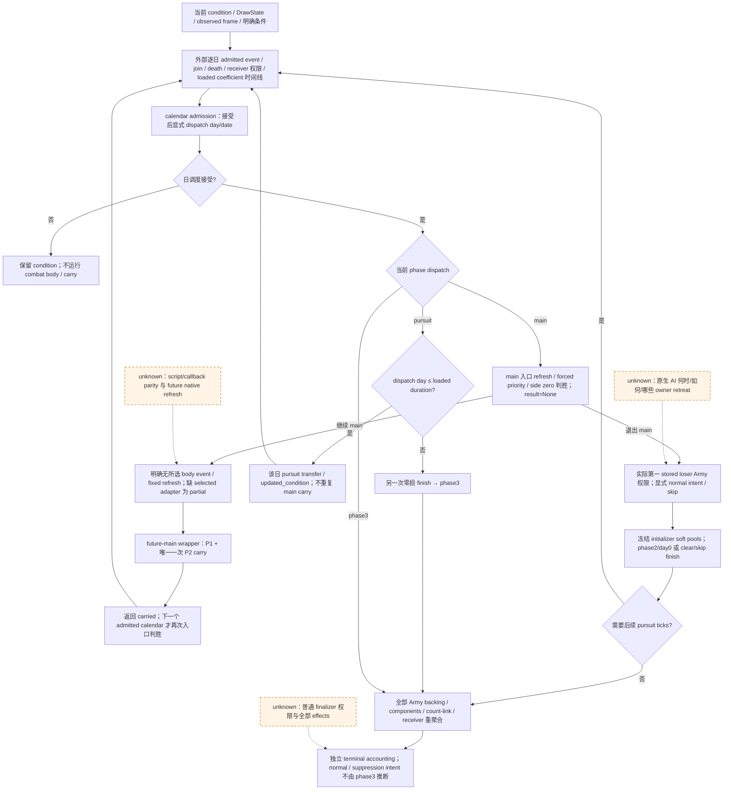

# CK3 1.20.0.3：当前战斗的固定条件 horizon

本专题记录基于当前已发布输入、明确条件和外部时间线的有限战斗 horizon。计算结果只属于指定条件；不外推为 CK3 原生未来、胜率、完整 Monte Carlo 或真实游戏结果。

当前状态：**static-ready：两个 unique offline synthetic production-composition case 获得资格**。原生顺序与 API 输入账本先于 orchestration 实现落盘；本文只消费封存元数据，不重新读取源码、游戏原始包或 fixture 输入/结果 body。适用构建为 CK3 1.20.0.3 / Steam build 25652598，EXE SHA-256 `94B55397ABB687A3DCD436805A5D885E6BE90FA6C693FEB44A9E3BBEEADE02A6`，沿用既有 exact-build 账本。

实现入口为 `run_conditional_horizon(initial_condition, *, timeline, draw_state, max_days, caller_seed_provenance=None) → ConditionalHorizonResult`。每个日 row 提供 `DailyDateStageInput`、`LoadedScheduleInputs` 与 `source_context`；按 phase 需要的 typed 项包括 `entry_events`、`phase_events`、`ai_context`、`future_main`、`transition`、`pursuit`、`terminal`。`None` 表示未知，显式空 tuple 表示没有所选事件；仅到达的阶段要求该输入，early exit 不要求未执行的 script。继续 main body 当前要求明确无所选 script event 和 `ai_context.action_selected=False`；selected event / AI owner action 各需独立 adapter。返回 `available | partial`、`final_state`、`modeled_date_raw / modeled_accepted_invocations`、有序 stage trace、包含 timeline index / stage / missing / implementation entry 的 typed gaps，以及独立 `terminal_result(backing, accounting)`。caller DrawState 只用于 modeled commander rolls，不观测或重放原生全局 event RNG。`available` 只说明这个有限条件调用有结果，不代表整场战斗或原生终局完成。

接受的 main 入口先刷新、判 forced winner，再检查 side 0 / side 1 是否零兵；随后才进入 event、roll、cadence 与 damage。damage 造成零兵不在同日补一次判胜；携带后的 condition 要等下一次接受的入口。`project_current_main_phase_transition(..., None, ...)` 配显式 dispatch day/date，不能把同一 simulation result 再扣一次。`run_conditional_future_main_tick` 自己拥有一次 P2 carry，其返回 `.carried` 直接进入下一日，不能再调用 `carry_frozen_main_tick` / `prepare_next_main_tick`。

追击使用初始化时冻结的 soft pools 和逐日 supplied loaded 系数，不能以递减后的当前 soft pools 重算初始化量。main 退出建立 phase2/day0 后，下一次接受的追击调度才执行 tick；skip/无权限清理另按已闭合分支处理。calendar 已计算 dispatch day；`run_current_pursuit_ticks(..., max_ticks=1, dispatched_phase_days=(...,))` 不再递增一次。`d <= duration` 执行该日 transfer，`d > duration` 是单独的零损 finish。权限来自实际第一 stored losing Army 及该日 witness，不能将当前计时权限冻结为未来权限或替换为选中 owner 的手动合法性。

| 组合接口 | 必需输入与结果边界 |
| --- | --- |
| `apply_closed_entry_events_12003` → `project_daily_battle_schedule` | caller 声明的有序 admitted join/cleanup、完整 backing、date-stage / combat admission 和 loaded maneuver/cadence；不自动生成未来成员或 script consequences。 |
| `project_current_main_phase_transition` → `run_conditional_future_main_tick` | 显式 dispatch day/date、当前强制结果 provenance、全部 primitive/commander/counter/role/terrain/effect 与 resolve/factor 边界；future builder 的 fixed/no-event/stable body 条件须成立。 |
| `run_current_pursuit_ticks` | 实际 receiver / automatic permission、skip、冻结初始 pools、duration/stat/base/min/current hard conversion/modifiers；owner writeback 已在 `.updated_condition`。 |
| `reaggregate_current_phase3_backing` → `project_current_terminal_accounting` | 包含所有 Army 与 joins 的 `full_backing_inputs_v1`、当前 component、strict Character count-link、actual receiver / captured maxima、side baseline、独立 normal-result intent 与 suppression 权限。entry 子集不等于 backing 完整性。 |

phase3 可组合的是数值 backing 与 accounting：complete all-Army current count 与原生 `Side+A8` baseline 驱动独立 hard-loss 计算；先前 main/pursuit 损失不能重复扣除。缺 whole backing、receiver、link 或 normal intent 时保留 `partial` / `null`。当前 source 的 forced/pursuit 优先级与显式 future 声明不一致时同样保留 typed partial，不能忽略外部声明。phase3、wipe 或 modeled winner 本身均不证明普通终局、named death 或全部 effects 已发生，既有 `full_terminal` 仍为 partial。

未闭合分支已有施工入口：`assess_current_battle_retreat` 是我方有界 assessment，`owner_subset_pursuit_worklist_12003` 是数值 pending work，二者均不等于原生 AI 选退或完整 retreat writeback。`execute_selected_phase_event_12003` 使用 caller outcome tape；`phase_event_evaluator` / feedback、knight refresh 与 Stats38 callback 未支持的部分继续 typed partial。普通 finalizer 与 suppression 的 manager `2AD8000 / 2AD8880 → 258CD50` 权限仍需显式输入，不由 phase3 推断。

原生顺序证据边界：daily `2988170 → 22A0D80 → 2AD8000`；main `258C640` refresh/exit 后依次 `264F080`（side 0/1 event）、`2650D70` rolls、cadence、`2587A90`、两侧 `264FF70 / 2652E30`；退出 `258C7D0 → 258AA10`；追击 `258CA60` 超 duration finish；phase3 `2633340 / 2667E90 / 2652B50` 的 count / accounting 与 `258CD50` finalizer 权限分别记账。这些是既有 .3 ledger 的来源顺序，本文未重新逆向。loaded coefficient 以逐日外部 provenance 为准；追击 hard-conversion slot 的独立修正回链 [SOURCE-CONTRACT.json](Z:/ck3_mod_rewrite_process_assets/g2-resume-20261004/battle-pursuit-hard-conversion-slot-v60/SOURCE-CONTRACT.json)。该包已独立封存为 static-ready，纯 explicit-coefficient 接口与公式不变；不把 native getter 修正算作本 horizon 的 live 信用。

封存来源：[native-order ROOT-DELIVERY](Z:/ck3_mod_rewrite_process_assets/g2-resume-20261004/battle-current-conditional-horizon-v60/native-order/ROOT-DELIVERY.json) SHA-256 `85f7c373c8916a735af83b67852e7f38eff0564947f30959b836c132ed07b095`；其 [SOURCE-ORDER.json](Z:/ck3_mod_rewrite_process_assets/g2-resume-20261004/battle-current-conditional-horizon-v60/native-order/SOURCE-ORDER.json) SHA-256 `d451ead3782f0d0a17446db8f6e6ce7c28ab63dc057852b93ea692939ff769e4` 固定 API/source pins；[TREE.md](Z:/ck3_mod_rewrite_process_assets/g2-resume-20261004/battle-current-conditional-horizon-v60/native-order/TREE.md) SHA-256 `86dbce5774c23bfdc3f4612714af81af47548671fe650d8bf4657c6bf0fabbc3` 为先行原生树。

实现封存：[module ROOT-DELIVERY](Z:/ck3_mod_rewrite_process_assets/g2-resume-20261004/battle-current-conditional-horizon-v60/module/ROOT-DELIVERY.json) SHA-256 `52ae4c74b23cf6395bc15c903e0546b0b7dae57d724c5c13e5f67624e0e57a81`；新增 `battle_current_conditional_horizon.py` SHA-256 `000b114c053e21c06aa8739cd8d7f591766e816529aa9eb6b6edfc2c86ccf3ec`。一次 [seam review](Z:/ck3_mod_rewrite_process_assets/g2-resume-20261004/battle-current-conditional-horizon-v60/native-order/MODULE-SEAM-REVIEW.json) SHA-256 `936fbc641bde0a87f94b7e738c29fb499a2da30b8181de51dbf0edc2c95346c1` 报告 CLEAN / 无具体修复；module 源码在各 attempt 间不变。

唯一 [fixture ROOT-DELIVERY](Z:/ck3_mod_rewrite_process_assets/g2-resume-20261004/battle-current-conditional-horizon-v60/fixture/ROOT-DELIVERY.json) SHA-256 `64938e64380143090e604a08b1270e70c7cc6326070ee69ef9504a29137db63f` 封存了真实生产 normalizers 与 adopted modules 的两个新增 case。本文只消费该 receipt / REPORT-FIELDS 元数据，下列数值均为 synthetic fixture 值。

| unique case | 最终观测资格 |
| --- | --- |
| `ordinary_main_next_admission_pursuit_terminal_accounting` | attempt 3 GREEN。main outgoing raw `[10000000,0]` 后 loser current 已为零，下一 admitted 入口才退出；loaded pursuit duration 1 后，独立 finish dispatch day 2 将 phase 重置为 `3/day0`。whole survivors `[100,0]`、Q100000 raw `[10000000,0]`；loser 两 Army 的 final owner hard raw 各 `5000000`，总计 `10000000`，只记一次。保留 synthetic Army 顺序 `[303,202]`、regiment 顺序 `[99,3]`；caller draw counter / salt 为 `[2,17]`。 |
| `independent_external_input_unknowns_stop_before_unknown_body` | attempt 1 GREEN、未重跑。一次 main 25-damage trace（outgoing raw `[2500000,0]`）后，分别缺 `phase_events` / `entry_events` / `ai_context` 的三个子例各返回自身 typed gap，保留 prior state / draws；loser current raw `[3750000,3750000]`，无第二次 damage、造零/空 complete 或 terminal 声明。 |

aggregate unique 2、focused attempts 3、test executions 4。保留 [attempt 1 RED](Z:/ck3_mod_rewrite_process_assets/g2-resume-20261004/battle-current-conditional-horizon-v60/fixture/attempt-01-RED.json) 的输入 seam 错误（缺 `pursuit_modifier_sides`）和 [attempt 2 RED](Z:/ck3_mod_rewrite_process_assets/g2-resume-20261004/battle-current-conditional-horizon-v60/fixture/attempt-02-RED.json) 的 expected-value 错误（预期 phase day 2，实际 phase3 重置 day 0），均为 harness RED，无 capability RED。后两次 `python -B -O` 仅重验受影响的终局 case；外部未知 case 复用首轮 GREEN，旧 matrix 未运行。不写首轮 2/2 GREEN。

资格为 static-ready 的固定条件数值组合；`full_terminal`、原生 AI 选退、script parity 和完整 finalizer effects 继续 partial。未消费 actual paused frame，无 fixture-live / production-live、native future、完整 Monte Carlo、win odds 或真实游戏日信用。日报字段为2026-10-04、ISO周报字段为2026-W40；文档 lane 仅输出外置新专题与字段，0 SDK/pipe/window/game/shared/Git/build/tests，不增加游戏日。缺项只作为条件结果质量账本，不新增战争执行门禁。
