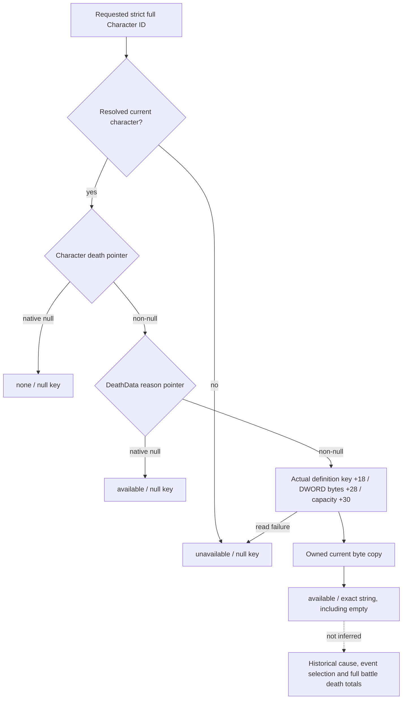

# Current character DeathReason key (1.20.0.3, 2026-10-05)

The existing `ck3_query_battle_terminal_transition_v1` current-person observations now carry an additive `current_person_state.death_record` leaf. This closes the specific stable reason-key source gap retained by the earlier Oct 5 terminal-person eligibility increment. It reads the current committed death record; selected event names and historical roster absence are not substituted for that record.

Exact source: CK3 1.20.0.3, Steam 25652598, EXE SHA-256 `94B55397ABB687A3DCD436805A5D885E6BE90FA6C693FEB44A9E3BBEEADE02A6`. The original independent frozen EXE and its intake identity were reused; no installed EXE or game process was accessed.

## Source-first closure

[Native API](Z:/ck3_mod_rewrite_process_assets/g2-resume-20261005/battle-death-reason-stable-key-v63/native-key-source/API.json), SHA-256 `0eaf21b123fc736bad1c5d6632dad9f3f4dcfa2ba90ba2b6585e27698a10372f`, and [string contract](Z:/ck3_mod_rewrite_process_assets/g2-resume-20261005/battle-death-reason-stable-key-v63/string-layout-source/STRING-API.json), SHA-256 `31ce0e5adad1409f0520d1600064fb50f31d84eb6b6c1d9d84cf610b70a9b837`, were sealed before provider implementation.

The committed pointer is `strict full Character ID -> Character+0x1D0 -> DeathData+0x10 -> actual DeathReason`. The current database identity comes from `0x2897FD0` / `0x5D295F0`; authored lookup `0x2B854E0` returns the actual definition or canonical fallback `0x5D296D8`. The specific `CDeathReasonDatabase` primary vtable `0x48A6E50`, slot `+0x20`, selects `0x2F52EC0`. Both actual-definition array and fallback branches join there and directly read the SAME key layout. The exact 277-byte getter span has SHA-256 `26e86f14d9684c7791ed4202f82d258c05428631b0002b2e58d893bf114660b1`.

| Actual definition field | Native getter meaning |
| --- | --- |
| `+0x18` | Key string storage; inline bytes or heap data pointer |
| `+0x28`, DWORD | Native uint32 length bits, measured in bytes |
| `+0x30`, qword | Unsigned capacity; `<16` selects inline, otherwise heap |

The getter returns a caller-owned descriptor containing a borrowed data pointer and length. It locks the database. The provider instead directly copies the source-proven bytes into an owning `std::string` on the existing query thread; it calls neither that getter nor the mutable serializer/intern helpers. Native empty strings are successful values. The existing bounded copy limit is retained.

Storage is a narrow char byte sequence. Current frozen authored keys `death_battle` and `death_fight` are ASCII and therefore preserve their UTF8 bytes. Arbitrary non-ASCII key encoding is not established by these bounded spans. Existing JSON escaping preserves bytes except its normal quote/backslash/control escapes; no validator, transcoder, new gate or feature flag was added.

## Existing query contract

The new object has exactly `status`, `reason_key` and `unavailable_reason`. `none` means a successfully observed native null death-record pointer. `available` means the current death record was read, with its exact key or a legitimate native null reason pointer. `unavailable` retains strict unresolved-character or real read failure detail. Existing alive/custody/prowess/injury fields and battle terminal readiness stay independent. The Python normalizer accepts older current-person objects without this additive leaf and does not fabricate a default record.

This is current per-requested-full-ID observation. It does not backfill old terminal journal rows, infer a reason from a scheduled/selected event, enumerate all dead knights, or execute death/custody callbacks. The query tool and public action surface are unchanged.

## Focused result and readiness

[The single new pipeline](Z:/ck3_mod_rewrite_process_assets/g2-resume-20261005/battle-death-reason-stable-key-v63/focused-run-01/RESULT.json) is FIRST GREEN: 7 necessary production TUs compiled concurrently with `/O2 /W4 /WX /DNDEBUG`, real current-person reader to actual terminal serializer to one registered existing MCP call under `-B -O`; total 6.514059 seconds. Result SHA-256 `527cfd939ea90a657bd0d31fb5dc32ab9353a1191a726dbf8768f59fad10cb0f`.

One new reason-only native case covers inline and heap key ownership, alive/no record, dead/native null reason, and strict generation mismatch. The source buffers change after reading, while serialized keys remain the owned originals. The same Python pass preserves the older absent leaf without another MCP query. Existing Oct 4 person/knight cases and the Oct 5 eligibility case were not rerun.

Readiness is **static-ready current DeathReason key observation**. Source proof is closed; Root deployment and a genuine current requested-character paused query remain necessary for production-live credit. This constructed fixture uses synthetic date `54000000`. New live observations, game days, SDK/pipe/CK3/window/Git/shared writes and full DLL builds are all zero. Normal-finalizer event effects, custody, cleanup and complete Monte Carlo remain separate.

Oct 5 / W41 report and Root-only seven-path LF patch: [ROOT-DELIVERY.json](Z:/ck3_mod_rewrite_process_assets/g2-resume-20261005/battle-death-reason-stable-key-v63/ROOT-DELIVERY.json), [ROOT-DAY-WEEK-FIELDS.json](Z:/ck3_mod_rewrite_process_assets/g2-resume-20261005/battle-death-reason-stable-key-v63/ROOT-DAY-WEEK-FIELDS.json).
