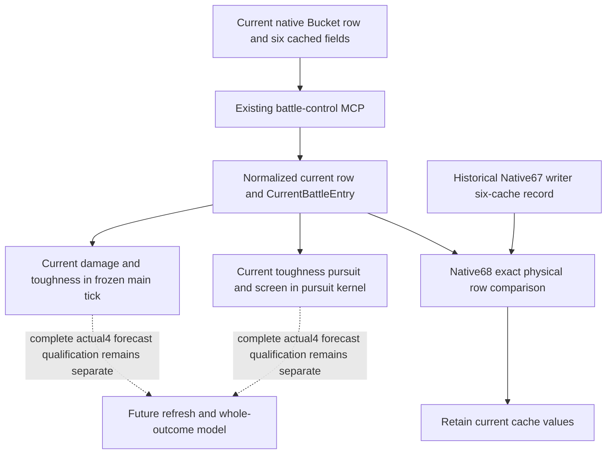

# Current Entry cache to combat forecast ingress, CK3 1.20.0.4

This bounded source review closes the **current physical Entry cache to existing
current-condition arithmetic** seam. It found no missing cache observation or
adapter field that needs a new bridge, MCP method or producer. The result is
**NO_NEW_PRODUCTION_WORK** for this seam, recorded on 2026-10-10 / ISO W41.

The reviewed source is `91bf64589d78df866fdf6908841fc9b64e875ec7`, including
qualified Native68 source `3ff84302db238fe7eaba108d39c5a3928449ca83`. Exact4
remains Steam 25734779 / CK3 1.20.0.4 / EXE SHA-256
`98702F88A547CDE2EAF29A85F93B85F68EE4CF8148336A4F7AFAEB75319DD518`.
No executable, game, SDK, process, saved response, Driver state or test was read
or executed for this review. These are production-source findings, not a new
actual4 arithmetic or paused-frame qualification.

## Native input and existing consumer

The [qualified physical Entry association](battle-current-physical-entry-writeback-12004.md)
already distinguishes the current Bucket row from the historical writer record.
`native_bridge/src/ck3_12002_battle.cpp:276` publishes the computed current row
address; its existing reader at lines 331 onward copies Entry `+0x30` max size,
`+0x38` siege, `+0x40` damage, `+0x48` toughness, `+0x50` pursuit and `+0x58`
screen. Native67's captured writer postimage is additional historical material.
It does not replace these current values.

All Python paths below are relative to `ck3_autonomous_player/src/xar_autoplayer/`.

| Current observation | Existing production consumer | Concrete numerical use |
| --- | --- | --- |
| `effective_damage_raw` | `simulation/battle_current_adapter.py:235`; `battle_current_runner.py:173` | Each retained MAA's current damage is multiplied by its current Q100000 fighting quantity, after the observed counter retention when applicable. |
| `effective_toughness_raw` | `battle_current_adapter.py:224`; `combat_core.py:241` and `:251` | Each current Entry's toughness supplies the main-casualty divisor. The pursuit runner also sums toughness times current soft casualties. |
| `effective_pursuit_raw` | `battle_current_adapter.py:225`; `combat_core.py:571` | Current pursuer Entry pursuit is multiplied by its current fighting quantity. |
| `effective_screen_raw` | `battle_current_adapter.py:226`; `combat_core.py:577` | Current retreating Entry screen is multiplied by its current soft-casualty quantity. |
| Max size and siege | `bridge/battle_control_contract.py:2033`; `battle_current_adapter.py:185` and `:239` | Both remain in the copied source snapshot and each source row. The selected main-casualty/pursuit functions do not use them as damage operands. Their absence as separate state members is not a missing damage input. |

`adapt_current_battle_condition` retains native bucket order, full Regiment IDs,
current/soft quantities, owner/Army identity and the physical Entry identity.
`battle_current_refresh.py:237` builds its refreshed condition through this same
adapter; lines 92-95 expose the four current combat statistics in its ledger.
The existing future-condition path invokes `run_frozen_main_tick` at
`battle_current_future_refresh.py:513`. No historical writeback or newly
computed Character statistic is silently substituted for a current Entry cache.



## Existing executable observation contract

On a future Root-owned fresh frame with a player-controllable public CUnit
actually in combat, use the already registered method:

```json
{
  "method": "ck3_query_battle_control_snapshot_v1",
  "arguments": {
    "subject_army_id": "<fresh full public CUnit ID, integer>",
    "expected_revision": "<fresh public revision, integer>"
  }
}
```

The exact registered signature is `bridge/mcp_server.py:2748` in the reviewed
source. The strings above are explicitly unbound recipe placeholders, not
literal executable IDs. Read `/battle_control_snapshot/attacker` and
`/battle_control_snapshot/defender`, each with `levy_entries` and
`men_at_arms_entries`. The rows already carry `physical_entry_identity`,
`regiment_id`, current/soft quantities and all six `effective_*` values.
Preserve the response's actual snapshot revision, date, CombatID and Province.
No old Army, WarID, combat or paused-frame values are supplied by this package.

The existing combat-input Service at `bridge/service.py:14605` also adapts its
already enriched current control leaf and returns Native68's physical writer
comparison. It performs no additional current-control query there. This is an
association result, not a forecast or an instruction to refresh native stats.

## Honest remaining boundary

The current runner explicitly freezes events, stats, width and rosters and
sets `complete_transition=false`, `complete_monte_carlo=false` and
`win_probability=null` (`battle_current_runner.py:279-299`). Its source still
labels its arithmetic qualification as `.3`; this review does not upgrade that
label or claim a registered actual4 full-forecast endpoint. The existing
refresh ledger separately names
`actual_ongoing_nonroll_advantage_component_sources`
(`battle_current_refresh.py:258`). Those future-refresh and arithmetic
qualification boundaries are not repaired by publishing these same cache
values again.

FullPerson, FullEntry, actual4 whole forecast, live outcomes and G2 credit remain
unchanged. Six Character base points, per-stage piety/count composition and
actual casualty application are other owners' independent packages. This task
adds only the bounded ingress knowledge; it authors no test or FIRST and
replays no earlier GREEN qualification.
