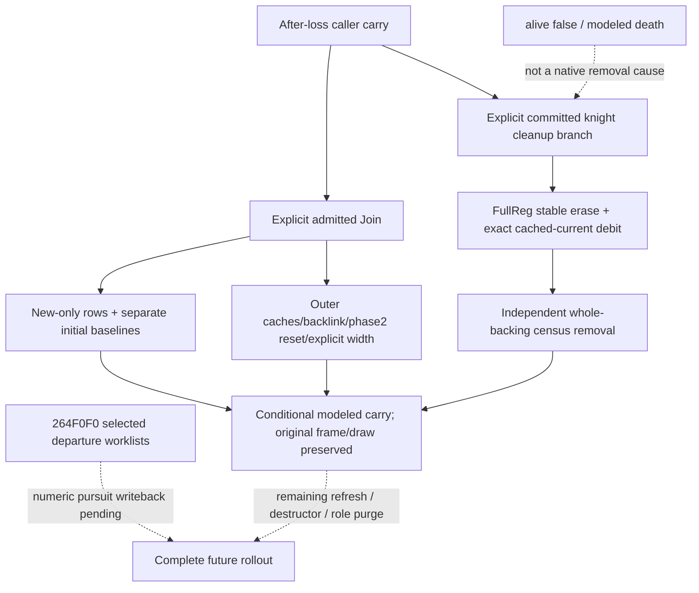

# CK3 1.20.0.3：条件化加入战斗与已提交死亡的骑士清理

2026-10-04，exact build `1.20.0.3` / Steam `25652598` / EXE SHA-256
`94B55397ABB687A3DCD436805A5D885E6BE90FA6C693FEB44A9E3BBEEADE02A6`。
本轮继续 [当前骑士/entry 关联](battle-current-knight-entry-refresh-12003.md)，先封当前构建的
outer writer，再实现 caller 条件化 future consequence。没有推进游戏、调用 SDK 或改变窗口。

| 实际 `.3` 来源 | 顺序与结果 | 不能替代的事实 |
|---|---|---|
| `2479180→24794B4→2586760` | actual chosen side 调 `2586A80/B80→264DE30`，只初始化新 Entry，随后 result/participant、Army+128、两侧当前缓存及有条件 width | 不预测什么时候获准入场；query 的当前 encounter stats 只是明示冻结假设 |
| prior pursuit2 的 outer join | 仅此分支重开 main1/day0/winner−1；main 加入保持原 phase/day | inner 重复 Army 只跳插入，不是整个 outer no-op |
| `28FAAF0→289F310→2BAF4C0→2BAF270` | 已提交死亡后，非空 CourtLink `[Character+1B8]` 且 CourtLink+16C 非0 才走骑士清理 | alive=false、phase-effect modeled death、抽象 detach 或后帧缺席不证明该 branch 已执行 |
| `2C06DC0→2A971A0→2633FF0→24E0D30` | 清 CourtLink flag/F8，稳定移除 Army regiment，Regiment+140=-1，然后两侧 `264EB90→26547D0` 删除 fullReg row | current0 仍可删；扣 Side+98 当前账，levy 另扣+A0；不重分 soft/owner hard 或重扣预测损失 |
| `2A9E640` | destructor 后清0x150字节、失效 fullID、清存储槽 | destroyed memory 的 Reg+148=0 不是合法骑士 CharacterID0 |

加入的新 row 从独立 whole current count 初始化 `starting=whole*Q100000`、
`current=starting`（仅 main-eligible）或真实0、`soft=0`。旧 row 的已预测 current/soft/hard 保留。
新 whole 数量同时增加 Side+A8 初始 baseline，levy 增加+B0，result row+40 独立增加；
它们与 Side+58 owner hard ledger 不同。重复内层 add 不再增加初始 baseline，但 outer
仍刷新、写 backlink、执行 pursuit-only 重开和 positive-basewidth 的 width 工作。

新 `battle_current_entry_events_12003.apply_closed_entry_events_12003` 消费
`CarriedBattleCondition` 及有序 typed `AdmittedArmyJoin12003` /
`CommittedKnightCleanup12003`。调用者明示入场 side、incoming regiment 原序/whole 数量、
main 资格、knight slot、effective 属性假设、width 与清理 branch。输出新的 model carry、
有序 side-effect ledger 和独立 whole-backing-by-Army 模型状态。原生 origin revision/date、
source snapshot、draw state 仍保持原义；不会把模型更新包装成新的实机帧。

当前 control 的 fullReg/Army/owner/knight 回链和现有 combat-simulation incoming operands
已足够支撑这个限定 what-if；无需新增 DTO、MCP、flag 或 runtime gate。CourtLink branch
前提是 caller 条件输入，不能从当前死亡 flag 推断。已选 stock phase event 的
`feedback_pending` / `require_participant_detach_recompute` 不自动生成 native cleanup event。
Regiment、Army、Combat 的 mapping outcome 也须明示：invalid Regiment 仅清标志，不解绑；
invalid Army 跳过 Army 与 Combat 写入；invalid Combat 只完成 Army 解绑。unknown 保留 partial
gap，不能当成 false 或有效删除。CourtLink+F8=-1 只清骑士标志，没有目标 Entry 可删。

混合 owner 撤退源也已封：实际 caller 的第五 bool 为 true，`264F0F0` 原序反向抽取 owner
worklists，先扣离场 current、删除其 row，再 `26520A0` selected pursuit，之后删除 owner
Army/清 backlink。此 pursuit 使用选中 copied levy/MAA soft sums、actual opposite side，
第九参数 `1` 是 **duration/divisor**，不是 subset-mode 或普通 runtime pursuitDays。
不能用 Combat+6E8/+6F0 全侧 soft 池、Side+C2 ordinary skip flag 或已有整侧 pursuit 替换。
数值追击 writeback 仍有独立工作入口，本模块不借成员删除宣称已完成该数学。

唯一新增 focused 两场覆盖：loss 后 join/duplicate/pursuit-only 重开与 native 原序初始化；
诊断死亡不删、明确 committed cleanup 只删除 full target、真实 current0、保留 survivor
账户和独立 whole backing。首次 `-B -O` 两场 GREEN 保留；最终 API 明确 mapping 分段后，
只补该必要 delta 并重跑相同两场，**最终 2/2 GREEN**（test elapsed `0.003478s`），
无 failure/error/skip。没有重跑既有 current/P1 suites 或 native build。
两次实际 attempt、源 hash 与结果均保存在下方 Root receipt。

本组件交付范围是 **static-ready 的条件化 membership consequences**，新增实机日、查询、
动作和 family credit 均为0。完整 future domain 继续未完成：contact/admission 时间、death
queue/commit 调度、Regiment destructor vfunc、后续 commander-role purge、完整 future refresh
与 selected subset-pursuit 数值 writeback 仍有具体源入口。它不能替代 full RNG、MC 或胜率。

[源树与最终 source receipts](Z:/ck3_mod_rewrite_process_assets/g2-resume-20261004/battle-knight-entry-future-12003/SOURCE-TREE-SEAL.json)
记录 `.3` writer、输入与实现前父树；
[Root 交付回执](Z:/ck3_mod_rewrite_process_assets/g2-resume-20261004/battle-knight-entry-future-12003/ROOT-DELIVERY.json)
保存补丁、两场验证及 Oct4/W40 merge fields。Root 负责共享采用、commit/push；g62 runtime 未被本包修改。
