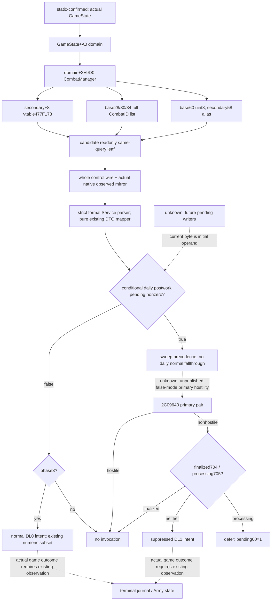

# Current CombatManager finalizer inputs — CK3 1.20.0.3

The existing conditional normal-finalizer projection needs the manager pending
byte before it can choose the ordinary phase3 accounting branch. This candidate
implements that missing current observation in the existing battle-control query:
`current_finalizer_manager_inputs_v1`, mirrored in
`active_combat_resume_inputs_v1.observed`. Source integration is complete in the
exclusive battle-pending worktree. Compilation, imports, the two whole-wire
FIRST scenes, and paused Robert observation are **NOTRUN**. Readiness remains
**research**.

Exact authority is CK3 **1.20.0.3**, Steam build **25652598**, supplied executable
SHA-256 `94B55397ABB687A3DCD436805A5D885E6BE90FA6C693FEB44A9E3BBEEADE02A6`.
The initial candidate used Root's read-only `Z:/gb0` baseline
`df87fd8562120b901413793ded4680b7b4dabd8e`. Its actual integration baseline is
`be06a134b9a5472275e08ea452a8e3542b192fb8`, resolved from the supplied `be06a134`,
in `C:/codex-ck3-background/parallel-integrations-20261006/battle-pending`.
The increment reuses cached exact bytes and introduces no executable read or hash.

## Native source and decision tree

Cached date-stage `22A1D64..22A1D75` loads `GameState+0xA0`, adds `0x2E9D8`,
then invokes secondary-interface virtual slot `+0x18`. Constructor
`2ADDDA4..2ADDDD1` establishes CCombatManager at the domain aggregate's
`+0x2E9D0`; its secondary vtable at manager `+0x08` is `EXE+0x477F178`.
That slot targets `2AD8000`. The manager's complete stored-order CombatID list
is data `+0x28`, capacity `+0x30`, count `+0x34`, int32 full IDs with stride4.

Daily `2AD8148` clears selected Combat processing `+0x705`, then `2AD814F`
reads secondary receiver `+0x58`: **manager base+0x60 uint8**. Zero reaches
the normal phase3 check and `258CD50(DL=0)`. Any nonzero value calls
`2AD8880(manager base)` and skips that daily row's normal check after return.
Sweep entry clears base60, calls `2C09640(primary0, primary1, false)` with
native Character fallback, then checks finalized704 and processing705 to skip,
defer, or invoke suppressed `258CD50(DL=1)`. The hostility body is unopened.

The complete source ledger and inherited pins are external `NATIVE-TREE.md` and
`SOURCE-PINS.json` in
`Z:/ck3_mod_rewrite_process_assets/g2-parallel-20261006/battle-pursuit/`.
Cached files used for the root and operand are:

- `g2-resume-20261003/combat-commander-quality-v46/in-battle-assignment/evidence/combat-reselect-root-logical.txt`
- `g2-resume-20261004/battle-source-next-increments-v52/native-active-exit/EXE-02AD8880.asm`
- `g2-resume-20261004/battle-calendar-admission-v57/manager-source/evidence/shared-date-stage-combat-call-cached.txt`
- `g2-resume-20261004/battle-calendar-admission-v57/manager-source/evidence/manager-vtable-second-ref-context.txt`

All four paths are relative to `Z:/ck3_mod_rewrite_process_assets/` and were
already frozen before this increment. Existing canonical background remains
`battle-normal-finalizer-1.20.0.3-2026-10-04.md` and
`battle-current-pursuit-terminal-12003-2026-10-04.md`.

## Concrete implementation

Four new native files provide the DTO, exact .3 binding, memory reader, and one
shared nullable serializer. The reader uses the existing actual GameState slot,
manager root, secondary vtable, exact selected Combat ID/tag, full manager list,
and base60. It calls no native function and writes no native memory. Root hooks
attach it to the existing two-pass `ControlSample`. Unequal optional samples
produce null for this leaf and retain the existing base control frame. Both
native serializers receive the same sampled DTO.

The leaf contains exactly `source_combat_id` signed int32,
`combat_manager_row_admitted` bool, `pending_suppression_sweep_raw` uint8, and
`pending_suppression_sweep` bool equal to `raw != 0`. Zero is retained. The strict
Python parser validates the exact four-key shape, width/type, Combat identity,
and raw/boolean agreement; the existing active-resume normalizer validates its
actual native mirror against the parent. Absent legacy keys remain absent,
explicit null remains unavailable, and neither becomes false.

The new pure adapter maps only the two observed operands into existing
`CurrentNormalFinalizerManagerInputs`. Its `entry_kind` is explicit caller
context, defaulting to the existing `daily_row` model. Primary hostility,
finalized, processing, and result presence remain explicit optional caller
conditions. It records that actual future manager state, native hostility, and
native finalizer effects were not observed.

No new MCP tool, argument, gameplay action, or readiness gate is added. Pending
data stays unavailable on old non-.3 bindings. The existing active-resume
`input_observation_ready` remains false for its still-unpublished future inputs.

## Two FIRST scenes and sole formal compound — NOTRUN

One new native fixture constructs two whole battle-control scenes, base60=0 and
base60=7, with opposite base58/base68 decoys, actual manager secondary vtable,
selected full CombatID in the complete stored list, two sides, and complete
one-Army/one-Regiment backing for each side. It invokes the production whole
control reader and both whole native serializers, preserves the input memory,
and writes `case-zero.json` and `case-nonzero.json`.

The sole Python compound consumes those native outputs through the existing MCP
helper and `GameplayBridgeService`, strict normalizer and actual mirror,
owned pure adapter, then the existing normal finalizer. Raw0 reaches ordinary
intent; explicitly conditional baseline/max10 and whole current9 produce
900000 Q survivors per side without loss reapplication. Raw7 first remains
partial without hostility, then explicit fixture hostility=false and
finalized=false establish suppression precedence and no normal numeric output.
These conditional inputs are fixture witnesses, not new native observations.
Legacy absent/null and malformed wire variants reuse the raw0 wire in the same
compound; they introduce no additional native scenes or live evidence.

The own CMake include registers the new reader TU in existing targets that
already compile the battle reader, then adds only the focused fixture target
and native-FIRST/Service-compound pair. Root-only patches cover five native
hooks, the strict Python hook, and one final shared CMake include. Concrete
copy destinations and commands are in `ROOT-DELIVERY.json` and
`parent/RUN-RECIPE.md`. No old B98 or terminal test matrix was executed.

## Readiness and next input

This increment delivers integrated source, not static-ready or live credit.
Root must cherry-pick the isolated source commit, freeze its joint integrated
source, then perform the two new scenes and sole compound once. A real paused
query is restricted to Robert29829's original
ordinary campaign and earns only current-input primitive credit. The current
byte is an initial same-frame observation; future pending writers and postwork
state require explicit caller assumptions until separately modeled/observed.

For a true pending sweep, the next concrete missing producer is actual
false-mode `2C09640(primary0, primary1, false)` with canonical fallback. Its
exact body/read behavior remains source research for a later finite cache or
Root-approved extraction. Independent sweep processing705 is another operand;
daily postwork processing=false is already source-closed. Character outcomes,
reentry, scripts, and war settlement remain their existing independent gaps.
No new battlefield execution restriction follows from these prediction gaps.

The packet path is
`Z:/ck3_mod_rewrite_process_assets/g2-parallel-20261006/battle-pursuit/implementation/`.
New EXE bytes/hashes, builds/tests, SDK/pipe/game operations, actual paused
observations, game days, shared source writes, and Git operations are all0.
Oct6/W41 merge fields are supplied in `OCT6-W41-FIELDS.json`; Root owns reports,
canonical docs/index integration, validation and commit/push.
