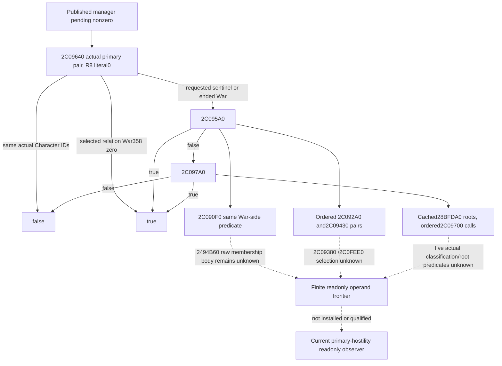
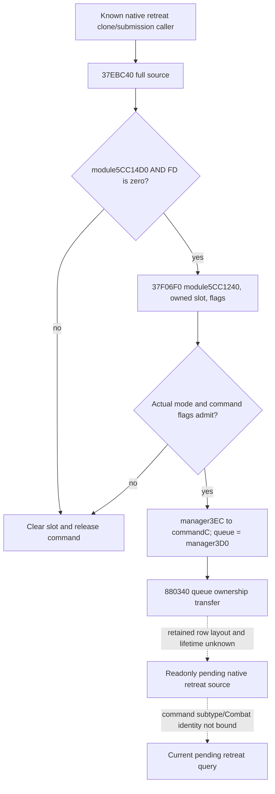

# Current finalizer hostility and retained retreat source — exact .3 frontier

This is source research recorded during the Oct6 to Oct7 cap-observer work.
It adds no installed hostility or retreat observer. The cap implementation and
its seven new FIRST cases are separately described in
[the cap topic](battle-current-warscore-caps-12003.md); all new fixture/consumer
execution remains **NOTRUN**.

Exact build: CK3 **1.20.0.3**, Steam **25652598**, inherited EXE SHA-256
`94B55397ABB687A3DCD436805A5D885E6BE90FA6C693FEB44A9E3BBEEADE02A6`.
Root authorized these necessary bounded static reads. Exact-named cache search
ran before extraction. No new EXE or source hash was computed, no game or SDK
was used, and no old qualified fixture was replayed.

## Current pending-sweep caller, after the published manager input

The existing nonzero-pending daily sweep reaches `2C09640(primary0,primary1,0)`.
Its complete 191 B body and literal ordered relation lookup are already cached.
Same actual resolved Character FullID returns false. A selected relation War
with `War+358==0` returns true for the actual literal-zero third argument.
The requested-sentinel or ended-War path calls `2C095A0`, then conditionally
`2C097A0` after a false result. The new complete bodies close that immediate
caller composition without invoking any predicate.

| Exact `.pdata` body | Bytes | Closed source behavior |
| --- | ---: | --- |
| `2C095A0..2C09635` | 149 | Same selected IDs or `2C090F0==true` returns false. Otherwise OR of `2C092A0(A,D,0)`, the reversed pair, `2C09430(A,D,0)` and the reversed pair. |
| `2C097A0..2C0980B` | 107 | Obtain each Character root via cached `28BFDA0`; OR `2C09700(A,D,rootD)` with the reversed pair/rootA. |
| `2C090F0..2C0921A` | 298 | Walk signed32 War IDs from `Character+1C0 -> +318`, or the native empty fallback list. Resolve each full War generation/fallback. `2494B60` chooses the first Character's side at War+20 or War+80 and tests the second Character in that same side. A match returns true; no War+358 check is present in this body. |
| `2C092A0..2C0937C` | 220 | `2C09380` and optional `2C0FEE0` select an operand; require its real Char tag, non-sentinel FullID and ID different from the other Character. Ordered relation is `(other,selected)`. Resolve relationship+20 War with native fallback; require actual War+358 zero. Optional War pointer filter is bypassed by the reached literal-zero argument. |
| `2C09430..2C09598` | 360 | Walk that same War list. If source Character is in War+20, select Character ID at War+28C; else if in War+80, use War+288; else select sentinel/fallback. Resolve actual Character and call `2C092A0(selected,other,0)`. |
| `2C09700..2C09795` | 149 | Same IDs, `2911DF0(first)` true, or `29131E0(second,first)` true returns false. `2C458E0(first)` plus `2C4BD40(second)` true returns true. Otherwise `2C10040(first,&root_argument)` returns true only for a valid non-sentinel Character. |

Names in the table describe the exact offsets and order. They do not assign
unclosed diplomacy, liege or religious meanings to the predicates. The reached
remaining body frontier is finite: `2494B60`, `2C09380`, `2C0FEE0`, `2911DF0`,
`29131E0`, `2C458E0`, `2C4BD40`, and `2C10040`. Their native values have not been
substituted with fixture booleans. No recursive body extraction followed.

## Already-selected native retreat command submission

The new `37EBC40..37EBCB8` body is **120 B**. It tests module byte `5CC14D0`
with mask `FD`. If the masked value is nonzero, it clears the supplied command
slot and releases the command through vtable slot0 with EDX1. Otherwise it
moves the slot into a local owner, clears the original slot, and calls cached
`37F06F0` with RCX=`module+5CC1240`, RDX=local command slot and R8D=the original
EDX flags. It is not itself the retained queue layout.

The existing complete `37F06F0..37F07EA` cache (**250 B**) is reused from the
Oct5 normal-create submit source. Before transfer, its actual mode checks can
release and reject a command. On admission it writes manager+3EC into
command+C, obtains the queue object from manager+3D0, takes ownership from the
caller slot, and calls `880340(queue,&local_owned_command)`. Flag bit2 chooses
the branch with the queue+78 lock. These facts identify retained storage's
real next entry; they do not establish the queue row layout or command lifetime
at an arbitrary paused capture.

`880340` is the next concrete retained-layout body entry. Natural retreat
command subtype and exact Combat association remain separate source inputs.
The query prototype is still uninstalled. Empty current storage does not prove
that no future native retreat will be selected. No observed current gameplay
blocker is claimed by this source-only lane.

## Source artifacts and actual read cost

The extraction script, retained raw bytes, exact `.pdata`/unwind records, decoded
bodies and two separate metadata/body attempts live at
`Z:/ck3_mod_rewrite_process_assets/g2-parallel-20261007/battle-pursuit/static-next-inputs/`.
`METADATA-READ-RECEIPT.json` / `BODY-READ-RECEIPT.json` preserve the original
three-target capture; `HOSTILITY-METADATA-READ-RECEIPT.json` /
`HOSTILITY-BODY-READ-RECEIPT.json` preserve the subsequent four reached helpers.
The existing PE map and narrow metadata cache were reused, avoiding repeated
header/hash/full-pdata reads.

Actual new EXE cost: **1403 B code + 284 B metadata = 1687 B total**. Each of
the seven named bodies was read once, with no neighboring code or new hash.
The cached `28BFDA0..28BFE38` frameless body (**152 B**) and `37F06F0` body were
reused without new EXE reads. This is source research, not an import/build/test,
native observer execution, paused game capture or readiness upgrade. The cap
observer's proposed production read cost remains separately **48 B per existing
two-pass battle-control frame**.
