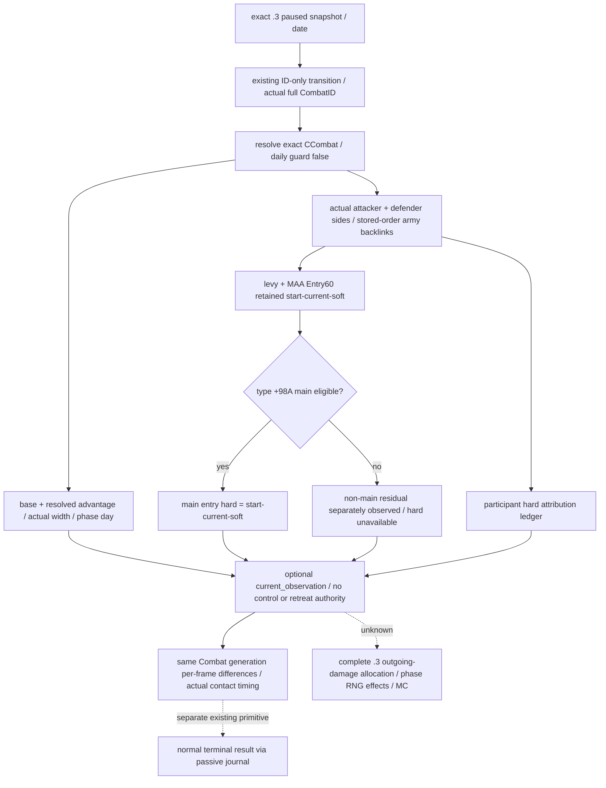

# CK3 1.20.0.3：实际战斗双方的即时兵员与伤亡观测

2026-10-03。Exact build 为 `1.20.0.3`、Steam `25652598`，EXE SHA-256
`94B55397ABB687A3DCD436805A5D885E6BE90FA6C693FEB44A9E3BBEEADE02A6`。
当前状态 **`production-live primitive`**：v37 已在原普通战役实测即时兵员与伤亡观测，详见文末；
完整 Monte Carlo、终结结果与玩家接战循环仍按各自实证分级。
本工作包在原生树落盘后，沿已有 ID-only `battle_transition_v1` 增补可选
`current_observation`；其独立价值是观察真实外国战斗双方正在消耗多少作战兵员、哪些已溃散、
哪些属于永久兵员损失，再决定接战时机。不能把地理上同省的敌军合成一个假想阵营。

## 已闭合的原生输入

复用 [battle 迁移](ck3-1.20.0.2-battle-migration.md)和
[1.20.0.3 伤亡/终结边界](battle-casualty-retreat-terminal-outcomes-1.20.0.3-2026-10-03.md)。
既有 `.2→.3` 比较的 battle 模块为 `UNCHANGED/GREEN`，复用 18 个唯一签名、7 个 vtable 前缀、
73 条字段指令和 30 个源码常量。比较 SHA 为
`5bd80588c3021bf300edda12a63b8d96fbefdb484f0d869ee129d0fc5a81876d`；
权威 battle manifest SHA 为
`5be799da379967d0876f2fe224f081bccd43a2778ee952adb6c9f9fd33c4d9d7`；
永久 `.3` reuse manifest SHA 为
`ff7a5b1a8208d7ce0358be3cd2fec9f455a4ba116ccf1b25c4ccf0f0b64dd119`。
本轮复用现有比较，不重跑整套 ABI 检查，不把历史 `.2` fixture-live 改称 `.3` live。

| 原生对象 | 已证字段 | 用途/单位 |
|---|---|---|
| CCombat | `+6B0/+6B4` int32 phase/day；`+6C0/+6C4` int32 base/final width；`+6C8/+710` int64 base/resolved advantage | day 是该 phase 内原生日数；width 为整数 frontage；advantage 是 signed Q100000 points，0 为合法观测 |
| CCombatSide | attacker `Combat+20` / defender `Combat+368`；`+B8` exact Combat backpointer；军队 vector `+10/+18/+1C` | 保留真正两侧及 stored-order full CArmyID，不请求玩家操控权限 |
| Entry60 两个 bucket | levy header `+28/+30/+34`；MAA `+40/+48/+4C`；stride `60`；entry full RegimentID `+8`；start/current/soft int64 `+10/+18/+20` | 各兵员账 Q100000；每个 bucket 的每行只累加一次 |
| CArmyRegiment / type | storage `5D1F340`、identity `+10`、所属 CArmy `+140`、type pointer `+18`；type main flag `+98A` | 必须用 CArmyRegiment，不混入 CRegiment；旧 `+A0A` 无效 |
| participant hard ledger | side header `+58/+60/+64`；stride `18`；FullCharacterID `+8`、int64 hard `+10` | Q100000、独立归属账；与 retained entry hard 分别发布 |
| side cache（既有参考，不属本次输出） | int64 total `+98` / levy `+A0` | tick-start cache；可合法与即时 entry 合计不同；本增量不采集、不输出缓存或相等标记 |

原生存储统一以完整 ID 身份核对：storage data `+20`、capacity `+2C`，
index 为 `uint32(FullID)&FFFFFF`，row stride `10`、对象 pointer `+8`；核对对象自身完整 ID。
CArmy `+124` 是 public CUnitID、`+128` 是 CombatID，CUnit `+178` 必须回到同一 CArmy，
`+174` owner 必须为有效 FullCharacterID。实际 CUnit `473/474` 的 generation 0 合法，不另造高位。
同一 owning-thread paused snapshot 的真实 clock 与完整 CombatID 是观测范围。

## 计数和差分语义

`derived_current_fighting_raw` 与 `derived_soft_casualties_raw` 累加两个 retained buckets。
主战 eligible 行才计算 `starting-current-soft` 为 main-entry hard；非主战行的残差可能是 reserve，
仅发布独立 `non_main_start_minus_current_minus_soft_raw`，不能称为 hard。验证
start/current/soft 非负、current≤start、soft≤start-current，再使用 checked int64 累加。

骑士的兵团记录已在 retained MAA bucket 内；不能另加一份骑士人数、再加 native army 的整数人数。
兵员账减少也不证明骑士人物死亡。participant hard ledger 是原生独立归属账，不能再加到 entry hard。
消失 entry 或参战成员变化时，主战 entry 合计不一定代表整个战斗累计 hard；保留 owner ledger 与真实
成员身份，说明差分的范围。soft 兵员在追击可转 hard；战后军队整数人数可回升，净人数差不等于 exact hard。

所有兵员/伤亡 raw 除以 `100000` 才是人数当量，native army-strength 已返回整数人数，不能再除一次。
advantage raw 同样除以 `100000` 才是 signed points；它不是胜率。
宽度直接读取本场实际 CCombat，不能替换成另一份假想 player-vs-rebels precontact 宽度。

既有 `stored_current_matches_derived=false` 或 levy 对应 false 是合法观测形状。
此差异已有 `.2` F22 main-day-1 真正 fixture-live 证据。本增量只发布 entry-derived 即时账和 owner
hard ledger，不采集 side 缓存，也不输出缓存或相等标记；即时字段不以缓存相等作为门槛。
初始静态交付时新的 `.3` 实际字段回执尚待 Root 采集；现已由文末 v37 回执补齐，旧实证不重复跑成新成果。

## 最小实现与诚实边界

新增 reader 可独立放在 `ck3_12003_battle_current_state.cpp`，使用现有 reviewed BattleBindings，
沿现有 transition handler 增补可选叶。以上计数不需要调用 native strength、retreat validator、
roll RNG 或任何 phase effect；不改 `ck3_12002_battle.cpp` 及正在修复的 terminal 路径。
已有 lifecycle 成功而新叶读取失败时，保留 phase/day/member 原结果并注明新叶 unavailable，不能用 0
补缺失兵数。Combat 删除按既有 `combat_not_found` 处理，新叶 null/unavailable；合法空 vector 与合法 0
仍是实际值。保持 complete MC 的四项缺域，不能因增加这些观测声称模拟已完成。

原普通战役 `.3` 既有真实回执证明 Combat `1577058305`、province `2640`，date `53236632`、maneuver
day `1`，attacker `[251658381,473,474]`、defender `[50331920,83886484]`；Robert `83886367` 不在两側。
该早期回执只证明这份身份/阶段，不含新的 casualty/current-state 叶；它是当时 `research` 与随后
`static-ready` 的历史基线。文末 Root 新 DLL 的 paused receipt 已提升新叶至 `production-live primitive`。
Root 应以最新真实 CombatID/阶段/成员采样，不为读取这些字段重种或倒退现有战役。

外部交付目录为 `battle-missing-observations/v37-value-increments/native/`；机器合同
`battle_current_state12003_abi.json` 和 `SOURCE-PINS.json` 保留完整字段、复用哈希与实际 receipt。
本 lane 无 SDK、游戏动作、日期推进、窗口、共享源码或 Git 修改，未重复既有测试。

## 2026-10-03 v37：原普通战役实际字段验收

Root 已在原 Robert29829 战役以 v37/g39、source `f425` 组合版本读取本叶；本节只消费既有
paused artifact，不重新调用 SDK 或推进日期。实际 034 transition 的 `current_observation.status`
为 `available`、`unavailable_reason=null`，新叶从 `static-ready` 提升至
**production-live primitive**。原生完整 Monte Carlo 四项转移/保真缺域继续未完成。

Source 为 `runtime-preparation/v37/actual-new-leaves-v37-01/034-ck3_query_battle_transition_v1.json`，
SHA-256 `2ae43a036b704df41fffe661cd2ee4ab770b560c9d7cc6fb4f61ded2b4daa775`；
Root runtime PID62452，date_raw53236800、paused、native:3/public2，episode
`native-29829-2bc2d599f7f9`。query 自身 `source.game_version` 和 `source.executable_sha256`
仍为 null；exact 1.20.0.3 / Steam25652598 / EXE SHA
`94B55397ABB687A3DCD436805A5D885E6BE90FA6C693FEB44A9E3BBEEADE02A6` 由 Root runtime freeze
单独绑定，不把空 query metadata 改写成自行发布的版本证据。

真实 Combat1577058305@2640 是 main/day4；攻击方 `[251658381,473,474]`，防御方
`[50331920,83886484]`。before/after 两份实际地图快照均将 Robert CUnit83886367 放在2610、
in_combat=false；他不在此战双方。winner与forced_winner均none、finalized=false；
BattleResult1493172226 仍是分配的结果身份，不能据它称终结或玩家胜利。

| 实际账户（raw /100000后的人数当量） | 攻击方 | 防御方 |
|---|---:|---:|
| retained entry current fighting | 2942.66453 | 1482.72297 |
| retained entry soft | 166.13486 | 112.89427 |
| eligible main-entry hard | 71.20061 | 48.38276 |
| non-main start-current-soft residual，非hard | 10.00000 | 20.00000 |
| native participant hard total，独立账户 | 71.20061 | 48.38276 |

本帧攻击方上述 current+soft+main-hard+non-main 残量为3190.00000，防御方为1664.00000；
这是从当前 retained 账户重建的合计，不是另一个直接发布的 `starting` 字段，也不证明未来
参战集合、entry保留和账户永远不变。owner hard ledger 依 native 顺序为70766=71.20061，
30097=43.37918、35357=5.00358。两侧 ledger 合计此帧各自与 main-entry hard 相等；两个
独立账户不能再次相加。非主战残差不计hard，骑士不另计一次，兵员hard不证明人物死亡。

同一真实 Combat width 为2412→1206，base/resolved advantage raw分别-1200000/-100000，
即 native signed -12/-1 points。该值不转换成 Robert 视角、接战胜率或假想未来宽度；
它与较早 player-vs-rebels 的 width1381 是不同查询范围。

本帧没有缺失或 partial 字段阻断这些账户，因而没有新源码修复、测试重跑或扩大观测范围。
Root strict541TU/64jobs 和官方 CI37110280135 GREEN 沿用既有记录，不重跑。
原 battle/terminal 完成、玩家接战 OODA 和全局战争胜利仍需各自真实后态。
消费包与 exact pins 在 `battle-missing-observations/actual-v37-01/ROOT-DELIVERY.json`。
本包零新增 SDK/游戏动作/窗口操作/存档日/Git 或共享源码改动；3853/date53236800
是 Root 已保存进度，本次 read-only 消费不再计日。

## 2026-10-03: v38 thirteen saved days of foreign current-battle observation

Existing paused live evidence: actual-route-days-batch-2604-01/result.json and its thirteen per-day battle/snapshot/strength/save captures. External derived files and SHA-256 pins: Z:/ck3_mod_rewrite_process_assets/g2-resume-20261003/battle-observation-schedule/recapture-v38-thirteen-day-consumption/foreign-battle-lane/ROOT-DELIVERY.json. No game rerun or API research occurred in this lane.

CombatID **1577058305**, province **2640**, battle_result_id **1493172226** stayed observable on all 13 saved days: date_raw **53236848–53237136**, native revisions **19–67**. Actual phase stays **main (phase_raw=1)**, phase_day **6→18**. Every sample has **winner_side=none / winner_raw=-1**, **forced_winner_side=none / forced_winner_raw=-1**, and **finalized=false**. A battle_result_id alone is not a finalized outcome.

Published current-battle raw fields use **scale=100000**:

| Actual field | Attacker first→last raw | Defender first→last raw |
|---|---:|---:|
| participant_hard_total_raw | 10717859→31948694 | 7087221→20717315 |
| derived_soft_casualties_raw | 25008356→74547010 | 16537021→48340940 |
| derived_current_fighting_raw | 282273785→211504296 | 140775758→95341745 |

The side ledger preserves each daily delta. The participant ledger keeps attacker character **70766**, defender characters **30097/35357**, and their actual hard_casualties_raw fields. The separate non_main_start_minus_current_minus_soft_raw stays **1000000/2000000**; it is not reclassified as deaths.

Stored full attacker CUnitIDs remain **[251658381, 473, 474]** and defender IDs **[50331920, 83886484]**. At every final sampled snapshot all five are at province 2640, in_combat=true, retreating=false. No sampled membership arrival, retreat transition, or destruction occurs; intermediate states are unobserved.

Fresh current_soldiers queries exist only on days **02/06/13**. Same full ID **251658381** reads **2733→2665→2552** (fresh-interval decreases **68/113**); **50331920** reads **1307→1289→1243** (**18/46**); **473/474/83886484** stay **300/10/300**. The fresh intervals span **96/168 raw hours**. Other ten days have blank measurements. These are **unattributed current-soldier changes**, kept separate from published current-battle hard/soft casualty fields; they are not combat death counts.

Readiness remains **production-live primitive: foreign current battle observation**. No future win odds, terminal foreign outcome, player victory, native AI decision cause, or player battle OODA is demonstrated. The root batch stops for the separate player army's actual arrival at 2604; checkpoint **h4819**, date **53237136**, SHA-256 **21273b864f1f6533fbf8c6fa8203de25925835026547bf6c0c7b7fe1676154f2**. Battle query source game_version/executable_sha256 are null; root v38 exact-build binding must remain attached separately.

Next: continue the root-owned player siege/war OODA from the saved arrival frame. Record later foreign phase/winner/terminal fields only when an actual observation publishes them. No policy was changed by this lane.

Root v38 binding is separately frozen at `Z:/g40`, source commit `0ad923525ef899b836a823dfe983db49030789f2`, game `1.20.0.3` / Steam `25652598`, EXE SHA-256 `94B55397ABB687A3DCD436805A5D885E6BE90FA6C693FEB44A9E3BBEEADE02A6`; see `runtime-preparation/v38/v38-root-packet/ROOT-PACKET.json` and `runtime-preparation/v38/ADOPTED-V38-RUNTIME-FREEZE.json`. The Root batch advances raw date `53236824→53237136` through 13 normal saved days; foreign observations begin after its first day at `53236848`. Root has already credited these 13 days once: total **3867**, resume **714**, 2026-10-03 **+619**, G2 **5/8**, NW **2/4**, natural reconciled successions **0**. This file-only topic adoption adds **0** days, actions, or battle outcomes.

## 2026-10-03: v39 corrected stationary batch, foreign main-to-pursuit observation

Source: Z:\ck3_mod_rewrite_process_assets\g2-resume-20261003\military-ooda-continuation\siege-v39\actual-stationary-siege-batch-2604-02; pinned raw ledgers: Z:\ck3_mod_rewrite_process_assets\g2-resume-20261003\battle-observation-schedule\stationary-siege-v39-second-batch-consumption\foreign-battle-lane/ROOT-DELIVERY.json. The source batch is RED. It contains **36 completed bounded saved days**, then a saved RED round37 whose actual date jumps **53238024 -> 53238336 (312 raw hours / 13 elapsed days)**. There are 37 saved observation rounds and 49 actual elapsed days; no intermediate round37 daily battle frames exist. Prior thirteen route days and the separate ordinary first day are not counted again.

Foreign CombatID **1577058305**, battle_result_id **1493172226**, was queried on rounds01-36. Rounds01-34 stay **main**, phase_day20-53, winner none/-1, finalized=false. At **round35/date53238000** the first actual new phase is **pursuit (phase_raw2), phase_day0, winner_side=attacker/winner_raw0, finalized=false**. Round36/date53238024 is pursuit day1 with the same winner field and finalized=false. Stored attacker full CUnitIDs are **[251658381,473,474]**, defender **[50331920,83886484]**. These actual pursuit winner fields are preserved; they are not a finalized result or player victory.

**This batch has no actual ended or finalized=true capture; its ending credit remains 0.** Round37 has no fresh battle or strength query, so phase/loss/winner/finalized fields are blank. Later absence or the date jump does not prove termination.

Published current-battle side/participant raw fields and scale are preserved in the CSVs. Fresh current_soldiers rows exist only on rounds **10/17/27/31/35/36**; all other rounds stay blank. Same full CUnitID changes remain unattributed current-soldier changes, separate from battle hard/soft casualties and sampled retreat/absence states. Unit absence is not inferred destruction.

Readiness: **production-live primitive, foreign current battle observation with actual main-to-pursuit transition**. Terminal observation, player battle credit, native AI policy cause and full player battle OODA remain unproved. Root owns runtime repair/continuation from **h5021/date53238336**, SHA-256 **d6e9986ccf24fd85c853a08921cd4d200e2b279a33236a31619e8fc1ba88bab2**. This file-only lane performed no SDK/game/window/Git/test or extra-day actions.

For saved round37, the requested bound was **7 days** and the actual saved interval was **13 days**; its harness RED and missing intermediate battle frames remain recorded. Root credits the **49 actual calendar days** ending in normal saves once: cumulative **3917**, resume **764**, 2026-10-03 **+669**. Final normal checkpoint **h5021**, date_raw **53238336**, **91105707 bytes**, SHA-256 **d6e9986ccf24fd85c853a08921cd4d200e2b279a33236a31619e8fc1ba88bab2**. This topic adoption adds **0** days. Root's separate later fixed-terminal query must be recorded from its own actual receipt; it is not inferred from this batch's missing round37 query or from elapsed time.

### 批次之后的独立真实终结

随后 **一次实际terminal查询 GREEN**、正常SDK关闭：journal **event18/latest20** 捕获外国Combat1577058305 **normal_result / terminal_date53238096 / phase3 / winner0**，attacker70766、defender30097、Result1493172226、wipe=false，ordered sides真实保持。当前query日期是raw53238336，终结事件日期另为53238096；prior与result对象已absent、province不含该combat，subject@2640 noactive/backlink，coordinator50331823的successor assignment_reopened，已观察真实正常终结分支，晋级有限 **production-live primitive**。journal内finalized_before=false是当时捕获的旧字段，不据此把当前写成仍active。battle_warscore为not_recorded_by_native/allnull、hard_loss_inputs=null，Robert不在双方，不授伤亡、玩家战分/胜利或完整战斗loop。一次dispatch后mailbox failure0/readytrue、exception0，无save/retry/rearm，增加0日；旧v37真实AV和v38 active/member实际资格保留。[独立真正terminal实际](Z:/ck3_mod_rewrite_process_assets/g2-resume-20261003/runtime-preparation/v39/actual-terminal-after-pursuit-v39-01/result.json)；[单次健康mailbox消费](Z:/ck3_mod_rewrite_process_assets/g2-resume-20261003/v39-terminal-after-pursuit/faultstate/ROOT-DELIVERY.json)
