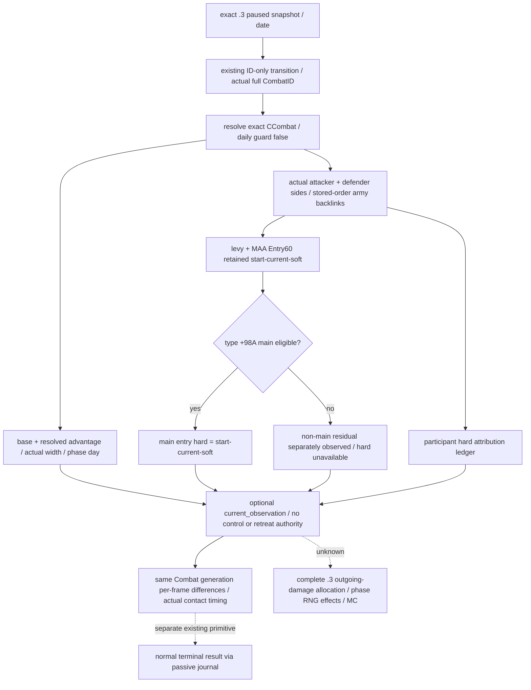

# CK3 1.20.0.3：实际战斗双方的即时兵员与伤亡观测

2026-10-03。Exact build 为 `1.20.0.3`、Steam `25652598`，EXE SHA-256
`94B55397ABB687A3DCD436805A5D885E6BE90FA6C693FEB44A9E3BBEEADE02A6`。
本工作包在原生树落盘后，沿已有 ID-only `battle_transition_v1` 增补可选
`current_observation`；其独立价值是观察真实外国战斗双方正在消耗多少作战兵员、哪些已溃散、
哪些属于永久兵员损失，再决定接战时机。不能把地理上同省的敌军合成一个假想阵营。

## 已闭合的原生输入

复用 [battle 迁移](ck3-1.20.0.2-battle-migration.md)和
[1.20.0.3 伤亡/终结边界](battle-casualty-retreat-terminal-outcomes-1.20.0.3-2026-10-03.md)。
既有 `.2→.3` 比较的 battle 模块为 `UNCHANGED/GREEN`，复用 18 个唯一签名、7 个 vtable 前缀、
73 条字段指令和 30 个源码常量。比较 SHA 为
`5bd80588c3021bf300edda12a63b8d96fbefdb484f0d869ee129d0fc5a81876d`；
权威 battle manifest SHA 为
`5be799da379967d0876f2fe224f081bccd43a2778ee952adb6c9f9fd33c4d9d7`；
永久 `.3` reuse manifest SHA 为
`ff7a5b1a8208d7ce0358be3cd2fec9f455a4ba116ccf1b25c4ccf0f0b64dd119`。
本轮复用现有比较，不重跑整套 ABI 检查，不把历史 `.2` fixture-live 改称 `.3` live。

| 原生对象 | 已证字段 | 用途/单位 |
|---|---|---|
| CCombat | `+6B0/+6B4` int32 phase/day；`+6C0/+6C4` int32 base/final width；`+6C8/+710` int64 base/resolved advantage | day 是该 phase 内原生日数；width 为整数 frontage；advantage 是 signed Q100000 points，0 为合法观测 |
| CCombatSide | attacker `Combat+20` / defender `Combat+368`；`+B8` exact Combat backpointer；军队 vector `+10/+18/+1C` | 保留真正两侧及 stored-order full CArmyID，不请求玩家操控权限 |
| Entry60 两个 bucket | levy header `+28/+30/+34`；MAA `+40/+48/+4C`；stride `60`；entry full RegimentID `+8`；start/current/soft int64 `+10/+18/+20` | 各兵员账 Q100000；每个 bucket 的每行只累加一次 |
| CArmyRegiment / type | storage `5D1F340`、identity `+10`、所属 CArmy `+140`、type pointer `+18`；type main flag `+98A` | 必须用 CArmyRegiment，不混入 CRegiment；旧 `+A0A` 无效 |
| participant hard ledger | side header `+58/+60/+64`；stride `18`；FullCharacterID `+8`、int64 hard `+10` | Q100000、独立归属账；与 retained entry hard 分别发布 |
| side cache（既有参考，不属本次输出） | int64 total `+98` / levy `+A0` | tick-start cache；可合法与即时 entry 合计不同；本增量不采集、不输出缓存或相等标记 |

原生存储统一以完整 ID 身份核对：storage data `+20`、capacity `+2C`，
index 为 `uint32(FullID)&FFFFFF`，row stride `10`、对象 pointer `+8`；核对对象自身完整 ID。
CArmy `+124` 是 public CUnitID、`+128` 是 CombatID，CUnit `+178` 必须回到同一 CArmy，
`+174` owner 必须为有效 FullCharacterID。实际 CUnit `473/474` 的 generation 0 合法，不另造高位。
同一 owning-thread paused snapshot 的真实 clock 与完整 CombatID 是观测范围。

## 计数和差分语义

`derived_current_fighting_raw` 与 `derived_soft_casualties_raw` 累加两个 retained buckets。
主战 eligible 行才计算 `starting-current-soft` 为 main-entry hard；非主战行的残差可能是 reserve，
仅发布独立 `non_main_start_minus_current_minus_soft_raw`，不能称为 hard。验证
start/current/soft 非负、current≤start、soft≤start-current，再使用 checked int64 累加。

骑士的兵团记录已在 retained MAA bucket 内；不能另加一份骑士人数、再加 native army 的整数人数。
兵员账减少也不证明骑士人物死亡。participant hard ledger 是原生独立归属账，不能再加到 entry hard。
消失 entry 或参战成员变化时，主战 entry 合计不一定代表整个战斗累计 hard；保留 owner ledger 与真实
成员身份，说明差分的范围。soft 兵员在追击可转 hard；战后军队整数人数可回升，净人数差不等于 exact hard。

所有兵员/伤亡 raw 除以 `100000` 才是人数当量，native army-strength 已返回整数人数，不能再除一次。
advantage raw 同样除以 `100000` 才是 signed points；它不是胜率。
宽度直接读取本场实际 CCombat，不能替换成另一份假想 player-vs-rebels precontact 宽度。

既有 `stored_current_matches_derived=false` 或 levy 对应 false 是合法观测形状。
此差异已有 `.2` F22 main-day-1 真正 fixture-live 证据。本增量只发布 entry-derived 即时账和 owner
hard ledger，不采集 side 缓存，也不输出缓存或相等标记；即时字段不以缓存相等作为门槛。
新的 `.3` 实际字段回执仍待 Root 采集，不把旧实证重复跑成新成果。

## 最小实现与诚实边界

新增 reader 可独立放在 `ck3_12003_battle_current_state.cpp`，使用现有 reviewed BattleBindings，
沿现有 transition handler 增补可选叶。以上计数不需要调用 native strength、retreat validator、
roll RNG 或任何 phase effect；不改 `ck3_12002_battle.cpp` 及正在修复的 terminal 路径。
已有 lifecycle 成功而新叶读取失败时，保留 phase/day/member 原结果并注明新叶 unavailable，不能用 0
补缺失兵数。Combat 删除按既有 `combat_not_found` 处理，新叶 null/unavailable；合法空 vector 与合法 0
仍是实际值。保持 complete MC 的四项缺域，不能因增加这些观测声称模拟已完成。

原普通战役 `.3` 既有真实回执证明 Combat `1577058305`、province `2640`，date `53236632`、maneuver
day `1`，attacker `[251658381,473,474]`、defender `[50331920,83886484]`；Robert `83886367` 不在两側。
该回执只证明这份身份/阶段，不含新的 casualty/current-state 叶。因此本研究为 `research`，代码聚焦
验证后可为 `static-ready`；Root 新 DLL 的 paused receipt 才能提升新叶的 production-live primitive。
Root 应以最新真实 CombatID/阶段/成员采样，不为读取这些字段重种或倒退现有战役。

外部交付目录为 `battle-missing-observations/v37-value-increments/native/`；机器合同
`battle_current_state12003_abi.json` 和 `SOURCE-PINS.json` 保留完整字段、复用哈希与实际 receipt。
本 lane 无 SDK、游戏动作、日期推进、窗口、共享源码或 Git 修改，未重复既有测试。
