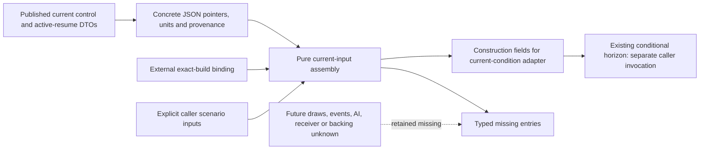

# CK3 1.20.0.3: current-input assembly for the conditional battle horizon

`assemble_current_horizon_input(bundle, *, build_binding=None) -> CurrentHorizonInputAssembly` connects published current DTOs to the existing [conditional horizon](battle-current-conditional-horizon-12003.md). It assembles concrete inputs and a missing-input ledger; it does not invoke the horizon or fill all future inputs. Exact source: CK3 1.20.0.3 / Steam 25652598 / EXE SHA-256 `94B55397ABB687A3DCD436805A5D885E6BE90FA6C693FEB44A9E3BBEEADE02A6`.

The published native order and current-input contracts precede this assembly. The field-map lane owns the sole cached-body read; this topic consumes its map and the assembler's metadata. The retired `.2` exact-build input boundary is incompatible with the `.3` binding; no `.2` actual cache was adopted. The captured query's schema 2 does not mean game 1.20.0.2. An adapter or library wrapper cannot repair a build mismatch by supplying defaults.

The historical `.3` material is `captured_decoded_body.control_before.battle_control_snapshot` plus `active_combat_resume_inputs_v1`: native 210, public revision 14, date raw 53250960, pursuit day 3, attacker winner, not finalized. Root's capture binding is R27/g58/source39b/PID122268. Payload build identity remains null; the external Root binding is separate `build_binding`, not a rewrite of `captured_build_identity`. The current published development head 21200c2a and active frozen runtime df6e do not refresh this historical frame. It is compatible historical input material, not a current live battle or terminal observation. The compact map exposes 53 header/side fields in 27 observation rows; the 58 Entry rows are linked to the original capture rather than copied. `current_snapshot` remains null and `current_snapshot_input_complete=False`, so the source-only recipe is not a complete initial condition.

| Assembly output | Concrete meaning |
| --- | --- |
| `construction_fields` | Exact call inputs for `adapt_current_battle_condition(snapshot, active_resume_inputs=..., backing_components_by_regiment_id=...)`; values remain observed or explicitly caller supplied. |
| `concrete_values` | Published values retain their JSON pointers; Q100000 fighting/attributes, whole backing soldiers and owner hard attribution stay distinct. |
| `captured_build_identity`, `build_binding`, `provenance` | Original payload identity and frame/source provenance remain separate from the external exact-build declaration. |
| `scenario_inputs` | Explicit caller declarations remain untouched; the assembler does not create draws or a daily timeline. |
| `missing_entries` | Each entry carries `stage`, `input_name`, `dto_entry` and `construction_guidance` for the consuming implementation entry. |

The cached example returns `partial` with 18 typed missing entries. The current-input entries are `complete_normalized_current_snapshot`, `complete_same_frame_active_resume_inputs`, `current_loss_inputs_v1`, `active_counter_inputs_v1`, `pursuit_modifier_sides` and `backing_components_by_regiment_id`. The caller-condition entries are `draw_state`, `max_days`, `timeline`, `admission`, `loaded`, `entry_events`, `phase_events`, `ai_context`, `future_main`, `transition`, `pursuit` and `terminal`. Each retains the stage, DTO/implementation entry and construction guidance. Missing components cannot be synthesized from an Entry subset. Current first-Army permission is not a future witness. Original stored caches and derived quantities remain separate.

A legitimate 0 is retained; absent optional leaves and null remain missing. Unknown events are not replaced by an empty event tuple, AI action by false, backing by zero, or loaded coefficients by stock defaults. An explicit empty tuple belongs to the caller's no-selected-event declaration. These typed gaps describe conditional-result quality and do not add a runtime entry gate.

Readiness is **static-ready for partial source-only current-input assembly**. The assembler owner reports its two new focused tests **2/2 GREEN on the first pass**, with no old fixtures run. Its cached CLI example retains 27 concrete rows, observed base raw -500000/resolved raw 700000, the null captured build identity and separate external `.3` binding; these values are not a forecast. No horizon invocation occurred. The predecessor horizon's two synthetic cases remain its own evidence and are not credited again.

The [field-map receipt](Z:/ck3_mod_rewrite_process_assets/g2-resume-20261004/battle-current-horizon-input-assembly-v61/field-map/ROOT-DELIVERY.json) pins the historical source map. The [focused run receipt](Z:/ck3_mod_rewrite_process_assets/g2-resume-20261004/battle-current-horizon-input-assembly-v61/assembler/RUN-RECEIPT.json), SHA-256 `5f20e9bafc472ffa37bed766184cd35f93f58afdc12ade101ee471e779a95df0`, pins the new test run; this topic consumes metadata only. No new SDK, pipe, game or window operation, current live qualification, game day or action is claimed. Full initial-condition construction and horizon execution remain partial. Native future draws, full terminal, complete Monte Carlo, win odds and complete OODA remain unclaimed. Root owns publication, commit/push and any later actual paused qualification.

## Canonical package integration

The identical pure implementation is available at `xar_autoplayer.simulation.battle_current_horizon_input_assembly`; the repository module retains the original tested bytes. The two focused tests use that package import and embed the same sealed compact-map JSON instead of requiring its external artifact path. Their cases and assertions are unchanged. The original first-pass two-case GREEN receipt remains the qualification; this path relocation does not grant complete initial-condition, horizon, MC or runtime credit.
