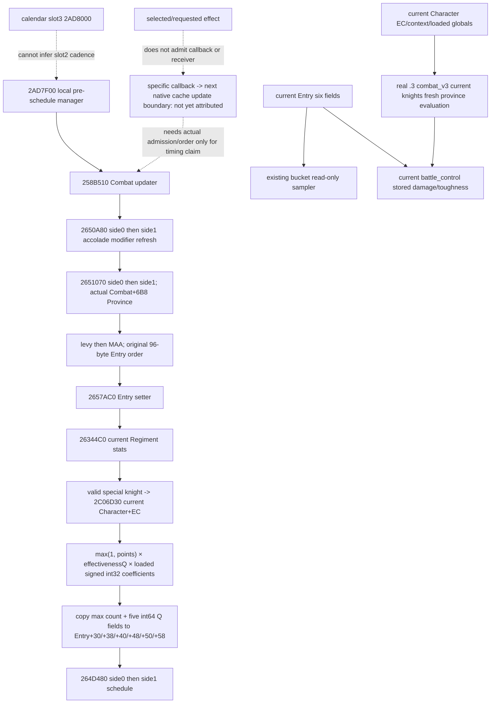

# Current knight Entry attributes, CK3 1.20.0.3 (2026-10-05)

This source-first increment separates current Character numeric state, freshly evaluated knight attributes and the six attributes already stored in a Combat Entry. Current observation is independent of selected-event requests, admitted callbacks and future native cache writes. Five existing producer/consumer sections are implemented. One new native-to-formal-current-association production-chain fixture is CORRECTED GREEN with19 explicit checks; no live or campaign day is credited.

The exact build is CK3 **1.20.0.3**, Steam **25652598**, EXE SHA-256 `94B55397ABB687A3DCD436805A5D885E6BE90FA6C693FEB44A9E3BBEEADE02A6`. Cached source was reused; no new EXE, installed script, SDK, RPM, pipe, game or window read was performed.

[Source receipt](Z:/ck3_mod_rewrite_process_assets/g2-resume-20261005/battle-current-knight-entry-refresh-v81/source/ROOT-DELIVERY.json), SHA-256 `c186af0716926e374cf501e2313266f470ec84659e7c69167db05dd701e1c0f0`, binds the [API](Z:/ck3_mod_rewrite_process_assets/g2-resume-20261005/battle-current-knight-entry-refresh-v81/source/API.json), Mermaid tree, original source pins and Oct5/W41 fields.

## Existing fields and the minimal missing inputs

The exact .3 battle-control Bucket already copies these genuine Entry fields. They do not need a second observation port.

| Entry field | Offset | Native storage/unit |
| --- | --- | --- |
| effective_max_size | +30 | signed int32 count |
| effective_siege_raw | +38 | signed int64, Q100000 |
| effective_damage_raw | +40 | signed int64, Q100000 |
| effective_toughness_raw | +48 | signed int64, Q100000 |
| effective_pursuit_raw | +50 | signed int64, Q100000 |
| effective_screen_raw | +58 | signed int64, Q100000 |

The existing exact .3 `ck3_query_combat_simulation_inputs_v3` current `army.knights` leaf independently publishes Character+EC signed int32 prowess points, effectiveness signed int64 Q100000 and fresh province-evaluated damage/toughness. Freshly evaluated values are not stored Entry observations; equality is not required to describe the current frame.

Its `ReadCombatKnights` producer already uses two runtime signed int32 globals. The additive publication is limited to optional `loaded_damage_multiplier` and `loaded_toughness_multiplier` on that existing knights leaf. They are whole-number per-prowess coefficients, **not Q values**. The provider captures each once and uses the same values for evaluation and publication. Present zero/null and old absent fields are distinct; no stock default or inverse division substitutes for a missing observation.

| Loaded field | Exact .3 global | Native load |
| --- | --- | --- |
| loaded_damage_multiplier | 0x5C699A8 | signed DWORD extension at2C06D90 |
| loaded_toughness_multiplier | 0x5C699B0 | signed DWORD extension at2C06DA5 |

The source knight calculator `2C06D30` uses `p=max(1,current Character+EC)`, then `damage_raw=p*effectiveness_raw*loaded_damage_multiplier` and the analogous toughness product. It uses low64-bit multiplication without an added Q division. Zero prowess remains zero when published; the max1 applies only to this calculator. The valid-knight result zeros max-size, siege, pursuit and screen; it does not modify quantities or detach the Entry.

## Source update order and ownership

Combat pre-schedule `258B510` updates both sides' accolade context with2650A80, updates both sides with2651070 using the genuine Combat+6B8 province, and then resolves/writes advantage+710. Side2651070 walks levy then MAA arrays in original order at96-byte stride. Entry2657AC0 resolves full RegimentID+8, obtains fresh Stats38 from26344C0 and copies only the six cache fields above. Starting/current/soft amounts at+10/+18/+20, identities, headers and the hard-casualty ledger remain independent.

The cached knight branch of26344C0 calls2634880 to validate/re-resolve Regiment+148 full CharacterID, then2C06D30. This bounded branch has no extra Character+1D0 alive test; its ordinary-type fallback is not a death or detach action. The whole26344C0 function is not claimed closed by this branch excerpt.

Manager2AD7F00 calls258B510 before scheduling both sides with264D480. This proves local order, not an unobserved external slot2 daily cadence. Event firing264E680 re-resolves Regiment/Army combat/Character identity and calls the compiled event through3765780. A selected or requested effect alone does not prove a subsequent native six-cache setter.

## Corrected public-route mapping

The registered dedicated current-battle-knight query initially looked reusable, but actual dispatch is only legacy11906: Character+E8 and globals570EDF8/FC, with no typed12002 remap. It is not credited as a .3 capability. This was corrected before source seal, implementation or SDK invocation; the new fields use the proven .3 combat_v3 route.

Current association preserves exact supplied combat/side/bucket/Regiment/Character/nativeArmy/publicUnit identity and frame provenance, plus current source ordering. Index is diagnostic, not a durable identity. Character prowess, fresh evaluation and stored Entry bytes stay independently visible. A request-only event does not manufacture callback `allowed_ids` for the existing `KnightCachedStatRefresh12003` public seam.

The DynamicRefresh owner retains future trait contexts and the third MAIN original character response/cache. This work consumes none of those raw values and does not derive a future context from trait booleans or current F0 rows. Health and native RNG schedules remain outside the six-skill current-input primitive.

## Current association API and production-chain qualification

The existing `associate_current_knight_entries` API adds `current_combat_armies` (the formal normalized combat input armies array) and `combat_query_source`. Per Entry it retains `stored_combat_entry_attributes`, the six-field presence map, and independent `current_knight_evaluation`. Literal numeric operands, native fresh evaluation and stored bytes are separately available; a stored/fresh discrepancy is a useful current value, not a failure or an automatic refresh.

The sole new scenario ran the actual `.3` `ReadCombatSimulationInputs`/`ReadCombatKnights`, the production `AppendCombatKnights` serializer, formal normalization, and the public current-association function. Its separate control side ran the actual battle-control reader/serializer, formal control normalization and current adapter. The six-skill public primitive was called once with explicitly synthetic current operands. Current refresh-candidate construction did not execute a selected public refresh effect, grant a receiver or select a native boundary.

The synthetic native frame read Character EC25 and two loaded pointers100/10. Callable effectiveness and fresh-attribute fixture leaves supplied the declared current values, rather than executing the game EXE. The independent six-skill proxy used raw/first points2,3,4,5,6,18 and explicit current inputs to produce final2,3,4,5,6,25, without a Character write. Effectiveness125000 and the two whole coefficients gave fresh damage312500000/toughness31250000. Stored max-size17/siege190007/damage210011/toughness230013/pursuit250017/screen270019 all remained intact; damage and toughness correctly differed from fresh evaluation.

The fixture did not exercise the outer native exact-build admission gate or a paused CK3 process. Those gates were not bypassed and credited as live. This remains **static-ready / production-path offline fixture**, not fixture-live, production-live, a selected effect commitment, future trait-context construction or complete battle simulation.

Nine necessary TUs compiled/linked strictly with8 parallel workers. One unique scenario made3 native executable attempts, with one completed frame, then2 Python-stage attempts; current association and six-skill arithmetic each completed once and19 `require` checks passed. Only2 fixture-driver recompilations were needed; production objects were reused after corrections. No old case, full DLL build, game, SDK, pipe, window, shared edit, Git action or new campaign day ran.

The three original HARNESS RED records remain available:

| Attempt | Actual failure | Minimal fixture correction |
| --- | --- | --- |
| 01 | Reused historical RVA table expected pursuit conversion5C69BB0; current source correctly uses5C69B98. | Removed3 historical-table assertions in the reused setup; retained the new actual loaded-pointer/value checks. No production/binder change. |
| 02 | Old explicit Retreat callback compared side0 while the new scenario selects side1. | Corrected the fixture receiver comparison only. |
| 03 | Native frame completed; Python DrawState omitted explicit salt. | Supplied `DrawState(0x81,0x82)` and reused the same frozen native frame; no further native compile/run. |

The final [fixture receipt](Z:/ck3_mod_rewrite_process_assets/g2-resume-20261005/battle-current-knight-entry-refresh-v81/fixture/ROOT-DELIVERY.json), SHA-256 `37f0de088b3ff5b46d3adcf6c51e9c1b9259ddd5a9f6344ce2306d77e295578a`, binds the19 checks, complete value origins, source projections and all failed artifacts. [Implementation receipt](Z:/ck3_mod_rewrite_process_assets/g2-resume-20261005/battle-current-knight-entry-refresh-v81/implementation/ROOT-DELIVERY.json), SHA-256 `4ee33e91b4333f2959f26f5f32b8063594d81f50d2f3f5fd3f6d7cac8be49652`, remains source-frozen. [Oct5/W41 fields](Z:/ck3_mod_rewrite_process_assets/g2-resume-20261005/battle-current-knight-entry-refresh-v81/ROOT-DAY-WEEK-FIELDS.json) aggregate the three lanes; Root owns application and commit/push.

The next temporal dependency is explicit admitted callback-to-next-setter ordering or a later authoritative Entry observation. Current EC and a request-only refresh list cannot supply it. DynamicRefresh's independently observed current numeric primitive is [linked by its own receipt](Z:/ck3_mod_rewrite_process_assets/g2-resume-20261005/v81-actual-current-numeric/publication/ROOT-DELIVERY.json); no original response/cache was reread or recalculated by this pod, and its prowess comparison does not establish Entry refresh or health parity.

## Source tree

| Receiver | Field / offset | Native type | Unit |
|---|---|---|---|
| Combat Entry | max_size +30 | int32 | count |
| Combat Entry | siege +38, damage +40, toughness +48, pursuit +50, screen +58 | int64 | existing stat raw Q100000 |
| current Character | prowess +EC | int32 | points; observed zero is legal |
| current Character context | knight effectiveness | int64 | ratio raw Q100000 |
| loaded image | 5C699A8 damage coefficient, 5C699B0 toughness coefficient | int32 | unscaled whole-number coefficient per prowess |

2C06D90 and 2C06DA5 each load a DWORD with MOVSXD. Native IMUL multiplies those whole coefficients by effectiveness raw and max(1, signed points), with no Q division in the knight calculator. No hard-coded coefficient or inverse derivation from observed damage is justified.

2657AC0 writes six stat caches only. Starting/current fighting/soft casualty quantities, IDs, array headers/counts and owner hard ledger are preserved. Entry ownership is native engine update; the observation bridge copies bytes only. Its real .3 combat_v3 fresh-evaluation query is a separate origin, not a native cache update.

Dedicated currentknight remains registered to BindCurrentProcess11906 (old E8 and570EDF8/FC), with no typed12002 remap. It is not counted as current .3 ready. The approved coefficient addition belongs to the existing real .3 CombatKnightsSnapshot ingress.

The closed timing edge is 2AD7F00 -> 258B510 -> both side event schedulers. External slot2 registration/cadence and precise selected callback -> next updater attribution remain local source gaps. Existing current-frame observation does not depend on closing those cadence edges. Do not reuse the old v57 refresh unknown: injury-order has closed the setter ordering.
