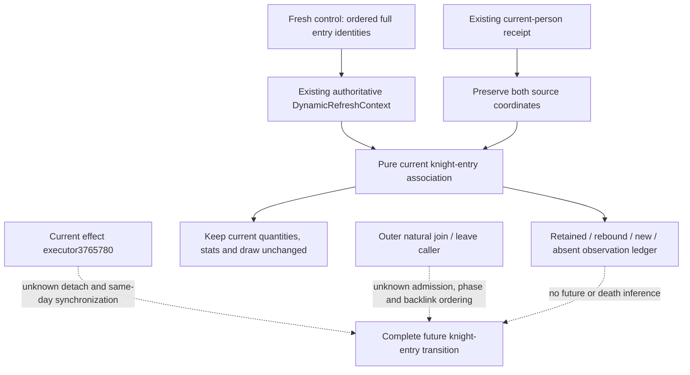

# CK3 1.20.0.3：当前骑士与战斗 entry 的刷新关联

2026-10-04。Exact build：`1.20.0.3` / Steam `25652598` / EXE SHA-256
`94B55397ABB687A3DCD436805A5D885E6BE90FA6C693FEB44A9E3BBEEADE02A6`。
本轮先落盘原生输入树，再实现小范围 pure 观察关联；未操作 SDK、游戏或窗口。
旧 [1.19 骑士转移专题](active-battle-knight-entry-transitions-2026-09-27.md)
仅作地址与行为线索，不把旧死亡 detach 实机或旧 RVA 升格为 `.3` 证据。

当前 `ck3_query_battle_control_snapshot_v1` 已提供 native bucket/index、完整 RegimentID、
native CArmy/public CUnit/owner 回链、MAA 当前 `knight_character_id_raw`、main 资格、
starting/current/soft 和 cached effective 属性。严格 `.3` reader 只允许正数占用骑士 ID；
`-1` 是唯一空位。Regiment+148、Character+18/+1C 与 KnightLink 回链必须同时符合原有读取。
signed normalizer 对旧输入的兼容范围不证明当前 producer 会发布零 ID。

当前人物伤势与 effective prowess 已在原有 terminal-transition 的 `character_ids` 只读入口。
character-only 模式的顶层战斗 transition 不可用不否定独立人物 row。两次查询必须保留真实
native revision/date/paused 来源；不能只因人物 ID 相同就当作同一帧。无需为当前关联新增
DTO、bridge、MCP、flag 或 runtime gate。

| `.3` 原生入口 | 已闭合顺序与写集 | 当前模型应如何使用 |
|---|---|---|
| `258B510 → 2650A80 → 2651070 → 2657AC0` | 先聚合两侧，逐侧 levy→MAA 原序刷新六项 Entry+30..+58 cached 属性；不写 starting/current/soft/header | fresh 属性权威替换；不再扣上次模型预测的损失 |
| `2634880 → 2C06D30` | 身份/tag 与实际效能输入；signed prowess+EC 使用 `max(1,p)`； inspected branch 无独立 alive 检查 | 人物 prowess/伤势不能自行覆盖 cached 属性或删除保留 entry |
| `264DE30 → 2653D20 → 26552C0` | 重复 Army 不插入；按 native regiment 顺序只初始化新 row；容量增长复制旧 row | 新观察成员与保留成员分开；reserve 的 current0 仍保留 |
| `264E180 → 2653E10` | 双 bucket 压缩 surviving Entry60，维持原序和余下账 | 后帧缺席只证明观察到缺席，不能推成死亡或具体离开原因 |
| `264D480 / 264F080 → 264E680` | 排程保存 RegimentID；火点重新解析当前 Army/Combat 与 Character | 当前名单、被排程角色及实际火点参加者不能混为一个事实 |

新 `battle_current_knight_entry_refresh.associate_current_knight_entries` 消费已存在的
`DynamicRefreshContext`，不再次执行整体刷新。它保留侧序、bucket 序与所有 full ID，关联当前
人物观察，并报告保留、当前新出现、同 entry 的骑士/军队绑定变化及观察缺席。人物 row 的
absent/null、prowess0、伤势 rank0、false flag 和军队 current0 均保留原义。即使附带人物 row
说 alive=false，仍在 fresh control 中的 entry 也保持原始成员、main 资格和 cached 属性。
匹配来源只是诊断，不收紧原有可用观察或战争执行。

唯一新增 focused fixture **首次 2/2 GREEN**（test elapsed `0.003673s`），含两场：保留受伤骑士与
reserve/current0，不重扣预测损失；以及 rebound、新出现/缺席/原序、空位与缺字段、跨帧人物诊断。
使用 Python `-B -O`，只执行这两场，
复用旧 fixture 数据构造器但不运行旧 suites。测试结果与原始 attempt 由下列回执保存。

本组件为 **static-ready**，新增实机观测、游戏日、动作和 family credit 均为0。
`battle_knight_participation_and_dynamic_entry_transitions` 的完整 future domain 仍未完成：
具体下一项入口是当前 `3765780` loaded effect 节点的 death/detach callback、原始 schedule/fire
与下一次 `258B510` 的人物链接/属性边界，以及 `264DE30/264E180` 的 outer join/leave caller。
当前缓存观察、两场 pure fixture 或单个人物效果不替代这组真实转移，也不证明整场 MC 或胜率。

[源树封口](Z:/ck3_mod_rewrite_process_assets/g2-resume-20261004/battle-knight-entry-refresh-12003/SOURCE-TREE-SEAL.json)
记录 implementation 前的树与三条 source lane hash。
[Root 交付回执](Z:/ck3_mod_rewrite_process_assets/g2-resume-20261004/battle-knight-entry-refresh-12003/ROOT-DELIVERY.json)
保存新文件、focused 结果与 Oct4/W40 报告字段；Root 负责共享源码采用和正常 commit/push。
