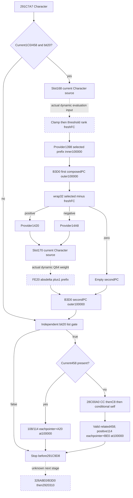

# Current-person gated temporary tail — CK3 1.20.0.3

The bounded source interval `[291C7A7,291C9D8)` is now **research / source-ready**. It composes two temporary PropertyContainers, appends each at unit outer weight, then adds either current or related selected-object list properties. The second temporary's internal weight comes from a current Character-scoped ScriptValue; its selector depends on a freshly evaluated and ranked value. Cached `+FC`, a fixed weight or independent outer rows for each prefix definition cannot reproduce this source.

This package changes no candidate code and supplies no observer, fixture, build, game execution or live evidence. Frozen version1.20.0.3, Steam25652598, image base140000000, recorded EXE SHA-256 `94B55397ABB687A3DCD436805A5D885E6BE90FA6C693FEB44A9E3BBEEADE02A6`; the EXE was not hashed or scanned again. Research sealed at2026-10-06T02:17:57.776865+08:00. Current24-provider candidate1a5ce7b6 remains unchanged by this lane.

## Source order and receivers

The full cached caller is `Z:/ck3_mod_rewrite_process_assets/g2-resume-20261005/battle-trait-native-input-primitive-v79/context-source/region-0291C0D0.asm`. R13=model, R14=Character from model+8, RSI=inline context model+10. The preceding list stage stops atC7A5; [its separate source](battle-person-list-predicate-12003.md) owns28AA8B0/2530DD0 and was not reread by this lane.

| Seam | Actual operation |
|---|---|
| C7A7/C7B7/C7CC | Both temporary families require Character1C0/+458 presence and bit20 of BYTE[QWORD[global5CB87F8]+2B0]. |
| C805/C80D |25FA9C0 evaluates current Character-scoped NamedValueDB+EF0 array slot168, clamps Q64 using5C68FF0/5C68D10, and caller stores selected+E0. |
| C814/C819 |25FA660 returns the first signed threshold index with value<=threshold, or signed table count; caller stores freshly derived selected+FC. Threshold pointer5456EA8/count5456EB4 are actual globals. |
| C827..C863 |Provider1398 header; selectedEC equal global5C82C68 chooses selectedF8, otherwiseE8. FE20 composes selected+1 prefix at inner100000. |
| C86E |B3D0 copies/retains the composed temporary and requests2438850(model+10,ownedPC,100000). |
| C892 |2920020 with mode1 computes wrap32(selectedE8/F8-freshFC). Zero yields empty; positive selects provider1420, other nonzero selects14A8. It evaluates NamedValue slot170 in current Character scope, then FE20 composes abs(delta)+1 prefix at that actual signed Q64 weight. |
| C89D |Second B3D0 request uses outer100000. Local temporary cleanup follows each request. |
| C8AE..C921 |Independent global bit20 gate. Current1C0/+458 present chooses selected108 pointer list /114 signed count; each pointer+A20 PC goes directly to2438850 at100000. |
| C926..C9CF |Otherwise28C00A0 derives a related full Character ID, caller resolves it again and requires Character magic/fullID validity and related1C0/+458. Positive related114 count contributes each pointer+BE0 at100000. |
| C9D1/C9D8 |Stop after list. C9D8 starts another bit20 stage,326A8E0 followed byB3D0 atCAFA; CB0F calls2920310. These remain concrete next-stage inputs. |

Temporary creation can skip while the related list remains required. Native order is first composed temporary, second composed temporary, then currentA20 or relatedBE0 list. Duplicate occurrences remain duplicate sources.

## Composition, rank and weight semantics

FE20 accepts `N=wrap_i32(selector+1)` only when N>0 and N<=signed header countC. It rejects an oversized prefix as empty rather than clamping. For each of the firstN QWORD pointers it admits magic DWORD[Def+38]==4744624F, then merges Def+40 into an initially empty PropertyContainer through2303120. No definition-ID test or deduplication occurs. Each source's paired U16 keys and signed Q64 values participate in the existing [source-closed logical fold](battle-person-stage-baseline-12003.md), including first-copyFFFF behavior and later merge skippingFFFF.

B3D0 copies keys11E1180 and valuesB73F50, retains the allocation in model248, and tail-calls2438850 with **RCX=model+10 inline address, RDX=ownedPC, R8D=100000**. Temporary1B8 is metadata. Internal weights have already been folded into the composed PC; the outer100000 does not multiply each block by the internal weight again. An actual empty source+C adds no weighted row or aggregate change. Logical numeric composition does not prove physical allocation/copy/lifecycle postimages.

25FA9C0 evaluates the slot168 source with the exact Character scope and five-argument37542F0 ABI, then implements the captured signed branch clamp: below minimum returns minimum; otherwise a value above maximum is replaced with maximum.25FA660 walks thresholds in stored order. If count<=0 it returns count unchanged; positive count returns the first threshold index where clampedQ<=threshold, or count if none. It does not sort or infer thresholds. The caller writes E0/FC before2920020, so a current-final selectedFC read alone is insufficient as an input to a new construction.

2920020 mode0 always usesF8, while this caller's mode1 follows EC/global comparison. Delta and absolute-value arithmetic wrap at32 bits, including INT32_MIN. Zero delta skips weight evaluation. Nonzero delta evaluates slot170 before FE20's prefix bounds check. A numeric reader may report a bounds-rejected contribution as known empty without executing that evaluation, but must not claim identical native evaluation activity.

The named source getterA07970 is reused from exact1.20.0.3 ABI evidence: its entry reads global5D1DD50; db+EF0 points to the array containing slots168/170. Full87B getter hash `6f3ba6b062d06184191b330d91bcca863bfe5d971725d2cc49f3e26c9be5a536`; full393B37542F0 hash `6f992e6362201cffd5ca55643cbfaeee159907a621878812e4ecc20b37d68ec6`. These bodies were not recaptured. Native named constants/tree/current evaluations are real inputs; slot numbers do not determine their values. No native constructor, intern getter, evaluator or allocator was executed.

## Related Character selection

28C00A0 first requires currentCharacter1B8. Absence returnsFFFFFFFF immediately. Otherwise it tries full raw1B8+CC, then+C8. Indexed resolution uses Character registry5C67568, low24 cap2C/table20/stride10 pointer8, and full generation equality atCharacter18. A null/mismatched indexed pointer chooses fallback5C67570; a missing registry or out-of-capacity index directly tries the next candidate. It admits magic43686172 and ID18!=-1 and returns the original candidate ID. If both candidates fail, current1C0 presence permits selfID18; otherwise it returnsFFFFFFFF. The caller repeats the full-ID resolution and applies validity and1C0/+458 checks. Both layers remain in the query input plan.

## Minimum implementation dependency and evidence

The proposed optional same-Character leaf is `gated_temporary_tail_291c7a7`; it is an input proposal and has no committed DTO, normalizer or emitter. Its full readiness requires actual source/evaluated slot168 refresh, clamp/rank, demanded prefix PCs and slot170 weight, plus independently demanded current/related list. A known false globalbit produces a complete empty segment. Missing ScriptValue results must retain concrete producer37542F0/currentCharacter scope; missing refresh must not suppress independent1398/list output. A separate explicit stage baseline joins this bounded segment, with proposed frontier `postGatedTemporaryAndList_pre291C9D8`. Current-final context is not historical pre-C7A7.

The external packet is `Z:/ck3_mod_rewrite_process_assets/g2-background-round4-20261005/person-tail/gated-temporary-tail-source/`:

- `SOURCE-TREE.md`: complete source order, byte-level inputs and Mermaid before implementation.
- `QUERY-PLAN.md`: demand, raw binding addresses, proposed grouping and current-evaluation boundary.
- `SOURCE-PINS.json`:8463B, SHA-256 `1e61f7623dcc10a43d63b86af23fa1f51342fb4d9472085eab0858ec25dd8de6`; exact captures and cached proof pins.
- `READ-COST.json` and per-capture receipts:2458B code +252B pdata =2710B actual EXE I/O. Six full normal helper bodies:FE20[291FE20,292001A)506B;0020[2920020,2920309)745B;B3D0[291B3D0,291B4EF)287B;A660[25FA660,25FA6F2)146B;A9C0[25FA9C0,25FABE6)550B;00A0[28C00A0,28C0180)224B. Concurrent metadata lookups reread72B of cached-search rows; those bytes are included in252B. No new unwind/data/header reads.

Source-only bookkeeping initially failed because Windows Python lacked tzdata; a fixed UTC+08 timestamp corrected it without installing dependencies or changing code. This was no capability failure. No native fixture, tests, build, existing-test reruns, game/query/runtime operation, new game day or readiness promotion occurred. Actual dynamic source expressions/evaluations, current PC arrays, physical lifecycle and the following326A8E0/2920310 segment remain subsequent implementation inputs.

## Cached fixed-literal source clarification

The exact cached393B37542F0 body permits a smaller readonly numeric path. At3754384..438B it first reads and tests QWORD[entry+70]. A nonnull tree takes the dynamic virtual-tree branch regardless of fixed flag7B. Only a **null tree** reaches37543BB: byte7B!=0 reads QWORD68 at43C1 and copies all64 raw fixed bits to the supplied output; byte7B==0 writes the initialized zero and does not demand68. At3754455 the function returns the output pointerRDI inRAX, not the Q64 value. The flag predicate is nonzero, not equality to1.

The resulting type is signed64 rawQ100000 as consumed by the actual clamp/weight callers. The literal branch performs no scaling, integer conversion or rounding, so zero/negative values are valid. A missing tree read is unknown, not null. A readable68 value does not override a nonnull tree. Thus the proposed observer reads actual source slot/tree first, flag only for nulltree, and raw68 only for nonzero flag. Nulltree/flag0 yields a complete `known_zero` input; nonnull tree yields the specific missing `dynamic_tree_requires_current_result`, with current slot/entry/tree provenance and no generic AST expansion.

This literal/knownzero route needs no scope construction, support buffers, string/name lookup, descriptor, intern operation, RNG or native callback. The original function's optional profiler reads at40/50 and callbacks do not alter the literal/zero result; a pure numeric observer does not claim that native diagnostic activity occurred. No extra vptr/tag/string metadata is a numeric gate in the captured function. Actual global5D1DD50/dbEF0/slots168 and170 remain bound as above. Slot168 literal/knownzero enables the captured pure clamp/rank freshFC computation; slot170 literal/knownzero supplies demanded delta prefix inner weight. Current selection fields and PC arrays still determine the remaining numeric requests.

For a true C7 gate, the source makes **exactly two outer100000 temporary request occurrences**, including known empty temporaries. CallerC86E andC89D both unconditionally invokeB3D0; B3D0 does not test source count before itsB4EA tail2438850 call. FE20 bounds rejection and2920020 delta0 return initialized empty PCs, which still reachB3D0. The pure source-request emitter therefore retains both first/second positions;2438850's empty-source+C skip determines resulting weighted rows, not the source request count. A false gate produces neither temporary request. Missing source inputs retain a missing request state rather than an invented empty PC.

The cached addendum is `gated-temporary-tail-source/LITERAL-EMPTY-ADDENDUM.md`; it reuses `artifacts/g2-offline-2026-10-01/gift/named-reverse/evaluate_named_fixed_five_argument_confirmed.txt` and the exact.3 ABI reuse393B pin. This clarification adds zero EXE reads, code, tests, build, query/runtime or game activity. The original source seal, read cost and delivery remain historical frozen records; a separate addendum receipt carries this clarification.

The pre-qualification `FINAL-NUMERIC-EMPTY-CLARIFICATION.json` further records numeric readiness when a valid delta prefix has complete rows that all fail magic, or whose every admitted actual PC has keys_count0. The captured prefix fold then has no value-dependent rows: the composed temporary is known empty and the outer request still occurs, without inventing slot170 weight or claiming the native evaluator ran. Slot170 is demanded for numeric composition only when an admitted positive-key actual PC is present. The original raw schema remains frozen history and this separate clarification applies to both the observer and strict pure contract.

An additional cached demand closure precedes qualification: FE20 computes wrapped N at291FFAC, tests at291FFB0 and jumps to the initialized-empty return at291FFB2 when N<=0. Only positive N reads header count+C at291FFB4 and the array at291FFBA. The readonly numeric collector therefore returns a nonpositive prefix independently with header_count/array_present null and rows=[], without requiring a loaded provider. The separate `FE20-NONPOSITIVE-DEMAND-ADDENDUM.md` preserves exact instruction evidence; no new EXE bytes or native getter activity are claimed.

## Minimum numeric implementation qualification

Leaf `gated_temporary_tail_291c7a7` is optional on the existing current source query. The dedicated strict contract normalizes actual raw literal inputs and their source-derived logical clamp/rank fields; its pure emitter composes inner prefixes once and emits the two distinct outer temporary requests followed by the selected ordered list rows. Family APIs expose `prefix_1398`, `delta_prefix_1420_14a8` and `list` independently. The modeled temporary PropertyContainer is labeled as modeled, while list PC identities remain current observed sources. No source evaluator, initializer or PC writer is invoked.

One new production-normalizer compound case passed on its first and only execution at2026-10-06 02:43:28+08:00: `1 passed in0.43s`, wrapper0.8671164s. It covers negative literal weights and FFFF/duplicate folding, zero-weight key retention, the two empty outer requests, dynamic168/170 independent families, bit20false, related full-generation CC/C8/caller selection and actor identity. Receipt: `gated-temporary-tail-source/FOCUSED-PRODUCTION-CASE.json`. Old tests ran zero times; native fixture/build and actual compiled wire qualification are pending. This is an offline pure qualification, not a live/future-baseline/full-person/Entry claim.
