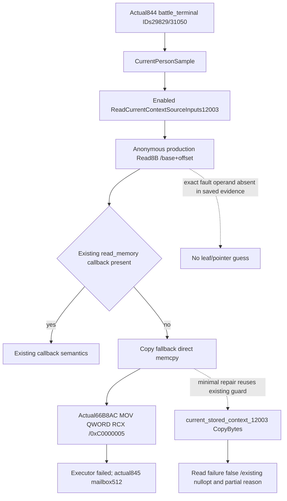

# Current-person source read production fault — CK3 1.20.0.3

## Actual fault and offline mapping, before implementation

The actual `844-current-fighter-model-context.json` request at2026-10-06 00:30:19.968760–00:30:29.771765 UTC queried `battle_terminal` with Character IDs29829 and31050 at expected publicrevision3. The executor entered, then recorded **0xC0000005 in bridge RVA0x66B8AC**; it did not finish or return a typed result. The existing845 diagnostic records pauseddate53288232/public3/native34/PID4692, completedsequence43 and **mailbox failure512**, ownerthread82028. These are retained production fault evidence, not a hypothetical unreadable-pointer case. No retry or process connection was performed for this diagnosis.

Root confirms g80 changed only the Python frontend. Its native DLL is the frozen g79 strict01 binary compiled from **715517beaa2bd49ad4c1fad9f4dd15a62c442da7**,10649088B, SHA256**e990d7d4538a9bfb78274f245afdabe79e140f5f99c1e7a910b2b1a4ab019604**. These existing pins are reused without rehashing the DLL or frozen game EXE. Existing PE exception metadata locates the fault-containing143B function at **[66B830,66B8BF)**. The actualfault instruction is **`mov rax,qword ptr [rcx]`** at66B8AC.

The existing `ck3_12003_context_sources.cpp.obj` contains byte-identical143B COMDATs for anonymous `Read<const void*>`, `Read<int64_t>` and `Read<uint64_t>`. The linker folded these into the same native function. The source is `Copy`/`Read` at `src/ck3_12003_context_sources.cpp`: an injected `read_memory` callback is checked first; absent a callback, `Copy` directly executes `std::memcpy`. Machine code reads callbackslot **binding+668** and takes66B8AC only when it is null. The address inRCX is the nonnull **base+offset** computed by `Read`; it is an unreadable8B source operand at the fault. Production `BindContextSourceInputs12003` zero-initializes the binding and does not assign that optional callback. `CurrentPersonSample` in `ck3_12002_battle.cpp` invokes this enabled source collector through the current-person typed query.

The saved844/845 evidence has no faultaddress, registers, callstack, active leaf or per-Character progress. Therefore **which exact leaf, Character or pointer was unreadable is not recoverable from these receipts**. The folded read specializations also prevent claiming whether the operand was a pointer or Q64. Do not guess an ABI offset, cached context or false rule result from this exception.

## Minimum repair and independent validation plan

The already implemented `current_stored_context_12003::CopyBytes` in `include/xar_bridge/ck3_12003_current_stored_context.hpp` catches an in-process copy exception and returnsfalse. Reuse that existing helper **only at this `Copy` fallback**. Retain the null-source check and injected callback path in their existing order. There is no new pointer-range policy, registry scan, callback evaluator or schema. `Read<T>` continues to return `std::nullopt` when `Copy` returnsfalse; the leaf continues its existing read-unavailable reason/partial readiness, rather than converting unreadable memory into zero or complete data. This prevents the observed raw-read exception from escaping this copy; it does not establish the missing operand's ABI or repair every possible native callback fault.

One new Windows/MSVC target/CTest, **`xar_ck3_12003_context_source_read_av_test`**, links the production `ck3_12003_context_sources.cpp`. Its independent fixture calls the public production source collector with only the pre291e210 observer enabled. A real nonnull `VirtualAlloc(PAGE_NOACCESS)`8B fallback-slot operand exercises the same folded production read; it must yield the existing `army_native_fallback_read_unavailable`/partial leaf, not an executor exception. A normal readable slot preserves the ready/known-nonadmitted result. An injected callback can supply a readable Army pointer for that inaccessible slot, or deny it; callback precedence and its existing false/nullopt path are checked separately. The fixture has no game process, native getter, SDK or runtime dependency and does not claim that this chosen operand is the original fault leaf.

The source tree/Mermaid and validation plan are persisted before the production edit. Compilation and first execution remain **pending Root's one fresh joint build**. No old fixture, native target or game query is repeated. Any required new CMake block is unique and Root resolves integration alongside its other real-fault package. Candidate code is not static-qualified until the new production fixture is built and passes; it does not promote real full-person/Entry readiness.

## Evidence packet and costs

External packet: `Z:/ck3_mod_rewrite_process_assets/g2-resume-20261006/battle-terminal-844-offline-fault/`. It retains `BRIDGE-RVA-MAP.json`, the exact fault143B disassembly and `OBJECT-EXACT-SYMBOL-MAP.json`. The offline bridge mapping reads835B of headers/individual exception rows/function/debug metadata; exact object matching rereads only that143B bridge extent, total978B offline DLL reads. The one existing object symbol/section lookup reads5911776B of existing object metadata and function-sized candidate COMDATs. No PDB/CodeView record is available in the frozen output directories, so exact object-symbol matching supplies the mapping. New frozen CK3 EXE reads0, whole DLL/EXE hash0, runtime/query/connection/build/test0 at source seal. Root's earlier exception artifacts remain unchanged.

Related current-person research: [Rule43 actual admission](battle-person-rule43-real-admission-12003.md), [current stored context state](battle-current-stored-context-state-12003.md). This concrete copy failure is independent of real Rule43 applicability and does not authorize another local runtime read under the latest user prohibition.

## First offline production qualification (2026-10-06T09:15:35+08:00)

Root compiled clean frozen **g82 / ecc15d1cfdcae9d8497cdc847af8a61be264837d** once: four runtime targets plus only these two new fixture targets, Release `/W4 /WX`, jobs64, explicit65ON/50OFF. The joint batch completed GREEN in **116.98222s**, with **586 actual TUs / 581 unique sources / 1238 compiled inputs / 0 reused TUs**. Counts describe the whole joint batch; four runtime binaries are in the formal manifest and fixture executables are separately archived.

The first and only two new CTests both passed at **2026-10-06T01:14:47.869671+00:00**, **2/2 GREEN**, 0.320155s outer elapsed. `xar_ck3_native_bridge_main_thread_query_exception_reclaim_v1` exercises an actual SEH access violation, retains its diagnostic, admits a distinct normal request after reclaim, and preserves an unrelated failure bit. `xar_ck3_12003_context_source_read_av_test` exercises the public production collector with an actual committed PAGE_NOACCESS operand, a readable control, callback supply, and callback false; unavailable input remains the existing partial/null admission rather than a supplied false value. Old CTests, wire consumers and the failed844 query were not repeated.

Both minimum repairs are **static-ready**. This machine is reserved for the user's CK3 play; no game was launched, contacted or operated and no binary was deployed. Actual recovery/current-person read qualification remains pending. Offline evidence cannot identify the original unreadable leaf or character from the preserved exception alone. The844/845/850 failure receipts remain unchanged; complete person/Rule43/Entry and future battle prediction are unfinished.

[First qualification receipt](Z:/ck3_mod_rewrite_process_assets/g2-resume-20261006/battle-terminal-mailbox-failure-01/strict02/ROOT-FIRST-QUALIFICATION.json) binds the build, final formal manifest and first CTests. DLL **10652672B / SHA52424a29410e1619b5032d89452ddd00b731a6db8287d8de8239ea95880102ca**; final pre-deployment manifest **304349B / SHAb67117cbb2600b726562f90ce2bf59a6ea419a827e8412182f0d846e31fd9c17**. Stored earlier candidate/NOT_RUN fields remain as their original historical receipts.
