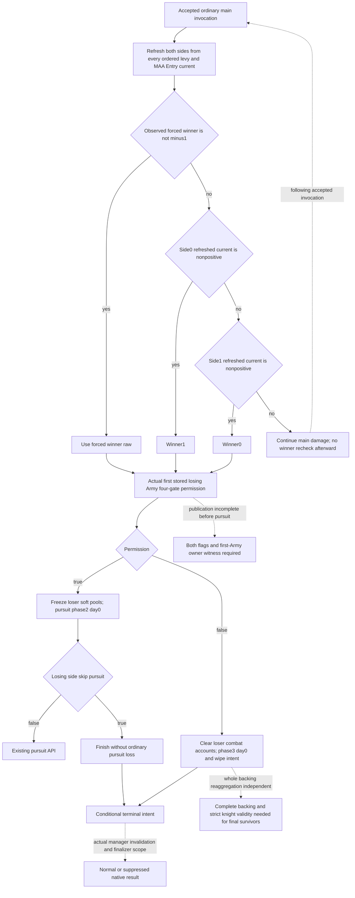

# Current main phase to pursuit or terminal (1.20.0.3, 2026-10-04)

Exact source: CK3 1.20.0.3, Steam build 25652598, EXE SHA-256 `94B55397ABB687A3DCD436805A5D885E6BE90FA6C693FEB44A9E3BBEEADE02A6`.
Source trees were sealed before the candidate pure implementation. This increment
adds a conditional step transition between the existing current main and pursuit
models. It does not advance the native game or simulate a whole battle.

Native `258C640` refreshes side0 and side1 using `26505E0` before damage.
Each refresh sums ALL ordered levy and MAA Entry `+18` signed int64 Q100000
current, even records with `fights_in_main_phase=false`; cached current `Side+98`
and cached levy `Side+A0` may otherwise lag the last damage. The branch priority
is forced `Combat+700`, then side0 nonpositive -> winner1, then side1 nonpositive
-> winner0. Both nonpositive follow the side0 branch and select winner1.
There is no casualty ratio or old 1.19 threshold in this selector.

The check precedes main damage. A supplied P1 simulated main result is carried
exactly once by the existing P2 helper and checked at the FOLLOWING accepted
ordinary main invocation. A condition without that result is checked at the
next accepted invocation. Modeled invocation offsets are not calendar credit;
the helper does not advance native date, revision or the game. Missing forced
winner stays missing, while a captured -1 remains its native sentinel.

`258C7D0` records winner then passes actual first stored losing native Army to
`258AA10`. The third argument is a null ErrorSink in both automatic and manual
calls; the difference is the actual Army receiver and owner. The four ordered
gates are `C0==0`; `C1!=0` or whole-day elapsed strictly greater than loaded
signed int32 `5C699B4`; current phase less than2; actual first-owner land/rule
permission. Each date is independently converted using signed truncation of
`(date-0x029C55C0)/24`. A current permit cannot be frozen through a future date;
a forecast needs correctly timed receiver witness or explicit source operands.

Permission true freezes losing levy and MAA soft `Entry+20` sums into
`Combat+6E8/+6F0` and sets phase2/day0. Actual losing `C2` true immediately
finishes without an ordinary pursuit casualty tick. Permission false clears
loser Entry current and soft and side cached totals, setting phase3/day0.
It does not add an owner hard-ledger increment. Native `2633340` backing
reaggregation can retain maximum for kind3 and whole current1 for a strictly
valid knight link. Consequently combat zero or wipe intent cannot set final
whole survivors to zero. The new module preserves that distinction.

Phase3 is a phase intention, not proof of a new normal-result journal entry.
The manager invalidation sweep precedes the ordinary finalizer. Normal versus
suppressed result, named deaths/captures, late survivors and whole-war score
require their own source observations. Existing terminal accounting remains
unchanged.

Existing MCP coverage supplies complete Entry arrays and ordered Army IDs,
forced winner, same-combat date and the selected legality timer operands.
Main-frame both-side C0/C1/C2 and actual first-Army owner land/rule witness
remain specific additive observation work. Phase2-only losing pool/skip fields
cannot substitute for those main inputs. Explicit source context enables a
conditional branch; missing context does not become false, a default duration,
or an invented phase2. Full all-Army backing current is separately observed;
no-retreat reaggregation additionally needs actual component kind/max and
strict knight-link validity to forecast final survivors.

Production API: `project_current_main_phase_transition(condition, simulation_result=None, *, inputs=None)`
in `battle_current_phase_transition.py`. It returns the branch, refreshed
modeled totals, timing/source metadata and typed pursuit start condition/context
for the existing `run_current_pursuit_ticks`. Existing P1, P2, pursuit, terminal,
adapter, runner and core modules are not edited by this packet.

Evidence: external artifact root
`Z:/ck3_mod_rewrite_process_assets/g2-resume-20261004/battle-current-phase-transition-v58/`.
Native `native-tree/TREE.md`, `SOURCE-CONTRACT.json`, `API.json` and
`callback-source/API.json` contain the archived call sites and pinned bytes;
`observation-coverage/API-FIELDS.json` records actual coverage and next entries.
Final focused result and root delivery are linked in the sealed packet.

Readiness: **static-ready conditional step transition**. The one new focused run executed exactly two unittest methods under Python `-O`, including real P1 producer -> P2 carry -> transition -> existing pursuit. Result: `Z:\ck3_mod_rewrite_process_assets\g2-resume-20261004\battle-current-phase-transition-v58\parent-focused-run-01\RESULT.json`. All earlier tests were reused as source evidence without reexecution. New native live observations, SDK/pipe/window operations and game days:0.
This increment does not establish native RNG/event parity, voluntary AI retreat,
full daily refresh, complete Monte Carlo, battle win odds or a whole OODA loop.
