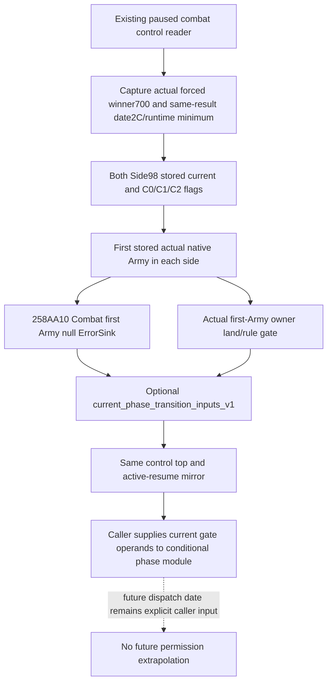

# Current phase-transition inputs (1.20.0.3, 2026-10-04)

This increment adds optional `current_phase_transition_inputs_v1` to the existing
battle-control response and its `active_combat_resume_inputs_v1.observed` mirror.
It exposes current native operands needed by the conditional main-to-pursuit
model. The existing tool, arguments, control observations and gameplay actions
are unchanged.

Exact source: CK3 1.20.0.3, Steam build25652598, EXE SHA-256
`94B55397ABB687A3DCD436805A5D885E6BE90FA6C693FEB44A9E3BBEEADE02A6`.
The v58 main and callback trees were sealed before implementation; this packet
reuses them without further EXE research.

The block contains `forced_winner_raw`, `result_start_date_raw`,
`minimum_elapsed_days`, and two ordered `sides` rows. Each row contains
`side_index`, `stored_current_fighting_raw`, `disallowed`, `allow_early`,
`skip_pursuit`, `first_native_carmy_id`, `native_can_retreat`, and
`owner_land_rule_allows`. Existing current date and other Army/public Unit/owner
identities remain in their original control fields. No additional object IDs or
forecast date are introduced.

Forced winner `Combat+700` is signed int32; captured -1 is the genuine sentinel,
not a default. Side stored current `+98` is signed int64 Q100000. Native
`26505E0` refreshes it from ALL levy and MAA Entry current at main invocation
start, before the winner check and before damage. This observation reads the
stored value and never invokes that mutating refresh. The stored cache may lag
the postdamage Entry totals, so it is not relabeled as a refreshed forecast.

`native_can_retreat` calls the already bound read-only `258AA10` with the actual
first stored native Army and a null ErrorSink. It does not use the selected
subject Army's manual permit. The exact native empty-list branch uses canonical Army fallback
`EXE+5D1DE50`; this provider branch is source-closed, but the existing public
control serializer excludes empty-side rosters, so it is not qualified as a
working public observation. Missing input is distinct from native -1 or false. Owner rule reads belong to that same first Army owner. The native
four-gate order is C0, C1 or exclusive whole-day timer, phase<2, then owner land
rule. The result date and loaded signed-int32 `5C699B4` minimum reuse the
existing same-combat legality operands. Dates are individually truncated by
`(date-0x029C55C0)/24`; no stock threshold substitutes for the loaded value.

False, zero and -1 survive serializer and formal Python normalization. Legacy
block absence remains compatible. A native reader can retain available status and nullable receiver fields for
an empty side, while the public serializer rejects that roster shape; these
are distinct qualifications. Missing old Retreat-required bindings retain
their original control behavior. A changing optional sample follows the
existing nullable extension pattern.
Ordinary genuine first-Armies produce
actual owner-gate observations; a strict owner resolution missing for a native
canonical fallback leaves that re-evaluation input null, while retaining the
actual native permit where available. Such a missing operand is not called
complete support for future gate re-evaluation.

These are current-frame observations. The phase model still requires a caller's
explicit future dispatch date or an exact witness for the invocation being
modeled. A current permit is not extrapolated through a later timer threshold.
The block does not advance calendar time, choose voluntary AI retreat, execute
phase changes, refresh combat entries or establish a complete battle simulation.

Evidence: external packet root
`Z:/ck3_mod_rewrite_process_assets/g2-resume-20261004/battle-current-phase-transition-inputs-v59/`.
`source-contract/API.json` freezes the minimal fields before code;
`BASELINE-PINS.json` identifies the fresh existing sections and preserves the
primary-loss, counter, complete backing and pursuit producers.
Readiness: **static-ready current-frame phase-transition input observation**.
The one new focused run compiled the necessary production path with strict
C++ warnings and NDEBUG, then passed two bounded native scenarios through
the production reader/serializer and the direct formal Python normalizer
under `-O`. Evidence: `Z:\ck3_mod_rewrite_process_assets\g2-resume-20261004\battle-current-phase-transition-inputs-v59\parent-focused-run-03\RESULT.json`.
No old fixture suite or whole DLL was rebuilt. Actual paused validation of this
new field block has not been performed.
The initial focused harness failure is preserved in `parent-focused-run-01`: an
empty-opponent test vector was outside the existing serializer contract and
produced an incomplete JSON packet. The fix changes only that fixture vector,
reuses seven unchanged production objects, and does not expand the contract.
`parent-focused-run-02` then exposed an actual parser defect: old legality
normalization rejected loaded thresholds other than14 and used14 for its gate
and output. Three uses now retain the captured signed-int32 minimum; final
validation reuses the native frames without another native build or execution.
New live observations, SDK/pipe/game/window operations and game days:0.
