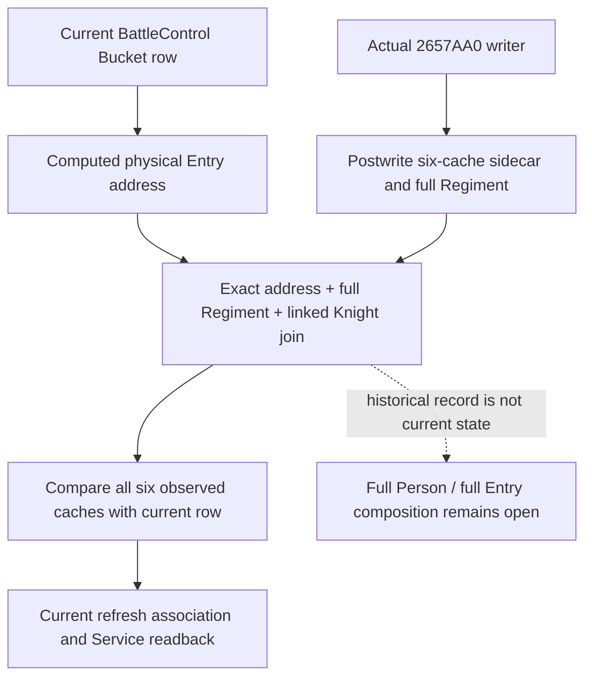

# Current physical Entry and observed writer cache, CK3 1.20.0.4

This source package joins an existing current BattleControl row to an observed
physical Entry writer record. It leaves the current six cached statistics intact
and compares them with the six values copied when the writer returned. The
comparison exposes retained or changed cache values for the exact row; a shared
Regiment ID alone cannot select another row with the same logical identity.
Current native Regiment IDs retain their signed int32 wire representation. The
join compares their unsigned 32-bit bit pattern with the writer sidecar's uint32
full ID. It uses the existing full-component ID validator for retained rows;
the missing `-1` sentinel remains excluded.

The exact build remains Steam 25734779, CK3 1.20.0.4, EXE SHA-256
`98702F88A547CDE2EAF29A85F93B85F68EE4CF8148336A4F7AFAEB75319DD518`.
The native writer proof is the retained 136-byte capture
`g2-background-20261010/person-physical-entry-frontier/actual-entry-writer01/2657AA0.asm`.
No new executable bytes are required by this package.

## Native input tree

`Bucket` already computes the current row address as `data + index * 0x60`.
The exact4 Battle binding publishes that address as optional
`physical_entry_identity`; older packets omit it. The writer at `0x2657AA0`
keeps its original RCX as the physical Entry and stores its returned cache at
Entry `+0x30` (int32 max size), then `+0x38/+0x40/+0x48/+0x50/+0x58`
(signed int64 siege, damage, toughness, pursuit and screen). Native67 copies
these six fields after the original writer returns, associated with the exact
nested knight wrapper sequence. Its scratch output pointer remains distinct.

## Consumer and qualification boundary

The existing current refresh association and combat-query Service result use
the same pure join. Service reads the already enriched current
`battle_control_snapshot_v1` in its existing snapshot; it issues no new native
query. Full Regiment, linked Character, current control coordinates and query
source coordinates remain visible alongside capture sequence, thread and date.
An address match identifies the row but does not establish that an older cache
record equals the current row. Every matching record and all six equality or
inequality results remain available in capture order. No historical value
replaces current statistics, and no refresh callback or combat action is run.

The one new authored consumer uses the retained Native67 whole through the
registered MCP, Service and real NativeDriver, then the real current-control
normalizer, adapter and refresh join. Its two separate current frames are explicitly
synthetic and share logical Regiment/Character identity while their physical
addresses differ. A synthetic high-bit full ID also exercises signed-current /
unsigned-sidecar equivalence without rewriting the retained whole. The existing
per-side duplicate Regiment rule remains intact. It does not qualify native current-row publication, replay
Native67's producer, or grant live, full Person, full Entry or G2 credit.

## Actual Native68 qualification, 2026-10-10 / W41

Root built and qualified this package at **2026-10-10 00:32:54.320235–
00:35:59.838942 UTC**, elapsed **185.518707 seconds**, using **16 BelowNormal
workers**. It compiled **451 production owners**, retained **293**, refreshed
the **444-member Runtime archive** with 299 replacements and 145 retained
members, and linked the DLL. The sole new registered MCP / Service / real
NativeDriver consumer passed. There was **no native fixture or producer
execution**: the test reused Native67's retained whole, qualified with fixture
source `813458e9c2c1ef4f5cdbee02c17613a680996643`.

Root sealed the [Native68 canonical qualification](Z:/ck3_mod_rewrite_process_assets/g2-background-20261007/upstream-build-migration/entry-live-fix68/ROOT-PARENT-RUNTIME-INCREMENTAL-DLL.json)
at **00:38:01.828186–00:38:03.103183 UTC**. Native68's compiled and consumer
source is `3ff84302db238fe7eaba108d39c5a3928449ca83`, following source commit
`d08a00127e0db21e3f59f1942d16ff4f96304fca`. Native67's production and unchanged
whole serializer remain pinned to `f19c1e4ffcb2bf7a7ac66b67970d4ab2f8342b45`;
its corrected producer fixture qualification is separately pinned to `813458e9`.

The new consumer exercises the actual Service ingress, normalizer, adapter and
shared current-refresh join. Its current control rows are **synthetic**, one
row per frame: a matching physical address, a different address with the same
logical identity, and a high-bit full Regiment representation. It preserves all
six current values and historical comparisons, the complete writer/Ci record,
and exact signed-current / unsigned-sidecar ID equivalence. It does not claim
that a real paused current BattleControl row has been observed.

Status is **static-ready**. No game was run by this package, no old native
producer or earlier GREEN compound was replayed, and no FullPerson, FullEntry,
battle outcome or G2 milestone credit is granted. The next useful entrance is
the existing paused BattleControl query followed by the existing combat-input
query on a fresh observed combat frame; it requires no new tool or native
source. Native66's separate cold recovery is independent of that future check.
