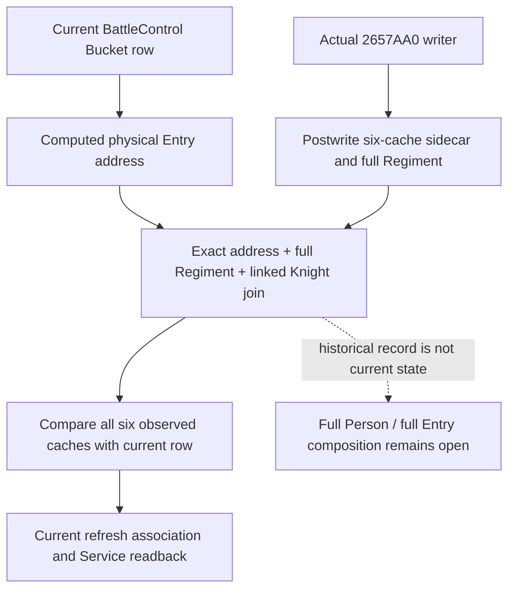

# Current physical Entry and observed writer cache, CK3 1.20.0.4

This source package joins an existing current BattleControl row to an observed
physical Entry writer record. It leaves the current six cached statistics intact
and compares them with the six values copied when the writer returned. The
comparison exposes retained or changed cache values for the exact row; a shared
Regiment ID alone cannot select another row with the same logical identity.

The exact build remains Steam 25734779, CK3 1.20.0.4, EXE SHA-256
`98702F88A547CDE2EAF29A85F93B85F68EE4CF8148336A4F7AFAEB75319DD518`.
The native writer proof is the retained 136-byte capture
`g2-background-20261010/person-physical-entry-frontier/actual-entry-writer01/2657AA0.asm`.
No new executable bytes are required by this package.

## Native input tree

`Bucket` already computes the current row address as `data + index * 0x60`.
The exact4 Battle binding publishes that address as optional
`physical_entry_identity`; older packets omit it. The writer at `0x2657AA0`
keeps its original RCX as the physical Entry and stores its returned cache at
Entry `+0x30` (int32 max size), then `+0x38/+0x40/+0x48/+0x50/+0x58`
(signed int64 siege, damage, toughness, pursuit and screen). Native67 copies
these six fields after the original writer returns, associated with the exact
nested knight wrapper sequence. Its scratch output pointer remains distinct.

## Consumer and qualification boundary

The existing current refresh association and combat-query Service result use
the same pure join. Service reads the already enriched current
`battle_control_snapshot_v1` in its existing snapshot; it issues no new native
query. Full Regiment, linked Character, current control coordinates and query
source coordinates remain visible alongside capture sequence, thread and date.
An address match identifies the row but does not establish that an older cache
record equals the current row. Every matching record and all six equality or
inequality results remain available in capture order. No historical value
replaces current statistics, and no refresh callback or combat action is run.

The one new authored consumer uses the retained Native67 whole through the
registered MCP, Service and real NativeDriver, then the real current-control
normalizer, adapter and refresh join. Its two current rows are explicitly
synthetic and share logical Regiment/Character identity while their physical
addresses differ. It does not qualify native current-row publication, replay
Native67's producer, or grant live, full Person, full Entry or G2 credit.

Status: source authored; new compound FIRST not run by the author. Root owns
native compilation and the unique retained-whole consumer execution.
