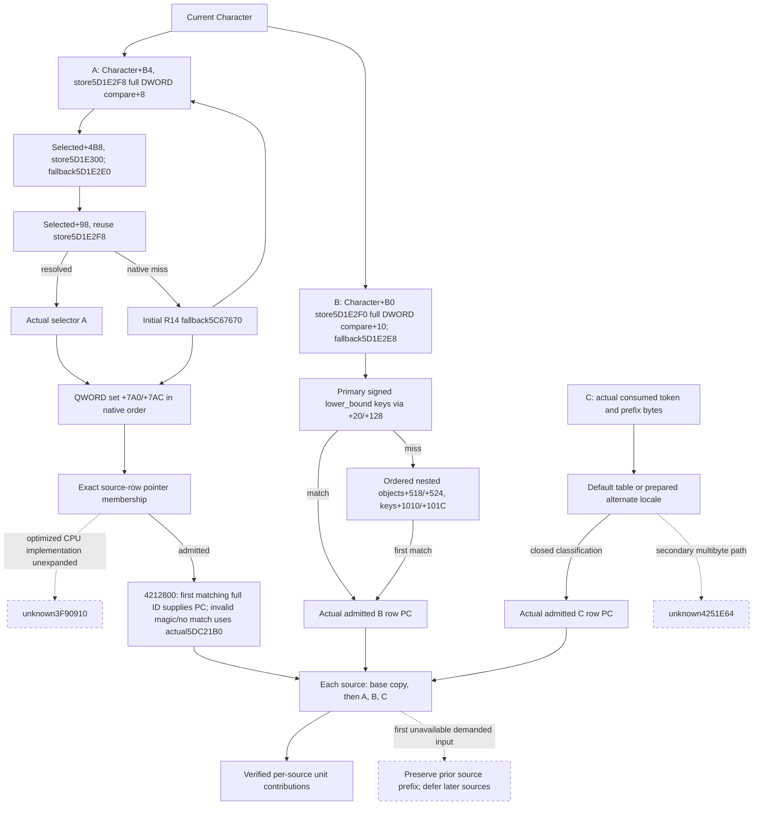

# Battle current prefix admissions and locale, exact 1.20.0.3

V86, 2026-10-05 / ISO 2026-W41. This increment makes the existing current-context source observation supply actual selector admissions and prepared alternate-locale classification to the public `291D7E0` composer. It preserves each verified source contribution in native order and stops at the first source whose demanded input is unavailable.

The build is CK3 1.20.0.3, Steam 25652598, with frozen EXE SHA-256 `94B55397ABB687A3DCD436805A5D885E6BE90FA6C693FEB44A9E3BBEEADE02A6`, image base `0x140000000`. The adopted V85 observer baseline is commit `213d90028c5a1027137d2baaec8fbf9040e4b2a2`. Current fields remain under the existing `current_context_source_inputs` observation; this increment adds no MCP query.

## Native source and construction order

The native tree and contracts were sealed before implementation. The selector lane reused the existing exact `291D7E0` cache and extracted only its 117-line / 4,629-byte selector prefix; it read zero new EXE bytes. The locale lane captured six necessary `.pdata` bodies and small metadata: 1,012 code bytes, 288 `.pdata` bytes, 44 unwind bytes and 136 IAT/name bytes, totaling 1,480 bytes. All cached source, raw byte pins and read costs remain in the external V86 packet.

| Contract | SHA-256 |
| --- | --- |
| Selector API | `aed28e67efb104762ee682018d371467b1447e3a1522ae937388df332d07e048` |
| Selector source-tree seal | `b5aae427175450ccc04ebfb4680c7c13a69243123f9076702ea31ccb1210403b` |
| Alternate locale API | `5b5721dd8637716cb1cd2381e54241fd7272f775ec1a5b3c609750d96656a51d` |
| Alternate locale source-tree seal | `fa45dab539f4f0e7673bba9e85b7f0397552a306cd96b6c7f24ff16970aae9d0` |
| Public B composer API | `64def22649c13e34235383fd501e9ae0732ee237dca6ac21dd0f72ce2bad44e7` |
| Adopted unit-merge contract | `7a10be179170eae2226f878a97e731cb138455332aaa3816963d0fc134d30c83` |

The last contract comes from the independently adopted materialized-prefix module, commit `a65fd887`. Its closed logical merge domain uses unit weight `100000`; B supplies exactly that unit weight. Physical capacity diagnostics and the separate arbitrary nonunit merge are outside this increment.

## Actual admission and demanded reads

A stage3 resolution failure keeps the initial `R14` fallback from `5C67670`; it does not retain a stage1 success. A selector membership preserves exact QWORD identities, including a legal zero key, and native order. The proven scalar/SSE equality semantics are projected directly. The separate optimized `3F90910` implementation remains a documented source edge; the observer does not call it or add a CPU-path gate.

For admitted A rows, `4212800` checks the key object's magic at `+38` and matches the full DWORD ID at `+10`. The first matching source A row supplies its property block at `+28`, even when that earlier row's own admission is false. An observed invalid magic or native no-match uses the actual static property block at `5DC21B0`. An admitted null object whose magic cannot be read remains partial. False admission avoids the property read.

B reads the actual selector primary keys first. A primary match avoids demanding nested keys. Otherwise nested objects are consumed in native order, and the first matching key set avoids reads from the remaining tail. The published vectors can therefore be shorter than their declared census counts while still closing that particular admission. Missing input, a declared empty set and an observed false admission retain distinct meanings.

## Prepared alternate locale

`424FB18` is a CRT getter with state initialization, and the `424E920`/`424E468` existing-state resolver can write import caches. The observer does not call these mutating paths. It decodes the existing cached getter at `5C5D7B8` as `ROR64(encoded XOR cookie, cookie & 63)`, with cookie `542F0B8`. An already cached `FlsGetValue` reads the current owning-thread index `542F328`; the native cached unsupported sentinel `-1` uses the identified TLS fallback import. Getter calls preserve LastError. A cache requiring resolution or a thread state requiring allocation remains precise partial.

`4250158` retains thread locale `+90` when it equals global locale `5C5DCD8` or thread flags `+3A8` intersect mask `542FCB0`. Its other branch synchronizes and returns the current global locale pointer. The observer selects the same current pointer without synchronization or refcount writes. It reads the selected locale's actual ctype table at `+0` and maximum multibyte count at `+8`; it does not substitute the default table.

For signed first byte `x`, `uint32(x+1) <= 0x100` indexes that selected table and uses the native classification result. Outside that range, maximum multibyte count `<=1` produces exact zero. A larger count delegates to `4251E64`, which remains unimplemented with `classifier_unavailable_locale_multibyte_path`. This has a concrete next source entry rather than a permanently null schema field.

## Public interface and useful boundary

`compose_291d7e0_current_contributions_12003(normalized_current_context_source_inputs, *, source_provenance=None)` returns `NativePreparationBResult12003`. It exposes contributions, verified source count, the first unavailable source index, deferred source indices and a per-source ledger. Each contribution carries the native source index, source identity, property container and unit weight `100000`.

Within each source, the composer copies independent base headers and arrays, then applies the observed admitted A/B/C property blocks in native row order. Empty destination copies include `FFFF`. A nonempty merge skips source `FFFF`, preserves native signed 64-bit wrapping, uses unsigned key lower_bound and inserts an aligned zero before adding a newly introduced key. A final temporary key count of zero skips that source contribution, including when its independent value vector is nonempty. The composer never consumes or merges a false-admission property block. The collector may already snapshot a B/C inline block before computing its admission; A's indirect selection is read only when demanded. Unknown source2 stops composition and leaves later source3 deferred; already verified sources remain available.

These results provide real current B source contributions to context construction. They do not supply an implicit prestage aggregate, substitute an old final model, predict an Entry or establish future Character/context stability. Full future context still needs the explicit earlier-stage/model inputs owned by the separate storage and task/position work packages.

## Verification and publication

The sole new compound fixture uses the actual native collector, production serializer, official normalizer and public B composer. Its hand vector distinguishes wrap64, first full-ID selection, actual fallback, exclusion of nonempty false-admission blocks, independent base-array counts, alternate-locale table selection and a genuine secondary multibyte partial frontier. Only the three production TUs changed by this increment and the fixture driver are required. Prior V85 cases are not rerun.

Parent private composition attempt01 initially omitted the selector's traditional `---/+++` sections. The fixture owner discovered that before compilation or case execution. The incomplete receipt and `PRECOMPILE_COMPOSITION_RED` are retained under `joint/precompile-composition-01`; the merger was corrected to accept both standard headings and exact traditional sections. This was a publication-tool correction with no lane business-byte change.

The first actual crossing retained a harness RED: it expected a false B inline block to remain unread, whereas the real collector snapshots that block before admission. The driver alone was corrected to provide a real nonempty false block and verify that the public composer excludes it. The three successful production objects were reused; the same single scenario was then executed as a second attempt. Both attempts remain in the fixture packet.

The corrected attempt02 is GREEN with 30 explicit checks, 251 injected native reads and zero read errors. It invokes the real normalizer and public B API once, emits one nonempty source0 contribution, verifies two sources, stops at source index2 and defers source3. The hand-computed output keys are `[2,3,4,6,7,9,65535]`, with values `[-5,MAX_I64,0,7,0,-10,99]`. There is one unique new scenario and two actual crossing executions. The three production TUs passed on their first compile attempt; only the corrected fixture driver was recompiled. Successful production objects were reused.

The outer tooling initially returned exit1 after the successful second crossing because its success comparison still expected the older `FIRST_GREEN` label. That tooling comparison alone was corrected with no rerun. The actual native process exit0, public crossing exit0 and GREEN result remain frozen in attempt02; the retained outer exit1 is documented separately.

Fixture results and candidate pins are maintained in the V86 `ROOT-DELIVERY.json` and `OCT5-W41-FIELDS.json` at `Z:/ck3_mod_rewrite_process_assets/g2-resume-20261005/battle-current-prefix-admissions-v86`. Readiness is `static-ready` with an offline native fixture. No CK3 process, window, game-day advance or live snapshot is claimed by this work package.

## 2026-10-05 R46 paused current-person readback

The source and branch inputs are available/ready, base inputs ready, with 21 sources. Every source has A/B conditional count 0 and empty rows; no native A/B admission boolean record was observed. Selector/resolution fields remain explicit nulls and A selected source remains empty. Registry guard is -2147483464, fallback null, government tokens [22151,22465,24075,24076,24077], selected source component+220. No current_B_prefix result was published or composer rerun. This verifies current source/base inputs, not nonempty admission paths or full prefix/Entry. Legal nullable/empty inputs do not block the current strategy.

Frame: query sequence 1, native 3/public 2, raw date 53264472, saved-day cut 5006; this readonly query adds zero days. Actual query game version/EXE SHA remain null; external g78/R0046 exact binding is recorded separately.

Evidence: `Z:/ck3_mod_rewrite_process_assets/g2-resume-20261005/current-person-fieldset-r46-consumption-preparation/actual-r46-once/parent-delivery/ROOT-DELIVERY.json`.
