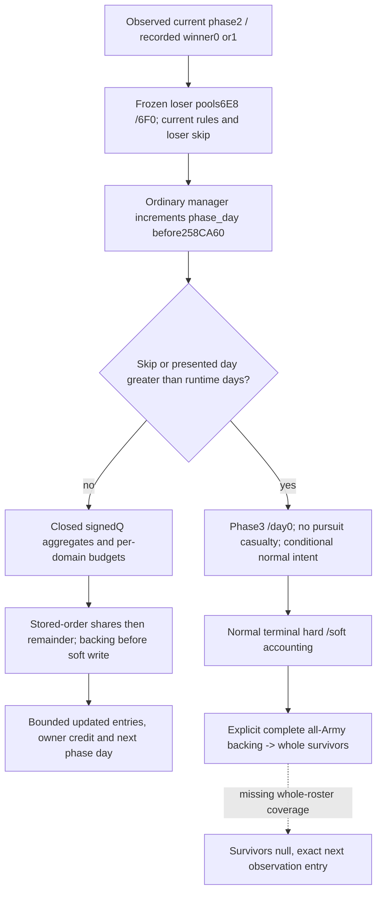

# Current .3 bounded pursuit and normal terminal projection

Source was frozen and recorded before the counter model: CK3 1.20.0.3 / Steam25652598, EXE SHA `94B55397ABB687A3DCD436805A5D885E6BE90FA6C693FEB44A9E3BBEEADE02A6`. The implementation reuses confirmed local arithmetic from the explicitly 1.19.0.6 `combat_core`; it does not relabel that whole kernel as .3 exact parity.

The recorded winner chooses the losing side. Current soft totals are not the frozen pursuit-entry pools. For paused pursuit day d, ordinary dispatch presents d+1; casualty allocation occurs through configured day N. The next call at d+1>N finishes at phase3/day0 without another casualty allocation. A losing-side skip flag also finishes without ordinary pursuit casualty. Current subject skip flag is insufficient when the subject is the winner; the same MCP producer adds `current_pursuit_inputs_v1.losing_side_skip_pursuit` from the actual losing side.

Q=100000. Soft toughness T sums loser `mulQ(toughness,soft)` and clamps a positive sum to at least Q. P sums winner `mulQ(pursuit,current)` then applies runtime5C699D0; S sums loser `mulQ(screen,soft)`. Base and minimum components use runtime5C699C0/5C699A0; extra=max(P-S,0), floor=max(base if extra>0 else base-S+P,minimum). The full-side multiplier is max(Q+winner modifier112+loser modifier198,0). Each domain and component retains its own signed truncation: divQ(mulQ(mulQ(frozen initial soft,divQ(component,T)),multiplier),days*Q). Native stored-order allocation and remainder convert separate components before backing updates and soft subtraction; owner hard credit is the same loss rather than another casualty.

New independent candidates are `battle_current_pursuit.py` and `battle_current_terminal.py`. The current-condition adapter, main runner, next-day carry owner and old kernel remain unchanged. A normal terminal projection keeps native baseline/current/soft hard=max(B-C-SL-SM,0) distinct from whole surviving backing soldiers. Native2667E90 enumerates all actual side Armies and all their RegimentIDs; combat Entry backing components alone do not establish that coverage. The candidate therefore takes complete backing explicitly and preserves null when it is absent. Wipe, character death/custody and war score are not invented from cached fighting or roster absence.

The source tree closes local pursuit arithmetic, initialization, counter ordering, allocation and normal-result lifetime. Full day admission/loaded effects/fresh feedback remain the next-day owner's scope; full all-Army backing observation remains an explicit producer entry. Native overflow/sentinel edge parity, complete MC, AI retreat intent, named character probabilities and full combat OODA are outside this bounded increment.

The first and only new focused run passed 2/2 production Python paths under `-O` in 0.251 seconds: pursuit dayN allocation then dayN+1 zero-casualty finish, initial-pool persistence/current-pool clamp, and terminal signed-Q accounts versus complete whole backing (including legitimate empty zero and absent null). No old suite or native build was rerun. New live observations and new game days remain zero. See the external [native tree](Z:/ck3_mod_rewrite_process_assets/g2-resume-20261004/battle-current-pursuit-terminal-v57/native-tree/TREE.md) and final implementation receipt for exact evidence, output API and preserved attempt pins.

[Focused result](Z:/ck3_mod_rewrite_process_assets/g2-resume-20261004/battle-current-pursuit-terminal-v57/parent-focused-run-01/RESULT.json) and [implementation receipt](Z:/ck3_mod_rewrite_process_assets/g2-resume-20261004/battle-current-pursuit-terminal-v57/ROOT-DELIVERY.json) pin the two candidate APIs and source. Readiness is **static-ready**, with zero new live observations. The actual all-SideArmy backing producer and loser-skip observer are separate Root-owned source packages; their future values must be passed as current inputs, not fabricated here.

## 2026-10-04 cached-slot correction: pursuit hard conversion

The exact .3 cached instruction at `2651FE3` loads a signed qword using RIP
`3617BAE`; next instruction `2651FEA` resolves the slot to `5C69B98`.
`5C69BB0` is the separate maneuver-entry signed-int32 threshold read at
`2AD8135`; it is not the pursuit hard-conversion slot. The prior v57 source
ledger identified the wrong slot and is preserved as historical evidence with
an explicit erratum.

The error also existed in production: `kBattlePursuitHardConversionRva` bound
`BattleBindings.pursuit_hard_conversion`, and `CurrentLossInputs` copied that
slot into `runtime_pursuit_hard_conversion_raw`. The minimal fix changes only
the constant to `5C69B98`. Pure pursuit formulas, explicit numeric inputs, the
query schema and gameplay actions stay unchanged. Previous frozen producer
outputs are not retroactively relabeled as measurements from the corrected slot.

Source: cached `battle-current-pursuit-terminal-v57/native-tree/evidence/02651fd0.txt`
SHA `fc4f1bf1c664e384b6138e60cd30391f0deb832d7ccea269a72b1d75c1a9fdbb`,
reused without reading the EXE. External correction package:
`Z:/ck3_mod_rewrite_process_assets/g2-resume-20261004/battle-pursuit-hard-conversion-slot-v60/`.
It preserves the previous facts and current preimages. Focused validation and
readiness are recorded in `ROOT-DELIVERY.json`; the fixture distinguishes loaded
B98 and BB0 values through the real binding and current-loss reader. No old
pure/registered matrix is rerun. The existing R30/g62 runtime is unchanged;
new SDK/game/window operations and calendar days:0.

The targeted production binding -> current-loss reader -> existing serializer case is GREEN: loaded B98=73123 is emitted while the unrelated BB0=919007 remains distinct. The first offline attempt is preserved as HARNESS-RED because fresh CurrentLoss DTO was linked with a v59 serializer object using the previous layout; only affected current objects were recompiled for the successful attempt. The fixture does not establish a corrected live observation. See [focused result](Z:/ck3_mod_rewrite_process_assets/g2-resume-20261004/battle-pursuit-hard-conversion-slot-v60/parent-focused-run-02/RESULT.json). Readiness is static-ready; the deployed R30/g62 runtime and prior frozen producer measurements remain historical.
