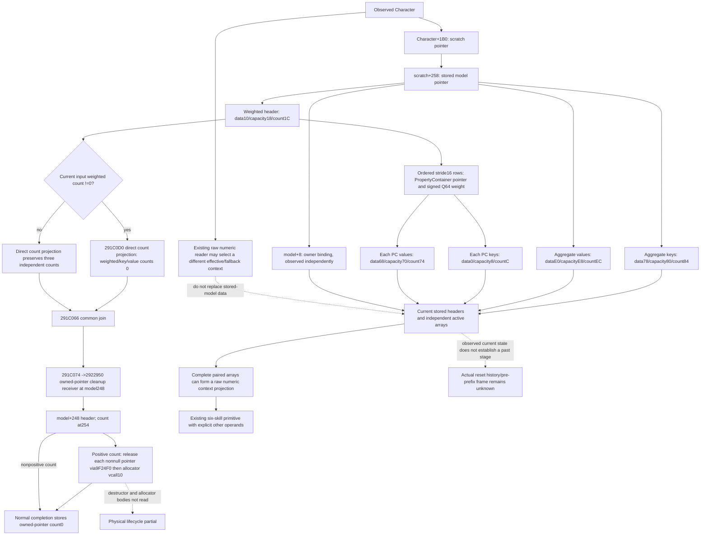

# Current stored context state in CK3 1.20.0.3

Frozen EXE SHA is `94B55397ABB687A3DCD436805A5D885E6BE90FA6C693FEB44A9E3BBEEADE02A6`. This source ledger extends the adopted unit-Q prior-prefix primitive with independent observation of the currently stored model. It does not substitute the current final context for a pre-prefix model or reconstruct a reset history from zero counts.

The context begins at the address `model+10`; it is not a pointer loaded from that address. Header capacities are raw U32 bits, counts are independent signed I32 values, and property values/weights are signed Q64. Zero count yields a legal empty active array without dereferencing unused data. Negative counts and read failures retain their observed descriptors and a missing active array. A zero weighted count does not imply empty aggregate keys or values. Capacity affects storage allocation paths and is separate from loaded six-skill caps.

The new bounded function `2922950` comprises 151 code bytes across three chained physical fragments, plus 96 pdata and 56 unwind bytes: 303 new frozen EXE bytes. Its normal end clears only the observed owned-pointer header count. The body contains no direct stores to weighted or aggregate data/capacity headers; unread destructor and allocator behavior remains outside this closure. The current pending marker and owner pointer are not evidence of a historical preparation stage.

Cached control pins distinguish count clearing from cleanup admission: `291C01F` compares weighted count with zero and `291C022` jumps to `291C066` when zero. Both branches join there; `291C06D` passes the owned header and `291C074` calls `2922950`. Thus zero weighted count skips the three count stores but does not skip owned-pointer cleanup. This selected cached slice supplies the join edge without re-reading the EXE or whole prior function.

Source receipts are `source-reset-control/ROOT-DELIVERY.json` (`f9341169668e50cdf964eade6ced98a187f5c9bd896ff3d00c2c539dc449ba95`) and `source-current-aggregate/ROOT-DELIVERY.json` (`cc603ab4e3b93f4a65946aea3ab819b3bc9995af1f995ea7b9e6d76b7baef988`). All remaining layout/control facts reuse sealed .3 callers and the existing numeric reader. No live process, SDK, reset call, game write or old fixture was used.

The optional field is `current_person_state.current_stored_context_state` in the existing terminal-transition actor query. It reads the current scratch/model and owner binding, three independent descriptors and active arrays, and independent property-container headers in the weighted rows. A missing model is an observed absence; it does not become empty aggregate arrays. Owner mismatch and unknown capacities do not suppress otherwise readable current storage. The sampler invokes no native getter, reset, cleanup, allocator or property writer.

The public `project_current_stored_context_state_12003(payload, *, source_provenance=None)` consumer retains observed descriptors and produces a raw numeric context projection only from complete paired arrays. Its current-input direct reset projection is independent of array availability: a negative weighted count still selects the nonzero count-clear branch, even when its active array is unavailable. This is a conditional calculation using present operands, not evidence that a native reset or cleanup ran.

The sole new production-path case is GREEN, 1 test, 0 failures, 0 errors, 2.163869699987117 seconds including the private overlay. It exercises the current stored field through the public normalizer and new consumer, then the existing six-skill kernel with explicit other operands. The fixture and qualification receipts preserve actual import paths and modeled values. A reviewed the new collector and its integration once against the sealed native source; no mismatch or code correction was needed for that review.

The five existing integration files were privately frozen from Root head `213d90028c5a1027137d2baaec8fbf9040e4b2a2`, preserving the adopted Knight observer. The only new native file is an independent header collector; existing changes are person-only insertion hunks. Later Death observer hunks belong to another pod and must be preserved when Root adopts this patch. Native compilation, deployment and a fresh paused observation are pending Root. No native observer execution, SDK action, game day, old fixture or current/future native parity comes from this package. Actual historical reset admission, a pre-prefix frame, physical allocation lifecycle and complete future context remain distinct from this current stored-state primitive.
