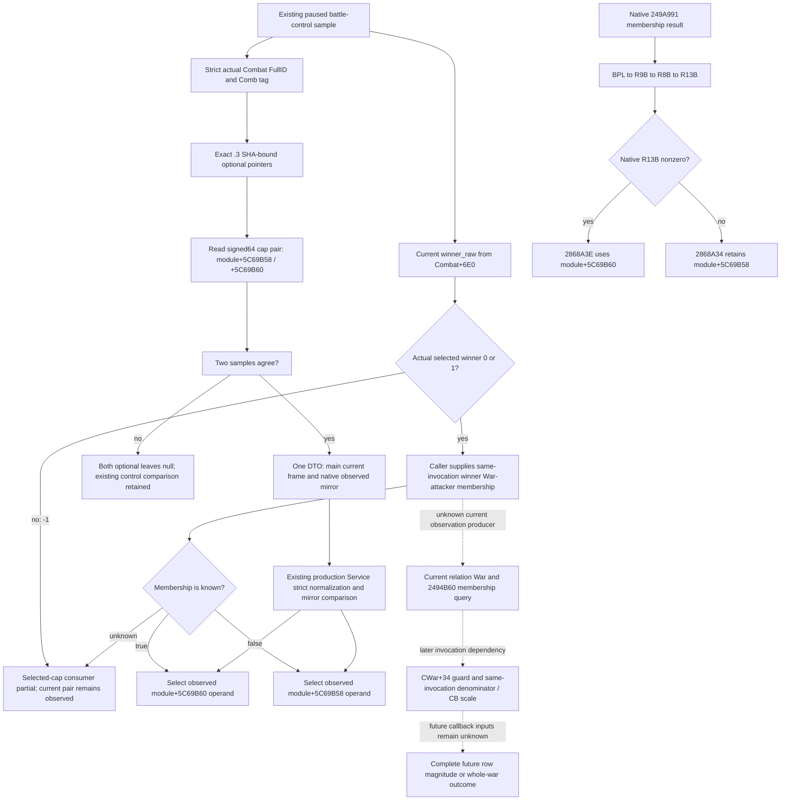

# Current loaded battle warscore caps — CK3 1.20.0.3

The existing paused battle-control query now has one optional
`current_warscore_caps_v1` block containing the two actual loaded native caps.
This is a current operand observation. Selected-cap consumption remains
conditional on the actual current selected winner and separately supplied
same-invocation War-attacker membership. Full selection is not yet a fully
observed current capability.

Exact build: CK3 **1.20.0.3**, Steam **25652598**, EXE SHA-256
`94B55397ABB687A3DCD436805A5D885E6BE90FA6C693FEB44A9E3BBEEADE02A6`.
The source tree and instruction ledger were frozen on Oct6 before the candidate
implementation. Root authorized actual source integration on Oct7 into
`C:/codex-ck3-background/parallel-integrations-20261007/battle-warscore-caps`,
based on `71b729f0cc4894331f1dadb89155920fccd42a00`. No game or build operation
was performed by this native source lane.

## Existing observation and the exact gap

The current native `TransitionSample` reads `Combat+0x6E0` as signed32
`winner_raw`; `ControlSample` copies that same current value into the whole
frame. Values 0/1 select an actual Combat side. Value -1 means that this frame
has no selected winner. Neither Combat-side index nor subject/player side
identifies the winner's War-attacker membership.

Current battle-control has no current relation WarID or current
`winner_is_war_attacker` field. The similarly named existing observation is
`BattleTerminalWarscoreSnapshotV1.winner_is_war_attacker`; its producer reads
`LookupBattleWarscoreJournalV1(r.prior_combat_id)` in the terminal query and
copies the captured event's membership. It belongs to that recorded native
invocation. A past terminal membership cannot be reused as the current
invocation by convenience.

The current terminal parser already publishes actual row magnitude, winner
War-side membership, denominator inputs and selected CB scale. This increment
does not rebuild those producers. The previously unobserved loaded cap family
is now copied from its exact module addresses into the current whole frame.

## Native caller and cap-selection tree

The archived normal writer `249A940` obtains actual winner membership with
`249A991 ->2494B60(CWar+20,winnerSide+70)`. AL is retained as BPL at `249A996`
and passed as R9B to row constructor `28681C0` at `249A9C5`. A separate
membership calculation at `249A9A3` records whether Combat-side0 is a War
attacker; it does not select this cap.

`2868207` retains R9B, `286821D` passes it as R8B to `2868690`, and
`28686B6` retains that flag in R13B. After the native fixed ratio and selected
CB-scale product, the exact cap instructions are:

| Instruction | Native observation |
| --- | --- |
| `2868A34`: `mov rax,qword ptr [rip+340111D]` | Next RVA `2868A3B`, target `5C69B58`; default War-defender-winner cap. |
| `2868A3B`: `test r13b,r13b` | Tests actual winner War-attacker membership. |
| `2868A3E`: `cmovne rax,qword ptr [rip+340111A]` | Next RVA `2868A46`, target `5C69B60`; nonzero selects War-attacker-winner cap. |
| `2868A46..5C` | Negative computed product stores zero; otherwise signed comparison limits it to the selected loaded qword before row+40 is written. |

Each cap is an **8-byte signed64 raw Q100000 quantity**. Signed `cmovg` closes
the interpretation; the existing fixed-point row accounting closes the unit.
The observer preserves zero, negative and large signed64 raw values exactly.
It does not replace them with vanilla script defines, a CB scale, combat
strength, Combat-side index or attacker-relative delta.

## ABI and existing query seams

The new native [header](../../ck3_autonomous_player/native_bridge/include/xar_bridge/battle_current_warscore_caps_v1.hpp)
groups the small DTO and leaf bindings with reader, binder and serializer
declarations. The [TU](../../ck3_autonomous_player/native_bridge/src/battle_current_warscore_caps_v1.cpp)
uses direct copies only. `BindBattleCurrentWarscoreCaps12003` returns two null
pointers for an absent module base or a SHA other than the exact `.3` constant.
It performs no legacy binding, native call or native write.

One `BattleCurrentWarscoreCapsBindings12003` is appended to the end of
`BattleBindings`, preserving its existing aggregate prefix. The existing
exact `.3` battle-control branch in `bridge.cpp` binds it using the existing
`query.image_base` and descriptor SHA. There is no derived module root from a
manager vtable or unrelated rule pointer.

Inside the existing owner-thread `ControlSample`, the already strict-resolved
actual Combat and requested FullID are passed to
`ReadBattleCurrentWarscoreCaps12003`. The leaf additionally copies Combat+8
FullID and Combat+C `Comb` tag, then reads both loaded signed64 operands. It
returns null if either binding is missing or the supplied Combat identity does
not match. It does not change the pre-existing whole-frame Combat validation.

The existing two-pass `ReadBattleControlSnapshot` drops the optional cap leaf
from both samples if it alone differs, then retains the original whole-frame
equality and paused-scope validation. A missing cap leaf does not tighten
`battle_control_ready`. Native main-frame and
`active_combat_resume_inputs_v1.observed` serializers consume the same DTO
instance from the returned `BattleControlSnapshot`.

| Wire field | Type and meaning |
| --- | --- |
| `source_combat_id` | signed32 exact parent current Combat FullID |
| `war_attacker_winner_cap_raw_q100000` | signed64 current module+5C69B60 raw value |
| `war_defender_winner_cap_raw_q100000` | signed64 current module+5C69B58 raw value |

An absent optional key remains an older wire shape. Explicit null means the
current leaf was unavailable; legal raw zero remains a real observation. The
existing production battle-control contract normalizes the leaf and its
observed mirror, requiring parent FullID agreement and matching copied fields.
The existing `GameplayBridgeService.query_battle_control_snapshot_v1` and MCP
route carry the increment; no new Service method or query capability is needed.

The conditional Python consumer uses the current whole-frame `winner_raw`,
with -1 remaining partial even if a membership bool was supplied. For 0/1 it
requires explicit same-invocation `winner_is_war_attacker` before selecting one
observed cap. Cap selection completion under that supplied input does not mean
membership itself was observed by this query. No winner is inferred, no normal
row is admitted, and no future row magnitude or whole-war outcome is produced.

## Cached source pins and read cost

Pins are inherited from the existing [effects source index](Z:/ck3_mod_rewrite_process_assets/g2-resume-20261004/battle-normal-finalizer-v61/effects/SOURCE-PINS.json).
No new EXE read or hash was performed. The exact archived ASM root is
`Z:/ck3_mod_rewrite_process_assets/g2-resume-20261003/battle-casualty-outcomes/normal-result-value-increments/native-research/`.

| Cached file | Inherited ASM SHA-256 | Existing native span bytes |
| --- | --- | ---: |
| `EXE-0249A940.asm` | `4f71898f3369ee05c428de045a96a097495b37c6ae592f0fa1c4d21c11552fa8` | 760 |
| `EXE-028681C0.asm` | `14be22b85a0fc5abeb31170c5e58b736a5d5adc722b255cbc4e23ea421f1c357` | 441 |
| `EXE-02868690.asm` | `2af30202ecc91e7daa0268bc037c869f3d54f7c277e951d0f65d1224ffd3251c` | 1012 |

The corresponding inherited native-span hashes are
`68198f94005cfdac6cbff8a5e2bd0747cb4ca972bee2dff5b9494b9201860bb6`,
`bf364650b973b416ed4d65d659584d735ffa1ec7fdc48aa3c6313725ea3d9eb4`,
and `046b955e40d008bdaf1e666ef182bab0ce53d8492428e5a9861238e5b415620f`.
Used instruction spans are `249A980..249A9D3`, `2868207..2868243`,
`28686B6`, `2868988..28689AB`, and `2868A34..2868A60`.
The external [Oct6 source packet](Z:/ck3_mod_rewrite_process_assets/g2-parallel-20261006/battle-pursuit/implementation/phase01-next-inputs/winner-warscore/SOURCE-PINS.json)
retains these pins, exact addresses, widths and the source-before-code order.

Reused cached bodies total **2213 B**; their cached ASM text totals **31597 B**.
The new leaf directly copies **16 B loaded globals plus 8 B Combat identity**
per sample, or **48 B** for the existing two-pass frame. It introduces no list
walk, native call, native write or new metadata request.

## Readiness and next source entry

This capability is **research / source-integrated, NOTRUN**. Imports, builds,
native FIRST, whole Service compound, game and SDK remain NOTRUN; no existing
qualified fixture was rerun. The isolated source commit is the integration
delivery, while Root owns the seven new FIRST cases, sole production consumer
and their actual receipts. Source integration alone adds no static-ready,
paused/live, forecast or complete credit. Separate authorized bounded source
research and its new-read cost are recorded in
[the finalizer/retreat frontier topic](battle-current-finalizer-retreat-source-frontiers-12003.md).

The concrete next current observation entry is the primary-pair relation
`28BC270(primaryA,primaryD)->relation+20` genuine War binding and the source
`2494B60(CWar+20,currentWinnerSide+70)` membership. A future row additionally
needs the actual `CWar+34` writer guard and its own losing-War-side mode2
denominator/CB-scale inputs. This package does not invoke or bind those native
functions: cached caller use is closed, but a current readonly query contract
for that relation/membership chain is not supplied here. They are finite later
work, not a new ordinary-combat gate. Any later actual paused evidence uses only
Robert29829's original ordinary campaign and Root's current exact runtime freeze.
