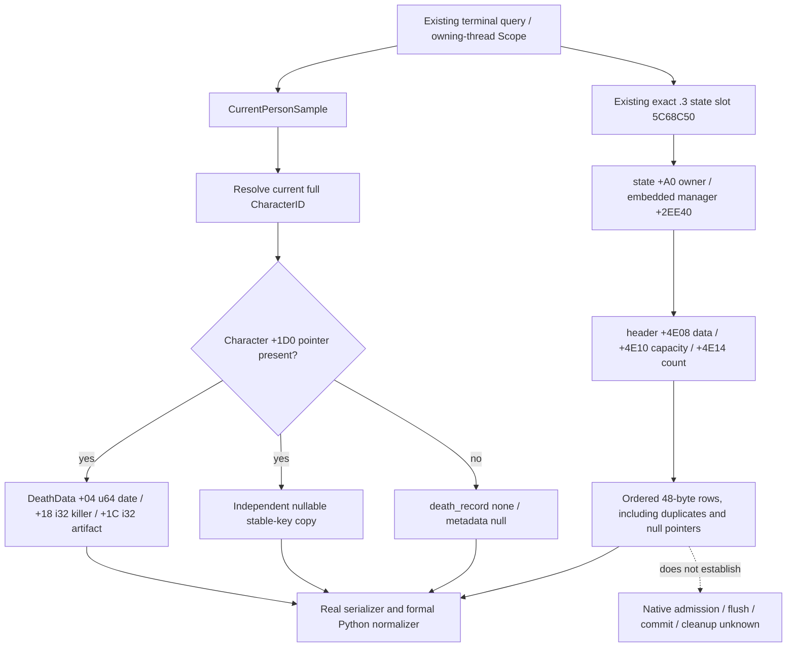

# Current death metadata and ordered pending-death storage (.3)

2026-10-05 / ISO 2026-W41. Source binding: CK3 1.20.0.3, Steam build 25652598, EXE SHA-256 `94B55397ABB687A3DCD436805A5D885E6BE90FA6C693FEB44A9E3BBEEADE02A6`. Status: **static-ready** after one offline production-path fixture. No new paused artifact or game day is claimed.

The existing `ck3_query_battle_terminal_transition_v1` now exposes the current Character's death metadata and the DeathManager's ordered pending rows. Existing alive, reason, custody and selected-effect request observations keep their own meaning. This provides concrete native storage observations for checking a named-person outcome; a pending row does not establish that the native writer committed it.

## Source and lifecycle contract

`EnableBattleCurrentPerson12003` already binds `current_person_prior_owner_slot` at EXE RVA `0x5C68C50` for the exact .3 current-person reader. This observer reuses that slot and `current_person_state_enabled`; prior-context flags are not required. It adds no binding, feature flag, public tool or action. The global queue sample precedes the character-only return and the historical Combat/journal branches. Existing same-date Scope and TerminalSample double sampling are retained.

Character `+1D0` is the current DeathData pointer. When absent, `death_record.status = none` and the three new fields are null. When present, `+04` is copied as all 64 raw bits of the date object; it is not interpreted as a calendar date. `+18` and `+1C` are signed int32 raw killer CharacterID and artifact ID. Legal `-1` and `0` remain unchanged. A reason-key storage failure retains independently read date, killer and artifact values. Existing reason null, empty string and unavailable states remain distinct.

The state pointer is loaded through the existing slot; `state +A0` holds the owner pointer and its `+2EE40` embeds the DeathManager. `state +C1` supplies the uint8 execution mode. The manager header is data `+4E08`, int32 capacity `+4E10`, int32 count `+4E14`. Its 48-byte rows hold victim pointer `+08`, reason pointer `+10`, copied raw date `+18`, killer pointer `+20`, and artifact pointer `+28`. Pointed-to Character IDs are read at `+18`; artifact IDs are read at `+10`. They describe current pointed-to objects, not a reconstructed durable historical identity.

All current ordered rows are preserved. Duplicate victims, null pointers, an already-present victim DeathData marker, and execution mode zero with a nonempty header are retained. Query `character_ids` do not filter this global queue. No flush, admission, DeathData writer, reason intern or cleanup callback is invoked.

## Additive public fields

`current_person_state.death_record` adds optional-compatible `date_object_raw_u64`, `killer_full_character_id_raw`, and `artifact_full_id_raw`.

The optional top-level `pending_death_queue` carries `status`, `unavailable_reason`, `source_state_pointer_present`, `manager_owner_pointer_present`, `execution_mode_raw`, `data_pointer_present`, `capacity_raw`, `count_raw`, and `rows`. A copied empty queue is `[]`; unavailable row storage is null.

Each row carries `status`, `unavailable_reason`, `row_index`, victim pointer presence/current full ID/death-data pointer presence, reason pointer presence/key, raw date object, killer pointer presence/full ID and artifact pointer presence/full ID. Raw pointers are not published. Python accepts legacy absence of these additions, preserves uint64 and signed int32 values, and retains nullable status fields without coercing legal zero to missing.

## Verification and remaining boundary

One explicit synthetic frame used five current-person rows and four pending rows through the genuine `ReadBattleTerminalTransitionV1` reader, genuine mailbox/person serializer and formal Python normalizer. Corrected attempt 02 passed **28 Require checks** (native 16, Python 12). Each public production stage executed once; native internal consistency sampling executed twice. Eight necessary TUs compiled/linked under `/W4 /WX`; the correction compiled only the omitted existing phase-character TU and reused seven GREEN objects. Python ran with `-B -O` and active Require checks.

Attempt 01 is retained as a **link HARNESS RED**: the harness omitted existing `FindUniqueTraitDefinition` / `ReadTraitPresence` dependencies, so reader, serializer and normalizer calls were all zero. No production code changed for the correction. The earlier wire projection anchor failure is also preserved as a projection HARNESS failure. No old case was executed.

The scenario covers raw date zero and values above 2^53, signed ID zero/-1/bounds, absent and unresolved current characters, unavailable reason storage with independent metadata, mode zero with four rows, duplicate/null victims, and null/empty/unavailable reason keys. These are offline production-path checks, not fixture-live or production-live observations. Native commit, casualty causality, Entry cleanup/numeric refresh, battle terminal outcome and complete OODA remain separate observations and dependencies.

Source: [sealed source contract](Z:/ck3_mod_rewrite_process_assets/g2-resume-20261005/battle-death-metadata-pending-observer-v85/source/SOURCE-CONTRACT.md), [source tree](Z:/ck3_mod_rewrite_process_assets/g2-resume-20261005/battle-death-metadata-pending-observer-v85/source/TREE.md), [API and field pins](Z:/ck3_mod_rewrite_process_assets/g2-resume-20261005/battle-death-metadata-pending-observer-v85/source/API.json). Verification: [sole fixture receipt](Z:/ck3_mod_rewrite_process_assets/g2-resume-20261005/battle-death-metadata-pending-observer-v85/fixture/ROOT-DELIVERY.json), [preserved attempt 01](Z:/ck3_mod_rewrite_process_assets/g2-resume-20261005/battle-death-metadata-pending-observer-v85/fixture/attempt-01/RESULT.json), [corrected attempt 02](Z:/ck3_mod_rewrite_process_assets/g2-resume-20261005/battle-death-metadata-pending-observer-v85/fixture/attempt-02/RESULT.json).

Root owns shared adoption, combined native build, deployment and a future real paused observation. This package adds zero SDK calls, windows, native flushes/writes or game days. Knight-v85 commit `213d90028c5a1027137d2baaec8fbf9040e4b2a2` is a separate adopted increment; these death-only local hunks preserve it.
