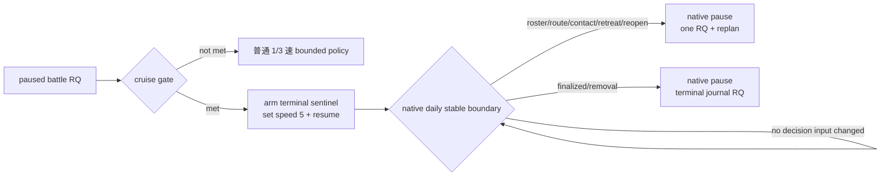
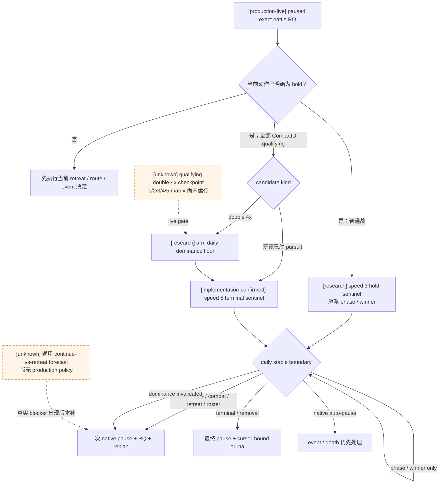

# 战斗决策时点与零中途暂停 cruise

状态：**native daily sentinel、完整全军 watch 与普通 decision speed-3 已 production-live；phase/winner 粗停点合并与运行中 dominance invalidation 为 research；玩家已获胜 pursuit 的 candidate-specific selector 已接线、production canary 待跑；双重 `4x` 的 overwhelming checkpoint matrix 尚缺**

冻结构建：CK3 `1.19.0.6`，`ck3.exe` SHA-256
`2D00FF3101EF70B566F2FCBAE292F09263199C80E9DC8F139B82D7D96F83DB86`。

本页只回答两个与 G1 吞吐直接相关的问题：

1. 已接战以后，哪些帧才是真正需要自动玩家重新判定的时点；
2. 怎样让明确碾压的战斗用 5 速从一次 paused rich query 直接跑到终局，中间不再做外部 pause/RQ。

原生逐日计算、五档速度实证与 same-day hook 的反汇编入口仍以
[battle-speed-control.md](battle-speed-control.md) 为权威；战斗帧、终局 journal 与增援分别见
[ongoing-battle-frame.md](ongoing-battle-frame.md)、
[battle-terminal-and-reentry.md](battle-terminal-and-reentry.md) 和
[battle-reinforcement-and-join.md](battle-reinforcement-and-join.md)。

## 直接结论

1. **CK3 不需要自动玩家每天发“继续战斗”。** maneuver、main、pursuit 和 finalizer 都由原生日更自动推进；当前逐日
   pause/RQ 只是我方旧事务边界。
2. **5 速零中途暂停必须是 native `run-until-terminal-or-sentinel`，不能是 Python 250 ms polling。** 现有真实战斗中
   5 速跑 33 个游戏日至 exact terminal 平均 `12.587s`，1 速平均 `76.621s`，核心终局结果在五档相同；正式逐日事务的
   实测均值却约 `4.555s/游戏日`。因此把 33 次 pause/RQ/barrier 收缩为首尾两次，收益大于单纯换速度。
   最新同 checkpoint exact-day route 五档实测又把固定往返成本量化为 speed 1 `3.184s`、speed 5 `1.381s`；五档均为
   `53220360 -> 53220384`、paused、cleanup GREEN。报告根为
   `C:\Users\xenoa\AppData\Local\Temp\xar-route-speed-matrix-82817df-state\runs`，speed 1/2/3/4/5 report SHA-256 分别为
   `9979B9A10BCAA2B1212BB13033D89B5611890411F0DB824B6AEA2E2F491E9700`、
   `DEF5511FBD514C39AB2D0FF7EB7C05E3D33D7511257CBF2B7A42D1D51B270697`、
   `8AEEC3BDB1B7EC342851881BC84835ECDF435C02CBB53A32977B820607760963`、
   `7DF10F023A8D7539DBB1F6A6F81D77754A8126CA8511213E1829F13B6A7BB79E`、
   `0200B0302937CE6DA90D648FEE9C226E248101DC34D86B4FBA831611C2190321`。
3. **真正的重新判定点不是“日期变了一天”，而是旧决定的输入失效。** 对预先选定 `hold-to-terminal` 的战斗，只有军队/
   CombatID、路线/接触、撤退、双方 roster、终局/删除、原生自动暂停或 sentinel 基础设施状态变化才要求停表。单纯
   `maneuver -> main -> pursuit` 和 winner 写入不推翻“继续到终局”。当前 terminal mode 已忽略二者；普通 speed-3
   decision mode 仍会为二者暂停，是下一项可直接删除的粗粒度开销，不是 CK3 计算要求。
4. **第一版不等待完整 Monte Carlo。** 当前 `monte_carlo_ready=false`，但这不妨碍先用同一 paused frame 的两项真实指标
   筛选 research candidate：玩家侧 `derived_current_fighting_raw` 和 `side_strength_raw` 都至少为对侧 `4x`。这只是一个
   可实测的操作性“碾压”定义，不声称 99.5% 胜率；production 必须再经过 overwhelming checkpoint 的平衡矩阵。
5. **运行中 dominance invalidation 已完成预研，但尚未成为生产门。** 项目所有者明确要求预研“碾压局完全不暂停”时如何
   发现优势失效，因此下文冻结只在 double-`4x` cruise 中启用的最小 native read；它不进入普通战，也不做逐日日志/RQ。
   在 qualifying live checkpoint 和 `1/2/3/4/5` 同 checkpoint matrix 以前，当前生产仍只监视
   roster/route/contact/retreat/terminal 等已有 epoch，不把预研字段冒充 live capability。

## 决策 epoch，而不是逐日 epoch

一次 paused battle-control frame 先决定当前动作。若动作是 hold，后续按下表处理：

| epoch | 是否暂停 | 原因与后置动作 |
|---|---|---|
| 纯日期、phase-day 或 casualty ledger 自然推进 | 否 | 没有新的玩家动作；CK3 继续原生 tick |
| `maneuver -> main` | terminal mode 否 | 已预先选择 hold；phase 变化本身不创造新动作 |
| winner 写入、`main -> pursuit` | terminal mode 否 | 胜负已定，pursuit 自动执行；直接等 finalizer |
| 双方 ordered roster count/hash 变化 | 是 | 增援/离场改变原决定输入；paused battle-control RQ 后重判 |
| watched CUnit/CombatID、route target、contact、retreat 或 reopen 变化 | 是 | 战斗身份或其它玩家军任务变化；查询对应 contact/battle/route 状态 |
| finalizer、旧 CombatID removal 或 terminal journal 事件 | 只做终局暂停 | 查询 journal，记录 exact terminal date、winner、Result/warscore 与后继状态 |
| 原生自动暂停 | 已由 CK3 暂停 | 复用现有 event/death/interaction 优先级，不再额外提交 pause |
| absolute target date | 是 | 防止异常长战无限占用；RQ 后可在条件仍成立时重新 arm |
| sentinel generation/TID/TLS/daily-count 异常 | 是/本臂 RED | 这是 primitive 未按合同运行，不能继续声称零超调 |

这使正常碾压战的时间线成为：



## 暂停压缩 v2 预研：trigger bit 到真实策略变化

### 当前 16 个 trigger 的逐项账本

[implementation-confirmed] `tactical_daily_sentinel_v1.cpp` 当前在 daily final-stage original 完整返回后读取下表字段。
`decision_epoch` 会把 phase 与 winner 也作为 stop；`terminal_or_sentinel` 已忽略这两个粗变化。表中“v2 处理”是本轮
research 结论，不表示代码已经修改。

| bit / reason | exact-build 读取与当前触发 | 是否会推翻已提交的 `hold` | v2 最小处理 |
|---|---|---|---|
| `0 date_deadline` | `date_raw >= absolute_target` | 是：到达首个 retreat day gate 或 45 日占用上限 | 保留；停一次后 RQ/重 arm |
| `1 army_unavailable` | watched public CUnit 或其 CArmy generation/backlink 不再严格解析 | 是：军队删除、换代或身份失效 | 保留；一次全局 paused replan |
| `2 route_target_changed` | watched `CUnit+0x30` 正 ProvinceID 归一化值改变 | 是：其它玩家军完成/改变命令 | 保留；一次 route/tactical replan |
| `3 combat_transition` | watched `CArmy+0x128` CombatID 改变 | 是：接敌、加入、离战或换战 | 保留；若同时 terminal，按 terminal 优先分派 |
| `4 retreat_transition` | watched `CUnit+0x170` retreat boolean 改变 | 是：军队可控状态与路线语义改变 | 保留；若同时 terminal，只停一次 |
| `5 combat_unavailable` | pre-arm CombatID 不再 strict resolve | 是：通常是 finalizer/removal | 保留，并与 bit 8 合成同一个 terminal stop |
| `6 combat_phase_changed` | `CCombat+0x6B0` 改变；仅 decision mode | **否（当前 hold policy）**：maneuver/main/pursuit 都无“继续战斗”动作 | v2 不再单独停；只保留终止后遥测 |
| `7 combat_roster_changed` | 两侧 ordered ArmyID count/hash 改变 | 是：真实 join/leave 会改变当前判断；也覆盖 pursuit reopen | 保留；当日停一次并 RQ |
| `8 combat_terminal` | finalized byte 改变，或 CombatID 已删除 | 是：需要 terminal journal 和后继军队状态 | 保留；这是正常最终暂停，不算中途暂停 |
| `9 date_sequence_failure` | 不是严格连续 `+24` | primitive 失效 | 保留为 infrastructure RED；不自动 resume |
| `10 world_identity_changed` | game/Jomini root 与 arm 时不同 | primitive 失效 | 保留为 infrastructure RED |
| `11 pause_not_observed` | wrapper 缺失、异常或 paused readback 仍 false | primitive 失效 | 保留为 infrastructure RED |
| `12 original_unavailable` | detour original/trampoline 不可用 | primitive 失效 | 保留为 infrastructure RED |
| `13 native_pause` | original 返回后 Jomini 已经 paused | 是：CK3 event/death 等外部硬暂停拥有优先级 | 保留；不再调用 wrapper，不把它记成零中停样本 |
| `14 combat_winner_changed` | `CCombat+0x6E0` 从 `-1` 写成 side；仅 decision mode | **否（当前 hold policy）**：pursuit 自动结算，玩家也已无 voluntary-retreat 动作 | v2 不再单独停；roster 变化仍会抓住 pursuit→main reopen |
| `15 evaluation_failure` | final-stage bounded read fault | primitive 失效 | 保留为 infrastructure RED |

[live-confirmed] 完整六军 production canary 的最终一天同时给出
`combat_transition, retreat_transition, combat_unavailable, combat_terminal`，但只发生一次 final pause；这已经证明多个 bit
必须先按语义优先级合并，而不是每个 bit 各开一轮 RQ。该 report SHA-256 为
`30C247B6C470BB1B867D90456282A25B6D30CC85E49C805263A2427AB32A7CEC`。

v2 的 stop 分派顺序冻结为：

1. infrastructure RED（bits `9/10/11/12/15`）：停止本臂，走现有 managed failure cleanup；
2. `native_pause`：直接交给 event/death/interaction 的现有优先级；
3. terminal group（bits `5/8`，并吸收同日 `3/4`）：只做 cursor-bound terminal journal RQ；
4. tactical invalidation（bits `1/2/3/4/7`）：只做一次 paused battle/route RQ 与 replan；
5. absolute date（bit `0`）：到 gate/bound 后只做一次 RQ；
6. phase/winner（bits `6/14`）：对明确预提交的 hold 不再触发 pause。

### 为什么普通 speed 3 可以合并 phase 与 winner

[static-confirmed] maneuver、main 和 pursuit 都由 `CCombat` 原生日更自动推进；玩家可提交的 voluntary retreat 在 elapsed
whole day `15` 前由原生 `too_early` 拒绝，pursuit/done 又由 phase gate 拒绝。当前 planner 已在 pre-arm paused frame 取得
`earliest_day_gate_date_raw`，所以无需靠 `maneuver -> main` 的粗停点重新发现同一个日期门。

[implementation-confirmed] 当前普通 combat branch 在 arm 以前已经完成：所有 active subject 的 exact battle-control RQ、全局
route/threat/Assault 审计、当前 retreat legality/立即动作检查、完整 controllable CUnit watch 和最早 day gate 选择。没有立即
retreat/route/event 动作时，它 arm 以后唯一提交的动作就是 hold。当前没有任何消费 `phase_changed` 或
`winner_changed` 后会立刻改发玩家命令的分支：

- `maneuver -> main` 不新增玩家动作；
- `main -> pursuit` 后 voluntary retreat 已非法；
- winner 已写入后只剩三日自动 pursuit/finalizer；为切换 3→5 速先暂停/RQ，反而会重付固定事务成本；
- 若新军令 pursuit 重开 main，ordered roster hash 必然改变，bit 7 仍会在同日暂停；
- 若 CombatID 被删除、玩家军离战/开始 retreat，bits `3/4/5/8` 仍会在同日暂停。

[live-confirmed] 六军 canary 的第一笔 battle-control RQ 用时约 `2.898s`；CK3 define 下三日 speed-3 pursuit 的纯原生时间约
`1.5s`，即为了 winner 停一次再换 speed 5，在该真实样本上比直接以 speed 3 结算更慢。故 v2 普通战的最小有效修复是让
现有 `decision_epoch` 在 hold arm 中同 terminal mode 一样忽略 bits `6/14`，而不是增加另一轮预测 API。

压缩后的普通战合同是：

- 从 maneuver/early-main arm，若 day-15 gate 早于终局，最多在该 gate 暂停一次；若 RQ 后仍选择 hold，再直接到 terminal；
- 当前帧已经 legal 且选择 hold，或四个 retreat gate 中除日期外已有结构性拒绝时，稳定战斗只在 terminal 停一次；
- roster、route/contact、retreat、外部硬暂停或异常仍在实际发生当日停，不把它们删除来制造“零暂停”数字。

这项合并对**当前 hold policy**不需要新的 native 字段。未来若 planner 真正实现 continue/reinforce/retreat forecast，并且该
forecast 会在 roster 不变时跨阈值，届时必须新增与那个实际策略完全同构的只读 invalidation 判据；不能继续拿 phase/winner
充当预测替身，也不在真实需求出现前扩张通用 Monte Carlo。

## speed-5 碾压局：从 admission 到 terminal 的零主动中停合同

### Admission 与全军 watch

[implementation-confirmed] 现有 production selector 已把每个 distinct active CombatID 分开评估，并且只有**全部**通过才运行
全局 speed-5 terminal cruise。一次 qualifying admission 必须同时成立：

1. paused/map-ready 的同一 semantic revision 上，每个 CombatID 都有 exact battle-control frame；
2. candidate 是玩家已获胜 pursuit、对手 current fighting pool 为零，或玩家侧
   `derived_current_fighting_raw` 与 `side_strength_raw` 同时至少为对侧 `4x`；
3. 当前没有已显示 event 或 pending interaction；既有全局 route/threat/Assault 审计已经通过；
4. `watched ArmyIDs == 当前全部 controllable player CUnitIDs`，1–64 个、去重；“全军”不表示遍历世界全部军队；
5. 每个 CombatID 都先冻结正数 terminal-journal cursor，absolute target 为 `start + 45d` 以内的整日；
6. terminal sentinel、speed 5 与对应 live readiness 为 true；double-`4x` / opponent-pool-exhausted 还要求 overwhelming
   checkpoint matrix，玩家已胜 pursuit 不要求该矩阵。

全军 watch 对每支玩家 CUnit 监视 generation-valid CArmy backlink、direct route target、CombatID 与 retreat；active combat
另监视双方 ordered roster count/hash。未在 watch 中的敌/盟军接近本身不触发 pause，但它实际 join 时 roster 当日改变；若它接触
玩家空闲军，玩家 CUnit 的 CombatID 当日改变。当前没有 live 故障证明需要扫描所有接近中的世界军队，因此不新增该成本。

### 运行中 dominance invalidation：只给 double-`4x` cruise

[research] 当前 v1 sentinel **没有**逐日重算 dominance：roster 不变时，双方伤亡会改变
`derived_current_fighting_raw` 和 `side_strength_raw`，却不会触发现有 bit。这不阻塞已决定的玩家胜局 pursuit；项目所有者要求
预研的最小补口只作用于 `double_dominance_hold`，不拖慢普通 speed-3 战斗：

1. arm 时为每个 qualifying CombatID 冻结玩家 side index、candidate kind、multiplier=`4` 和四个 admission raw；
2. 每个 daily final-stage stable boundary 先确认 `CCombat+0x705 == 0`；按两个 side 的 levy/MAA entry headers 对
   `entry+0x18 current_fighting_raw` 做 checked int64 求和，得到**当日伤害后** current raw；
3. 同一边界调用已静态闭合为 synchronous read-only leaf 的 `0x23CC340(CCombatSide*)`，取得双方
   `side_strength_raw`；不得用 `CCombatSide+0x98` tick-start cache 冒充当日伤害后 current，因为它可合法落后一 tick；
4. 用无浮点、溢出安全的交叉乘法复核两项 `player >= 4 * opponent`。任一项失效即置新的
   `combat_dominance_invalidated` reason，在**同一 native day**调用现有 pause wrapper；
5. stop status 只保存触发日的四个 raw、candidate kind 和 multiplier，运行中不写逐日日志、不做 mailbox RQ、不持久化每日帧；
6. post-stop 做一次 rich RQ 复现阈值失效后才重判。若 rich RQ 不复现，记 sentinel false-positive RED，不直接 resume。

`pursuit_cleanup` 不运行 dominance read：winner 已锁定，真实 join 会先改变 roster 并可重开 main。对
`opponent_fighting_pool_exhausted`，第一轮 matrix 可继续依赖 roster/terminal；只有实机出现同 roster 的 opponent pool 回升才把
`opponent_current > 0` 纳入同一 guard，不为未发生情形预付遍历成本。

这条 read 的性能风险是明确而有界的：post-damage entry sum 与 native strength leaf 都是 O(当前 combat entries)，但每个 speed-5
crush native day 都会执行。实现前后必须在同一 checkpoint 记录 hook evaluation `p50/p95/max` 与 end-to-end
game-days/s；若双遍历吃掉 speed-5 收益，优化入口是把 current sum 合并到已有 side entry walk，而不是退回每日 pause/RQ。

### 什么叫“完全不暂停”

本合同中的“零暂停”精确定义为：admission RQ 结束并 resume 后，直到 terminal final pause 之间，
`external_pause_count=0`、`external_rich_query_count=0`、`intermediate_pause_count=0`；最终 terminal wrapper pause 是结算边界，
不计中停。下列情况会诚实结束 straight-through arm：

- dominance、roster、route/contact、retreat 或 army/combat identity 失效：一次 semantic pause + RQ + replan；
- CK3 event/death 等令 Jomini 自行暂停：`native_pause`，wrapper 不再调用；该臂不再算零中停样本；
- 先到 absolute bound：在 exact target date 暂停，属于正常 bounded stop，但不算“直达 terminal”；条件仍成立可重 arm；
- terminal/finalized/removal：一次最终 pause，cursor-bound journal 必须给出同 CombatID、同日 terminal event；
- infrastructure reason：本臂 RED，现有 managed cleanup 接管，不能自动继续。



## 最小代码入口、离线测试与同 checkpoint 五档实机矩阵

### 最小代码入口（本轮未修改）

1. `native_bridge/src/tactical_daily_sentinel_v1.cpp`：在明确 hold 的 decision arm 中不再设置
   `combat_phase_changed/combat_winner_changed`；保留现有 terminal、roster、army 与 infrastructure reads。
2. 同文件的 `CombatFingerprintV1` / armed payload：只对 double-`4x` terminal arm 增加 side/candidate binding 与上节
   post-damage dominance read；header/`bridge.cpp` 增加一个 trigger reason 和触发日 raw readback。
3. `src/xar_autoplayer/bridge/native_driver.py`：扩展 canonical reason/schema 校验，仍要求同 generation、tick/date、零超调和
   pause ownership；不能因 phase/winner 被忽略而放宽其它 postcondition。
4. `src/xar_autoplayer/strategy.py`：把 ordinary arm 理由改为 hold-invalidating epoch，按上文优先级把同日多 bit 合成一次 RQ；
   terminal cursor 规则保持不变。
5. `simulation/battle_terminal_cruise_policy.py`：保留当前 candidate/research/production 三层；只把 candidate kind 和
   dominance guard admission 明确传给 native arm，不把 `4x` 写成胜率。

最低成本实现可以直接收窄现有 `decision_epoch` 的 bits `6/14`，因为 production 只在 paused planner 已选择 hold 后 arm；
若 research harness 仍需要观察粗 phase/winner，可保留一个显式 diagnostic mode，但不能让诊断模式继续成为普通 G1 默认路径。

### 必要离线测试

- native fixture：同 CombatID/roster 的 `maneuver -> main` 与 winner 写入都不触发 hold stop；roster join、pursuit reopen、
  retreat、CombatID 删除和 absolute date 仍逐项在正确日触发；多个终局 bits 只产生一次 wrapper call；
- dominance fixture：两项都维持 `>=4x` 时不触发；current 或 strength 任一首次跌破即同日触发并记录四 raw；pursuit candidate
  不执行 dominance walk；read fault 仍为 abnormal；
- Python：ordinary speed 3 只接受完整 watch/有效 target；同日 terminal 多 bit 只请求一次 journal；dominance stop 只请求一次
  fresh RQ；`native_pause` 不被伪造成 wrapper pause；
- 性能 fixture：分别记录无 dominance 的 ordinary hook 与 double-`4x` hook 的 evaluation distribution，禁止通过每日日志或
  paused mailbox query 取得数据。

### 同一 immutable checkpoint 的 `1/2/3/4/5` live 矩阵

五档都纳入统一 harness，采用既有升降序平衡 schedule
`1,2,3,4,5,5,4,3,2,1`。`1/3/5` 是最终生产判定的基线、普通默认档与 crush 目标档；`2/4` 同样保留 exact
stop/frame/outcome 与 wall-time 结果，用来判断是否存在独立 selector 价值，不能因为它们不是当前默认档而省略。

[live-confirmed baseline] 现有 active-battle 五档 stop envelope SHA-256 为
`0B6818DA2630786A31EE28729694CA911A27781C9E8A60F1955B4F07F0DE6FEA`；五档 balanced terminal artifact SHA-256 为
`1C19372B51CDE8A66380F556B51495476A668DD028C705CADC7EE7D51E731103`，十臂 exact terminal core 相同、warscore 保留为
RED-inconclusive。它们证明统一 harness 与五档 native-day 运行，不证明本轮尚未实现的 phase/winner 合并或 dominance stop。

矩阵一（phase/winner 合并）复用已知 `date_raw=53178264`、maneuver/1、CombatID `335544325` 的 checkpoint
`F2252BA060EDA701ADC85BBE97894B01A38FC997712A5B7F315F8D3E81F44723`，平衡顺序
`1,2,3,4,5,5,4,3,2,1`，每臂从同一 size/SHA/date/history/episode 恢复：

- arm 普通 hold mode，absolute target 取现有 `earliest_day_gate_date_raw=53178624`；
- 允许跨 `maneuver -> main`，不得出现 phase/winner-only stop；六臂必须在同一 target date 因 `date_deadline` 停，
  completed ticks、normalized battle frame 与 post-RQ retreat legality 相同；
- resume 与 stop 之间 external pause/RQ 为零、overshoot 为零、checkpoint 不变、cleanup 全绿；speed 5 仍是 research arm，
  不因这一矩阵自动开放普通 5 速。

矩阵二（稳定 hold 到 terminal）从矩阵一产出的同一 day-gate paused frame另冻 immutable checkpoint，再按
`1,2,3,4,5,5,4,3,2,1` 恢复。每臂在 paused RQ 明确选择 hold，target `+45d`：

- phase/winner 不暂停；没有 roster/route 等真实 invalidation 时只在 terminal final pause；
- exact terminal date、winner/Result/wipe/ordered sides/removal 与 cursor-bound journal core 相同；warscore 原值完整保留，
  按现有同档漂移边界解释，不删除字段制造 GREEN；
- 统计“每臂中间暂停/RQ 次数”和 running wall time，证明收益来自删除停点而不是只换档。

矩阵三（qualifying crush）等待第一份同帧双重 `4x`、玩家预选 hold 的真实 checkpoint，再按同一五档平衡 schedule 运行：

- 所有 controllable CUnit 和所有 distinct active CombatID 必须与 admission 一致；
- dominance guard 全程未失效的臂必须 `0` intermediate/external pause、`0` running RQ、`0` overshoot，直接到 terminal；
- 若任一 ratio 首次跌破，五档都必须在同一 native date 因 `combat_dominance_invalidated` 停，并由一次 post-stop RQ 复现；
  该样本证明 guard 正确，不算 zero-pause crush GREEN；
- speed-5 两臂都 terminal、player winner，terminal core 与 speed-1/3 一致，且 speed 5 running wall 至少比 speed 1 快
  `3x`，才把 double-`4x` selector 从 research 升级。

### Readiness 分层

- **production-live loop**：普通 battle speed 3 decision sentinel、same-day stop、完整六军 watch；
- **production-live primitive**：败局 pursuit seed 的 speed-5 terminal arm，`[5,1]` 同 checkpoint 核心 outcome 一致，
  speed 5 `2.000491s` 对 speed 1 `10.030168s`，零 intermediate/external pause、零 running RQ、零 overshoot；
- **implementation-confirmed / live pending**：玩家已胜 pursuit selector；
- **research**：普通 hold arm 忽略 phase/winner、double-`4x` daily dominance invalidation，以及上面三套五档 matrix。

这些 research 项都不是当前 defensive-war B1 的前置条件；最小代码和 live 矩阵应在长跑恢复到可控战斗帧后施工，不再回退
到“每天暂停一次”来等待随机样本。

## 已可观察、尚缺与是否阻塞

| 输入/边界 | 当前状态 | 对第一版的意义 |
|---|---|---|
| exact CombatID、phase/day、玩家 side、ordered roster | production paused query 已有 | 直接作为 pre-arm identity 与 sentinel fingerprint |
| 双方 derived current fighting、exact native side strength | production paused query 已有 | 双重 `4x` research candidate gate；不是胜率 |
| 撤退合法性、affected owner subset | production paused query 已有 | 非 crush 时重判/撤退；crush gate 选择 hold |
| passive terminal journal、exact terminal date/result/warscore | production live 已有 | native stop 后做一次终局 RQ，不用外部轮询推断终局日 |
| public speed 1..5 | production primitive 已有 | arm 后直接用 5 速 |
| daily final-stage hook + native pause wrapper | exact-build production-live；decision/terminal sentinel matrix 已过 | 5 速无外部反应窗，故这是零中途暂停的唯一硬依赖 |
| 完整未来 reinforcement ETA | 未完成 | **不阻塞正确停表**：真实 join 会改变 roster 并触发 sentinel；只影响能否提前预测本臂会不会中途停 |
| full Monte Carlo / calibrated win probability | unavailable | **不阻塞第一轮 empirical gate**；影响风险分类质量，不影响五档每日计算或 terminal detection |
| overwhelming live checkpoint | 尚缺 | 只阻塞双重 `4x` / opponent-pool-exhausted 的 production admission；不阻塞结果已经锁定的玩家获胜 pursuit |

## 最小 eligibility gate

研究合同实现于
`ck3_autonomous_player/src/xar_autoplayer/simulation/battle_terminal_cruise_policy.py`，且不提交任何游戏命令。
它严格分开三层状态：

- `candidate_ready`：当前 battle-control frame 能预先选择 hold-to-terminal；
- `research_run_ready`：另有完整 watch set、speed 5 与 terminal sentinel primitive，可运行 A/B；
- `production_ready`：所有 candidate 都要求 sentinel live；双重 `4x` 与 opponent-pool-exhausted 另要求 overwhelming
  checkpoint matrix，玩家已获胜的 pursuit 不再等待该矩阵。

候选规则按优先顺序为：

1. pursuit 且 winner 已明确为玩家所在 side：玩家胜局已锁定，直接 cruise 到 finalizer，不要求比例；败局或 winner
   未定均不进入第一版 speed-5 production candidate；
2. maneuver/main 且对侧 current fighting 已为零、我方仍大于零：terminal imminent；
3. maneuver/main、winner 尚未写入，且我方 `derived_current_fighting_raw >= 4 * enemy`，同时
   `side_strength_raw >= 4 * enemy`：`double_dominance_hold`。

运行前另要求：

- 同一 paused/map-ready frame 没有已经显示的 event 或 pending interaction；
- arm 的 watched CUnitIDs 与当前所有 controllable player CUnitIDs 集合完全相同；
- `set-speed-5` 与 terminal sentinel command 可用。

这里不要求所有其它玩家军静止：它们全部进入 watch set，任一 route/contact/retreat 变化由 native sentinel 当日停表。
这比为了零暂停冻结整支军团更符合 G1 的实际游玩价值。

## Native arm 与停后分派

当前 sentinel vertical slice 的计划 wire 是：

```text
research-arm-tactical-daily-sentinel-v1-
  <start_raw>-to-<absolute_target_raw>-speed-<1..5>-
  mode-<decision|terminal>-a-<count>-<public CUnit IDs...>

research-query-tactical-daily-sentinel-v1
```

terminal mode 的 bounded fingerprint 包含 watched `CUnit -> CArmy`、move target、CombatID、retreat、active combat
phase/day、winner/finalized 与双方 ordered ArmyID roster count/hash。它应忽略普通 phase/winner 变化，停在 date、army missing、
route/contact/reopen/retreat、roster、finalized/removal、native auto-pause 或 infrastructure failure。

Python/strategy 集成不能只看 ACK：

1. paused RQ 后运行 eligibility contract；
2. arm -> set speed 5 -> resume；不再提交外部 pause，也不做 rich battle query；
3. 等 native paused observation，再 query sentinel status；要求 trigger date、actual paused date、`overshoot_days=0`、
   `pause_wrapper_called/observed=true`；
4. `finalized/removal` 走 terminal journal；其它 semantic trigger 只做一次 battle/route/event RQ 并重判；
5. infrastructure RED 才由 managed cleanup 做 emergency pause/退出，不能把它算正常 intermediate pause。

### 单臂 exact post-run invariants

每个 cruise arm 必须逐项记录并通过；任一缺失都只能算 research RED：

| invariant | 必须成立 |
|---|---|
| 身份 | connection generation、episode、played character、armed speed `5`、watched CUnit set 与 pre-arm binding 一致 |
| 日期算术 | `start_date_raw` 等于 pre-arm battle date；`trigger-start = completed_daily_ticks * 24`；`last_date_raw = trigger_date_raw` |
| absolute bound | `trigger_date_raw <= target_date_raw`；date fallback 时严格相等；`signed_delta` 与上述日期算术一致 |
| native pause | 最终 snapshot `paused=true`、`map_ready=true`、observed date 等于 trigger date；`overshoot_days=0`。普通 semantic stop 要求 wrapper called/observed 均为 true；`native_pause` 要求 CK3 已自行暂停、`intermediate_pause_count=1 / wrapper_called=false / observed=true`，不能伪称零暂停 |
| 零中途外部干预 | arm 与 native stop 之间 `external_pause_request_count=0`、`paused_rich_query_count=0`；heartbeat/轻量 status read 不冒充 RQ |
| stop 原因 | 只允许 terminal/finalized/removal、已声明的 route/contact/reopen/retreat/roster/army/native-auto-pause、absolute date 或 infrastructure RED；未知原因不继续 resume |
| terminal | pre-arm journal cursor 后存在同 CombatID event；journal exact terminal date 等于 trigger date；winner/Result/wipe/ordered sides/removal 可验证；只在 stop 后查询一次 rich terminal frame |
| semantic replan | 非 terminal stop 的新 paused RQ 必须真实重现对应变化；若重查不成立，该臂是 sentinel false-positive RED，不直接 re-arm |
| 生命周期 | CK3 受管进程树、driver、control files 与 disposable state cleanup 全绿；immutable matrix seed 的 size/SHA 不变 |

`native-auto-pause` 与 infrastructure failure 可能意味着 pause wrapper 不需要或无法正常调用；这两类要单独记录原生已经
paused/managed emergency-cleanup 的事实，不能伪造 `pause_wrapper_called=true` 来通过常规 invariant。

现有 `strategy._battle_control_transition` 只接受 `actual_elapsed_days in (1,2)`。接入多日 sentinel 时必须只对
**完成且零超调的 native sentinel result** 放宽：

- terminal/removal 由原有 `left_combat -> terminal query` 路径处理；
- 仍在同一 CombatID 的 semantic stop，允许 exact date delta 等于 sentinel 报告的 completed ticks；
- 旧外部 pause 的普通 `life-advance` 仍保留两日 envelope，不能全局删除该限制。

## 最小 live matrix

### A. Sentinel primitive

1. 同一 paused checkpoint，speed 1 的 `+1/+3` decision-date arm：每日 post hook 计数、date `+24`、主线程 pause、零超调；
2. 同一 seed 的 speed `1/3/5` decision arm：phase/roster/date trigger 均停在同一 native day；
3. terminal mode 使用已知劣势战斗 seed：允许跨 phase/winner，必须只在 roster/terminal 等 semantic reason 停；不重复逐日 RQ。

### B. Overwhelming admission

冻结第一帧同时满足双重 `4x` 的真实 paused checkpoint，平衡顺序最小为 `1,5,5,1`：

- 四臂从 size/SHA/date/history/episode 全同的 immutable checkpoint 恢复；
- speed-1 baseline 也采用 terminal sentinel，避免“逐日暂停 baseline”改变干预语义；
- speed-5 两臂 `external_intermediate_pause_count=0`；若 roster/route semantic trigger，记为正确 replan 样本而不是
  zero-pause crush 样本；
- terminal journal 的 exact terminal kind/date、player-side winner、Result/wipe、ordered sides/removal 必须有效；
- warscore/casualty 不做跨臂逐值全等，因为现有五档矩阵已经证明同一 speed 重载也会漂移；必须保留原值并与 speed-1
  同档变异范围比较，不能删字段制造 parity GREEN；
- speed 5 端到端至少比 speed 1 快 `3x`，managed cleanup 全绿。

第一次矩阵 GREEN 后只开放 `dominance_multiplier=4` 的 exact gate，不下调阈值。阈值扩展必须由新的真实 battle outcome
校准；若 qualifying battle 首次出现 roster 不变但优势崩塌/错误 hold，保留 artifact，并把 daily dominance-floor stop
作为最小修复，不回退到永久逐日暂停。

## Production selector 接线（2026-08-28）

[implementation-confirmed] `strategy.choose_one_life_turn` 现已消费显式 `battle_speed_readiness`，而不是把 DLL capability
或 composite 存在误当 live 结论。三个 gate 缺失时都按 `false` 处理：

- `decision_sentinel_live_ready=true` 且 base composite `battle-decision-epoch-advance` 可执行时，完整全局战术审计后的
  active combat 默认选择 speed 3。实际 step 编码为 `battle-decision-epoch-advance-to-<date_raw>`：若同帧所有相关撤退
  legality 中存在 `legal_now=false`、唯一 reason 为 `too_early` 的合法日门，则取最早
  `earliest_day_gate_date_raw`；否则使用 `+45d` absolute fallback。这样只在首个可撤退日多停一次，不回到逐日暂停；
- speed 5 要求 `terminal_sentinel_live_ready=true`、`battle-terminal-cruise` 可执行，并且每个 distinct CombatID 都通过
  `battle_terminal_cruise_policy.production_ready`；`pursuit_cleanup` 在玩家 side 已获胜时不再等待
  `overwhelming_matrix_live_ready`，`double_dominance_hold` 与 `opponent_fighting_pool_exhausted` 仍必须等该 gate；
- watched IDs 是当前全部 controllable player CUnitIDs，包括同一时刻未参战的其它玩家军；不能只看当前 battle subject；
- 每个获准的 terminal CombatID 先在同一 paused revision 做一次 journal query，冻结正数 `latest_sequence`。native stop
  后只有 cursor 后的新 event 同时证明原 CombatID、terminal date 与 attacker/defender outcome，才能接受 terminal transition；
- 任一 gate、composite、完整 watch set 或 cursor 缺失，selector 保留旧 `life-advance` speed-1 路径。

多日 transition 的放宽只识别参数化 decision composite、其旧 `+45d` 兼容 literal 与 terminal composite，并严格要求
`progress_status=postcondition`、零 external pause、零 rich query、零 overshoot、无 managed cleanup、
`trigger_date_raw - starting_date_raw = completed_daily_ticks * 24`、顶层与 nested sentinel 字段一致。普通 semantic stop
继续要求零 intermediate pause；只有 reasons 含 `native_pause` 时严格接受 CK3 自己产生的一次 pause，并要求 wrapper 未被调用。普通
`life-advance` 的三日结果仍是 RED。`GameplayBridgeService` 只透传 driver capabilities 中可选的 readiness map；当前 live
矩阵未决定某个字段时不得填写 `true`。

## 2026-08-28 完整全军 watch 与稀疏暂停收口

### Production speed 3

`dcf7f16` 先把 tactical arm 的 `step` 上限从通用 128 bytes 精确放宽到 64 个 public CUnitID 的 795 bytes；`type` 与
`request_id` 仍保持 128 bytes。第一次真实六军 arm 随后没有被当成成功：空闲 regular CUnit `33554818` 的
`CUnit+0x30` 为非空 direct-target pointer，但目标 row 的 ProvinceID 非正数；其 paused semantic route/target 都为空。旧
fingerprint 把这项合法 idle/no-target 表示误判为 unavailable。`42601a5`（原分支 `56eac58`）只把该字段归一化为 absent，
完整六军集合不删减。

最终 production canary：

- report：`C:\Users\xenoa\AppData\Local\Temp\xar-full-watch-production-56eac58-state\runs\20260828T043404Z-one-generation-ce48a71c\report.json`；
- SHA-256：`30C247B6C470BB1B867D90456282A25B6D30CC85E49C805263A2427AB32A7CEC`；
- immutable seed：`date_raw=53195952`，checkpoint SHA-256
  `08964AFA6D6CD56C6F7ACB9B24A79E30FC7C125936FD88E6635E4008B6203686`；
- planner 自行选择 production `battle-decision-epoch-advance` / speed 3，watch 精确为
  `[33554797,33554818,67109252,83886358,117440751,218103933]`；
- 一次 resume 从 `53195952` 跑到 exact terminal `53196048`，4 daily ticks，零 intermediate pause、零 external pause、
  零运行中 rich query、零 overshoot；最终 wrapper pause/observation 与 cleanup/tree-gone 全绿。

报告整体是批准的三 turn 人为边界 `turn_limit / bounded_incomplete`，不是 capability RED。最终 live DLL / injector SHA-256
分别为 `6B2D8D80CB75005A377BD7B5B0C57C278B8DB97303779F9FE44742557775F7F4` 与
`63C08C2C03E90FCC3266BC86A17DB969DFDEC4B3A8BF9C560E7B6848BFC33225`；native CTest `39/39`。

### Full-watch speed 5 terminal primitive

最终 artifact：`C:\Users\xenoa\AppData\Local\Temp\xar-full-watch-terminal-speed5first-56eac58.json`，SHA-256
`AE8D8EC25B4CF38BB864212099F9F9251C0BD37E0362BE22EE60B45C60DEFEF4`。逆序 `[5,1]` 两臂都从同一 checkpoint、完整
六军 watch 跑到 `53196048`；terminal outcome core 都为
`F5FC814BA7088AB34D4A36F1071FFF0C5528F32C7809E59110F46FEEF6B2C38B`。speed 5 running wall
`2.000491s`，speed 1 为 `10.030168s`；两者均零 intermediate/external pause、零 running rich query、零 overshoot，cleanup
全绿。

该 seed 是**玩家败局 pursuit**，因此只把完整全军 speed-5 terminal primitive 升为 production-live，不把它冒充玩家获胜
`pursuit_cleanup` selector canary，更不能替代双重 `4x` overwhelming matrix。先前 `[1,5]` harness 的第二臂发生
`revision mismatch expected 20/current 21`，失败 artifact
`C:\Users\xenoa\AppData\Local\Temp\xar-full-watch-terminal-1v5-56eac58.json`（SHA-256 `3C1236E1...3EB1`）继续保留；
逆序 fresh run 才是通过证据。

### 不逐日暂停的实际预算

当前 decision mode 不观察纯 date、phase-day、casualty ledger 或逐日 strength 自然变化。稳定战斗从 maneuver 开始通常只需
约三次原生停点（main、winner/pursuit、terminal），从 main 开始约两次，从 pursuit 开始一次；若撤退首个合法日与这些停点
不同日，最多再增加一次精准 day-gate stop。增援、route/contact、retreat、roster、reopen 或原生事件仍会在发生当天暂停并重判，
这是策略输入真实失效，不算恢复逐日轮询。

## Readiness

本页 ordinary decision speed-3 selector、native sentinel 与完整全军 watch 已达到 `production-live loop`；参数化 day-gate 与
`native_pause` consumer 为 `static-ready`，仍待对应 day-15 / 真实原生自动暂停 live artifact。完整全军 speed-5 terminal primitive
为 `production-live primitive`。

玩家已获胜 `pursuit_cleanup` selector 已 implementation-confirmed，但仍待一份 qualifying offensive-war checkpoint 的真实
production selector canary。双重 `4x` 与 opponent-pool-exhausted 继续等待 overwhelming checkpoint 的 `[1,5,5,1]` 平衡矩阵，
`overwhelming_matrix_live_ready` 仍为 false。完整 Monte Carlo、通用 reinforcement forecast 与更低碾压阈值都是后续质量升级，
不得阻塞当前已由 live 证据支持的 speed-3 G1 路径。
