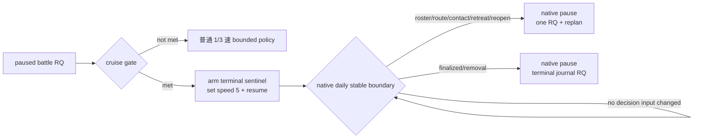

# 战斗决策时点与零中途暂停 cruise

状态：**counter-policy + research contract static-ready；native daily sentinel 与 overwhelming checkpoint live 待合并/验收**

冻结构建：CK3 `1.19.0.6`，`ck3.exe` SHA-256
`2D00FF3101EF70B566F2FCBAE292F09263199C80E9DC8F139B82D7D96F83DB86`。

本页只回答两个与 G1 吞吐直接相关的问题：

1. 已接战以后，哪些帧才是真正需要自动玩家重新判定的时点；
2. 怎样让明确碾压的战斗用 5 速从一次 paused rich query 直接跑到终局，中间不再做外部 pause/RQ。

原生逐日计算、五档速度实证与 same-day hook 的反汇编入口仍以
[battle-speed-control.md](battle-speed-control.md) 为权威；战斗帧、终局 journal 与增援分别见
[ongoing-battle-frame.md](ongoing-battle-frame.md)、
[battle-terminal-and-reentry.md](battle-terminal-and-reentry.md) 和
[battle-reinforcement-and-join.md](battle-reinforcement-and-join.md)。

## 直接结论

1. **CK3 不需要自动玩家每天发“继续战斗”。** maneuver、main、pursuit 和 finalizer 都由原生日更自动推进；当前逐日
   pause/RQ 只是我方旧事务边界。
2. **5 速零中途暂停必须是 native `run-until-terminal-or-sentinel`，不能是 Python 250 ms polling。** 现有真实战斗中
   5 速跑 33 个游戏日至 exact terminal 平均 `12.587s`，1 速平均 `76.621s`，核心终局结果在五档相同；正式逐日事务的
   实测均值却约 `4.555s/游戏日`。因此把 33 次 pause/RQ/barrier 收缩为首尾两次，收益大于单纯换速度。
   最新同 checkpoint exact-day route 五档实测又把固定往返成本量化为 speed 1 `3.184s`、speed 5 `1.381s`；五档均为
   `53220360 -> 53220384`、paused、cleanup GREEN。报告根为
   `C:\Users\xenoa\AppData\Local\Temp\xar-route-speed-matrix-82817df-state\runs`，speed 1/2/3/4/5 report SHA-256 分别为
   `9979B9A10BCAA2B1212BB13033D89B5611890411F0DB824B6AEA2E2F491E9700`、
   `DEF5511FBD514C39AB2D0FF7EB7C05E3D33D7511257CBF2B7A42D1D51B270697`、
   `8AEEC3BDB1B7EC342851881BC84835ECDF435C02CBB53A32977B820607760963`、
   `7DF10F023A8D7539DBB1F6A6F81D77754A8126CA8511213E1829F13B6A7BB79E`、
   `0200B0302937CE6DA90D648FEE9C226E248101DC34D86B4FBA831611C2190321`。
3. **真正的重新判定点不是“日期变了一天”，而是旧决定的输入失效。** 对预先选定 `hold-to-terminal` 的战斗，只有军队/
   CombatID、路线/接触、撤退、双方 roster、终局/删除、原生自动暂停或 sentinel 基础设施状态变化才要求停表。单纯
   `maneuver -> main -> pursuit` 和 winner 写入不推翻“继续到终局”，terminal mode 不应为它们暂停。
4. **第一版不等待完整 Monte Carlo。** 当前 `monte_carlo_ready=false`，但这不妨碍先用同一 paused frame 的两项真实指标
   筛选 research candidate：玩家侧 `derived_current_fighting_raw` 和 `side_strength_raw` 都至少为对侧 `4x`。这只是一个
   可实测的操作性“碾压”定义，不声称 99.5% 胜率；production 必须再经过 overwhelming checkpoint 的平衡矩阵。
5. **暂不为假设性的优势崩塌增加逐日战力遍历。** 第一版 sentinel 监视 roster/route/contact/retreat/terminal 等已证明会
   产生新决策的 epoch。只有 qualifying live battle 真实出现“roster 不变但双重 `4x` 优势崩塌、应撤未停”时，才补最小的
   native dominance-floor stop；不先支付其每日日志/遍历成本。

## 决策 epoch，而不是逐日 epoch

一次 paused battle-control frame 先决定当前动作。若动作是 hold，后续按下表处理：

| epoch | 是否暂停 | 原因与后置动作 |
|---|---|---|
| 纯日期、phase-day 或 casualty ledger 自然推进 | 否 | 没有新的玩家动作；CK3 继续原生 tick |
| `maneuver -> main` | terminal mode 否 | 已预先选择 hold；phase 变化本身不创造新动作 |
| winner 写入、`main -> pursuit` | terminal mode 否 | 胜负已定，pursuit 自动执行；直接等 finalizer |
| 双方 ordered roster count/hash 变化 | 是 | 增援/离场改变原决定输入；paused battle-control RQ 后重判 |
| watched CUnit/CombatID、route target、contact、retreat 或 reopen 变化 | 是 | 战斗身份或其它玩家军任务变化；查询对应 contact/battle/route 状态 |
| finalizer、旧 CombatID removal 或 terminal journal 事件 | 只做终局暂停 | 查询 journal，记录 exact terminal date、winner、Result/warscore 与后继状态 |
| 原生自动暂停 | 已由 CK3 暂停 | 复用现有 event/death/interaction 优先级，不再额外提交 pause |
| absolute target date | 是 | 防止异常长战无限占用；RQ 后可在条件仍成立时重新 arm |
| sentinel generation/TID/TLS/daily-count 异常 | 是/本臂 RED | 这是 primitive 未按合同运行，不能继续声称零超调 |

这使正常碾压战的时间线成为：



## 已可观察、尚缺与是否阻塞

| 输入/边界 | 当前状态 | 对第一版的意义 |
|---|---|---|
| exact CombatID、phase/day、玩家 side、ordered roster | production paused query 已有 | 直接作为 pre-arm identity 与 sentinel fingerprint |
| 双方 derived current fighting、exact native side strength | production paused query 已有 | 双重 `4x` research candidate gate；不是胜率 |
| 撤退合法性、affected owner subset | production paused query 已有 | 非 crush 时重判/撤退；crush gate 选择 hold |
| passive terminal journal、exact terminal date/result/warscore | production live 已有 | native stop 后做一次终局 RQ，不用外部轮询推断终局日 |
| public speed 1..5 | production primitive 已有 | arm 后直接用 5 速 |
| daily final-stage hook + native pause wrapper | exact-build static 入口已闭合；独立 sentinel vertical slice 待合并/live | 5 速无外部反应窗，故这是零中途暂停的唯一硬依赖 |
| 完整未来 reinforcement ETA | 未完成 | **不阻塞正确停表**：真实 join 会改变 roster 并触发 sentinel；只影响能否提前预测本臂会不会中途停 |
| full Monte Carlo / calibrated win probability | unavailable | **不阻塞第一轮 empirical gate**；影响风险分类质量，不影响五档每日计算或 terminal detection |
| overwhelming live checkpoint | 尚缺 | 阻塞 production admission；下一场满足双重 `4x` 的 paused frame 应立即冻结为矩阵 seed |

## 最小 eligibility gate

研究合同实现于
`ck3_autonomous_player/src/xar_autoplayer/simulation/battle_terminal_cruise_policy.py`，且不提交任何游戏命令。
它严格分开三层状态：

- `candidate_ready`：当前 battle-control frame 能预先选择 hold-to-terminal；
- `research_run_ready`：另有完整 watch set、speed 5 与 terminal sentinel primitive，可运行 A/B；
- `production_ready`：另有 sentinel live matrix 与 overwhelming checkpoint matrix，才允许正式 selector 使用。

候选规则按优先顺序为：

1. pursuit 且 winner 已明确：结果已定，直接 cruise 到 finalizer，不要求比例；
2. maneuver/main 且对侧 current fighting 已为零、我方仍大于零：terminal imminent；
3. maneuver/main、winner 尚未写入，且我方 `derived_current_fighting_raw >= 4 * enemy`，同时
   `side_strength_raw >= 4 * enemy`：`double_dominance_hold`。

运行前另要求：

- 同一 paused/map-ready frame 没有已经显示的 event 或 pending interaction；
- arm 的 watched CUnitIDs 与当前所有 controllable player CUnitIDs 集合完全相同；
- `set-speed-5` 与 terminal sentinel command 可用。

这里不要求所有其它玩家军静止：它们全部进入 watch set，任一 route/contact/retreat 变化由 native sentinel 当日停表。
这比为了零暂停冻结整支军团更符合 G1 的实际游玩价值。

## Native arm 与停后分派

当前 sentinel vertical slice 的计划 wire 是：

```text
research-arm-tactical-daily-sentinel-v1-
  <start_raw>-to-<absolute_target_raw>-speed-<1..5>-
  mode-<decision|terminal>-a-<count>-<public CUnit IDs...>

research-query-tactical-daily-sentinel-v1
```

terminal mode 的 bounded fingerprint 包含 watched `CUnit -> CArmy`、move target、CombatID、retreat、active combat
phase/day、winner/finalized 与双方 ordered ArmyID roster count/hash。它应忽略普通 phase/winner 变化，停在 date、army missing、
route/contact/reopen/retreat、roster、finalized/removal、native auto-pause 或 infrastructure failure。

Python/strategy 集成不能只看 ACK：

1. paused RQ 后运行 eligibility contract；
2. arm -> set speed 5 -> resume；不再提交外部 pause，也不做 rich battle query；
3. 等 native paused observation，再 query sentinel status；要求 trigger date、actual paused date、`overshoot_days=0`、
   `pause_wrapper_called/observed=true`；
4. `finalized/removal` 走 terminal journal；其它 semantic trigger 只做一次 battle/route/event RQ 并重判；
5. infrastructure RED 才由 managed cleanup 做 emergency pause/退出，不能把它算正常 intermediate pause。

### 单臂 exact post-run invariants

每个 cruise arm 必须逐项记录并通过；任一缺失都只能算 research RED：

| invariant | 必须成立 |
|---|---|
| 身份 | connection generation、episode、played character、armed speed `5`、watched CUnit set 与 pre-arm binding 一致 |
| 日期算术 | `start_date_raw` 等于 pre-arm battle date；`trigger-start = completed_daily_ticks * 24`；`last_date_raw = trigger_date_raw` |
| absolute bound | `trigger_date_raw <= target_date_raw`；date fallback 时严格相等；`signed_delta` 与上述日期算术一致 |
| native pause | 最终 snapshot `paused=true`、`map_ready=true`、observed date 等于 trigger date；`overshoot_days=0`；pause wrapper called/observed 均为 true |
| 零中途外部干预 | arm 与 native stop 之间 `external_pause_request_count=0`、`paused_rich_query_count=0`；heartbeat/轻量 status read 不冒充 RQ |
| stop 原因 | 只允许 terminal/finalized/removal、已声明的 route/contact/reopen/retreat/roster/army/native-auto-pause、absolute date 或 infrastructure RED；未知原因不继续 resume |
| terminal | pre-arm journal cursor 后存在同 CombatID event；journal exact terminal date 等于 trigger date；winner/Result/wipe/ordered sides/removal 可验证；只在 stop 后查询一次 rich terminal frame |
| semantic replan | 非 terminal stop 的新 paused RQ 必须真实重现对应变化；若重查不成立，该臂是 sentinel false-positive RED，不直接 re-arm |
| 生命周期 | CK3 受管进程树、driver、control files 与 disposable state cleanup 全绿；immutable matrix seed 的 size/SHA 不变 |

`native-auto-pause` 与 infrastructure failure 可能意味着 pause wrapper 不需要或无法正常调用；这两类要单独记录原生已经
paused/managed emergency-cleanup 的事实，不能伪造 `pause_wrapper_called=true` 来通过常规 invariant。

现有 `strategy._battle_control_transition` 只接受 `actual_elapsed_days in (1,2)`。接入多日 sentinel 时必须只对
**完成且零超调的 native sentinel result** 放宽：

- terminal/removal 由原有 `left_combat -> terminal query` 路径处理；
- 仍在同一 CombatID 的 semantic stop，允许 exact date delta 等于 sentinel 报告的 completed ticks；
- 旧外部 pause 的普通 `life-advance` 仍保留两日 envelope，不能全局删除该限制。

## 最小 live matrix

### A. Sentinel primitive

1. 同一 paused checkpoint，speed 1 的 `+1/+3` decision-date arm：每日 post hook 计数、date `+24`、主线程 pause、零超调；
2. 同一 seed 的 speed `1/3/5` decision arm：phase/roster/date trigger 均停在同一 native day；
3. terminal mode 使用已知劣势战斗 seed：允许跨 phase/winner，必须只在 roster/terminal 等 semantic reason 停；不重复逐日 RQ。

### B. Overwhelming admission

冻结第一帧同时满足双重 `4x` 的真实 paused checkpoint，平衡顺序最小为 `1,5,5,1`：

- 四臂从 size/SHA/date/history/episode 全同的 immutable checkpoint 恢复；
- speed-1 baseline 也采用 terminal sentinel，避免“逐日暂停 baseline”改变干预语义；
- speed-5 两臂 `external_intermediate_pause_count=0`；若 roster/route semantic trigger，记为正确 replan 样本而不是
  zero-pause crush 样本；
- terminal journal 的 exact terminal kind/date、player-side winner、Result/wipe、ordered sides/removal 必须有效；
- warscore/casualty 不做跨臂逐值全等，因为现有五档矩阵已经证明同一 speed 重载也会漂移；必须保留原值并与 speed-1
  同档变异范围比较，不能删字段制造 parity GREEN；
- speed 5 端到端至少比 speed 1 快 `3x`，managed cleanup 全绿。

第一次矩阵 GREEN 后只开放 `dominance_multiplier=4` 的 exact gate，不下调阈值。阈值扩展必须由新的真实 battle outcome
校准；若 qualifying battle 首次出现 roster 不变但优势崩塌/错误 hold，保留 artifact，并把 daily dominance-floor stop
作为最小修复，不回退到永久逐日暂停。

## Production selector 接线（2026-08-28）

[implementation-confirmed] `strategy.choose_one_life_turn` 现已消费显式 `battle_speed_readiness`，而不是把 DLL capability
或 composite 存在误当 live 结论。三个 gate 缺失时都按 `false` 处理：

- `decision_sentinel_live_ready=true` 且 `battle-decision-epoch-advance` 可执行时，完整全局战术审计后的 active combat
  默认选择 speed 3、`+45d` absolute fallback 的 decision epoch；
- speed 5 另要求 `terminal_sentinel_live_ready=true`、`overwhelming_matrix_live_ready=true`、
  `battle-terminal-cruise` 可执行，并且每个 distinct CombatID 都通过 `battle_terminal_cruise_policy.production_ready`；
- watched IDs 是当前全部 controllable player CUnitIDs，包括同一时刻未参战的其它玩家军；不能只看当前 battle subject；
- 每个获准的 terminal CombatID 先在同一 paused revision 做一次 journal query，冻结正数 `latest_sequence`。native stop
  后只有 cursor 后的新 event 同时证明原 CombatID、terminal date 与 attacker/defender outcome，才能接受 terminal transition；
- 任一 gate、composite、完整 watch set 或 cursor 缺失，selector 保留旧 `life-advance` speed-1 路径。

多日 transition 的放宽只识别两个 composite literal，并严格要求 `progress_status=postcondition`、零 intermediate/external
pause、零 rich query、零 overshoot、无 managed cleanup、`trigger_date_raw - starting_date_raw = completed_daily_ticks * 24`、
顶层与 nested sentinel 字段一致。普通
`life-advance` 的三日结果仍是 RED。`GameplayBridgeService` 只透传 driver capabilities 中可选的 readiness map；当前 live
矩阵未决定某个字段时不得填写 `true`。

## Readiness

本页 Python selector 已达到 `implementation-confirmed`，native/live gate 仍由各自 artifact 决定。它没有宣称 speed 3
decision epoch 或 speed 5 crush 已 production-live；readiness map 默认全 false，因此静态接线本身不会改变正式长跑速度。

升级顺序固定为：native sentinel build/tests -> speed 1/3/5 same-day live -> 第一份双重 `4x` checkpoint -> `1,5,5,1`
零中途暂停矩阵 -> production selector。完整 Monte Carlo、通用 reinforcement forecast 与更低碾压阈值都是后续质量升级，
不得再阻塞这条已由用户明确要求、且有现实吞吐证据的 G1 路径。
