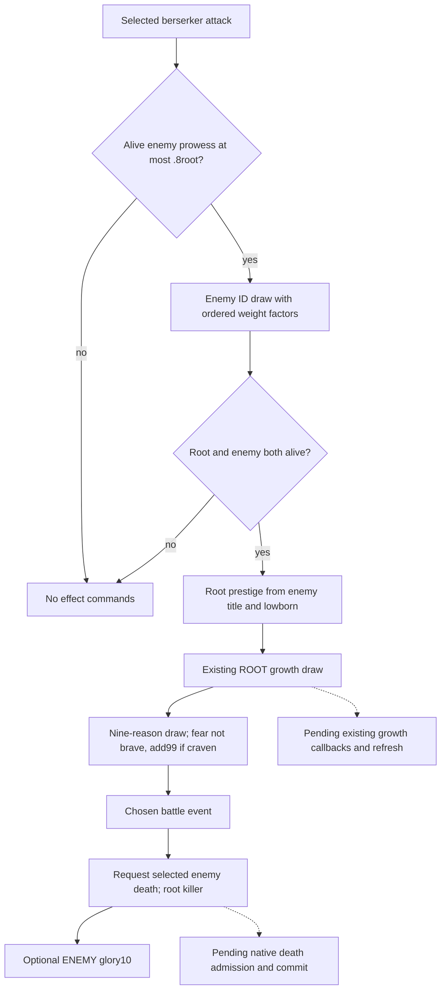
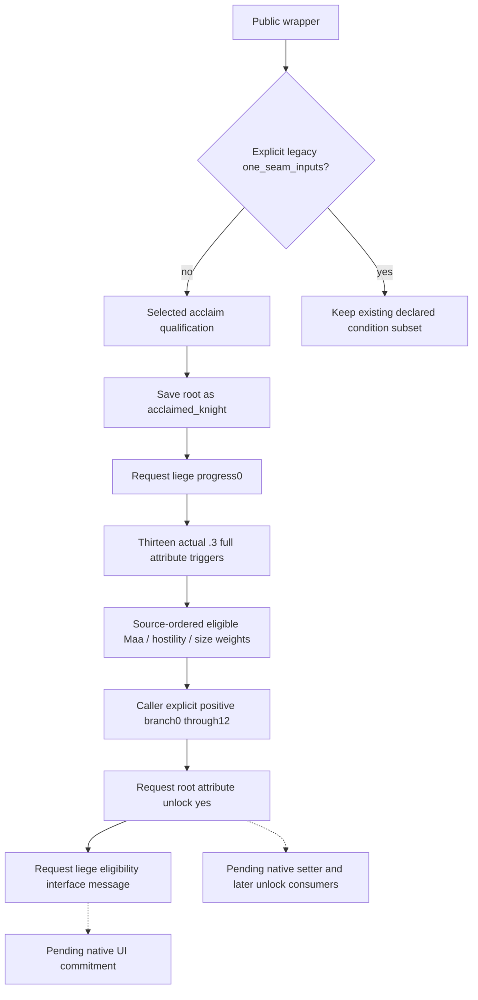

# Final selected battle effects, CK3 1.20.0.3 (2026-10-05)

Source closure covers the final two stock event rows, `knight_berserker_attack` and `knight_qualify_for_accolade`. The baseline is Root-adopted shieldmaiden commit `72f9ae8a4c924d3e11f31824bbee87c26830ee7f`, with 11 of 13 selected effects supported. The three existing producer paths are implemented and both distinct new public production cases passed on their first attempt. Selected request coverage is now13/13; native admission and refresh remain partial. This is offline work; no game, SDK, window or new campaign day was used.

The build is CK3 **1.20.0.3**, Steam **25652598**, EXE SHA-256 `94B55397ABB687A3DCD436805A5D885E6BE90FA6C693FEB44A9E3BBEEADE02A6`.

The sealed source API is [API.json](Z:/ck3_mod_rewrite_process_assets/g2-resume-20261005/battle-final-selected-effects-v80/source/API.json), SHA-256 `DE88E5F1EF68FCDA836AB3A1C880596E913D177F7DE3CDFFA05A05BFDF4E3790`. The source-first receipt is [SOURCE-FIRST-DELIVERY.json](Z:/ck3_mod_rewrite_process_assets/g2-resume-20261005/battle-final-selected-effects-v80/source/SOURCE-FIRST-DELIVERY.json), SHA-256 `34A250D5F1BA035F5DA85CECE8DDA3D690CE66FB20C5074E8416EDE6159EBD47`.

## Source scope and fields

| Input or source | Exact meaning |
| --- | --- |
| `00_knight_phase_events.txt` | Cached complete .3 official source, 41733 bytes, SHA-256 `6307140E6F0543D9C44CACF40771710032A050279B82B0074A86DF7B68E3CADF`. Berserker event lines55-182/effect131-181; qualifier event1430-1890/effect1511-1889. |
| `00_commander_effects.txt` | Cached complete .3 official source, 17093 bytes, SHA-256 `AB943C4AD0B68E2305F958A0031125EE7FA2543C47CF312C07BDBC8EAA7163F8`; berserker kill helper150-319. |
| `04_ep2_accolade_triggers.txt` | Necessary new target freeze, 36064 bytes, SHA-256 `107CFA2332BE501004BD95B66EA3311E4DD2C76128075865ACE6154BED209051`. All 13 complete attribute triggers and their underlying authored predicates are retained. |
| `02_religion_values.txt` | Necessary new target freeze, 118720 bytes, SHA-256 `9E55618B00B463589AF310BD17511B4F260FEA4D3ACB43E512E209CFC1517DED`; line8 defines `faith_evil_level = 3`. |
| Enemy filtering | Berserker both any/random selectors require alive and prowess <=0.8root. Selection and selected-scope alive guards remain separate caller inputs. |
| Qualifier MAA counts | Regiment count operands, not soldier numbers or native Q values. Existing AST arithmetic converts whole counts to Q100000 at its arithmetic boundary. Exact type exclusions and sequential arithmetic must be preserved. |
| Attribute eligibility | Truth of each complete authored trigger, or its pinned underlying leaf states; a stored unlock variable or one trait alone does not substitute for the whole trigger. |
| Owner faith scope | The fanatic helper contains optional `scope:owner.faith ?= faith`. The caller must supply the actual scope; it is not inferred as root or liege. |
| Side army size | The valiant authored comparison is own side >= enemy side times0.66. Its source comment does not reverse the operator. |

Only the two missing nested target files were read from the installation. Each buffer was copied to an external frozen cache and compared once against the already frozen .3 target hash; both matched. Existing stock caches were reused without rehashing the tree.

## Berserker request order

A qualified enemy is selected first. If root and that selected enemy are alive, the source requests root prestige derived from the enemy's title/lowborn state, the existing root growth helper, the selected kill helper's battle event followed by enemy death with root as killer, and optional enemy minimal accolade glory10. No eligible enemy or a false inner guard emits no commands; no fallback or trait addition is introduced.

| Source branch | Death reason | Weight and predicate |
| --- | --- | --- |
| 0 | `death_head_ripped_off` | 10 |
| 1 | `death_cloven_in_half` | 10 |
| 2 | `death_viciously_dismembered` | 10 |
| 3 | `death_ripped_apart_limb_by_limb` | 10 |
| 4 | `death_chopped_to_pieces` | 10 |
| 5 | `death_heart_ripped_out` | 10 |
| 6 | `death_fear` | Base1; requires selected enemy not brave; adds99 when that enemy is craven. |
| 7 | `death_skull_cracked_open` | 10 |
| 8 | `death_strangled_with_own_intestines` | 10 |

The helper battle events run in matching source order from `berserker_rage_killed_enemy_no_trait` through `_v9`. Caller-supplied selections consume enemy identity, root growth branch and the nine-branch kill helper in that order; they are not native random draws.

## Complete accolade request effect

The full effect saves root as `acclaimed_knight`, requests `liege.accolade_progress = 0`, chooses one positive source branch, requests the matching root attribute unlock, and requests the liege interface message. The 13 branches are skirmisher, archer, crossbowmen, pike, vanguard, outrider, lancer, camelry, elephantry, horse_archer, gunpowder, fanatic and valiant, in that order. Bases are10 except valiant50. The first eleven multiply by the applicable MAA regiment count; fanatic and valiant multiply by total regiment count/2.

Archer counts subtract crossbowmen, shenbigong and accolade crossbowers in source order; the crossbow branch sums those exact counts. Per-branch any-type predicates do not gain an extra count>0 test; that check belongs to event validity. Qualifier validity includes genuine MAA presence, `can_be_acclaimed` and prowess>=8. Fanatic uses enemy-participant faith hostility>=3; gunpowder learning eligibility aliases to12. Trigger bodies retain their optional-scope, trait XP, culture, innovation and category predicates. The public full-effect request route still depends on actual caller scope, regiment counts and complete trigger truths; source closure does not claim native observation of every operand.

The unchanged public wrapper previously always sent the qualifier key to a condition-only seam. The necessary minimal routing change preserves that legacy seam when `one_seam_inputs` is explicitly provided and dispatches to the existing full selected interpreter otherwise. Pending/ready classification uses the actual result's `condition_feedback_ready`, rather than exempting every qualifier request by key.

## Request and commitment boundary

Selected branch, emitted request, observed queue admission and actual native commitment are separate facts. Pending requests do not mutate current person state, traits, roster, battle Entries, backing components or native draws. No death, growth, accolade variable, message delivery or refresh is declared committed from interpreter output alone. Native callback/admission and refresh remain an explicit partial branch.

## Authored source trees

The qualifier's source prefix precedes its random choice. If no positive branch is established, keep only known requested prefix and unresolved choice; do not fabricate selection or RNG. The public route distinction is an approved minimal implementation dependency, not a new gate. Native callbacks, original RNG and production-loop readiness remain outside the closed authored trees.

## Implementation and the two new public cases

The patch changes only the existing interpreter, its stock JSON manifest, and the approved minimal public feedback-wrapper route, together with this new topic. The interpreter uses transition version `ck3-1.20.0.3-caller-selected-primary-and-requested-effects-v6`; its extended canonical manifest hash is `974AABDC003066335F14A376B128AF55AA2CAB8E121F998CB3EB586A0E595952`.

| New public production case | First-attempt result |
| --- | --- |
| Berserker attack |19 explicit `require` checks, one public-wrapper invocation. Caller enemy/root-growth0/reason6 selects fear with enemy brave=false/craven=true. Nine helper weights retain source order, fear has effective100Q. Four ordered requests: root prestige, selected v7 battle event, enemy `death_fear` with root killer, optional enemy glory10. |
| Full acclaim qualification |18 explicit `require` checks, one public-wrapper invocation. `one_seam_inputs=None` reaches the generic full selected global12 effect, not the legacy condition subset. Archer branch1 consumes the source arithmetic, with effective10Q, and emits three requests in order: liege progress0, root archer unlock yes, liege eligibility message. |

The sole runner used Python `-B -O` and `require`, so its 37 explicit checks do not depend on Python assertion optimization. There were two distinct new cases and two total public-wrapper invocations, both FIRST GREEN, with no failure, retry, old case or mirrored duplicate test run. Current person, trait, roster, Entry, backing and draw state remained unchanged. Native queue admission and commitment were false; both cases stopped with the pending callback gap before main damage.

These are **static-ready, production-path offline fixtures**. They are not fixture-live, production-live, native RNG sampling, all-reason runtime coverage, a complete event-commit model, full future battle fidelity, Monte Carlo or victory odds. Root owns review/application/commit/push; no child SDK, RPM, pipe, game, window, Git, shared edit, full build or campaign day was used.

Evidence: [source receipt](Z:/ck3_mod_rewrite_process_assets/g2-resume-20261005/battle-final-selected-effects-v80/source/ROOT-DELIVERY.json), [frozen implementation receipt](Z:/ck3_mod_rewrite_process_assets/g2-resume-20261005/battle-final-selected-effects-v80/implementation/ROOT-DELIVERY.json), [sole two-case receipt](Z:/ck3_mod_rewrite_process_assets/g2-resume-20261005/battle-final-selected-effects-v80/fixture/ROOT-DELIVERY.json), and [Oct5/W41 fields](Z:/ck3_mod_rewrite_process_assets/g2-resume-20261005/battle-final-selected-effects-v80/ROOT-DAY-WEEK-FIELDS.json). The bounded next dependency is actual admitted native callback identity/order and variable/death/growth commitment followed by authoritative refresh; these requests alone do not supply those observations.
