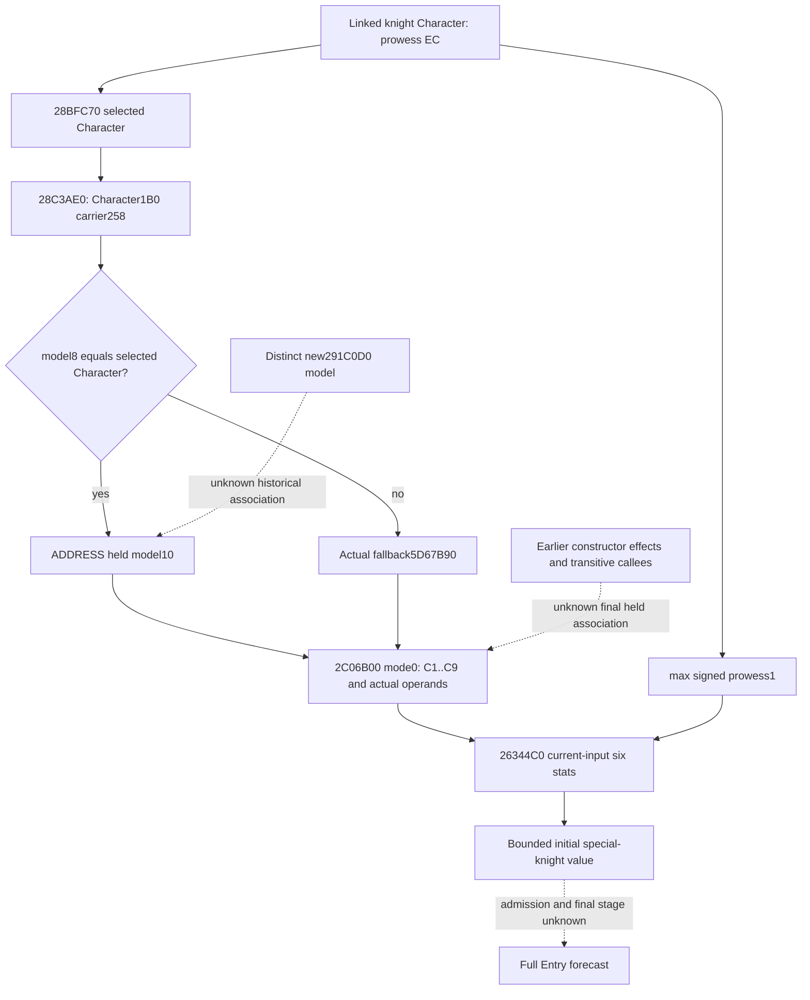
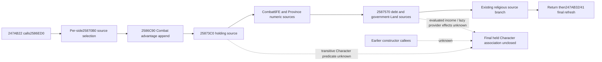

# First-contact held Character context and independent knight value (.3)

This is source research for CK3 1.20.0.3 / Steam build 25652598. The frozen EXE
is `artifacts/migrations/2026-10-02/installed-build/binaries/ck3.exe`, with the
previously recorded SHA-256
`94B55397ABB687A3DCD436805A5D885E6BE90FA6C693FEB44A9E3BBEEADE02A6`.
No game operation, native callback, whole-file hash, or whole-file scan was used.
Research was sealed on 2026-10-06 before the dedicated pure consumer was added.

The immediate useful result is a current-input special-knight stat calculation.
Its inputs already exist in `combat_v3.armies[].knights`. A historical person
baseline is unnecessary for this bounded calculation. Complete first-contact
admission, constructor final inputs, full person preparation, and full Entry
forecast remain separate capabilities.

## Actual context identity

`28BFC70` returns a **Character**, not a modifier model. A landed Character selects
the valid related Character through `+1C0 -> +1C0 -> +28`, otherwise self; the
unlanded branch resolves the employer ID at the `+1B8` carrier. `2C06D30` reads
linked-knight prowess at `+EC`, applies the lower bound one, and uses that selected
Character for `2C06B00`. Linked and selected Character full IDs can differ.

`2C06B00` obtains the selected Character's modifier receiver through `28C3AE0`:
Character `+1B0 -> carrier+258 -> model`. If `model+8` is the selected Character,
the returned receiver is the **address** `model+10`; otherwise the receiver is
the actual fallback at `5D67B90`. A cold fallback is not invented as zero.
Mode zero reads the sparse aggregate at receiver `+68`, keys `C1..C9` in order.
The operands are `Q`, selected carrier `+350`, selected carrier `+358`, then
signed selected Character skill fields `EC,D8,E4,E8,DC,E0` multiplied by Q.
An absent selected `+1C0` carrier contributes real zero for the two carrier
operands. `2C4D680` uses signed maximum decomposition on its large-product branch.

`CurrentRawNumericInputs` in the production native battle reader uses the same
physical matching-owner branch and emits `context_source="model_inline"` with
the actual aggregate and weighted rows. Thus, inside an explicitly supplied
current sample, matching selected full ID and a `model_inline` person row
identify this current held model. The existing census records model presence,
owner presence, owner full ID, and owner match. No new descriptor observer is
needed to identify this branch. Separate requests do not become one native
sample merely because their full IDs match.

The paired preparation path copies the old owner into a **different new model**
and calls `291C0D0` with that new model. Equal owner IDs do not prove that this
new model is the held `carrier+258` model. No current final context is used as a
historical prior, and held-current `291F260` weights retain that scope.

## Last named constructor source stage

The cached full `2586ED0` body is `[2586ED0,25870A1)`, 465 bytes, SHA-256
`f6775f254e57860f5dc6d442f2dc4ea0d04e3d7c6ab107d628024b28b89e0c28`.
It is called at `247AB22`; `247AB1F` is RCX setup. After it returns, the caller
loads Combat Province `+6B8` and reaches final side refresh at `247AB32/41`
without another preparation, selector, or rebuild instruction in that interval.
This does not establish held Character stability over the whole constructor.

The following three immediate source helpers were closed with bounded seeks
and their chained `.pdata`/unwind pieces. Logical function extents are complete;
arbitrary transitive callbacks were not audited.

| Native order | Helper and logical extent | Actual numeric/storage role |
| --- | --- | --- |
| Per side, call `2586EFB` | `25870B0..25873BC`, 780 B | Resolve the side's Army IDs and Regiment IDs, admit ordinary regiments or the special first-row qualifier, sum signed Regiment `+38` counts, classify Army `+180` supply against loaded thresholds, and return loaded rule `F20/F30/F40` according to low/next counts versus half the total. Normal body writes stack only; the caller appends the returned nonzero `+40` source. |
| Call `2586F2A` | `25873C0..2587563`, 419 B | Resolve first defender Army/Unit/owner and evaluate `2C09D30(owner, Combat Province)`. On true, write **Combat+6FE=1**, then evaluate Province ordinals `1EB` and conditional `1D6`; a positive wrapped sum appends loaded rule `F10` on side one. Province getters have a Province receiver, not the selected Character model. |
| Call `2586FC2` | `2587570..258792A`, 954 B | For each side's first Army owner, mode-zero `2BCA620` selects a provider/fallback PC. Government bit29 then living-first selected Land and negative Land `+318` demand mode-three `2BCA620`. Admitted ObDG `+40` PCs append at Q. All selection branches and source occurrences remain native-ordered. |

`25873C0` has no direct selected-Character/model write. Its Character predicate,
lazy rules/provider initialization, and income evaluation remain transitive
dependencies; their absence from direct body stores is not a no-mutation proof.
Negative income values retain the existing precise evaluated accounting gap.
The already closed religious branch and `2586C90` Combat advantage append were
reused, not recaptured. The append storage is distinct from Character context.

## Existing query inputs and minimum consumer

The native query already publishes the required positive numeric source. The
production `combat_contract` normalizer accepts a selected Character full ID,
exact modifier indices `193..201`, nine signed Q64 modifiers and operands,
plus linked member identity/prowess and loaded signed damage/toughness multipliers.
The selected-context diagnostic can be unavailable while the independently
observed scalar and Province-evaluated stats remain available.

The existing `knight_inputs_from_current_observation_12003` and
`compute_knight_stat_cache_at_stage_12003` implement the exact sparse arithmetic.
The older current-entry association calculates from the observed scalar instead
and does not provide this raw-input batch value. The minimum addition is a
dedicated pure consumer of a **normalized combat query**, retaining Army/member
order, per-member numeric readiness, computed six-cache values, actual observed
scalar/stats, and diagnostic comparisons. It reuses those two functions and
adds no native field or new arithmetic kernel.

Required bridge parameters are already available: Army full ID, member Regiment
full ID, linked Character full ID and signed prowess, selected Character full ID,
`modifier_raw[9]`, `operand_raw[9]`, `loaded_damage_multiplier`, and
`loaded_toughness_multiplier`. Target Province is provenance for this special
branch, not an arithmetic operand. Unavailable raw context must retain the
first exact missing operand/selected identity while preserving observed values.

The result is `frozen_current_character_values` projected to a caller-conditioned
initial special-knight cache. It does not write an Entry, predict Army admission,
invent future occupants, or declare these inputs held across `2586ED0`.

## Frozen fixture and evidence

One new compound consumer fixture should use the real production normalizer
and existing stat kernel with a nonempty selected C1..C9 array, distinct linked
and selected Character IDs, signed values, nonzero and zero operands, loaded
multipliers, and observed stats different from the computed estimate. A second
member with unavailable raw context must preserve its current scalar/stats and
not erase the first member's ready value. No old producer or kernel test is rerun.

A later native identity fixture can hold model A at selected carrier `+258` and
place a different preparation model B with the same owner but different keys.
The actual getter must read A; the fixture must not infer B from owner equality.
An actual initialized nonempty fallback is a separate valid branch. This is a
fixture proposal, not a new native implementation or a completed constructor test.

External packet:
`Z:/ck3_mod_rewrite_process_assets/g2-background-round4-20261005/person-stage-chain/entry-held-association/`.
`SOURCE-PINS.json` pins every new cached binary and the assembled logical helpers;
`READ-COST.json` records 2,681 physical EXE bytes read: 2,153 code, 360 `.pdata`,
164 saved unwind bytes, and four duplicate unwind bytes before harness failure.
Of the code, 189 bytes `[25874A6,2587563)` repeat the previously closed holding
tail and receive **zero new source credit**. New unique code credit is 1,964 B;
code plus metadata credit is 2,488 B. The failed exclusive metadata write is
preserved under `capture-025873C0-complete/FAILED-ATTEMPT.json`; the corrected
continuation reuses that attempt's saved pieces. No capability RED was inferred.

Related contracts: [final stat refresh](battle-first-contact-final-stat-refresh-12003.md),
[constructor religion sources](combat-constructor-religion-sources-12003.md),
[retained current rules](battle-retained-current-rule-contributions-12003.md),
and [person stage chain](battle-person-stage-chain-12003.md).

## Delivered bounded consumer

`simulation/battle_current_special_knight_value_12003.py` exposes
`estimate_current_special_knight_initial_stats_12003(normalized_combat_inputs,
source_provenance=...) -> dict`. It consumes the existing `armies[].knights`
leaf directly. No production normalizer, arithmetic kernel, native collector,
service, or runtime source was changed in the initial `038ddba7` delivery.

The result preserves member/Army identities and order, the actual selected
Character full ID and `frozen_current_character_values` stage, per-member missing
numeric fields, raw-backed effectiveness and all six initial cache fields,
the independent current scalar/stats, and diagnostic equality comparisons.
`all_observed_member_inputs_ready` is strictly this bounded numeric readiness.
Ready-member role sums explicitly count partial members and do not forecast
admission or native aggregate behavior. Known empty rosters have zero observed
members; they are not presented as a positive nonempty-value demonstration.

One new compound case passed once at **2026-10-06 07:10:17 Asia/Shanghai**, 1/1,
0.035 s, through the actual full production combat normalizer at source
`586db26b019ec5010fa9f8841999e2ec6520bec4` and the existing exact knight kernel.
The nonempty selected Character is 29829, distinct from linked IDs 56513/56514.
The computed effectiveness is 173100; the first knight's damage/toughness are
8655000/1731000 and the second's are 60585000/12117000. Both can qualify together.
Missing raw context and a separately missing loaded coefficient retain precise
gaps and independent ready values. Signed terms and zero-operand lookup skips
are exercised; the original source observation is preserved.

Receipt: `entry-held-association/CURRENT-VALUE-ATTEMPT-01.json`. No old case,
sibling producer case, native target, or game operation ran. This consumer is
**static-ready**. It can be attached to the existing combat-query response in
the next ordinary source package; the subsequent service attachment is recorded
below. This child does not hot-edit the active runtime.
It leaves full Entry/person readiness false. The first missing value when this
slice is partial is an existing `effectiveness_context.operand_raw[i]`, selected
Character identity, sparse modifier, or loaded multiplier, not a new descriptor.

## V3 query return attachment

`GameplayBridgeService.query_combat_simulation_inputs_v3` now returns
`current_special_knight_initial_value`. The V3 normalizer's wrapper contains
the already normalized Army/knight leaf at `normalized["base_inputs"]`; that
exact leaf is passed to the existing consumer. V1 is unchanged.

The derived JSON includes provenance for the actual V3 query sequence, public
revision, native revision, snapshot ID, raw date, pause state, backend, and hello
game version/EXE SHA. This is an additional returned value; no native, driver,
schema, policy, status, completeness, fidelity, or forecast readiness field changes.

One necessary new service-route case passed on its **first execution** at
**2026-10-06 07:20:15 Asia/Shanghai**, 1/1, 0.183 s. It uses the existing production
V3 fixture builder and invokes the actual service method with a fake backend.
The backend payload has no preattached derived value. The returned result has
nonempty ready member values and preserves all original forecast flags.
Public revision four and native revision five remain distinct in its provenance.
Receipt: `entry-held-association/V3-SERVICE-ATTEMPT-02.json`.

Attempt 01 was import-only **harness RED**, before any case ran: the worktree
test process lacked the `ck3_workshop_mcp` compatibility registry import path
required by existing environment imports. The external runner adds the existing
Root registry source path; production dependencies were unchanged. The failed
attempt is preserved as JSON/text. The previous numeric compound and all old or
sibling tests were not rerun. No native build or game operation ran.

## Fresh strict self-ransom and independent Diac qualified at source715（2026-10-06T07:52:08+08:00）

Existing current-knight pure038 first.035398 and V3route2fc first.183162 are qualified independent current-value outputs; source715 strict freezes the integrated route, with no additionalknight testcase/nativeproducer/live or forecast promotion.

R0047正常SDK/native exit0后，**R0048／v74／g79 source715517be** 于23:39:37UTC经本机Operator GREEN后正常启动，job480e5d18-ac10-4ab1-a269-eb1e7c550f95／新CK3 PID4692。以完整h9537十条输入、原opaque save SHA c97831a4f591b3cc2a0ecc40cc73b1c643a4cee1de789d7f4fa03601b1d08db4续接，不重开campaign或seed。官方prepare/stage/rebind/no-launch preflight都GREEN；新environment SHAe1cd27c30e42cdcf38e75cddf650bef3927517473e4f7f92726a38cc2e1492bb，rebind后driver SHA0cbe2117a238419235b9a83763cd1242cc1f5c0180f8622ee03e4e2159761939来自正式receipt，不借用旧7130。标准新run budget21600s；旧R0047的08:05截止不是新run或用户全局截止。cached hello session_generation0／connection_generation1按实际保留，旧gen2不投影为当前。首次751加载中actor/episode null，第二次752实paused **P3/N2/raw53286360/Robert29829 alive/原episode**，独立755另确认已任命Steward32440／skill11／vacantfalse／readytrue在冷恢复后仍存在；未授task或收入效益。

**真实received self-ransom有限production-live loop完成**：753 named current_gold_value读取 pending1107296271／actor=prisoner70766／jailer29829／current_gold index3，实际 **56gold（5600000raw，scale100000）**；context global semantics仍false，ordinary quote readytrue。754当前完整4人collection经新record hook进入真正driver history，757现有registered planner选pending_received_ransom_ordinary_gold_accept；758既有auto_turn只接受一次。759–761独立后态 **P4/N3/同rawdate且paused**：玩家gold **77117044→82717044（+5600000／+56gold）**，complete collection **[54235,56063,61540,70766]→[54235,56063,61540]**，pendingnull。ACK只算submitted，付款/离开玩家custody信用来自独立gold和完整collection；不声称已观察70766的新jailer、所有effect或native最优political价值。首次真实当前报价与后置结果不是37gold合成fixture。

762正常保存 **h9543／5918日/raw53286360**，104224054B／SHA **99e340844b50d54eb125be6663eccc2a4b00bf931332bb04a02357426913ee79**，交易结果及完整history共同冻结。物理保存见 [immutable checkpoint receipt](Z:/ck3_mod_rewrite_process_assets/g2-resume-20261006/checkpoints/self-ransom-70766-56gold-v74/checkpoint-receipt.json)；complete matching driver123708890B／SHA53a6078dc01bc420381bb61ae8d1369378b7a5bd2acc975e8a8e0ffc79c03d1d只copy/hash一次，原failed attempts/command history保留。此交易cutoff不增加游戏日：resume883／cumulative-resume2765、natural0、G2 5/8、NW2 2/4不变。之后770现有planner已经执行1次declarable＋3次战略power查询且正常保存h9549，同日无宣战或推进；下一24-turn batch正在继续，新增faction-read phase使用已有typed查询，后续结果另记，不能回授本cutoff。完整实机小回执、独立结果和driver pin在 [FINAL-LIVE-RESULT](Z:/ck3_mod_rewrite_process_assets/g2-runtime-next-20261006/actual-self-ransom-70766-56gold/FINAL-LIVE-RESULT.json)。

实机准备另保留Steam黑屏/置前RED及首次重开暂无可见窗口。Root正常steam.exe -shutdown exit0→同账号 -cef-disable-gpu→官方 steam://open/library→fresh08新HWND3082894/PID44240原图SHA545F7EB08CFA16F468ADECB338A115A13414C282E4361B4DC93A0C2D516CB8E5/1037741B，23:38:48UTC亲自读到离线模式与7:38 clock；未切在线，未操作OBS114680或重启ToDesk41260，单一rootcause未隔离。保存wrong-tool750 HARNESS RED（没有游戏查询/action，改为advertised take_snapshot）以及archive首次缺receipts目录RED（0copy/0driver/0seal，补父目录后继续，零重做交易），[FREEZE-LIVE-ATTEMPT-01-RED](Z:/ck3_mod_rewrite_process_assets/g2-runtime-next-20261006/FREEZE-LIVE-ATTEMPT-01-RED.json)与旧失败均保留。整体仍partial生产loop；fullperson/Entry/forecast/完整战斗与natural succession未完成。

[self-ransom97 contribution33](Z:/ck3_mod_rewrite_process_assets/g2-background-20261006/pending-self-ransom-720/QUALIFICATION-RECEIPT.json); [self-ransom policy/ingestion fields](Z:/ck3_mod_rewrite_process_assets/g2-background-20261006/pending-self-ransom-720/REPORT-FIELDS.md); [Diac8/64 final](Z:/ck3_mod_rewrite_process_assets/g2-background-round4-20261005/person-tail/following2920d60-source/nonempty-numeric/FINAL-COMPILED-QUALIFICATION.json); [Diac day/week](Z:/ck3_mod_rewrite_process_assets/g2-background-round4-20261005/person-tail/following2920d60-source/nonempty-numeric/FINAL-COMPILED-OCT6-W41-FIELDS.json); [current knight source/pure](Z:/ck3_mod_rewrite_process_assets/g2-background-round4-20261005/person-stage-chain/entry-held-association/ROOT-DELIVERY.json); [V3 service route](Z:/ck3_mod_rewrite_process_assets/g2-background-round4-20261005/person-stage-chain/entry-held-association/SERVICE-ROOT-DELIVERY.json)；[frozen qualification seal](Z:/ck3_mod_rewrite_process_assets/g2-background-round4-20261005/source715517be-self-ransom-diac-strict-native-artifacts/FINAL-COMPILED-QUALIFICATION.json)。
