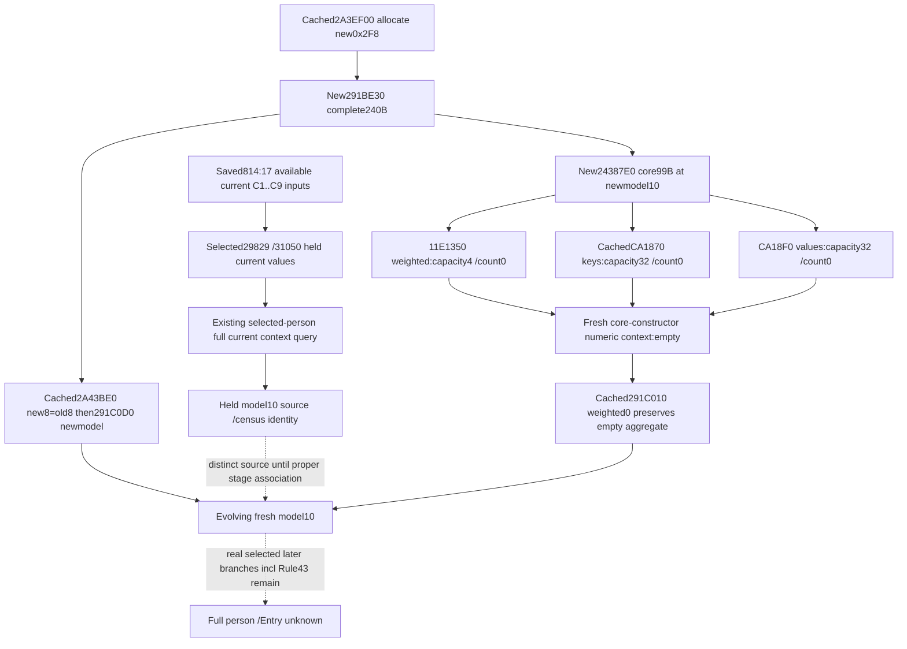
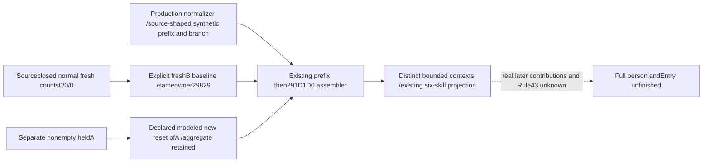

# Entry model quality: saved814 and fresh paired-model initialization (.3)

Source-first increments, 2026-10-06 / W41. The exact frozen build is CK3 1.20.0.3,
Steam25652598, with reused EXE SHA-256
`94B55397ABB687A3DCD436805A5D885E6BE90FA6C693FEB44A9E3BBEEADE02A6`.
The source packages performed no game/MCP query, native build, test, callback
execution or shared runtime edit. A later single new production consumer case
is qualified below. The source target was selected from actual saved inputs,
not to complete a field catalogue.

## Actual saved input and useful next query

Only the relevant constructor/knight fields were extracted from
`Z:/ck3_mod_rewrite_process_assets/g2-resume-20261006/gameplay-responses/814-war100663329-combat-v2.json`.
Artifact SHA-256 is `bd450008f92866d89fa939090043059840429c9f384ff2aaac8d7e5d218865a7`.
Its result is available with base input observation ready. All **17** knight
`effectiveness_context` leaves are available: thirteen select Character29829
and four select Character31050. Both Army leaves publish loaded multipliers
50/10. For29829, C1 is75000 and the remaining eight modifiers are zero; the
observed effectiveness is175000. The existing current-input special-knight
consumer already accepts these numeric inputs; it was not rerun here.

Saved coordinates are public revision32, native revision31, snapshot `native:31`,
date53288232, paused true, query sequence1. Returned hello version/EXE SHA are
null. The artifact is not relabeled with an invented hello identity, a present
revision, or a hypothetical construction stage.

814 does not publish either selected Character's complete current model context
or a fresh paired-model baseline. The historical minimum **existing** query
recipe for a separately authorized paused sample was:

```text
ck3_query_battle_terminal_transition_v1(
  prior_combat_id=null,
  subject_public_cunit_id=null,
  expected_revision=<that sample's current public revision>,
  character_ids=[29829,31050])
```

This child did not issue that query. Inspect each requested row's
`current_person_state.raw_numeric_inputs`: Character full ID, scratch presence,
`context_source`, and complete context weighted rows and key/value arrays.
The existing current source census also exposes model presence, owner presence,
owner full ID, owner match, and model magic. Match current getter provenance
with the selected Character and `model_inline` branch. Keep the query's own
public/native revision/date; a separate request is not an atomic part of814.
The user's latest instruction prohibits local CK3/Steam/SDK/UI connection or
operation. This recipe is retained as an unvalidated interface record, not local
execution authorization; arrangements on other machines are separate.

Root subsequently attempted this recipe as844. It failed before delivering the
requested contexts: `executor_exception3221225477` (`0xC0000005`), bridge
RVA`66B8AC`, `waitexecutor_failed`. Root's saved
`gameplay-responses/844-current-fighter-model-context.json` is an error result;
the following850 request was busy. The current-context recipe therefore remains
**RED/unvalidated for this intended delivery**, and no contexts or live credit
are inferred from it. Root owns the observed driver fault and any later retry;
this child did not repeat the query or investigate the driver. Saved814's17
available numeric knight leaves remain independent evidence.

The physical current recipe is Character `+1B0 -> scratch+258 -> model`, with
owner at model `+8`. Matching owner selects **ADDRESS model+10**. Weighted rows
are model `+10/+1C`, 16-byte occurrences; aggregate keys are model `+78/+84`
and signed Q64 values are model `+E0/+EC`. This existing query can release the
actual full held source used by `291F260` and distinguish a held context from
the C1..C9 projection. It must not rename that full current context as a
historical preprefix baseline or as the distinct new construction model.

## One bounded fresh-model initializer chain

The cached v75 `2A3EF00` allocates a0x2F8 object, calls **291BE30**, and appends
an allocator/newmodel pair. The cached serial binding `2A43BE0` selects that
new model and old `primary98` model, writes `newmodel8=oldmodel8`, then invokes
`291C0D0(newmodel)`. Neither source directly assigns Character carrier258.
The cached `291CF50` transfers paired state later; its generic storage helpers
were not expanded for this task. Owner equality alone still cannot replace
held old model inputs with the evolving new model.

The previously unread **291BE30** is now captured as the complete
`[291BE30,291BF20)` body, **240 B**, normal return291BF1F. It:

1. Installs its fixed vptr and initial owner from the static QWORD source.
2. At291BE63 calls **24387E0 with RCX=ADDRESS newmodel+10**.
3. Constructs separate allocator/owned-container storage at model240/248.
4. Writes model2F0 magic43684D64 and pending byte2F4=0, then returns the model.

The necessary direct numerical helper **24387E0** is complete
`[24387E0,2438843)`, **99 B**, normal return2438842. Its exact ordered demands
are `11E1350(context)`, `CA1870(context+68 keys)`, and
`CA18F0(context+D0 values)`. Its direct zero stores concern other context fields;
they do **not** substitute for weighted/key/value header constructor results.
The core initialization stage is now tied to an actual model address and real
constructor calls; numerical emptiness is not inferred from pending0 or magic.



## Initialized numerical header postimages

The source-only follow-up closes the three directly demanded numeric headers on
**normal constructor return**. It adds complete11E1350`[11E1350,11E13CF)`127 B
and CA18F0`[CA18F0,CA1972)`130 B, reuses cachedCA1870`[CA1870,CA18EF)`127 B,
and resolves exactly their actual static slots10/20. Their fixed vptr producers
and target pointer bytes establish this table without a vtable catalogue:

| Header | Constructor / fixed vptr RVA | Static slot10 RVA / target | Static slot20 RVA / target | Final data / capacity / count |
|---|---|---|---|---|
| Weighted at model10 |11E1350 /45333E8|45333F8 /855830|4533408 /896B80|model30 /4 /0 at model1C|
| Keys at model78 |CA1870 /44DEF18|44DEF28 /855830|44DEF38 /86E150|model98 /32 /0 at model84|
| Values at modelE0 |CA18F0 /44DEF60|44DEF70 /855830|44DEF80 /86E150|model100 /32 /0 at modelEC|

Each constructor follows the same relevant order:

1. Install the embedded allocator vptr and its auxiliary source; initialize the
   header data, capacity and count to zero.
2. Call slot10 with `RCX=header+18`, `RDX=0`, `R8D=2` for keys or8 for the other
   two headers. Its actual shared wrapper855830`[855830,85586A)`58 B contains no
   direct header writes. It performs its release/delegation calls; this package
   does not execute them or expand global allocator implementation. The result
   below is the **normal return path**, after that call has returned.
3. Unconditionally write data0 and **QWORD[header+8]=0** again immediately before
   slot20. This clears both the capacity DWORD+8 and count DWORD+C after slot10.
   Exact stores are11E13AA/11E13B0, CA18CA/CA18D0 andCA194D/CA1953.
4. Call slot20 with `RCX=header+18`, `RDX=header`, `R8=&header+8`. The key/value
   leaf86E150 writes `QWORD[RDX]=RCX+8` and **DWORD[R8]=32**, then returns.
   The weighted leaf896B80 writes the same data pointer and **DWORD[R8]=4**,
   then returns. Both complete leaves are15 B. Neither writes `[R8+4]`, the count.
5. Return the header with count0. The final data pointer is its **inline buffer**;
   a nonnull data pointer and positive capacity therefore do not imply entries.

This closes the normal initialized logical context at
`post24387E0_fresh_context`: weighted occurrences`[]`, uint16 keys`[]`, signed
Q64 values`[]`, all three count DWORDs0. It is not inferred from a pending byte,
owner match, allocator name, or pre-callback zero store. No unused buffer bytes
need reading or initializing for this numerical projection.

## Minimum usable fresh-baseline interface

Retain Character full ID, the **distinct construction model** identity/address,
the actual copied owner from cached2A43BE0, and constructor source provenance.
This source result supplies entering numeric counts **(0,0,0)** and an empty
logical context for a deliberately constructed fresh model. Cached291C010 tests
the weighted count first; its zero branch preserves the aggregate. Here those
aggregate counts are independently proved zero, so the fresh logical projection
at `post_291C010_pre_prefix` is empty. This is the new-construction modeled path,
not an observation of an older model's historical baseline. Physical cleanup
success and later transfer/selection are separate source boundaries.

The existing `PersonStageStartBaseline12003` interface in
`battle_trait_materialized_prefix_12003.py` can express that path with
`stage="post_291C010_pre_prefix"`, `kind="modeled_new_reset"`,
`entering_counts=(0,0,0)`, empty context, and the exact construction provenance.
No new DTO, native callback or arithmetic system is needed. An old held model
with weighted0/nonempty aggregate must still supply its actual retained arrays;
these new-construction counts do not override that existing branch.

The proposed distinct-model fixture was implemented after the source seal.
It uses held model A with nonempty values and distinct fresh model B for the
same Character. B receives the source-closed entering counts(0,0,0), then the
real production-normalized provider prefix and existing branch fold. A remains
the separately supplied held source; a separately declared modeled new reset
of A exercises weighted0/nonempty aggregate retention. It is not B's prior or
a claim about a historical preparation frame. No Rule43 admission, cold callback
result or whole Entry equivalence is fabricated.

## First independent production consumer fixture

The existing interface already provides the complete bounded value path; no
production glue was missing and no consumer, forecast, native/schema or Entry
readiness code changed. The new unique test is
`ck3_autonomous_player/tests/unit/test_battle_person_fresh_constructor_baseline_12003.py`,
case `test_distinct_fresh_model_joins_normalized_prefix_branch_and_skills`.
Only earlier fixture builders are imported; their test cases were not run.

The new source-shaped synthetic frame carries nonempty held A for Character29829
and normalized current provider1530/common1A48/selected19A0 inputs plus selected
291D1D0 and positive group0/2 inputs. The existing production
`normalize_battle_terminal_transition_v1` feeds the existing assembler. Fresh B
uses `kind="modeled_new_reset"`, explicit entering(0,0,0), `context=None`,
normal constructor-return source pins, copied-owner provenance and distinct
fresh/held model identities. The actual existing empty-context projection is
used; A's current-final aggregate is not an implicit prior for B.

Seven ordered contributions, including both equal common occurrences and the
group0 weight200000, produce B's verified aggregate keys`[0,1,4,5]`, signed Q64
values`[100000,200000,300000,700000]`. The existing six-skill kernel gives
**[7,8,6,6,9,13]**. The separately modeled retained A branch gives
**[19,8,6,6,9,53]**, demonstrating the actual weighted0/retained aggregate
difference without renaming A as B's constructor baseline. Both retain the
current context and observed prowess8. Source provenance survives the assembler
ledger, and the result stops at **post291D1D0_pre291C209**.



The sole first execution was **GREEN1/1,0.219730s**,2026-10-06
**09:03:35+08:00**, W41. Receipt:
`model-quality-814/fresh-baseline-consumer/attempt-01/RESULT.json`; the plan
preceded implementation. The runner selects this exact one case and adds only
the existing local registry package import path. It invokes no registry/Steam
tools, no game/SDK/pipe query, native build or old test. The bounded source-derived
fresh-baseline consumer path is **static-ready**; this is not a new native frame,
paused observation, physical constructor execution or live capability. Terminal,
full future-context and Entry readiness remain unchanged/false.

## Receipts and boundary

External source packet is
`Z:/ck3_mod_rewrite_process_assets/g2-background-round4-20261005/person-stage-chain/model-quality-814/`.
`SOURCE-PLAN.json` preceded reads; `NECESSARY-CORE-HELPER.json` records the actual
first call that required the99 B helper. Fresh frozen EXE I/O is **627 B =339
unique code+288 exact .pdata**. The cached getter, reset, paired dispatcher,
291CF50 and CA1870 body were reused, with zero new source credit. No code spans
were duplicated and no unwind/handler, EXE header/full hash/scan, allocator
catalogue, Rule43 span, runtime field, test, or game operation was added.

The separate initialized-count follow-up lives under `initialization-counts/`.
Its `SOURCE-PLAN.json` and necessary-callee records precede the reads; final
`SOURCE-PINS.json`, `READ-COST.json`, `ORDERED-STAGE-LEDGER.json` and
`ROOT-DELIVERY.json` account for the new bytes independently. Two initial exact
`.pdata` lookups failed because86E150 and896B80 are leaf functions absent from
that table. Both **harness RED** attempts and their metadata remain saved; the
known static targets were then captured once in16 B chunks, covering each15 B
leaf plus one alignment byte. This is not a capability RED or a runtime test.
Read-only shell/path errors also remain recorded. No code body was recaptured.
The follow-up adds **1043 B** of frozen EXE I/O: **345 B unique function code**,
2 B trailing leaf alignment, **648 B exact .pdata**, and **48 B** for the six
actual8-byte static slots. Combined with the earlier627 B package, this owned
fresh-model source line totals1670 B. CachedCA1870 and all earlier caller/reset
source retain zero new source credit. No unwind, global allocator body, extra
vtable slot, whole EXE scan/hash, game query, build or test was added.

The constructor work is **research/source-closed numerical initialization** and a concrete
existing current-input query recipe whose Root delivery attempt is RED. The
fresh normal-return empty logical baseline now has exact source evidence;
current held inputs, later real gates/selected contributions, full preparation,
post-constructor held stability and complete Entry remain separate. The one new
fixture qualifies the existing bounded fresh-baseline value path as static-ready;
no new production glue or live primitive is claimed. The independent current
C1..C9 slice remains useful and available in814.
