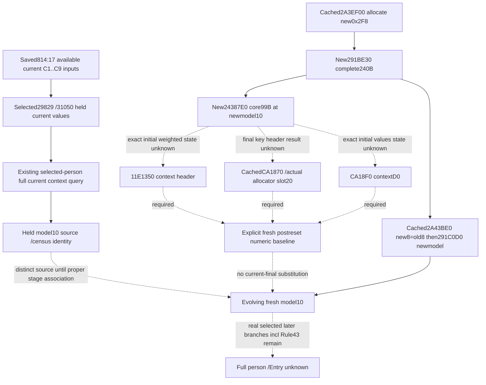

# Entry model quality: saved814 and fresh paired-model initialization (.3)

Source-only increment, 2026-10-06 / W41. The exact frozen build is CK3 1.20.0.3,
Steam25652598, with reused EXE SHA-256
`94B55397ABB687A3DCD436805A5D885E6BE90FA6C693FEB44A9E3BBEEADE02A6`.
No game/MCP query, native build, test, callback execution, or shared runtime edit
was performed. The source target was selected from actual saved inputs, not to
complete a field catalogue.

## Actual saved input and useful next query

Only the relevant constructor/knight fields were extracted from
`Z:/ck3_mod_rewrite_process_assets/g2-resume-20261006/gameplay-responses/814-war100663329-combat-v2.json`.
Artifact SHA-256 is `bd450008f92866d89fa939090043059840429c9f384ff2aaac8d7e5d218865a7`.
Its result is available with base input observation ready. All **17** knight
`effectiveness_context` leaves are available: thirteen select Character29829
and four select Character31050. Both Army leaves publish loaded multipliers
50/10. For29829, C1 is75000 and the remaining eight modifiers are zero; the
observed effectiveness is175000. The existing current-input special-knight
consumer already accepts these numeric inputs; it was not rerun here.

Saved coordinates are public revision32, native revision31, snapshot `native:31`,
date53288232, paused true, query sequence1. Returned hello version/EXE SHA are
null. The artifact is not relabeled with an invented hello identity, a present
revision, or a hypothetical construction stage.

814 does not publish either selected Character's complete current model context
or a fresh paired-model baseline. The minimum **existing** query recipe for
Root's next authorized paused sample is:

```text
ck3_query_battle_terminal_transition_v1(
  prior_combat_id=null,
  subject_public_cunit_id=null,
  expected_revision=<that sample's current public revision>,
  character_ids=[29829,31050])
```

This child did not issue that query. Inspect each requested row's
`current_person_state.raw_numeric_inputs`: Character full ID, scratch presence,
`context_source`, and complete context weighted rows and key/value arrays.
The existing current source census also exposes model presence, owner presence,
owner full ID, owner match, and model magic. Match current getter provenance
with the selected Character and `model_inline` branch. Keep the query's own
public/native revision/date; a separate request is not an atomic part of814.

The physical current recipe is Character `+1B0 -> scratch+258 -> model`, with
owner at model `+8`. Matching owner selects **ADDRESS model+10**. Weighted rows
are model `+10/+1C`, 16-byte occurrences; aggregate keys are model `+78/+84`
and signed Q64 values are model `+E0/+EC`. This existing query can release the
actual full held source used by `291F260` and distinguish a held context from
the C1..C9 projection. It must not rename that full current context as a
historical preprefix baseline or as the distinct new construction model.

## One bounded fresh-model initializer chain

The cached v75 `2A3EF00` allocates a0x2F8 object, calls **291BE30**, and appends
an allocator/newmodel pair. The cached serial binding `2A43BE0` selects that
new model and old `primary98` model, writes `newmodel8=oldmodel8`, then invokes
`291C0D0(newmodel)`. Neither source directly assigns Character carrier258.
The cached `291CF50` transfers paired state later; its generic storage helpers
were not expanded for this task. Owner equality alone still cannot replace
held old model inputs with the evolving new model.

The previously unread **291BE30** is now captured as the complete
`[291BE30,291BF20)` body, **240 B**, normal return291BF1F. It:

1. Installs its fixed vptr and initial owner from the static QWORD source.
2. At291BE63 calls **24387E0 with RCX=ADDRESS newmodel+10**.
3. Constructs separate allocator/owned-container storage at model240/248.
4. Writes model2F0 magic43684D64 and pending byte2F4=0, then returns the model.

The necessary direct numerical helper **24387E0** is complete
`[24387E0,2438843)`, **99 B**, normal return2438842. Its exact ordered demands
are `11E1350(context)`, `CA1870(context+68 keys)`, and
`CA18F0(context+D0 values)`. Its direct zero stores concern other context fields;
they do **not** substitute for weighted/key/value header constructor results.
The core initialization stage is now tied to an actual model address and real
constructor calls; numerical emptiness is not inferred from pending0 or magic.



## Exact next missing numerical producer

The minimum fresh baseline still needs actual initialized header postimages.
The next direct source entries are **11E1350** for weighted rows and **CA18F0**
for values. Their exact bodies were not recaptured in this bounded package.
The ordinary MAA owner is checking whether its fresh scratch cache already
contains11E1350; no constructor-baseline credit is borrowed from the caller name.

**CA1870** is already source-captured by the following2920B50 package. Its127 B
body was reused here, adding zero EXE reads/credit. It explicitly stores zero
data/capacity/count, then calls its embedded allocator slots10 and20. The final
numeric result remains a concrete source dependency rather than a generic
allocator audit. The fixed vptr producer atCA188D is
`nextIP CA1894 +383D684 = RVA44DEF18`. Therefore the exact two pointer locations
are **RVA44DEF28 (slot10)** and **RVA44DEF38 (slot20)**. The latter receives
`RCX=header+18`, `RDX=header`, `R8=&header+8` atCA18D4, after the final direct
zero stores. A future bounded closure can resolve only these two8-byte static
pointers and their demanded count effect. No vtable catalogue or callback was
read/executed here.

Source proof for a fresh logical baseline must retain the construction model's
address, owner copied from the selected old model, stage label, and initialized
weighted/key/value counts. If those counts are observed at the actual stage,
read only demanded arrays: weighted16 B rows, uint16 keys, and signed Q64 values.
Weighted count0 does not imply aggregate empty. Current raw model counts are
current values, not evidence of earlier initialized counts.

A future frozen fixture can use held model A with nonempty keys and a separate
new model B for the same owner, exercise the actual initialized B header state,
then pass that explicit fresh baseline through the existing prefix/branch fold.
It must retain A for held-source ranks and separately label B's evolving context.
An empty B is usable only after the real constructor result closes; no fabricated
rule43 admission, arbitrary gate boolean, or cold default emptiness is introduced.

## Receipts and boundary

External source packet is
`Z:/ck3_mod_rewrite_process_assets/g2-background-round4-20261005/person-stage-chain/model-quality-814/`.
`SOURCE-PLAN.json` preceded reads; `NECESSARY-CORE-HELPER.json` records the actual
first call that required the99 B helper. Fresh frozen EXE I/O is **627 B =339
unique code+288 exact .pdata**. The cached getter, reset, paired dispatcher,
291CF50 and CA1870 body were reused, with zero new source credit. No code spans
were duplicated and no unwind/handler, EXE header/full hash/scan, allocator
catalogue, Rule43 span, runtime field, test, or game operation was added.

This is **research** for fresh numeric initialization and a concrete existing
current-input query recipe. It does not claim a newly complete baseline,
fresh person preparation, post-constructor held stability, complete Entry,
or a new live primitive. The independent current C1..C9 slice remains useful
and available in814 while these distinct dependencies remain partial.
