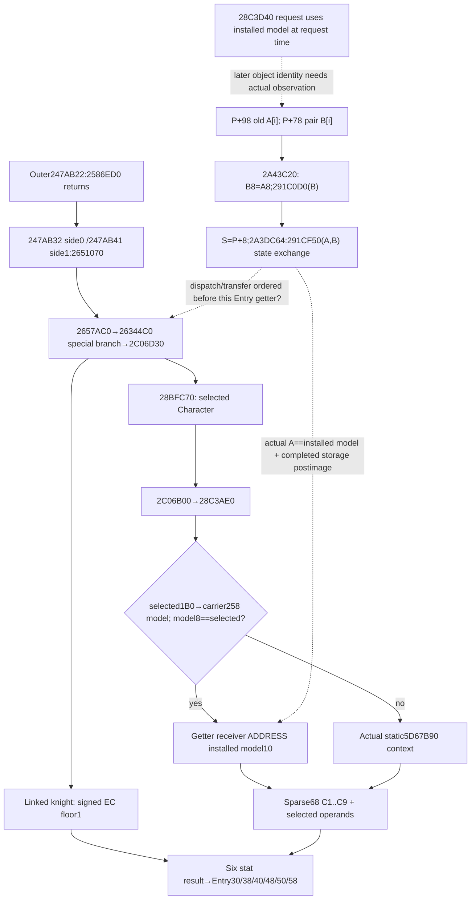

# First-contact outer caller and selected Character context association — 1.20.0.3

2026-10-06 / 2026-W41. **Research; source-only.** Frozen Steam build25652598,
EXE SHA `94B55397ABB687A3DCD436805A5D885E6BE90FA6C693FEB44A9E3BBEEADE02A6`,
reused from the existing source seals. New EXE reads, scans, hashes, tests, builds
and game operations are all **0**. This increment joins cached caller identities
and specifies an implementable observation seam; it adds no runtime capability.

`28BFC70 → 2C06B00` selects a **Character**, then reads that Character's
**installed current model's inline context** on the matching-owner branch. It
does not select the separate fresh model merely because both models have the
same owner. The later paired operation exchanges model **state**; it does not
directly install the fresh model pointer into Character carrier `+258`.

## Source-bound consumer path

The existing [selected Character topic](battle-knight-effectiveness-context-12003.md)
closes landed-related, employer and self selection in `28BFC70`. The
[held-context topic](battle-first-contact-held-context-association-12003.md)
closes the current numeric receiver and its independent frozen-current adapter.
The following is the shortest relevant first-contact consumer path, reusing the
[final refresh](battle-first-contact-final-stat-refresh-12003.md) and
[final caller assembly](battle-first-contact-final-caller-assembly-12003.md).

| Consumer | Actual object and source order |
|---|---|
| Initial new row | `264DE30 → 2653D20 → 26552C0`; `264E099 → 2657AC0`, with that incoming Army's actual current Province |
| Final outer refresh | `247AB22 → 2586ED0`; after return, `247AB32 → 2651070(Combat+20, Combat+6B8)` then `247AB41 → 2651070(Combat+368, Combat+6B8)` |
| Side enumeration | `2651070` traverses stored levy rows, then stored MAA rows, stride `0x60`; each demanded row reaches `2657AC0` |
| Six-stat getter | `2657AC0 → 26344C0`; its special-character branch reaches `2C06D30` |
| Linked versus selected Character | `2C06D30` takes signed prowess `+EC` from the linked knight Character, floored at1; `2C06D46 → 28BFC70` selects the potentially different effectiveness Character; `2C06D56 → 2C06B00` receives that returned Character, mode0 |
| Numeric receiver | Each demanded C1..C9 term in `2C06B00` obtains its receiver through `28C3AE0`; calls at `2C06B1E/2C06B6C/2C06BA8/2C06BDF/2C06C16/2C06C4D/2C06C84/2C06CBB/2C06CF2` |
| Cache destination | The six Entry cache fields are `+30/+38/+40/+48/+50/+58`. Writing them does not install or prepare a Character model |

This table records native term demand;
the existing diagnostic provider may read all nine raw keys independently of
whether a zero operand caused a native term to skip evaluation.

After `2586ED0` returns at `247AB27`, the cached outer instructions contain no
Character preparation, selection or rebuild between the two final side calls.
Earlier direct Combat advantage appends and `2650A80` side-accolade storage have
their existing sealed roles. Their receiver distinctions do not prove that all
earlier/transitive constructor work preserves selected Character model or skill
state. No whole-constructor absence-of-mutation claim is added here.

## Address equality is conditional on the actual selected object

Cached `28C3AE0` is explicit:

```text
selected = Character returned by28BFC70
carrier = QWORD[selected+1B0]
model = carrier ? QWORD[carrier+258] : null
if model != null AND QWORD[model+8] == selected:
    receiver = ADDRESS model+10
else:
    receiver = actual initialized static context RVA5D67B90
```

The owner comparison is **pointer equality to the selected Character**. This
getter has no model-magic predicate. The separate forced-refresh/request paths
do check `model+2F0=43684D64`; their additional condition must not be inserted
into the getter's own branch. The fallback's cold initialization is not an empty
context and must not be replaced by zeros.

`2C06B00` mode0 reads its sparse aggregate at `receiver+68`, with exact property
ordinals `C1..C9`. Its carrier `+350/+358` and six signed Character skill operands
also belong to the selected Character. Linked-knight prowess remains separate.

Existing `CurrentRawNumericInputs` uses the same matching-owner selection and
`ADDRESS model+10`. Thus **within one actual observation**, selected Character
identity plus `model_inline` and the same resolved model establish the current
receiver association. Matching full IDs in two separate responses do not prove
one physical native sample or a historical caller stage.

## Paired construction and transfer use separate model roles

Let `A[i]` be the queued old model and `B[i]` the fresh paired model. These names
denote source roles, not a claim that the present getter's model is either one.

| Cached source | Closed role |
|---|---|
| `2A3EF00` | Primary manager `P`; old descriptor `P+98`, pairs `P+78`, count `P+84`; allocates separate `0x2F8` objects, calls `291BE30`, appends allocator/model pairs |
| `2A43BE0` serial binding | Index `i` selects pair `B[i]` and old vector `A[i]`; `2A43C20` stores `B[i]+8 = A[i]+8`, then `2A43C91` tails `291C0D0(B[i])` |
| Fresh numeric initialization | `291BE30 → 24387E0`; normal constructor counts at `B+1C/+84/+EC` are `(0,0,0)`, independently sealed by the initialization-counts packet |
| `2A3DB50` paired prefix | Registered secondary receiver `S=P+8`. `S+90` is therefore the same primary old descriptor `P+98`; `S+70` is pairs `P+78`. `2A3DC57/DC5F` load `A[i]` and pair `B[i]`; `2A3DC64` calls `291CF50(A[i], B[i])` |
| `291CF50` | Swaps owner `+8` and pending byte `+2F4`; locks both models; exchanges weighted rows through `2439690(A+10,B+10)`, keys through `2305F50(A+78,B+78)`, values through `2306100(A+E0,B+E0)`; swaps allocator `+240`, tails owned-container `2922A30` |
| Remaining old-vector branch | After the paired prefix, `2A3DD20/DD2B` directly rebuild remaining old models via `291C0D0(A[i])`; it is a separate branch, not another fresh-pair construction |

The primary/secondary receiver adjustment closes an otherwise misleading
`+90` versus `+98` comparison. The exact swap body has no direct Character
carrier `+258` store. **If** `A[i]` is the model currently installed for the
getter's selected Character, a successful complete state exchange can make
prepared `B[i]` state visible through the existing `A[i]+10` address without
replacing that carrier pointer. That conditional is the relevant connection;
it is not a source proof of the actual object identity, storage postimage or
first-contact timing in a present game frame.

The earlier request leaf `28C3D40` does load `Character+1B0 → +258`, requires
owner pointer and model magic, and tails `2A3E220` with that model. It proves
identity **at that request**, not preservation until dispatch/transfer. The
cached `2A3FCE0` helper invoked on the old descriptor and the generic storage
exchange branches remain outside the complete association claim. No further
generic helper expansion is needed to specify the current observation seam.



## Minimum existing-query collector plan

The first useful increment belongs in existing
`ReadKnightEffectivenessContextSources` in `native_bridge/src/ck3_12002_combat.cpp`,
immediately after its selected identity and `get_character_modifier_aggregator`
result are available. Its caller already holds the linked knight, Regiment,
Army, selected effectiveness Character and returned getter receiver in **one
combat-input query**. This avoids joining a separate broad terminal-person
request just to establish current physical association.

Add an optional independent `effectiveness_context.current_model_association_v1`
leaf with the selected full Character ID, branch (`model_inline` or
`fallback_static`), carrier/model/owner presence, owner-match and
`getter_receiver_matches_model_inline`. Compare native addresses inside the
reader and serialize booleans or per-query local identity tokens. A false
comparison is a diagnostic value; an unread comparison remains missing. Use
the existing getter result and current property reader; do not run a preparation
or fallback initializer. Do not add model magic as getter admission or change
the enclosing scalar/stat readiness.

This minimal leaf binds the existing C1..C9 operands to their actual **current**
model role. A complete current raw context, when independently required for the
person cache kernel, can reuse `CurrentRawContext` at this same resolved
receiver. C1..C9 alone are not a complete six-skill cache context. Keep the read
scope `frozen_current_character_values`; no `post247AB22` label can be inferred
from a later paused snapshot.

The distinct next association input is actual `A[i] == installed_model`, ordered
pair occurrence/owner census and a declared observation stage. A future
authorized observation may read relevant present queue/pair descriptors from
the same sample, preserving duplicates and native order. Empty present queues
are only a present-empty observation, never evidence that a historical transfer
ran. If a historical/changed-stage transfer postimage is required, it needs
explicit source-bound stage inputs or an independently observed postimage; a
current getter value cannot reconstruct that baseline.

There is **no local query request to execute now**. The project owner forbids
local CK3 access. The earlier Root844 full-person query failed before contexts
and stays RED/unvalidated; this source packet neither retries it nor gives it
live credit. Root owns any later permitted other-machine observation and the
collector implementation. No new policy, forecast gate or gameplay barrier is
introduced by this plan.

## Reused evidence and remaining qualification

External packet:
`Z:/ck3_mod_rewrite_process_assets/g2-background-20261006/first-contact-outer-caller-association/`.
Its `SOURCE-PINS.json` carries copied existing pin metadata, not fresh hashes;
`SOURCE-TREE.md`, `MINIMUM-READONLY-COLLECTOR-PLAN.json` and
`OCT6-W41-FIELDS.json` are the reviewable delivery.

Exact getter cache: `battle-trait-effective-attribute-callback-v77/source/numeric-chain/region-028C3AE0.asm`.
Exact selected body: `native_bridge/research/immediate_liege_self_12003_abi.json`.
Exact C1..C9 consumer: `actual-entry-context/capture-02C06B00-body/region-02C06B00.asm`.
Exact paired consumer: `battle-modifier-manager-pending-consumer-v73/source/function-02A3DB50.asm`.
Exact allocation caller: `battle-modifier-manager-pending-dispatch-v75/source/region-02A3EF00.asm`.
Exact exchange: `battle-trait-native-input-primitive-v79/context-source/continuation-paired-preparation/region-0291CF50.asm`.
Serial binding and initialized-count seals are the existing
`person-stage-chain/model-assignment-timing` and
`person-stage-chain/model-quality-814/initialization-counts` packets.

The selected getter receiver, pair-index matching across primary/secondary
receivers and transfer's state-versus-pointer distinction are source-closed.
Actual queued/installed object equality, complete storage postimages and
transfer-to-Entry temporal association remain explicit. Full person preparation,
changed-context Entry, native parity, live forecast and whole war loop remain
unqualified by this increment.

## Minimal observer candidate after the source closure

Root authorized a same-query implementation after source commit
`d22deeb032ad16de2fe7d3e80950e23655a1c24d`. The concrete producer entrance is
available: existing `CombatBindings.game_state_slot` already binds RVA5C68C50.
The cached `28C3D40 → 2A3E220` receiver proves `world=QWORD[root+A0]`, primary
manager `P=ADDRESS world+CBD8`. No helper invocation or additional EXE read is
needed to observe its current old/pair headers.

| Current read | Published observation |
|---|---|
| selected `+1B0`; carrier `+258`; model `+8` | Carrier/model/owner presence, selected-owner pointer equality, expected getter branch |
| Existing getter result versus `ADDRESS model+10` | Actual same-query receiver comparison; no raw address in JSON |
| `P+98` pointer, signed `P+A4` count | Current old-model pointer vector and raw count |
| `P+78` pointer, signed `P+84` count | Current allocator/model-pair vector and raw count |
| old row `i*8`, old-model owner `+8` | Actual old occurrence whose owner equals the selected pointer or whose nonnull model equals the installed model |
| same pair row `i*16+8`, paired-model owner `+8` | Present/absent/unread model, old/installed pointer comparisons and selected-owner comparison |

`knight_current_model_association_v1.hpp` owns the independent DTO, read-only
collector and literal serializer. `ReadKnightEffectivenessContextSources`
passes its existing selected pointer, full ID and getter result. The exact .3
adapter enables the optional observer; .2 keeps it absent. No new public tool,
capability bit, launch flag, strategy rule or forecast gate is required.

The collector publishes `current_installed` and `queue_census` status
independently. It preserves native indices and duplicate model occurrences.
Null pair slots or an index outside an observed pair count are legal absence;
an unread owner/comparison stays null. Known-empty old count0 differs from
unknown countnull. Partial enumeration retains observed prior/later independent
rows where source reads permit them; `first_unread_occurrence` identifies an
old-vector stop. Larger/negative raw counts remain observed and make only the
bounded diagnostic census partial. The 4096-row observation bound changes no
native queue or existing input readiness.

This is a census of **relevant current old occurrences**, not all standalone
pair rows. The leaf does not establish dispatch cadence, historical queue
membership, complete generic exchange postimages or a final first-contact
stage. A paired slot is not automatically fresh, installed or fully prepared;
the actual comparisons may be true, false or missing.

One new compound Python validation ran **once, GREEN1/1**, at
2026-10-06 09:24:40 Asia/Shanghai, 0.008529s. It fed the genuine cached814
enclosing input plus its actual linked33435/selected29829 context through the
production normalizer with a **synthetic new identity leaf**, then checked
distinct same-owner models, stored duplicate occurrences, optional omission,
partial paired-owner reads and zero versus missing counts. Native scalar,
damage, input observation readiness and existing false Monte Carlo readiness
were preserved. It ran no forecast or old test.

The focused native source `knight_current_model_association_v1_test.cpp` uses
the production collector and serializer on fake memory. Target/CTest recipe
`xar_ck3_12003_knight_current_model_association_test` is external under
`identity-census/NATIVE-TARGET-RECIPE.cmake`; Root integrates and builds it in a
later central batch. It has **not** been compiled or executed by this child.
Candidate qualification is Python-contract-ready/native-pending, with no new
native-static or live credit. The earlier source-closure counts remain0; this
separate candidate has Python1/native0/build0/game0/newEXE0.
