# First-contact person preparation frontier, exact 1.20.0.3

2026-10-05 / ISO 2026-W41. This source package closes one missing native predicate before the existing A/B context sources and specifies the smallest additional current observation. It does not change the source freeze or claim a constructed Combat Entry.

The exact build is CK3 1.20.0.3 / Steam25652598, frozen EXE SHA-256 `94B55397ABB687A3DCD436805A5D885E6BE90FA6C693FEB44A9E3BBEEADE02A6`, image base `0x140000000`. The reused source file is `Z:/ck3_mod_rewrite/artifacts/migrations/2026-10-02/installed-build/binaries/ck3.exe`. The package is at `Z:/ck3_mod_rewrite_process_assets/g2-resume-20261005/background-user-session-round02/battle-entry/`.

## Where the existing current prefix ends

The cached `291C0D0` caller sets `R13=model`, `R14=QWORD[model+8]` as the Character and `RSI=model+10` as the context. Existing current prior inputs observe the provider `+1530`, common `+1A48` and selected `+18F8/+19A0` contributions. The independently closed `291C204 -> 291D1D0` current contribution uses `context_branch_inputs`: actual `flag14`, selected index and seven group counts/property blocks. These are current prepared inputs; changed-stage receiver/held-title/qualifier reconstruction remains a separate dependency.

Between that prepared frontier and `291C282 -> 291E210`, the caller has an additional condition at `291C255`, followed by the unit contribution at `291C277`. Neither existing prior inputs nor A's four spans provide it. V86 closes the later A/B admission and prepared locale selection. R46's 21 observed empty current leaves are genuine observations of those leaves; they do not fill this missing caller contribution or construct a complete person/Entry.

## Exact predicate and contribution

`291C209` reads `Character+1B8`; a present carrier supplies its full DWORD Army key at `+F4`. The caller resolves it through Army storage slot `5D1DE48`, comparing the full DWORD object ID at `+10`. Readable native null/out-of-range/missing/generation-mismatch paths select `QWORD[5D1DE50]`. A null Character carrier also selects this fallback. It does not skip the predicate. Existing native binding metadata names `5D1DE48` as `army_internal_storage_slot`.

The actual call operand at `291C255` is VA `0x1424DFB70`, hence RVA **`24DFB70`**. The early FAST note dropped the leading `2`; this was corrected before any code read, and no bytes were sampled from RVA `4DFB70`.

`24DFB70` is a complete 88-byte frameless leaf. Adjacent `.pdata` records end at `24DFB70` and start at `24DFBD0`; the single captured 96-byte gap contains the leaf and eight bytes of INT3 padding. The leaf has no calls, writes or initialization:

1. Read DWORD `selectedArmy+120`. Exactly `FFFFFFFF` returns AL0 without reading `+124` or the second registry.
2. Otherwise read DWORD `selectedArmy+124` as the full requested key. Resolve it through storage slot `5D1E380`: low24 index, unsigned capacity `+2C`, slots `+20` with stride16/pointer `+8`, then exact full DWORD object `+10`. Native resolution failure selects `QWORD[5D1E378]`.
3. Return AL1 exactly when Army `+120` equals the selected second object's DWORD `+174`; otherwise return AL0. Upper EAX is not the boolean result. The second object's business type is not inferred.

An actual true result continues through `291C25E -> 8FD4E0`, reads `QWORD[provider+1640]+40`, and calls `2438850(model+10, property_block, 100000)` at `291C277`. False returns directly to the subsequent A call. The source therefore has an actual unit-weight merge in a precise place in the native construction order.

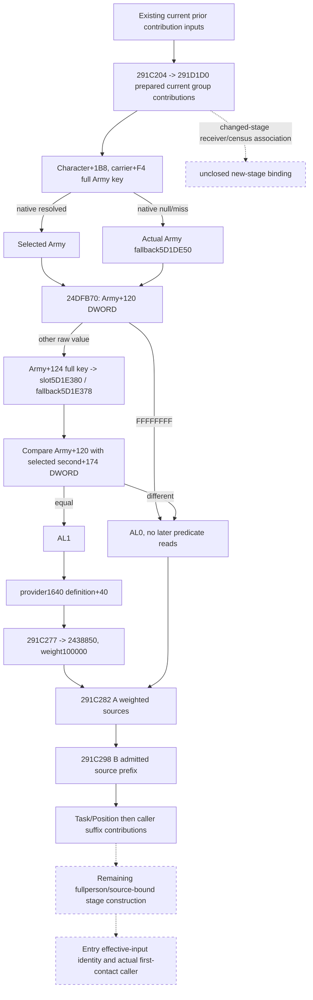

## Smallest current readonly construction

Add an optional `pre_291e210_1640` object under the existing `current_context_source_inputs` section, preserving its actor and outer frame provenance. No additional MCP query is required. The proposed fields and read order are specified in `OBSERVER-CONSTRUCTION-PACKAGE.json`.

| Required input | Current coverage | Minimal increment |
| --- | --- | --- |
| Validated current Character / source frame | Existing current-person observation | Reuse the actual actor/frame |
| Army storage `5D1DE48` and native fallback `5D1DE50` | Existing internal Army binding / native caller | Reuse the closed lookup and fallback |
| Character carrier `+1B8`, full Army key `+F4` | Existing source paths use this carrier; this contribution is not emitted | Sample the native selected Army for this branch |
| Army DWORDs `+120/+124` | Not emitted for this predicate | Emit raw32 operands; `+124` is not demanded when `+120==-1` |
| Second registry `5D1E380`, fallback `5D1E378`, selected DWORD `+174` | Not emitted for this predicate | Two binding slots and the consumed current operand |
| Exact AL admission | Missing | Project the closed read-only equality predicate |
| Provider `+1640` definition `+40` | Getter and paired-property reader already closed; this block absent | Read the property block only on actual true admission |
| Current A four spans / B admission/token prefix | Existing V85/V86 fields | Keep as later separate contributions |
| Current final stored context | Independently observed current final state | Preserve it as current final; it is not a before-A/B baseline |

The predicate can be implemented with ordinary readonly memory reads; calling the native predicate is unnecessary. Preserve full DWORD identities and signed raw32 wire bits. An actual zero operand can compare equal; positive IDs do not establish admission. A failed read must not be converted into a native lookup miss, fallback, null or false. False admission leaves the property block not demanded. True admission retains the existing paired-property observation's real counts, empty vectors and failure status.

A source-bound assembler adds this contribution after `291D1D0` and before A. It requires the explicit correct stage baseline. The current final stored context cannot be used as that baseline or receive the contribution a second time.

## Remaining complete-person/Entry distinction

The companion B ledger records the next unmapped current caller suffix at `291C2B3`: `Character+1B0`, actual fallback `5D1E308`, signed16 `Character+68`, signed32 threshold `5C6A19C`, and the conditionally merged property block `object+630` at `291C2FE`. The subsequent `291C32C` carrier contribution and `291C334 -> 28B6200` pointer-vector source are separate remaining inputs. Later fullperson auxiliary outputs also retain their exact callsite ledger.

Entry's `2C06D30` consumes Character EC and another context returned by `28BFC70`, passed to `2C06B00`. The existing sources do not prove that context is identical to `model+10` or establish the first-contact source-stage association. Current prefix contributions and current scalar values cannot establish a new Entry by themselves. These remaining branches are recorded with concrete xrefs in `branch-b-person/`, without a new broad audit or source capture.

## Work qualification

This round is native source research plus a concrete readonly construction contract. Two existing source lanes were reused. Only the single predicate leaf was captured from the frozen offline EXE, using bounded seek reads; `.pdata` absence is retained as a lookup diagnostic. No EXE scan or rehash, game/SDK/pipe/attach/window/profile activity, query-domain consumption, prepare/build/launch, compilation, test or game-day advance occurred. No implementation was installed and no current source-freeze bytes changed.

Oct5/W41 fields, exact source pins, byte/read logs, new Mermaid trees and the one-file documentation patch are in the parent `ROOT-DELIVERY.json`. No live, static implementation or complete Entry claim is made.

## Offline implementation increment, 2026-10-05

The vacation successor implemented the source-closed `pre_291e210_1640` leaf in the existing current-person query. The native DTO, exact-build bindings, readonly collector, serializer and strict Python normalizer now carry the same Character ID, native selections, signed32 raw operands, nullable AL admission and paired PropertyContainer. The two new registry bindings are `5D1E380/5D1E378`; Army `5D1DE48/5D1DE50` and the closed `8FD4E0` provider are reused. No query or command was added.

The actual demand order is retained. Null Character carrier selects the actual Army fallback. A readable null registry bypasses its requested-key read; bounds/null-slot/full-generation misses use its actual fallback. An unread registry/operand remains partial. `Army+120==-1` skips `+124`, the secondary registry and provider; other raw values, including zero and negative signed wire values, compare by exact DWORD bits. The provider and `1640` property block are demanded only on true admission. An empty key vector remains an available native observation without demanding unused value fields.

`emit_pre_291e210_1640_requests_from_current_source_inputs_12003` emits the admitted unit request, preserving the actual block and empty request. Its position is **current prior prefix → `291D1D0` → `pre_291e210_1640` → A `291E210` → B `291D7E0` → remaining suffix**. This increment emits a contribution; it neither selects a stage baseline nor writes or rebuilds a context. Observed current final storage remains current final storage.

Offline Python validation ran once: `py -m pytest -q ck3_autonomous_player/tests/unit/test_battle_pre_291e210_1640_12003.py`, with this checkout's `ck3_autonomous_player/src` on `PYTHONPATH`: **16 passed**. The new cases cover signed raw types, zero/negative equality, early false, fallback operands, partial read/PC status, actor join, older producer compatibility and unit-request block preservation. Receipt/log: `Z:/ck3_mod_rewrite_process_assets/g2-resume-20261005/background-implementation/battle-entry/python-tests.json` and `python-tests.log`. `open_kaishek` is not applicable: these are native-memory DTO/JSON observations and not Paradox script semantics.

The focused fake-memory native target is `xar_ck3_12003_pre_291e210_1640_test`, using the production collector and serializer. It additionally checks exact RVA binding, full-generation mismatch fallback and undemanded reads. This lane did **not** build or run it; the root integrator owns the one combined native build. Qualification at handoff is Python **static-ready**, native source implemented with compile/fixture execution pending; no new `fixture-live`, `production-live primitive`, `production-live loop`, game day, person or Entry credit. The user's current instruction forbids CK3 launch, attach, query, UI, Steam and stop activity; all implementation and testing here stayed offline.

The remaining exact breakpoints above are unchanged: post-A/B `291C2B3/C2FE`, `291C32C`, `291C334→28B6200`; changed-stage receiver/title/qualifier/count associations; scratch `430/438`; and `28BFC70→2C06B00` effectiveness-context identity plus the actual first-contact caller. The independently assigned suffix source research can add knowledge without turning this prefix into a complete Entry.

## Post-A/B person source suffix, exact 1.20.0.3

2026-10-05 / ISO 2026-W41. This bounded offline continuation closes the physical bindings of three native contribution families immediately after the current A/B stages. It extends the known pre-A `1640` frontier without replacing that contribution. Qualification remains **research**: no observer implementation, compiler, test, game query or live sampling occurred.

Reuse the existing exact CK3 1.20.0.3 / Steam25652598 pin, EXE SHA-256 `94B55397ABB687A3DCD436805A5D885E6BE90FA6C693FEB44A9E3BBEEADE02A6`, image base `0x140000000`. The frozen file is `Z:/ck3_mod_rewrite/artifacts/migrations/2026-10-02/installed-build/binaries/ck3.exe`. There was no full-file hash or scan. Source receipt and field contract are in `Z:/ck3_mod_rewrite_process_assets/g2-background-20261005/entry-next-stage-research/`.

### Caller stage order and direct guards

The reused `caller-after-A-B.asm` window is `[291C2B3,291C370)`; its existing text pin is `fe0974406968f2d63bdd6750c514cb0ea8f5915d3e86e3570dd743e1ed255787`. The same caller binds `R14=Character`, `RSI=model+10`. All three families call `2438850` with weight **100000**, in the following order after `291C282->291E210` (A) and `291C298->291D7E0` (B).

1. **`291C2FE` direct guarded property.** Read `Character+1B0` as a pointer. If it is nonnull and its QWORD `+280` is nonnull, select `QWORD[carrier280+8]`; otherwise select the actual native `QWORD[5D1E308]` fallback. At `291C2D8`, demand DWORD `selected+38 == 0x4744624F`. Only when equal, read `Character+68` as signed16 and the loaded `DWORD[5C6A19C]` as signed32; `JL` skips when sign-extended Character operand is smaller. True admission merges the property block **`selected+630`** at `291C2FE`. Null Character carrier does not by itself imply false: the fallback participates in both guards. The body does not add a null guard for `carrier280+8`; the observer must distinguish failure to read this selected object from a native null carrier/fallback choice. No business name is inferred from the magic, the Character operand or the fallback.
2. **`291C32C` second carrier property.** After the first admitted writer, native code rereads `Character+1B0` at `291C303`; on its skipped path the earlier carrier remains in RCX. The next family requires this carrier and its QWORD `+288` both nonnull. It selects `QWORD[carrier288+18]`, then merges the property block **`selected+40`** at `291C32C`. A null carrier or null `+288` skips this family; there is no native fallback. No extra positive-ID or source-pointer guard is present in this caller. This is a separate contribution from `+280/+630`.
3. **`291C334->28B6200`, then `291C363` ordered list properties.** The caller passes the same Character. Newly captured exact `.pdata` extent **`[28B6200,28B6279)` is 121 bytes**. On the common selection path, the getter reads `QWORD[Character+1C0]`. Nonnull returns **`carrier+200`**; null returns **the address of the static list header RVA `54E7270`**, from `LEA` at `28B623D`. This is an inline header address, not `QWORD[54E7270]` as a header pointer. The caller reads `header+0` as the source-pointer array and `header+C` as signed32 count, computes the end using sign-extension and stride8, and consumes every QWORD source pointer in native stored order. Each occurrence merges its own **`source+D8`** block at `291C363`, weight100000. Preserve duplicate occurrences; do not deduplicate or reorder. An observed zero count is a valid empty list. No current header was sampled in this research.

`28B6200` has a TLS/guard path before its carrier selection: signed comparison of `DWORD[5D679F0]` with TLS-derived `DWORD+10`, then calls at `28B6251->4223AA4`, condition `DWORD[5D679F0]==-1`, `28B6266->4223F44` with address `436B370`, and `28B6272->4223A44`. This resembles C++ static initialization bookkeeping; the helper semantics were not independently closed and that label is an inference. Every recorded path rejoins `28B6225`, where the Character carrier or static fallback header is selected. A readonly observer reads the actual selected current header; it does not invoke these helpers or manufacture an empty fallback from initial file bytes.

### Minimal observation and composition contract

Add an optional `post_291d7e0_sources` under the existing `current_person_state.current_context_source_inputs`, preserving the existing actor/full ID and source-frame provenance. `OBSERVER-CONSTRUCTION-PACKAGE.json` specifies physical field names and demand order. Reuse the existing paired PropertyContainer reader for `+630`, `+40` and `+D8`; no new MCP query or native function invocation is needed. New address bindings are the direct object fallback slot `5D1E308`, loaded signed32 threshold slot `5C6A19C` and the inline static ordered-list header `54E7270`. The global TLS initialization guard is source provenance, not an additional observer operand requirement.

Distinguish a readable native null/skipped family, a native zero/empty property container, and an unread demanded operand. Wrong magic stops before the signed threshold reads; low signed Character operand stops before the property read. Direct `+288` guards stop before its selected property; zero list count demands no occurrence. Read failure cannot establish known false or native zero. Both independent container arrays retain their actual counts and row order through the existing reader. A requested list count outside the existing reader's representable limits remains unavailable rather than becoming an empty list; the source count itself is still signed32.

Composition order is `291D1D0 -> pre-A1640 -> A -> B -> +630 guard -> +40 carrier -> ordered+D8 occurrences -> later291C371 suffix`. An assembler requires the exact source-stage starting context and all intervening contributions. **Observed current final storage cannot supply a pre-A/post-B baseline or receive these contributions a second time.** Current source bindings do not derive changed-stage list generation, held-title/qualifier/receiver inputs or future caches.

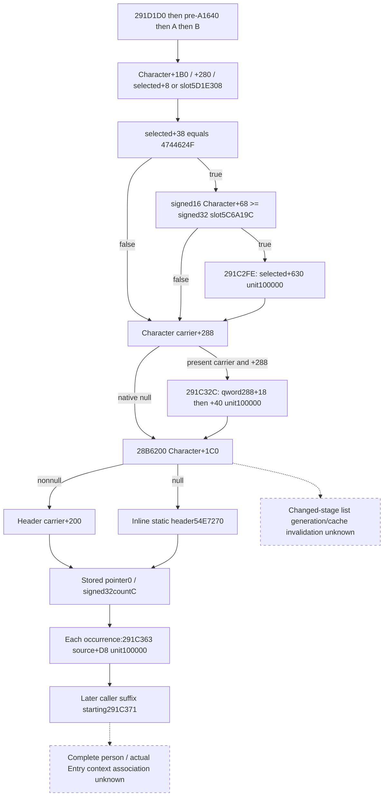

### Remaining precise construction gaps and receipt

The highest-value physical source-list binding at `28B6200` is now closed. List allocation/writes, source-object type/lifetime and invalidation for changed stages are not closed; the known physical follow-on is **writers of Character+1C0 and its inline+200 list**. Later caller contributions beginning **`291C371`** remain separate. Full-person scratch430/438 producers `2948DF0`/`2948F00`, postcopy `2949010`, changed-stage receiver/held-title/qualifier/census binding, and the actual Entry context `28BFC70->2C06B00` plus first-contact caller identity retain their previous gaps. No current-final baseline, forecast, complete person, Entry readiness, win rate or new live evidence is claimed.

New frozen-file I/O was exactly **121 code bytes plus four 12-byte `.pdata` rows = 169 bytes**, captured by bounded seek/read and retained in separate metadata/body attempts. `.pdata` body bounds were found before code was read. The read log records every new offset and byte count; prior cached `.pdata` rows were reused. Small cached caller windows were reused without new EXE bytes. No unwind body, initializer helper, list-write xref scan or whole EXE scan was captured. The separate research-plan consistency check records only file/record structure and is not a semantic test. The draft plan is explicitly offline-only and not suitable for live observation. Initial command-transport failures are preserved in `ATTEMPT-NOTES.json`; none read an incorrect source RVA or touched the game. Shared source/doc files and the runtime freeze were untouched.

## 后台整合后的prestage资格（2026-10-05T19:48:26+08:00）

Root集中离线验收已于2026-10-05完成，整合源码 `4733655173e65be99c9ffaafbe2d9275940df4d6`。`xar_ck3_bridge` 与五个新增focused native目标在Release、`/WX`、jobs4、低优先级下编译GREEN；五项CTest一次5/5 GREEN。外置 [构建与测试冻结](Z:/ck3_mod_rewrite_process_assets/g2-background-20261005/OFFLINE-FREEZE.json) 保留原始attempt/测试/producer pins。两次真实RED分别为occurrence缺少快照比较与geography fixture缺少phase-character链接，已最小修复；旧attempt不覆盖。

本次是默认配置的离线bridge/fixture资格，G2 capability flags未从v73运行配置采用，宗教private query仍OFF；不是可直接部署的v74，也未进行runtime prepare/stage/attach。未来实机须采用实际所需flags并另冻候选。用户独占CK3期间game/SDK/attach/query/pipe/UI/Steam/profile操作均0；没有新paused artifact、live资格或游戏日。

`xar_ck3_12003_pre_291e210_1640_test` 已真实编译并一次GREEN；lane新增Python16例一次GREEN（1.86秒），原日志/回执 `Z:/ck3_mod_rewrite_process_assets/g2-resume-20261005/background-implementation/battle-entry/python-tests.json`。prestage及两个registry bindings的生产读取/序列化/消费现为static-ready；current final不替代该baseline、-1/false/0与missing仍独立保留。上文post-A/B贡献族是新source研究输入，尚未observer施工；完整人物初始化、changed-stage census与actualEntry上下文仍partial，不授首次接战或完整战斗forecast。

## Post-A/B current observer implementation, 2026-10-05 second background batch

The three source-closed post-B contribution families are now implemented as optional current_person_state.current_context_source_inputs.post_291d7e0_sources. Exact .3 bindings are 5D1E308 (actual object fallback pointer slot), 5C6A19C (loaded signed32 threshold), and 54E7270 (**inline** static ordered-list header). This extends the existing native DTO, readonly collector, serializer and authoritative Python normalization reached by the existing current-person/MCP path; no new query, command, initialization helper or source writer is invoked.

The three leaves retain independent availability and the same current Character/full ID. guarded630 preserves the current 1B0/280 pointer guards, actual object selection, signed32 wire bits of DWORD +38, signed16 Character +68, loaded signed32 threshold and exact admission. Wrong magic stops before the signed operands; the native signed less-than result stops before the property read. Readable null carrier/280 chooses the actual fallback and still evaluates it. A failed selected-object read is partial, rather than a native null guard or false admission.

carrier40 independently observes current Character +1B0 and carrier+288. Native null skips the family; two present guards establish admission before the selected object's +18 pointer/+40 property can be read. A failed demanded pointer/property preserves the known true admission but leaves the leaf partial. There is no fallback for this family.

ordered_d8 selects the current inline carrier1C0+200 header or actual inline static 54E7270. It reads header pointer0 before signed32 countC, matching the caller, and emits every stored source occurrence with its index, snapshot-local source identity and actual paired property block source+D8. Duplicate occurrences remain separate and preserve their order. The additional nullable source_array_present records the readable pointer0 result: a known empty list with a readable null pointer is distinct from an unread header. Zero count is a valid empty list; negative count is retained as signed32 and unavailable, without manufacturing zero/empty storage. The native static header is observed directly, never reconstructed from frozen initial bytes.

The three families reuse the existing PropertyContainer reader, including legal zero keys, unused value-field short circuit and independently observed value counts. The optional field remains absent for older/unbound producers. The strict Python normalizer retains these current values/statuses and validates the existing actor join. emit_post_291d7e0_requests_from_current_source_inputs_12003 emits unit-weight requests in order **guarded630 → carrier40 → every orderedD8 occurrence**; empty blocks and duplicates remain requests. The complete native stage order remains 291D1D0 → pre-A1640 → A → B → guarded630 → carrier40 → orderedD8 → later291C371. No prestage baseline, current-final append, future context, full person or Entry is computed.

The new Python validation ran once against this package: **16 passed in 1.68 seconds**, covering the production current-person authority ingress, signed16-to-signed32 comparison, inline fallback, stored occurrence order/duplicates, independent paired counts, legal empty blocks, missing demanded PC, closed wire types and older producer compatibility. Receipt/log: Z:/ck3_mod_rewrite_process_assets/g2-background-round2-20261005/post-ab-observer/python-tests.json and python-tests.log. open_kaishek is not applicable: native-memory DTO/JSON and guards are outside Paradox finite runtime semantics.

The new native build target and CTest name are xar_ck3_12003_post_291d7e0_sources_test. Its one CTest invocation writes eight production collector/serializer snapshots to post_291d7e0_sources_wire.json in CMAKE_BINARY_DIR. The fake-memory fixture covers exact RVA binding, actual nonempty inline static fallback, native stored duplicates and signed paired values, empty-key unused-field reads, wrong-magic and signed-JL short circuits, null pointer guards, unread demanded selected pointer and negative/unread list counts. The lane has not compiled or run it; the root integrator owns the central offline jobs4 build with the adopted capability flags.

Qualification at lane delivery: the new Python path is **static-ready**; native source and focused fixture are implemented with compile/execution pending. No live/paused qualification, first-contact/Entry/forecast credit or new game day. No CK3 process/pipe, attach/query, runtime prepare/stage, UI, Steam, profile/save/cache or frozen-EXE read occurred.

Remaining source work is unchanged: changed-stage generation/lifetime/writers of Character 1C0+200, later caller sources beginning 291C371, receiver/held-title/qualifier/census association, full-person auxiliaries 2948DF0/2948F00 and postcopy 2949010, and 28BFC70→2C06B00 effectiveness context/actual first-contact caller. The independently assigned later-suffix and scratch/census lanes own these follow-ons.

## Later current-person direct contributions, exact 1.20.0.3

2026-10-05 / W41. This background lane continues the cached caller at `291C371`. It closes two direct contribution families after `291F0A0` and captures that helper's exact source extent. The prior post-A/B observer and actual Entry-context lane remain separate. Source tree and field contract were persisted before implementing any observer.

Reuse the CK3 1.20.0.3 / Steam25652598 EXE pin `94B55397ABB687A3DCD436805A5D885E6BE90FA6C693FEB44A9E3BBEEADE02A6`. The cached entire `291C0D0` caller was reused; no EXE scan or rehash was performed. Exact `.pdata` closure of `291F0A0` is `[291F0A0,291F25D)`, 445 code bytes; binary-search metadata demanded four new 12-byte rows, total new frozen-file I/O **493 bytes**. All seeks, bytes and small file pins are retained in `Z:/ck3_mod_rewrite_process_assets/g2-background-round2-20261005/person-later-suffix/`.

### Closed direct inputs and demand order

At `291C377`, `291F0A0` receives `model` and the same Character; its recipient becomes `model+10`. The caller then executes:

1. **Ordered `+80` property occurrences, `291C3FB`.** Read `QWORD[Character+1B0]`. Nonnull selects the inline header at `carrier+98`; null selects the **address** of static header RVA `545A3E8`, rather than its first QWORD as another header pointer. Read signed32 count `header+C`, then the native stored DWORD full-key vector at `header+0`. Zero count is a real empty family, without demanding either registry slot. For each occurrence, resolve low24 index through `QWORD[5D1FC58]`, unsigned capacity `+2C`, stride16 pointer at slot `+8`, and full DWORD object ID `+10`. A readable native null/miss/mismatched generation selects `QWORD[5D1FC48]`; an unread operand remains unavailable. Native signed32 `selected+24C==0` skips its property. Every other signed value, including negative values, admits `selected+80`, weight100000 into `model+10`. Retain duplicate requested keys and duplicate selected objects, in stored order. `R12D` is zero from `291C1A6` and remains zero at this comparison.
2. **Guarded `+AA0` property, `291C44C`.** Read `QWORD[Character+1C0]`. Nonnull selects `QWORD[carrier+388]`; null selects the actual `QWORD[5D1DCB0]` fallback. Demand DWORD `selected+38`; exactly `4744624F` admits `selected+AA0`, unit100000, into the same context. Wrong magic skips the property; unread carrier/selection/magic does not establish false. No extra positive-ID or selected-pointer null guard occurs in this native body.

The direct contribution order is after post-A/B ordered `+D8` occurrences, **then helper291F0A0, then ordered+80, then guarded+AA0, then helper291F550 and helper291F940**, followed by caller `291C467`. Observing these direct leaves does not close or omit the helper between the earlier post-A/B leaves and them. Their property containers use the existing paired keys/values observation, retaining independent count provenance and genuine empty blocks. Current final storage cannot be supplied as a before-helper baseline or receive these leaves twice.

### Source-closed helper body and concrete remaining operands

The complete 445-byte `291F0A0` body contains four ordered families, each writing via `2438850` to `model+10` at weight100000:

- `291F11C`: Character full key `+B4` resolves through storage `5D1E2F8` and native fallback `5C67670`, comparing selected full DWORD ID at **+8**. A readable null registry skips the Character key read. The selected object's pointer `+20` / signed32 count `+2C` vector consists of direct PropertyContainer pointers; preserve occurrences.
- `291F1C1`: manager slot `5D1F6D0` can initialize via `3F8B660` when null. `3181BF0(manager, Character)` selects a object; `3181370(selected, recipient)` supplies a property block, admitted when signed32 `block+C !=0`. Recipient is `QWORD[Character1C8+A0]` or `2BFB4C0`'s output when the Character carrier is null. These selection/cache helper leaves are not closed or called by this observer.
- `291F1FC`: `28BD090(Character)` returns a pointer header (`+0` / signed32 `+C`). Each stored source pointer demands signed32 `source+A24`; nonzero admits `source+A18` (the count is the property container's own `+C`). The getter's physical header selection remains a concrete follow-on.
- `291F23C`: exact AL from `2BABEC0(Character)` gates selected object's pointer `+938` / signed32 `+944` list of direct PropertyContainer pointers. False demands no list. The predicate leaf remains a concrete follow-on.

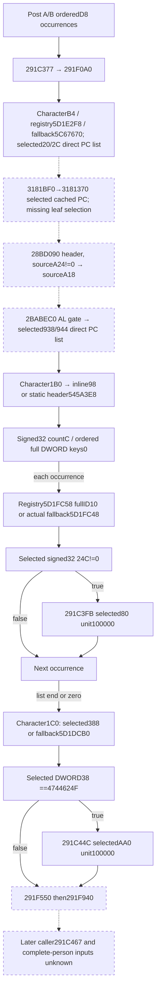

The new optional current source section is `later_direct_291c3fb_44c`; its independent readiness qualifies exactly the two direct families. Missing helper inputs, later caller/helper branches, scratch430/438, changed-stage list generation/receiver/title/qualifier/census and actual Entry association retain their concrete seams. The observer provides current read-only inputs, without native initializer/counter/writer calls, prepared-cache mutation, new MCP query, forecast or game-result credit. No launch, attach, game/SDK/pipe query, UI, Steam, save/cache/profile or runtime preparation occurred; `open_kaishek` is not applicable to native ABI memory/DTO arithmetic.

### Implemented direct observer and focused validation

The two caller-direct families are now implemented under that optional field in the existing query: exact .3 binding, production readonly collector/DTO/serializer, shared strict Python current-source normalizer and pure unit-request emitter. Newer producers retain source actor29829, native full DWORD generation bits, selected snapshot-local identity, signed nonzero admission, actual fallback choices, ordered duplicates and genuine empty PropertyContainers. Older producers omitting the new field still load. A negative native list count is retained as unavailable/unrepresentable, never invented as an empty list. Header pointer0 and countC are demanded even for zero count; registry slots and occurrence bodies are not demanded on zero. Both registry slots are loaded before the first key, and reread after admitted native merge sites; the readonly observer performs these reads without merging.

The focused Python suite ran once: **11/11 GREEN**, 2.33s, receipt/log `python-tests.json` and `python-tests.log` in this external directory. It covers duplicate order/block reference preservation, negative nonzero admission, zero and false skipped body, failed reads instead of native fallback, admitted unavailable properties, negative source count, source actor join/legacy producer, native word types and undemanded branch properties. Source changes are ready for root's centralized native build. Target and CTest **`xar_ck3_12003_person_later_direct_test`** use the production collector and serializer and output seven genuine case wires under `BUILD_DIR/ck3_12003_person_later_direct_wire`; this lane did not compile or run it. Qualification remains Python static-ready/native implemented pending build, no complete-person/Entry/live/forecast credit.

### Additional exact helper leaf closures for the next implementation

After the direct implementation and its test, bounded source follow-on closed two of the previously unclosed helper operands. This does not silently extend the tested direct observer.

- **`28BD090`**: complete .pdata extent `[28BD090,28BD12A)`,154B. A nonnull `QWORD[Character+1C8]` returns the **address** `carrier+88`. Null carrier returns the **address** of inline static header **`5D67E40`**, not a QWORD header pointer. TLS guard paths can initialize the static header but rejoin that exact address; a readonly observer samples its current bytes without initializer calls or assuming static file zeroes. Combined with `291F1FC`, every stored occurrence has source+A24 nonzero admission and source+A18 PropertyContainer, unit100000.
- **`2BABEC0`**: complete161B frameless leaf, captured176B gap through next function start2BABF70 with15B INT3 padding; surrounding .pdata rows prove no covering body. Read signed/raw DWORD `Character+15C`; exactlyFFFFFFFF returns AL0 and demands no registry/key. Otherwise, select first object using registry **`5D1E2F8`**, full key Character+B4, exact full DWORD selected ID **+8**, actual fallback **`5C67670`**. A readable null registry does not demand the key. Second registry **`5D1E300`** selects using first object full key **+4B8**, again exact ID+8, with actual fallback **`5D1E2E0`**. AL1 iff the first Character15C DWORD equals selected second object's DWORD **+A0**. Legal zero and negative raw words compare by exact bits. Unread demanded fields cannot establish native false. This gates the previously captured selected first object's938/944 direct-PC list at291F23C.

`3181370` also now has a captured176B frameless gap, exact leaf `[3181370,3181417)` plus9B padding. It reads selected+64 signed32 count. Zero branches to3182420's current inline default PC (address **5D70FC0**, known116B getter, lazy guard not called). Nonzero compares the recipient signed64 with two loaded native QWORD threshold slots **5C68E00/5C68DF8**, selects the first or last stride218 row at selected+58 at the extreme bounds, otherwise scans rows in stored order. It consumes row signed64 lower1E0/upper1E8 and the exact sign-dependent inequalities, returns first matching row's base PC, or QWORD[selected+70] fallback. These source branches are captured but no new observer is installed; demanded threshold values and selected object remain missing inputs in the old query.

`3181BF0` is split into multiple .pdata regions. The captured39B head validates Character magic43686172 at+1C and ID18!=-1; captured5B/276B continuation closes three chained full-ID+8 lookups (first5D1E2F8/fallback5C67670 CharacterB4, second5D1E300/fallback5D1E2E0 first4B8, third5D1DE88/fallback5D1DE00 second8C). It then takes QWORD[third+20] and scans manager+50/signed count5C definition pointers using `A11CC0(definition+40, &third20)`. The captured continuation stops at3181D30: return/default tail3181D30/3E/50 and A11CC0 membership remain precise unclosed seams. An absent Character1C8 recipient still invokes `2BFB4C0`; its known551B .pdata extent was recorded but its body was not captured. Do not call native getters or assume an identity from these partial paths.

All subsequent captures retain separate raw receipts; total lane I/O including these follow-ons is frozen in `ROOT-DELIVERY.json`, while the earlier493B figure accurately records the source input available before the direct implementation. The follow-ons are research, distinct from the tested direct observer.

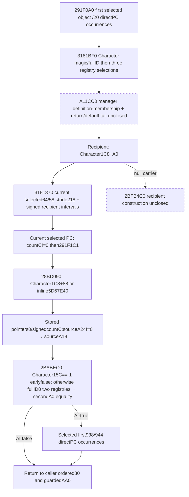

### Manager tail closure after the implementation handoff

The next narrow reads close the previously named3181D30/3E/50 tail, without changing the validated observer code. Matching manager+50 stored definition occurrence returns the QWORD definition itself at3181D30. Exhausting the list selects QWORD**manager+EF0** at3181D3E (not a inferred small-offset default). An invalid Character magic43686172 or fullID18==-1 selects QWORD of **slot5D1FBD8** at3181D50. These are three separate native selections; null or unread current selected pointers do not manufacture an empty PC.

The326B A11CC0 body consumes header pointer0 / signed32 countC, compares its QWORD entries with the QWORD supplied at `&third20`, and returns AL whether a matching stored pointer was found. Its visible baseline paths compare complete64-bit values: SSE scans twoQWORDs at a time, followed by a scalar tail; duplicates do not change the predicate. A native global guard has lazy feature initialization. When the loaded upper32 feature word is >=4EE8, it delegates the same begin/end/key search to `3F90910`; that optimized leaf is not independently reversed here. Accordingly baseline bit-equal membership is source closed, while the optimized helper's return equivalence remains source inference. No static initializer, membership predicate or native selector was called.

The smallest next current observer is therefore manager slot5D1F6D0, Character identity/magic, the three resolved fullID8 objects and their selected third+20 pointer, manager50/5C ordered definition pointers plus each definition+40 membership header, managerEF0 and invalid-Character fallback5D1FBD8. The3181370 selectedPC range inputs and actual recipient still follow. Absent Character1C8 recipient2BFB4C0 and optimized search3F90910 are the precise remaining source leaves; once those are closed the whole291F0A0 helper can be implemented in this same query. The direct observer does not wait on or claim those future inputs.

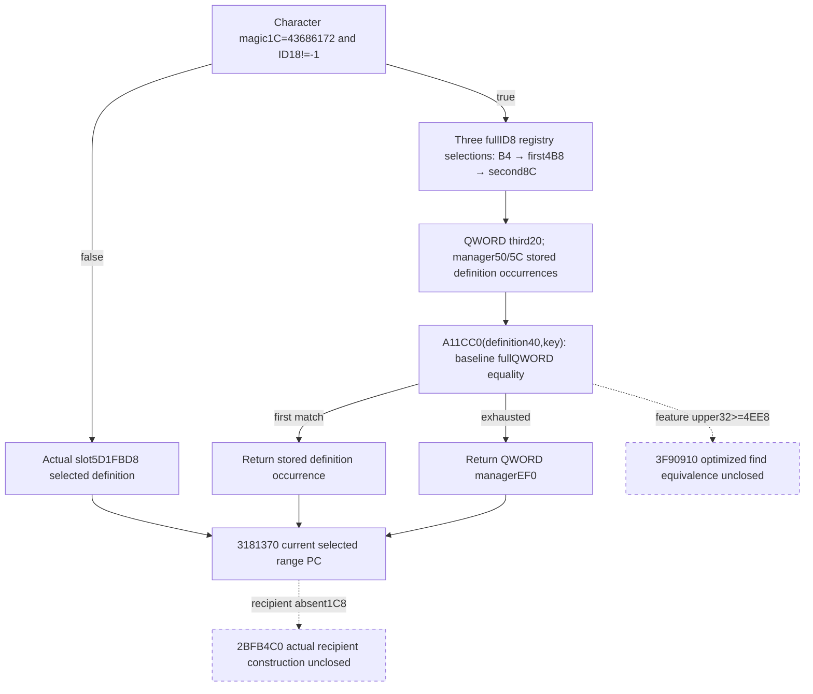

## Auxiliary person scratch preparation, exact 1.20.0.3

2026-10-05 background round 2. This source increment closes the auxiliary `scratch+430/+438` producers independently from the already implemented six-skill cache. Frozen CK3 1.20.0.3 / Steam25652598 EXE SHA `94B55397ABB687A3DCD436805A5D885E6BE90FA6C693FEB44A9E3BBEEADE02A6` is reused. Only the frozen file was read; no whole-file scan/hash, CK3/process/SDK/pipe/UI/Steam action or game-day advance occurred.

### Exact inputs and native order

Reuse the v77 `28C3D80` caller windows. `RBP=Character`, `R15=QWORD[Character+1B0]` scratch and `R14=the actual context returned by 28C3AE0`. The caller first finishes six skill results, then calls `2948DF0(scratch, output, context)` at `28C3EB0`; the returned signed Q64 is copied to `scratch+430` at `28C3EBD`. The `.pdata`-bounded leaf is `[2948DF0,2948EFB)`,267 bytes.

The `430` leaf reads weighted key `0x38` through source-closed `24389A0` in mode1 then mode2, preserving stored weighted-row order and signed fixed-Q products. It also performs a lower-bound aggregate lookup for key `0x3D` in context's embedded `+68` PropertyContainer; actual absent key is zero. Let `P` be mode1 sum, `N` mode2 sum, `A` the aggregate key3D value and `B` signed QWORD[scratch+2D8]. Its native result is:

`negative_tail=wrap64(N+A); negative_tail=negative_tail<0 ? negative_tail : 0; total=wrap64(P+wrap64(negative_tail+B)); result=total<0 ? 0 : signed_min(total,100000)`.

Every ADD wraps before its subsequent signed test. The base is added after the negative-tail choice; moving it inside that choice produces a different result. No division occurs in this leaf.

For `438`, the caller reads `Character+1A1` byte and sign-extended signed16 `Character+68`. When the byte is zero it loads low/high signed32 slots `5C6A15C/5C69D18`; otherwise `5C69D10/5C69D14`. The caller selects key `0x3A` when the signed16 value is below the low slot. Otherwise it selects `0x3B` when below the high slot, else `0x3C`. The high slot is not demanded on the first branch. These operands have no inferred business names. It calls `2948F00(scratch,output,context,selected_u16_key)` at `28C3F1C` and copies the result to `scratch+438` at `28C3F24`, then sets scratch byte440 to1. The exact leaf is `[2948F00,2949008)`,264 bytes.

The `438` leaf first obtains key39 mode2 (`N`), reads aggregate key3E (`A`), wraps their sum, then obtains key39 mode1 (`P`) and aggregate selected3A/B/C (`S`). Signed QWORD[scratch+2E8] is `B`. Its native result is `wrap64(wrap64(wrap64(min(wrap64(N+A),0)+B)+S)+P)`. There is **no final zero clamp, upper cap, rounding or division**. A negative result is legitimate.

The source-closed mode getter and aggregate lookup are reused from v77; no native getter invocation is needed to consume the materialized current context. Missing context/keys/values/weighted rows remain partial; legal zero values and native absent keys remain zero. The current stored context is a current input only, not a changed-stage materialized baseline.

### Copy and following nine-byte cache

Reuse v64 `28C3F60` writer: it copies `scratch438→scratch2F0` at `28C3FED/3FF4`, rereads Character1B0 and copies `scratch430→scratch2E0` at `28C4002/4009`, then calls `2949010(scratch)` at `28C4017`, and clears440. Prepared430/438 and copied2E0/2F0 are separate observations; neither implies the copy has happened.

New bounded source `[2949010,2949578)`,1384 bytes, establishes that the next helper is a separate nine-byte producer. It reads `QWORD[scratch+258]` as model, searches aggregate U16 keys at model78/count84 with signed Q64 values at modelE0, then optionally adds definition-selected keys. The optional family requires scratch278 object DWORD28=`41495374`, selects object20+238 or actual fallback QWORD[5D1F7B8], then requires DWORD38=`4744624F`; its nine U16 definition operands at312..322 are grouped in three triples and `FFFF` means skip. Sums preserve wrap64. Each result is truncated by native /100000, narrowed to signed low32, clamped to[-100,100], and stored as a signed byte through QWORD[scratch+310]. The embedded jump table at2949550 selects the nine initial property IDs; the tenth entry is outside the actual0..8 loop. This entire helper does not consume scratch430/438 and does not establish Entry refresh or a cache's business name.

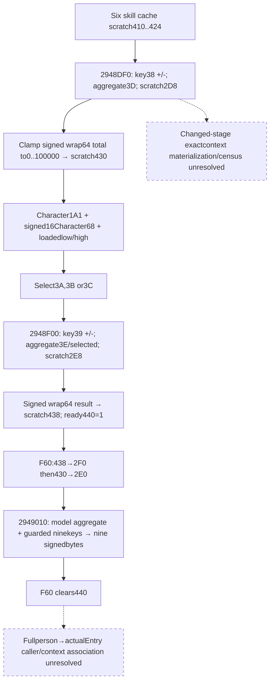

### Minimal same-query increment

The useful bounded implementation is optional `raw_numeric_inputs.auxiliary_scratch_inputs`, under the existing explicit-Character current-person query and its actor/frame. It emits scratch2D8/2E8, source selector operands, prepared430/438, copied2E0/2F0 and ready440. The existing actual-selected `raw_numeric_inputs.context` is reused. A pure adapter reproduces the two source-closed leaves from this materialized context; it never writes, prepares, flushes, rebuilds a current-final baseline or updates Entry. Native-null scratch is a named no-op and demands none of these fields. The high threshold is demanded only when the low comparison passes. Older producers without the optional leaf remain compatible.

This increment releases the actual auxiliary calculation interface. Fullperson and Entry remain partial: changed-stage receiver/title/qualifier/census inputs, earlier source-stage baselines and actual first-contact association are still required. The newly closed nine-byte helper can be implemented in a subsequent independent package with its exact table, selected definition and actual model-bound properties; no forecast is inferred here.

### Receipt boundary

Source receipt, bounded binaries/assembly, previous caller/getter reuse pins and implementation qualification are under `Z:/ck3_mod_rewrite_process_assets/g2-background-round2-20261005/person-scratch-census/`. New frozen-file reads are1915 code bytes plus180 `.pdata` bytes=2095 bytes. The three function bodies and previously cached source were interpreted once. No unwind body, full-image xref scan, initializer or unneeded caller was followed. `open_kaishek` is not applicable to this ABI/DTO/native integer-arithmetic work; no Paradox script semantics are changed.

### Offline implementation qualification

Isolated source commit `73e8f3f1` implements this optional raw leaf, four exact loaded threshold bindings, current prepared/copied observations, strict optional normalizer and `compute_auxiliary_scratch_from_native_inputs_12003`. No new MCP or native getter invocation was added. One new production-normalizer→kernel Python case was run once: **1 passed in1.52s**; it covers low/middle/high signed selector boundaries, legal negative438, wrap64-before-clamp, empty/missing properties, legacy absent/explicit-null leaves and native-null scratch. Receipt/log: `PYTHON-VALIDATION.json/.log` in this packet. Python qualification is **static-ready**. Native target/CTest `xar_ck3_12003_person_auxiliary_scratch_test` has six production-reader/serializer fixture samples and is implemented but **not yet built or run by this lane**; Root owns the combined offline build. It emits `${CMAKE_BINARY_DIR}/person_auxiliary_scratch_12003.json` for one genuine wire-consumption follow-up. No new fixture-live or production-live qualification is claimed.

## Post-A/B genuine native fixture wire integration, 2026-10-05

After the root central offline /WX DLL/new-target build and one 5/5 GREEN CTest run, the eight genuine post_291d7e0_sources_wire.json snapshots were consumed once by the adopted production normalizer and post-B unit-request emitter from Z:/gb0, source 96e4c6a688d95dc326db4cd3b7cd25961e3c40c6. All eight cases passed. Exact request counts were [5,1,1,3,0,null,null,null]; the three partial demanded-source cases retained independent current facts and rejected complete post-B request emission.

This integration preserved guarded630→carrier40→stored orderedD8 order, duplicates, FFFF/zero and negative Q values, independent value counts, native wrong-magic/signed-JL short circuits, actual admitted fallback with a nonempty inline static list, and negative/unread list count distinctions. The adopted production module's optional later_direct extension remained compatible. Wire SHA-256: 6f0c05a9c5dd4f7783b0653f15af15aad387950e31520a76dc2d94fe8e6bf656.

Receipt: Z:/ck3_mod_rewrite_process_assets/g2-background-round2-20261005/post-ab-observer/native-wire-integration/WIRE-INTEGRATION-RECEIPT.json. Normalized actual native snapshots and unit requests are retained in NORMALIZED-AND-REQUESTS.json in the same directory. The root native build/CTest receipts are native-person-holy-01.json and native-person-holy-ctest-01.json in its round2 output. The old sixteen Python cases were not rerun; no source/native input changed during this integration.

The new post-A/B observer/consumer is now static-ready using the compiled production reader, serializer and adopted Python ingress. This is synthetic native-memory fixture evidence, not fixture-live or production-live. No paused artifact, full-person/Entry/forecast claim or game day was added. Game/process/pipe/runtime/desktop access remained zero.

### Root 整合 native/consumer 资格

实际验收收口时间：2026-10-05T21:12:06+08:00。整合 source `96e4c6a688d95dc326db4cd3b7cd25961e3c40c6` 在 adopted v73 capability flags 下 MSVC `/WX`、jobs4 below-normal 纯离线 bridge + 5新增targets构建 GREEN（152.98 秒、362增量步骤），`native-person-holy-01.json/.log` 保留。只运行5个新增 CTests，一次 **5/5 GREEN**（总0.73 秒）：post-A/B、knight effectiveness context、later direct、auxiliary scratch、holy-order current-war eligibility。旧C/D及旧Python cases未重跑。

真实生产reader/serializer输出随后各消费一次，合计28份：post-A/B8（ordered requests `[5,1,1,3,0,null,null,null]`）；knight4（缺诊断仍保留真实scalar/stats）；later-direct7（duplicates、fullgeneration fallback、negative count/missing/false分开）；auxiliary scratch6（真实准备/复制结果分列、native-noop、missing threshold）；holy-order3通过注册MCP consumer 48checks。无synthetic replacement，生产normalizer/module从Z:/gb0导入；十三份later/scratch在 `later-scratch-genuine-wire-integration.json`，其他各lane native-wire-integration/VALIDATION-RECEIPT保留wire、consumer与projection pins。新native+consumer资格均为 **static-ready**，不是live，也没有完整人物、changed-stage、Entry预测或release action信用。

qualified DLL已归档 `source96e4c6a6-person-holy-qualified-binaries/xar_ck3_bridge.dll`：9,691,648 bytes，SHA `ce030baa45956ffac50b43e3b1337b6b06c8407e9a38fe2ab110382d0c51ca41`，同档案保留5fixture EXE、实际JSON、CMakeCache与编译result。未注入或deploy。上一已推送loss milestone `02d187b2cf7df41393affe840992d26f2b715691` 官方CI `37313580089` SUCCESS；对应[CI日志](https://github.com/XenoAmess/ck3_eternal_recurrence/actions/runs/37313580089)不能外推新commit已过CI。

下一后台工作仍在做：已交付九cachebyte child源待Root采用/独立native验证；291F0A0 helper四族观测、2633340 conditional raised refresh及retained selected Rules真实effect值正在 source-first施工。这些都针对当前功能输入缺口，不派生理论安全审计，不用无paused状态当停止理由。新CK3启动/连接/SDK/真实pipe、UI/Steam、profile/save/cache/runtimeprepare/stage/deploy与游戏日全部0；历史5035保存日与R0046停点不变。日/周保持rolling，不倒填早会，不把幕后源码测试记成production-live。

## Following nine-byte person cache, exact 1.20.0.3

2026-10-05 background round 2 continuation. Reuse the newly closed `2949010` body and table from `person-scratch-census`, frozen CK3 1.20.0.3 / Steam25652598 EXE SHA `94B55397ABB687A3DCD436805A5D885E6BE90FA6C693FEB44A9E3BBEEADE02A6`. No new EXE bytes, full-file hash/scan, game/process/SDK/pipe/UI/Steam operation or native initialization is required.

### Current receiver, lists, demand and exact arithmetic

`28C4017` passes the current `QWORD[Character+1B0]` scratch to `2949010`. Unlike the earlier `28C3AE0` selection, this helper unconditionally selects `QWORD[scratch+258]` as its model; there is **no `model+8==Character` ownership branch or fallback-context selection** in this body. Its actual aggregate PropertyContainer is embedded at **model+78**: U16 key data+0, signed32 count+C (model84), signed Q64 value pointer+68 (modelE0). Reusing an earlier fallback-selected `raw_numeric_inputs.context` would therefore use the wrong model on an ownership mismatch. The minimal readonly observer copies this actual aggregate separately.

The actual loop has nine occurrences, in jump-table order at `2949550`: **[22A,228,22B,229,225,22D,22C,226,227]**. The tenth table branch is not consumed by this0..8 loop. Every base occurrence uses source lower-bound lookup; a legitimate native absent key contributes0. Actual count/keys/values are preserved, without reordering or synthesizing values.

The optional contribution family first reads `QWORD[scratch+278]` and its DWORD+28. Only magic **41495374** demands QWORD+20. If that pointer is nonnull, select QWORD[linked+238]; otherwise select the actual native **QWORD[5D1F7B8]** fallback. Demand DWORD[selected+38]; only magic **4744624F** admits definition keys. The caller's source has no null guard for scratch278 or the selected definition. An observer seeing a native null there reports an unavailable demanded operand; it does not manufacture a false family. Wrong first/second magic is a source-closed skipped family and demands no later fields.

An admitted family reads exactly nine U16 definition keys at **312,314,316,318,31A,31C,31E,320,322**, in three triples. Each corresponding cache position wrap64-adds the aggregate lookup for its own key. **FFFF skips** that contribution. Duplicates remain positional, and a selected key equal to its position's base key contributes that value again. No positivity rule is added.

Each final signed Q64 sum is truncated toward0 by **/100000**. The result is narrowed to **signed low32** before comparing against the actual instruction constants **-100 and100**; this is not a direct signed64 clamp. The clamped signed point is stored as its signed byte to `QWORD[scratch+310]+index`. Current cache bytes copied by an observer remain separate from these calculated results; stale or unprepared bytes are not treated as calculation evidence.

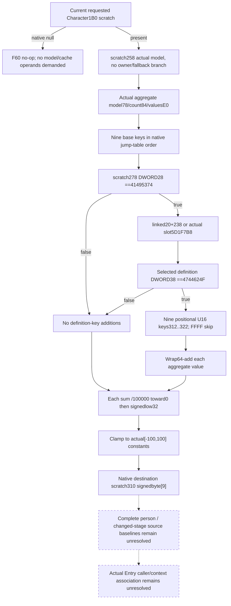

### Same-query and calculation boundary

Add optional `raw_numeric_inputs.nine_cache_byte_inputs` to the existing explicitly requested current-person query. Reuse its actor/frame and emit the actual model aggregate, source gate operands and selected keys, and actual current nine signed bytes from scratch310. A null scratch is the existing F60 no-op; a missing demanded model/definition operand is partial. No native getters or helper2949010 run. Add a pure `compute_nine_cache_bytes_from_native_inputs_12003` adapter consuming these source operands; preserve distinct calculated sums, low32 points and clamped results. It does not write the cache or claim complete person, Entry, future forecast or callback execution.

Source body/table pins and Mermaid are published before code in this appendix. `open_kaishek` is not applicable to this native ABI/DTO/integer-arithmetic package. Root owns canonical append, daily/weekly records, central build, eventual runtime adoption and master push.

### Offline implementation qualification

Isolated child commit `2306c381` implements this same-query optional raw leaf, exact fallback binding, independent actual model aggregate, strict optional normalizer and `compute_nine_cache_bytes_from_native_inputs_12003`. Observation `ready` concerns formula source inputs; a missing current cache pointer remains separately observed and does not manufacture cache bytes or block calculation of otherwise known inputs. One new production-normalizer→kernel Python case ran once: **1 passed in1.10s**. It checks exact base order, both false native guard families, fallback selection, positional duplicates/FFFF, wrap64-before-division, signedlow32-before-clamp, missing demanded operands, legal empty containers, native-null scratch and old absent/explicit-null producer compatibility. Receipt/log: `PYTHON-VALIDATION.json/.log` in `person-nine-cache-byte`.

Native target/CTest `xar_ck3_12003_person_nine_cache_bytes_test` is implemented with eight production query/serializer samples and is **not yet compiled or run by this lane**. Its output is `${CMAKE_BINARY_DIR}/person_nine_cache_bytes_12003.json`; `replay_compiled_wire.py` consumes those genuine fixture bytes through the integrated normalizer and kernel, optionally also consuming the previous six auxiliary-scratch samples. Root owns the one central offline build. This is Python **static-ready**, native fixture execution pending, with no new live/game/Entry credit.

## Nine-byte cache offline native qualification, 2026-10-05

Root adopted child `2306c3813a6f31f61f3fab3d7f27ac29462ea8b1` as `da9aa3fa`. The new standalone target `xar_ck3_12003_person_nine_cache_bytes_test` compiled once with `/WX`: **GREEN9.66s**, integrated source `f16c12b7e50fb50da899655ef295993ecbe55cf5`. Its new CTest alone passed **1/1 GREEN0.13s**. These build/test facts are supplied by the Root integrator. This result does **not** qualify a newly linked complete bridge DLL; Root's combined DLL build remains a separate operation.

Its actual production-reader/serializer output is `Z:/ck3_mod_rewrite_process_assets/g2-background-20261005/native-build/person_nine_cache_bytes_12003.json`,10572B,SHA256 `2033c0fd780383e1cfcdc086097388021d5f8dc9118a8887b68af3217ce5fe50`. On2026-10-05T21:20+08:00, the external replay script imported the integrated production normalizer and kernel from `Z:/gb0/ck3_autonomous_player/src` and consumed these **eight new samples once:30checks GREEN**, eight outcomes`computed,computed,computed,computed,partial,computed,partial,native_noop`. The earlier six auxiliary-scratch samples were not read or rerun. Replay receipt `compiled-wire-01/RESULT.json` is2983B,SHA256 `7691730f786587e50fb05531d60e5a921808ba478f3870f4252676e251035f50`.

The genuine fixture wire preserved the helper's actual model aggregate despite the earlier AE0 owner mismatch/fallback context, both source guard skips, positional keys/FFFF and fallback selection, current-cache absence independently from usable source inputs, partial demanded null carrier/model and the native null-scratch no-op. No fabricated replacement wire was used. These are offline fake-memory production-reader observations and mathematical consumption; helper2949010 itself was not executed and this is **static-ready**, not fixture-live or production-live. Game/process/SDK/pipe/attach/UI/Steam/save/cache activity, old-test reruns and new game days remain0.

The next concrete background construction entrances remain available. First, bind a **changed-stage selected Character/model** to the known `291C0D0` receiver `QWORD[model+8]` and the `291C204→291D1D0` group producer. The next source input adapter must specify the actual stage-starting context, receiver full ID, held-title/qualifier operands and seven group occurrences for that stage, rather than reusing the observed current-final aggregate. The existing native caller windows and `context_branch_inputs` reader provide the physical starting seam; source-close the changed-stage census producer before implementing its adapter.

For complete Entry, the independent source ledger now closes the occupied-knight wrapper and immediate `264E099→2657AC0` stat writer, but still names **general Entry `24E0EB0`'s Province and outer encounter admission** as the next specific source entrance. A background work package can reuse that caller/cache, capture only the demanded exact-build blocks, publish the native tree, then add the corresponding readonly/pure entry-source interface. Neither the nine bytes nor current six-stat/auxiliary results establish that admission or a changed-stage baseline. This delivery closes the new primitive; it does not claim background work is exhausted.

# Helper291F0A0 background delivery, 2026-10-05

The native tree in HELPER-SOURCE-TREE.md was written before observer/consumer construction. This delivery follows child2d567cd7 and retains the earlier direct80/guardedAA0 implementation977de946. Parent owns canonical topic and daily/weekly merge.

The missing current-person input is now an optional same-query helper_291f0a0 observer, using the existing PropertyContainer representation. It captures the native order primary_direct -> manager_range -> source_a18 -> conditional_direct, including stored duplicate occurrences, signed generation bits, current selector keys, exact predicate demands and actual signed recipient/range operands. All merge requests use model+10 / unit100000. Each available family can be emitted independently; the combined helper requires all four available. No observed final context is substituted for a missing stage baseline.

Manager source selection is source-closed for present Character1C8: current manager5D1F6D0, three fullID+8 registries or invalid-character slot5D1FBD8, first matching completeQWORD key definition or managerEF0, current signed1C8+A0 recipient and3181370 range/default choice. Scalar A11CC0 and captured frameless AVX2 3F90910 agree on completeQWORD membership and first-match semantics. Zero native key-count skips only manager admission. Direct pointer-list families retain real zero lists and original occurrence order.

The observer records actual lazy manager null, static pointer-list initializer guard5D67E38 and default PC guard5D70FBC/current stored zero count. Guards0/-1 remain partial with explicit reason. It never calls an initializer or a native helper. Character15C==-1 returns native false without demanding first938 or the later comparison operands.

Absent Character1C8 recipient still needs2BFAC30 contribution producer/current inputs inside source-closed551B2BFB4C0. The latter uses CharacterB4/28BD090/CharacterF8, effective modifier25D and actual collected map values before signed clamp. The explicit absent-recipient partial does not remove the other three useful families. Parent requested delivery of these source-closed paths now;291F550 and291F940 caller suffixes remain separate next source seams.

One new focused Python validation passed11 tests in1.07s. Receipt helper-python-tests.json/log pins the exact command, dirty source base2d567cd7 and log SHAed86b1a5659f51935e66925b55f2563997e527faa7d6e91064aa48bf2b1c985d. No old test reruns. open_kaishek is not applicable: native memory ABI/JSON and pure contribution emission, no Paradox script semantics.

The production collector, DTO/JSON, strict Python normalizer and pure ordered family/full emitters are implemented. New native target/CTest xar_ck3_12003_person_helper_291f0a0_test is ready for Root's central jobs4 build; seven wire cases cover all families/default, positive signed-range boundary, absent recipient with independent families, actual lazy manager, actual lazy default PC, early false predicate and first matching manager definition. Wire output is BUILD_DIR/ck3_12003_person_helper_291f0a0_wire. Native compilation/fixture execution is pending at this receipt; this lane did not compile.

Exact-build identity is reused: CK3 1.20.0.3 / Steam25652598 / EXE94B55397ABB687A3DCD436805A5D885E6BE90FA6C693FEB44A9E3BBEEADE02A6. This follow-on reads775 new frozen EXE bytes:551B2BFB4C0 body,96B narrow .pdata rows and128B bounded3F90910 gap (115B body/13B padding). Lane cumulative new frozen EXE bytes3109. No whole EXE scan or rehash.

Readiness: Python static-ready; native implemented pending central build/fixture. Present1C8 can expose all four helper families when actual current dependencies are available. This is useful source observation; complete current-person stage, Entry/forecast, deployment and production-live readiness remain unclaimed. No game/SDK/pipe/UI/Steam/runtime/profile/save/cache activity, no game days advanced. Production baseline remains R0046/h9052/raw53265168/campaign5035/36524.

# Helper291F0A0 native/production-consumer qualification, 2026-10-05

Parent integrated childd30e01eb as12574a6b. The source tree and original construction receipt remain in HELPER-SOURCE-TREE.md / HELPER-DELIVERY.json; this additive receipt records later validation without rewriting their earlier pending status.

Root reports native-helper-rules-01 source52391be52ac520e077eb3131f9bb9e638651a978 GREEN156.12s under /WX, full bridge DLL including helper/current-state Rules, and the two new CTests2/2 GREEN .34s total (helper .11s). This lane did not compile or rerun prior tests.

After that GREEN message, consume_helper_native_wires.py consumed the actual seven outputs from Z:/ck3_mod_rewrite_process_assets/g2-background-20261005/native-build/ck3_12003_person_helper_291f0a0_wire with the production normalizer and individual/full emitters loaded from Z:/gb0/ck3_autonomous_player/src. One attempt:7/7 GREEN in0.043s. Source module pins and unchanged exact raw wire copies are in helper-native-wire-integration/RECEIPT.json, SHAdea5b78aeeded9c49ab5e7662d3f5fa2fbdf3e4cfd9ccfe4ef995441a13e3873.

The wire/consumer boundary preserves all four-family order, stored duplicates, native row index, selected source identity, unit100000 weight and actual normalized PropertyContainer block references. Positive signedrange boundary selects the second PC with202. The absent-recipient, null-manager and uninitialized-default cases retain native partial reasons, independently emit their available families and reject full or unavailable-family requests. Early ALfalse emits no conditional rows. First completeQWORD manager-key match survives normalization.

This is static-ready offline fake-memory producer-to-production-DTO/emitter evidence. It does not establish paused/live observation or a complete person/Entry/forecast stage. No game days advanced; baseline remains R0046/h9052/raw53265168/campaign5035/36524. No CK3 launch/attach/query/SDK/pipe/UI/Steam/process/runtime/profile/save/cache operations.

Exact next source work remains absent1C8 recipient2BFB4C0 ->2BFAC30 current contribution inputs, then independent current-person caller291F550/291F940. These gaps do not erase the useful present1C8 four-family or independent three-family observer.

## Current raw title census and model-owner association, 2026-10-05

The exact source receiver/title/qualifier census now has a current read-only
implementation. Source tree and physical input plan were sealed before code in
`Z:/ck3_mod_rewrite_process_assets/g2-background-round2-20261005/person-changed-stage-census/`:
`SOURCE-TREE.md`, `SOURCE-RECEIPT.json`, `QUERY-PLAN.json`. Reused exact .3 sources
are291C0D0,291D1D0,28C2E10,28AC6B0 and the bounded28C3BC0 admission prefix.
New EXE/code/pdata/unwind reads are all0; no source bodies are copied.

Existing exact.3 `title_holder12003_abi.json` closes the prior unnamed record type
as Title: registry5D1DAF8/fallback5D1DAE0, FullID10, template48/tier64. The census
uses receiver Character1C0 landedData1E0, or actual static5439C88; it does not
substitute DeathData's held-title list. Highest held tier28AC6B0 separately prefers
landed1D4 unless7, then first held FullID/template tier, and only uses death68/74
when landed data is absent. Its source and government getter's different
precedence are documented; this package reuses both existing getter bindings.

The same current-person query optionally adds
`current_person_state.context_branch_inputs.census_inputs`. It publishes current
scratch/model presence, actual model8 owner's raw Character FullID and pointer
match, and local28C3BC0 model2F0 magic only after an owner match. It retains the
queried actor and never replaces that Character with the model owner. This
association is separate from the AE0 numeric-context fallback and current final
stored context. The census remains independently useful even when model is absent
or associated with another actual Character; those facts stay explicit.

Raw Title occurrences retain DWORD FullIDs in native order, duplicates, resolution
matched/fallback/unavailable and the actual resolved record FullID (including a
different fallback ID). Demand order is Title1D8 byte, then130 byte, then12C
signed32, fresh government bit14 on the same receiver Character, then signed32
template tier. Skipped fields are null. The implementation captures those values
inside the existing single traversal and government calls, preserving old counts,
property blocks, readiness and selected contribution. Raw census readiness is
independent of the older property contribution family's readiness. An observed
tier outside0..6 remains raw/source-ready while the seven-counter projection
stays partial. No category is clamped or discarded.

The strict optional-family normalizer retains native widths, occurrence positions,
actor join and demanded-source readiness, and accepts older producers with an
absent/null family. `compute_seven_group_census_from_native_inputs_12003` counts
the raw occurrences with source wrap32 math, independently of the old summary
fields. It returns row admission and model-association facts; missing required
row operands retain null seven-count output. No native writer or getter is called
by the pure kernel.

The one new production normalizer-to-kernel Python case is **1/1 GREEN**, 1.61s
(outer2.1966s), with receipt/log `PYTHON-VALIDATION.json/.log`. It covers ordered
duplicates/zero FullID, fallback identity, short circuit and fresh government
selection, absent/mismatched/wrong-magic model, static empty census, missing rows,
raw outside tier, native widths, actor join and old producer compatibility.
Existing auxiliary/nine-byte tests were not repeated. New native target/CTest
`xar_ck3_12003_person_title_census_test` uses the production query and serializer,
with10 fake-memory samples output at`BUILD_DIR/person_title_census_12003.json`.
This lane did not compile/run it; Root qualifies that necessary target centrally.

Readiness is Python **static-ready**, native implemented/pending build. It exposes
actual current raw source values and independently computes the current census.
It does not supply an actual changed-stage frame, explicit stage-start baseline,
current-final-as-prior assembly, complete person/Entry, forecast or live evidence.
The next specific changed-stage construction seam is the actual stage's
Character1C0 held-title1E0 membership and Title1D8/130/12C operands, tied to its
actual model8 receiver; current query and pure census now provide that physical
input interface. Source-stage context baseline and intervening contributions
remain separate. All game/SDK/pipe/UI/Steam/runtime/profile/save/cache operations
and advanced game days are0; remaining background work is not exhausted.

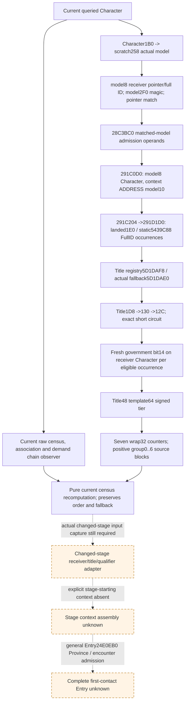

### 当前七组 Title census 原生与消费者验收完成

实际收口时间：2026-10-05T22:06:41+08:00。Source-first当前raw Title census/model-owner关联源e46db613→Rootd2d2d341已接入既有只读查询；完整bridge和newtarget离线 `/WX`、jobs4 below-normal build GREEN148.40秒（native-census-02）。新夹具fix65415a63→Root12a9caf2仅改fake-memory test：query稳定性连续双采样，每帧Provider重置government序列，累计两次Provider/正常10次government；scratch扩到290补query已有custody288读取。生产代码与旧Python用例不改不重跑，整DLL无需因test-only变化重编。新target单独重建GREEN5.89秒；新CTest一次修复后1/1 GREEN0.07秒（总0.11）。

真实生产reader/serializer新JSON22497B，SHA25b7d129abbf535873f88ac935ee1cbf7c5a09c1d4af71982d54bc6951dfd13f；十份输出只消费一次，Z:/gb0 authoritative normalizer→pure seven-group kernel 45checks GREEN。compiled-wire-02/RESULT.json14563B，SHAd6174b5efc5544706f09979a072c24bb77e2fdd1e8a411abee491920244b3fc6。旧aux/nine/其他已通过样本0重跑。Raw census独立ready，outside-tier原值留存但七计数partial；头衔重复/顺序/fallback、实际actor/model-owner关联与短路source读取保留，不拿旧汇总或当前final代阶段baseline。

首次native-census-01因Root错误DLL target名无compile执行；native-census-ctest-01因夹具未模拟第二帧throw穿过noexcept而RED0xc0000409，输出0bytes。Root随后consumer也在byte0 JSONDecodeError，实际消费0份。原失败与empty wire均保留person-changed-stage-census/native-attempt-01-red/RESULT.json和owner ROOT-FIXTURE-FIX-DELIVERY.json；最小fixture修复后才首次实际消费十份GREEN，不能改写失败。新增路径共11项不同native CTests已通过、60份新真实fixture输出已消费通过，资格为static-ready，非game fixture-live。

整DLL归档source12a9caf2-census-qualified-binaries/xar_ck3_bridge.dll：9748992bytes，SHAce472bc34028dc675d9f5c47cf10f6ff65f082387bd93e0be8ebde115277f44a；编译production source为d2d2d341，fixture source为12a9caf2。同档案保留newEXE/wire/cache/result/consumer pins及source差异只有此test的证据，未stage/deploy/inject。前一已推送fc628dca官方CI37319699503 SUCCESS，归档tag archive/g2-background-20261005-round2-pre-rebase保全原编译源；新publication的实际SHA/CI另记，不借上一CI结果。

三条后台依赖继续source-first推进：291F550/291F940人物剩余helper，291C0D0 model10真实reset/显式起始状态，以及月度初始供给/围城/劫掠预算。阶段baseline、实际changed-stage receiver/operands、完整人物/Entry/fullmonthly/forecast仍未完成；无新paused/live或战争loop信用。CK3启动/连接/SDK/realpipe/UI/Steam/profile/save/cache/runtimeprepare/stage/deploy与新增游戏日0；历史5035/36524、G2 5/8、NW2 2/4、natural0保持。日/周rolling，后台工作未耗尽。

## Source closure for the remaining two helpers before observation

Adoption time: 2026-10-05T22:12:41+08:00. The source tree and QUERY-PLAN.json were sealed before production implementation. Both helpers are source-closed research; the same-query optional observer is now being implemented. There is no native/consumer qualification yet for these new fields.

2026-10-05 / ISO2026-W41. Research-only source closure before any observer/counter-policy construction. Parent owns canonical topic/report integration. Exact CK3 1.20.0.3 / Steam25652598 / frozen EXE94B55397ABB687A3DCD436805A5D885E6BE90FA6C693FEB44A9E3BBEEADE02A6, image base140000000; existing freeze identity reused, no whole scan or rehash.

## Caller association and phase order

Cached291C0D0 sets R13=model, R14=QWORD[model+8]=Character, RSI=model+10. After291F0A0, caller ordered80 and guardedAA0, it calls291F550 at291C457, then291F940 at291C462. Both append to this same model+10 receiver. They are further current-person construction stages; these bodies do not create an Entry, establish a before-stage baseline, or imply a complete forecast. The later caller continues at291C467 into additional158/2922070/2922530/conference/291F260 branches: they remain separate, not covered by these two helpers.

Native .pdata splits291F550 into seven contiguous segments covering[291F550,291F940),1008B, and291F940 into three covering[291F940,291FB09),457B. All normal paths and their local initializer branches were captured; these are one logical function each. Parent/source evidence must not mistake the first short segment for a complete helper.

## 291F550: guarded three families, unit100000

First load actual Culture storage slot5D1E2F0. Nonnull storage demands full DWORD Character+B0, low24 capacity+2C/table+20/stride16 pointer+8, exact selected ID+10; native null/miss selects QWORDslot5D1E2E8. Null storage does not demand Character+B0. Selected DWORD+14 must equal43756C74 (Cult), then selected fullID+10 must not equalFFFFFFFF. Wrong magic or minusone skips the entire helper, before government or family reads. No extra positive-ID guard exists.

1. Government-indexed property at291F62C. Physical government getter28C2E10 is reused from the cached237B .3 body. It loads Character storage5C67568/fallback5C67570 once; validates current Character magic+1C=43686172 and fullID+18!=-1; prefers deathData1D0+88, then current1C0+3F8. If neither component exists, it follows full Character key1B8+C8 (orFFFFFFFF if1B8 null) through the same storage, fullID+18, and loops on that selected Character. Invalid Character, or a null selected government after diagnostic branch, returns actual QWORDgovernment fallback5D1E2A8. No observer call or diagnostic is needed.
   Government magic+38=4744624F selects signed32 governmentID+10; native PC pointer is QWORD[Culture+670]+sext32(governmentID)*1C0. There is no native length or nonnegative check in this helper. Wrong government magic uses inline current fallback PC5D65890. Guard5D6588C is the native lazy initializer marker; native initializers rejoin at291F620. Read actual current guard/PC and retain0/-1 partial without initializing. Both selections contribute directly (including initialized empty PC), weight100000, receiver=model+10.
2. Ordered direct property pointers at291F65C. Culture QWORD+90 / signedcount+9C describes stored stride8 pointers. Every occurrence is the PropertyContainer itself, without additional offset/gate; duplicates and order remain. Zero count is actual empty; no unused row reads.
3. Conditional mapped PC occurrences at291F829. Resolve selected first Rite via Character+B4 storage5D1E2F8/fullID+8 or fallback5C67670; second object via first+4B8 storage5D1E300/fullID+8 or fallback5D1E2E0; then selected Rite via second+98 and the first Rite storage/fullID+8, defaulting to the original Rite fallback5C67670 (rather than a failed previously resolved Rite).
   Culture QWORD+230 / signedcount+23C stores descriptor pointers. For each occurrence, key is QWORD[descriptor+20]. Admit exactly if selected Rite's QWORD+7A0 / signedcount+7AC contains this entire QWORD. Reused A11F60 baseline and already-captured3F90910 AVX2 compare complete64-bit entries and return first equal/end; no native finder call is necessary.
   For admitted rows native reads shared inline PC fallback5DC2380/guard5DC2370 initialization state before mapping. Key object magic+38=4744624F permits a scan of the *whole same Culture230 list*, choosing its first descriptor whose key object's fullID+10 equals admitted key object's fullID+10; selected PC is QWORD[first-matching-descriptor+28], including actual null. Wrong magic, or an actual null descriptor fetched from the chosen slot, takes inline fallback5DC2380. The native scanner at291F80F does not independently guard a zero scan-result before its dereference; no-match is not a demonstrated native fallback. Exact pointer membership plus the current row supplies its own candidate in ordinary source state. A readonly unread demanded mapping remains partial rather than emulating an invalid dereference.
   Stored outer duplicates can select the same first mapped PC repeatedly. Every admitted occurrence merges, even an initialized empty fallback PC, at100000. Membership false skips magic/mapper/guard/PC.

Lazy initialization branches only were captured, not invoked: first default291F8D1 rejoins291F620; mapped fallback291F860 rejoins291F7CE. Inline fallback addresses are not pointer slots.

## 291F940: outer-row interleaving and nested mapped unit requests

Resolve first Rite Character+B4 through5D1E2F8/fullID+8 and fallback5C67670; second via first4B8 through5D1E300/fullID+8 and fallback5D1E2E0; third via second98 through the first Rite store/fullID+8, defaulting to original5C67670. The selected third Rite+750 is a membership context, **not the model+10 recipient**. Its QWORD+50 / signedcount+5C selects accepted keys for nested helper4212920. A business name for the second+98 relationship is not established here.

Independently resolve Character+158 through actual storage5D1DAF0/fullID+10 or fallback5D1DAE8. Resolve its full key+2C through storage5D1DE78/fullID+10 or fallback5D1DE28. Selected object's QWORD+178 / signedcount+184 stores source pointers in stride8 order.

For every outer source occurrence, native does the following in order:

1. Read signed32 source+16C. Nonzero admits source+160 PropertyContainer at291FACD, weight100000 to model+10. Exactly zero skips this direct merge; source16C is the PC key countC. Keep negative nonzero admission even if a consumed PC read then remains partial.
2. Always pass source+450 list header, selected Rite+750 context and model+10 recipient to4212920 at291FAE0. Header0 / signedcountC stores inline stride30 descriptors. For each inner descriptor, key=QWORD[row+20]; admit exactly if selected Rite+750's50/5C QWORD list contains key. Zero inner count does not demand membership context fields or keys.
3. Admitted inner descriptor invokes4212800(key, whole source450 header). This cached274B mapper checks key magic38=4744624F; when true chooses the *first row in whole same30-stride list* whose row20 key object's fullID10 equals selected key object's fullID10, then returns QWORD[row28] (including actual null). Wrong magic/no ID match returns inline default PC5DC21B0. Its actual initializer marker is5DC21A4; native checks this marker before magic/scan even if mapping succeeds. Observer reads current marker and PC without initialization.
4. Each admitted inner row merges returned PC at42129AF, weight100000, model+10. No Q-derived, scalar or variable weight appears in either helper. Duplicate inner key identities still produce separate occurrences selecting the first mapped PC.

**Full contribution order is outer0.direct160 -> outer0.inner0/inner1/... -> outer1.direct160 -> outer1.inner...**, not all direct rows followed by all conditional rows. Pure separate direct-family observations are useful independently; full-stage emission needs this nested order.

4212920 is three contiguous segments[4212920,42129D5),181B. Its membership and mapper are now source-closed, including map default/guard. No script callback, trigger evaluator, heap producer or variable-weight path occurs in this helper.

## Native tree and remaining boundaries

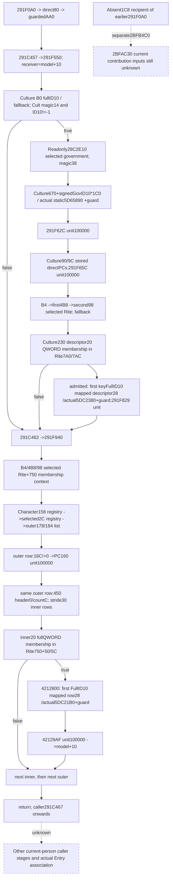

Both later helpers have independently valuable direct current source observations and source-closed conditional selection. They do not consume2BFAC30 or require earlier absent1C8 recipient reconstruction. Existing .2 religion-conversion package proves2BFAC30 call placement but delegates to the native complete evaluator rather than publishes its current contribution collection. Its readonly current source reconstruction therefore remains a separate exact .3 leaf; no new reads were spent on it here.

New EXE I/O is2064B =1920 code +144 narrow.pdata, total lane5173B. One274B4212800 body was redundantly captured after a parallel cached-path search found the old body; this extra is counted and preserved, with no wrong RVA/game action. Future captures follow cached-search results before code read. Other cached caller/A11F60/28C2E10/3F90910 source reused. No unwinds, external initializer leaves, whole-file scan/hash, compilation, old tests, runtime or game actions.

## Explicit person preparation stage baseline source closure

Adoption time: 2026-10-05T22:18:13+08:00. Source ledger, Mermaid and PLAN.json were sealed before the bounded assembler implementation. The existing completed-empty-reset interface remains; the explicit retained-baseline connection is being implemented and has no new validation claim yet.

The useful interface is a **logical post-reset context explicitly labeled
`post_291C010_pre_prefix`**, followed by the existing provider prefix and then
the actual291D1D0 requests. It does not identify an old snapshot as that stage.
Frozen EXE SHA256:94B55397ABB687A3DCD436805A5D885E6BE90FA6C693FEB44A9E3BBEEADE02A6.

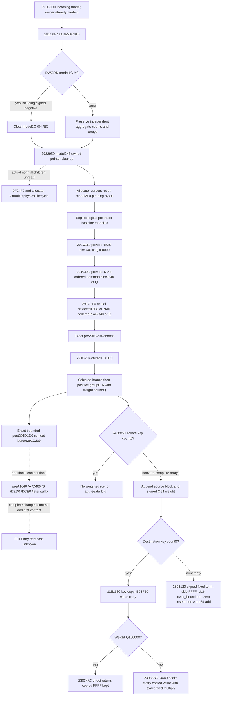

## Ordered source ledger

| Stage | Exact source | Logical effect and required input |
|---|---|---|
| Incoming |291C0F0/F3|RCX model, owner QWORD[model+8]; current model identity alone gives no historical stage |
| Reset |291C0F7→291C010|model+1C !=0 clears weighted count, key count model+84, value count model+EC; otherwise the independent aggregate counts and active arrays survive direct reset |
| Owned cleanup |291C074→2922950|model+248 pointer array, allocator model+240; normal control zeros only owned count model+254 directly; nonnull cleanup/release children remain physical lifecycle unknown |
| Reset return |291C0B7/C0C8|pending byte zero after allocator cursor reset; no context values copied or initialized here |
| Baseline |before291C119|Explicit postreset logical weighted count0, aggregate paired arrays/count. Empty baseline is valid when explicitly supplied; weighted0 alone never implies empty aggregate |
| Base prefix |291C119|provider+1530 block+40, weight100000; empty source skips |
| Common prefix |291C150|provider+1A48, native 16B order; each first pointer block+40 at weight100000 |
| Selected prefix |291C1F0|Actual observed selector18F8 or19A0, native 16B order at weight100000; provider second qword is not a weight |
| Prebranch |291C204|Complete logical prefix result is the actual required input for291D1D0 |
| Selected branch |291D238|Initial flag14 true uses actual selected index/providerFA8 block+40 at100000 |
| Seven groups |291D407|Actual eligible record census; positive signed32 group count in0..6 source order supplies provider1000[group]+40 and signed64 count*100000 |
| Stop |return to291C209|Remaining preparation contributes additional requests. This packet does not call it complete context or full Entry |

291CF50 later swaps model owners, pending flags, context headers, allocator and
owned containers. Therefore a present address, pending0 or zero rows cannot
retroactively prove that present context was the historical baseline.

## Minimal logical input and implementation plan

Extend the existing materialized-prefix module with an explicit stage baseline
and a bounded prefix→291D1D0 assembler. Keep the existing completed-empty-reset
API. Reuse its source-defined copy/merge and the existing signed Q multiply;
factor the fold rather than duplicate the numeric model.

The explicit baseline carries a Character full ID, the exact stage label,
logical context and caller provenance. After reset the weighted count is zero.
The retained branch still requires its actual complete paired aggregate arrays;
negative or mismatched counts remain partial. Source contributions retain native
order, duplicates, signed zero/negative values and original property rows.

An explicitly requested **modeled new reset** may project the source's direct
count stores from supplied entering counts. Nonzero weighted count projects an
empty logical count state; weighted zero preserves the supplied aggregate.
This is a conditional new-stage numeric model, never proof that native cleanup
ran or that a historical current-final snapshot was preprefix. Physical allocator
state is not modeled. A caller can instead supply the explicit postcleanup
logical context. No automatic adapter turns current-final into historical prior.

Empty destination with nonunit weight is now source-closed at the necessary
23033BC continuation: copied key/value order is retained, every copied value
(including keyFFFF) is scaled by the already implemented signed fixed Q helper.
Constants3037000499 and0x29F16B11C6D1E109, fast and decomposed paths, truncation,
store order and normal exit match the existing arithmetic primitive. With
weight100000 the source returns without scaling; nonempty merge still skipsFFFF
after computing its term. First copy does not coalesce duplicate keys.

Scope is logical numeric postimages after supplied normal source requests,
without physical allocation readiness claims. The actual arrays determine the
numeric result; storage capacity remains diagnostic. Other trait/provider
changes, later helpers, full first-contact context, Entry/stat refresh and
calendar/RNG remain separate inputs and unknown branches.

## Read receipt

Reuse v79 caller/reset/writer, v83 insertion, v85 copy/materializer, v86 cleanup
and current state. New necessary scale reads total231codebytes (18B fragment plus
213B bounded continuation). No new metadata was needed. A29B cleanup-entry read
duplicated v86 before that cache was found; it is preserved as an avoidable
attempt, not new research credit. Total fresh EXE I/O260B. Whole EXE scans/hashes,
native builds, old tests, game/process/query/SDK/pipe/UI/Steam operations:zero.
CLI `check --plan` failed before source capture due to a wrong argument; the
correct positional plan check passed. This harness failure remains in receipt.

### 显式人物阶段基线与前缀连接交付

实际采用时间：2026-10-05T22:28:23+08:00。source e68ef8922a535ea188d80654e0f09a309755c295→Root497319d0已合入，source账本/Mermaid先封存并同步frontier。既有materialized prefix保留completed-empty-reset API，新增明确post_291C010_pre_prefix logical baseline；支持weighted0但aggregate非空的实际保留分支，依原生base/common/actual-selected→291D1D0 selected/groups顺序复用共享fold，返回pre291C204和post291D1D0/pre291C209两个有界context。必要23033BC空目标非unit-Q scale已闭合；firstcopy重复keys/FFFF与nonempty merge的FFFF skip分开。不自动将current-final当historical prior或声称cleanup实际执行。

唯一新增production normalizer→assembler→既有six-skill kernel integration一次1/1 GREEN，结果保留aggregate为[9,6,6,6,8,9]、显式新reset清空为[9,6,6,6,8,7]；首group2Q空目标、大数分解与prowess raw80006→cap120已覆盖，缺失baseline和错误current-final stage仍partial，原当前prowess8与输入不变。旧tests、native builds和游戏操作0。本包资格为有界logical stage static-ready，不是完整人物/Entry、native parity、physical allocator/storage、历史stage观测或live。

交付及日周fields保存在第二批actual-entry-context/person-stage-baseline/ROOT-DELIVERY.json、OCT5-W41-FIELDS.json；focused-attempt-01/RESULT.json保留实际测试。新必要EXE code231B、一次可避免的cleanup重复读取29B按实际历史保留计成本而不给新研究信用，总260B；wrong plan CLI和Windows wildcard harness失败已保留纠正，没有capability RED。完整专题：[explicit person stage baseline](battle-person-stage-baseline-12003.md)。下一实际连接是post291D1D0→preA1640/A/D460/B/DED0/DCE0和已闭后缀，各helper输出逐stage续fold，未知与合法空分开。

两条原生observer包继续施工：291F550/291F940 ordered source与monthly post-updater budget，source均已闭合并同步native专题，尚不抢记其native/consumer GREEN。前一census提交74f60838的官方CI37322176165/37322176711已SUCCESS，11个新增native tests和60份新真实fixture consumer资格仍保持，未重复运行。各包完成即普通commit/push；后台入口没有耗尽。CK3/SDK/realpipe/UI/Steam/profile/save/cache/runtime prepare/stage/deploy与新增游戏日0，游戏留给用户，历史5035/36524、G2 5/8、NW2 2/4、natural0保持；日报/周报rolling不倒填午夜收口。

## 2026-10-05 later helper 291F550/291F940 static qualification

Exact CK3 1.20.0.3 / Steam 25652598 / frozen EXE SHA `94B55397ABB687A3DCD436805A5D885E6BE90FA6C693FEB44A9E3BBEEADE02A6`. Source-first tree, Mermaid and query plan were sealed before implementation. Their original source-only receipt is unchanged: `Z:/ck3_mod_rewrite_process_assets/g2-background-round2-20261005/person-later-suffix/remaining-two-helper/SOURCE-ONLY-RECEIPT.json`. This task's EXE I/O remains **2064 B including the recorded redundant 274 B**, lane total 5173 B; no implementation or validation reread the EXE.

Caller 291C457 invokes 291F550, then 291C462 invokes 291F940. Both append to the same actor's model+10 recipient. The optional **later_helpers_291f550_291f940** lives in the existing current source query. It publishes three independently available 550 families (government indexed, culture direct, culture mapped) and independently available 940 direct/mapped families. Pure emitters retain every occurrence, each unit weight 100000, and native 940 order **outer0 direct160 -> outer0 inner450 -> outer1 direct160 -> outer1 inner450**.

The new fake-memory target double-reads and compares the complete source snapshot on a fixed frame, then serializes actual production DTOs. Its three genuine wires were consumed once through the adopted production normalizer and emitters at `64bb7db9054fc155839c7c30528405c6b8f4addd`. Full output is `[101,201,201,301,301,301,401,501,501,601,701]` (11 occurrences). The selected lazy-default partial case retains 550 direct2 + mapped3 + 940 direct2 (7 independently usable occurrences). The whole-Culture skip plus empty inner spans emits `[401]` (1 occurrence), without demanding skipped source operands.

Full QWORD membership and first full-ID mapping preserve pointer distinctions and duplicates. Actual unused default guards 0/-1 do not reduce readiness of valid selected mapped PCs. When an uninitialized default is selected, the observer retains its actual empty PC bytes, guard and partial status; it performs no initializer, native callback, mutation or contribution append. The source receipt does not invent a 550 no-match native fallback.

Validation: one new compound Python case **1 passed / 1.56 s**, once. Initial central `/WX` build `native-final-frontiers-01` was **harness RED 144.29 s**, due to a fixture `optional<uint32_t> == 0` signedness warning; the original JSON/log are retained. Child fix `c28d683ad62183e95d4827972a5b8a18f94bf402` changes only that literal to `0U`. Necessary central incremental `native-final-frontiers-02` then passed full DLL and both new targets **8.351 s**. The two new CTests first ran **2/2 GREEN / 0.49 s** (helper **0.14 s**). New genuine-wire consumer **3/3 GREEN / 0.292 s**, exit0. No old tests or Python case were repeated.

Evidence: `Z:/ck3_mod_rewrite_process_assets/g2-background-round2-20261005/person-later-suffix/remaining-two-helper/FINAL-QUALIFICATION.json`; consumer `Z:/ck3_mod_rewrite_process_assets/g2-background-round2-20261005/person-later-suffix/remaining-two-helper/native-wire-integration-attempt01/RECEIPT.json` SHA `5676fa37b13a67c605137b5f5209d3641025e64f4f3eeb58e04342dc1f36550d`. Source-only child `e3dc8920755bc4ddd612c6241d1028ea661543a2`; implementation child `cb57a5a319a37620e24a7c094f7d38d7c49643b0` adopted as `69a36e5b`; final native/consumer source `64bb7db9054fc155839c7c30528405c6b8f4addd`. Root owns shared canonical/report merge and push.

Readiness is **static-ready** for these two independent source stages, using native fake-memory and adopted production consumers. Whole current-person source remains partial. Earlier absent1C8 -> **2BFAC30**, remaining caller beginning **291C467**, and full baseline/actualEntry/downstream replay remain concrete next inputs. No CK3/game/SDK/pipe/UI/Steam/runtime activity occurred. Campaign stays **R0046/h9052/raw53265168/campaign5035/36524**, **0 new game days**; no live or complete-person/Entry/forecast claim.

### 后台三个功能包完成：人物后缀、显式阶段基线、月度预算

实际采用时间：2026-10-05T23:06:01+08:00。逐项核对22:02实际追加计划：291F550/291F940 source/observer/consumer包完成；explicit baseline/prefix/291D1D0包完成（此前497319d0/8b01a769）；monthly post-updater budget包完成。没有倒填00:00计划，本日/本周报告仍为rolling。这些包解决当前人物贡献与扣兵预算所缺的可施工输入，依原生source账本/Mermaid先封存再实现。

人物同查询新增`later_helpers_291f550_291f940`，保留550政府/文化direct/mapped和940每个outer的direct→inner原生顺序、FullQWORD membership、firstFullID mapping与重复项。3份新原生序列化输出一次走生产normalizer/emitter GREEN，完整11条、partial独立7条、known skip/zero span1条；未使用的lazy default未初始化不影响已选有效PC，实际选中未初始化default保持partial，未调用initializer。source子提交e3dc8920、实现cb57a5a3→Root69a36e5b、fixture修复c28d683a→Root64bb7db9。一个新Python case1/1 GREEN1.56s，不重复旧case。

月度同查询新增`monthly_loss_budget_inputs_v1`，采集admission、loaded vectors、fleet/date、实际commander/Province ordinal；新条件kernel先计算post-stock，再按source选table/modifier，最后独立取整siege/raid，对已提供tier/DATA的复制frame连接既有四轮writer/refresh。新Python生产service case验证current budget0/原序列final12保持，derived budget1/条件final11成立。7份新原生生产serializer输出一次走实际service/normalizer/kernel GREEN0.034064s，供给预算为4/0/6/0/0/0/null，siege与raid各1保持。该新native fixture未绑定旧tier/DATA，预算ready不冒充nested sequence ready；Python新增case单独验证这些现有输入的连接。实现0e64b517→8620dbc9；7bf52472→e6b4219d移除与loaded table无关的regiment数量限制，仅保留source非正count与实际读失败。

中央native-final-frontiers-01 /WX初次harness RED144.2888s为helper fixture的optional<uint32_t>==signed0引发C4389/C2220；原receipt/log已保留，最小修复为0U，未改生产helper。source64bb7db9054fc155839c7c30528405c6b8f4addd必要增量完整DLL+两新target GREEN8.350974s（此值不是clean build耗时）；两项新CTest首次2/2 GREEN，helper0.14s、budget0.09s，总0.49s。随后仅消费新增3+7份wire，没有重跑此前passed路径。本次后续累计13项不同新增native CTests、70份新actual production fixture JSON消费GREEN，旧资格直接复用；原stage baseline新integration也已1/1 GREEN。8b01a769的Official Runner CI37325149320已SUCCESS。

完整DLL9807360B，SHA256`72a070cddb334f875a391d3f9dc48c25df559ccd897925751f4abb83bb424c54`。两个新fixture EXE、10份原生wire、CMakeCache、native-msvc-result、初次RED/后续GREEN与两consumer receipt已归档到`Z:/ck3_mod_rewrite_process_assets/g2-background-round2-20261005/source64bb7db9-final-frontiers-qualified-binaries/`，索引HASHES-AND-QUALIFICATION.json。构建使用只读已保存v73 115 feature flags、/WX、jobs4 below-normal，是普通离线编译；没有runtime prepare/stage/deploy。归档首次metadata的Windows separator assertion失败保留在索引，使用Path.parts恢复既有拷贝，没有重跑编译、测试或消费者。

最终资格为各有界查询/纯kernel的static-ready。actual_loss=false、actual_post_stage_current=null、full_monthly_applied_loss_ready=false，人物whole-source仍partial。接续后台入口明确保留：earlier absent1C8→2BFAC30、caller291C467以后、post291D1D0逐stage接到已闭A/B/后缀并关联actualEntry、其他monthly effects；实际post-updater/post-writer读取与整套paused/live验收继续等用户结束占用。无需以缺少实机停止这些source/model施工，也没有宣称后台工作耗尽。

game/SDK/realpipe/UI/Steam/profile/save/cache/runtime部署操作0、新增游戏日0。Z机器历史R0046关闭、v73 h9052/raw53265168与5035/36524、G2 5/8、NW2 2/4、natural0保持；其他机器单独授权的日报记录保留，不外推本机live。相关实现与本次专题/报告一起普通commit/push到master；最终发布SHA、archive tag和CI回执保存于外置FINAL-PUBLICATION.json。

专题：[人物阶段基线](battle-person-stage-baseline-12003.md)、[人物后缀与frontier](battle-first-contact-person-preparation-frontier-12003.md)、[月度budget/writer](army-attrition-soldier-writeback-12003.md)。最终子包资格：第二批person-later-suffix/remaining-two-helper/FINAL-QUALIFICATION.json SHA97eece0edbdfc89ee1b4881611a33e4c94cdc9fc4bbd51580372e1627caa53aa；第三批monthly-budget-source/ROOT-DELIVERY.json SHAbc88d0aad351fef88342cf1f76e5f82bf1108b815c03a34e2cbca4c5ad0b93ba。日周fields已分别由工作包代理封存，由Root合并，没有漏报。

## Round4: source-closed sparse tail input families before observation

# Current-person caller 291C467 onward: first closed tail source leaves

Source status: static-confirmed exact CK3 1.20.0.3 / Steam25652598 / EXE SHA 94B55397ABB687A3DCD436805A5D885E6BE90FA6C693FEB44A9E3BBEEADE02A6. Worktree Z:/gbs1 starts at published614440b9a7e37dc759ae6003a666aebb1a3f3875. This initial packet reuses cached full caller291C0D0 and raw getter28C2E10; new EXE I/O is 0 B. Independent helper source lanes preserve their own new read ledger rather than altering this initial 0 B receipt.

R13=model, R14=QWORD[model+8]=Character, RSI=model+10 recipient. Closed earlier helper291F940 returns at291C467. The remaining caller is not a single known contribution: it contains independent helpers and direct families, several temporary evaluated maps, and native receiver appends. Current final storage is not a pre-tail baseline.

## Closed government family at291C5B7-291C620

Read QWORD[Character+1C0]; actual null skips both direct leaves. Nonnull calls28C2E10(Character). Its already-closed raw selection (Character magic1C/fullID18; death1D0+88, land1C0+3F8, or relay1B8+C8 through Character store5C67568/fallback5C67570; final government fallback5D1E2A8) is reused through the readonly observer. No native getter/diagnostic/initializer is called.

Read selected government DWORD+38. Wrong magic4744624F skips both contributions. Matching magic contributes government+870 at291C5E4 with unit100000. Then native caller rereads QWORD[Character+1C0]. Actual null skips additionalA30. Nonnull reads QWORD[land+1C0], DWORD[subcarrier+C]. Only when that magic equals5362436F does it demand signed32[subcarrier+8]; matchingmagic and fullID!=-1 skipsA30. Wrongmagic or fullID==-1 contributes the same selected government's +A30 at291C61B, unit100000. The subcarrier native pointer has no null skip in this caller; unreadable/null demanded object is unavailable, not a manufactured false predicate. The two contributions preserve this source order.

## Closed weighted carrier family at291CB70-291CC6B

Read QWORD[Character+1B0]. Actual null is a known empty family. Nonnull reads signed32[carrier+274]; -1 is a known skip before registry demand. Other full keys are preserved exactly. The selected object resolves via actual storeQWORD5D1E310, capacityDWORD+2C and tableQWORD+20, low24 index/16byte slots/pointer+8, then exact fullID DWORD[selected+8]; native miss uses QWORD5D1E2D0. A failed demanded read does not establish a native miss.

Read signed32[selected+63C]. Exactzero skips before QWORD[selected+630] demand. Nonzero native path acquires the native readerlock+858; readonly observer does not change that lock. It reads the actual current array630/count63C, stride16. Every row contains QWORD PC pointer at+0 and signed64 weight at+8. Caller291CC49 invokes2438850(model+10, PCpointer, rawweight). Preserve every native occurrence, duplicate PC pointer and weight including zero/negative; the weight is not converted to unit100000. Read each PC using the existing paired key/value scheme. Negative/nonrepresentable stored counts retain raw count and unavailable status instead of becoming a knownempty family. This is a separate source stage from government870/A30; intervening stages remain explicit.

## Remaining native order and research entries

291C4C7->2753860 after Character158/fullID10 selected firstbyte218 gate; first+1D0 is the receiver source and Character isthirdarg. Then291C4D2->2922070;291C4DD->2922530; Conference Character1C8+80/fullID8 through5D1...? magic436F6E66/fullID!=-1 gates291C548->24B1D00;291C553->291F260. Then signed carrier2F8 with28BC5A0 chooses provider11F8 bucket or actual fallback5D1E0B0, Def+40 unit contribution291C5B2. The newly closedgovernment870/A30 follows. The middle region includes qualifier-count evaluation28BC0D0 and repeated Def+40 at291C68D,291C6CF->291FB10, then28AA8B0 list and2530DD0 predicate selecting+D8/+298. Flag20 branches include currentland458 related A20/BE0 list and temporary model slices291FE20/2920020/326A8E0 with291B3D0. After291CB0F->2920310, signed16Character192 loaded thresholds5C69FE4/5C69FE0 choose provider16A0/16B0 or actualfallback5D1E0B0 and291CB60 Def+40.291CB6B->2920850 precedes the newly closed weighted630 family. Then291CC71->2920B50;2BCA620 selects a provider bucket/+1690/fallback and291CCD2 Def+40; government bit29/title318 negative/312A950 contributes291CD8D;291CD98->2920D60,291CDA3->2921350,291CDAE->2921020; Character1C8+20 and signedb70 chooses table3D8/stride340 or31937C0 fallback and291CE06 contribution;291CE11->2921AB0,291CE1C->29226A0; governmentbit19 andDomainb68 throughB01F90/25B9100 gates provider16C0 contribution291CE90;291CE9B->291E3C0; six evaluated attributes2BA95E0 produce providerF08/F58 contributions291CEE4/291CF16. These untranslated dependencies remain research entries, not omitted contributions.

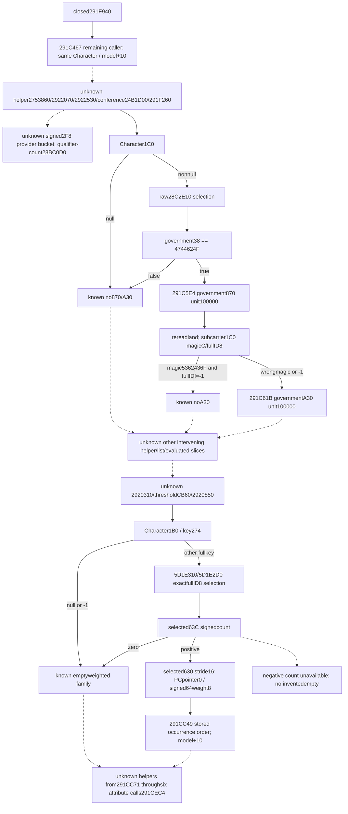

The existing fields for291DED0 and291DCE0 are already available in current_context_task_position_inputs/evaluated parser and must be reused. Stagechain owner is isolating291D460 trait-growth evaluated vector; that real missing observation is the highest current dependency. Another source-only agent owns earlier absent1C8->2BFAC30 and this owner implements it after closure; this packet does not reread those functions.

## Oct6 five-leaf current-person integration adopted (2026-10-06T00:21:35+08:00)

# Current-person five-leaf source and implementation increment

Source-first research started on 2026-10-05; implementation delivery and first focused Python qualification occurred on 2026-10-06, Asia/Shanghai. Exact executable remains CK3 1.20.0.3 / Steam 25652598 / pinned SHA-256 `94B55397ABB687A3DCD436805A5D885E6BE90FA6C693FEB44A9E3BBEEADE02A6`. All source work used cached disassembly or necessary frozen-file spans. No CK3, SDK, pipe, UI, Steam, process inventory, runtime preparation, staging, deployment, profile, save or workshop cache activity occurred.

Source trees and query plans were persisted before implementation: `SOURCE-TREE-INITIAL.md` / `QUERY-PLAN-INITIAL.json`; `tail-prefix-helper-source/SOURCE-TREE.md` / `QUERY-PLAN.json`; `tail-middle-helper-source/SOURCE-TREE.md` / `QUERY-PLAN.json`; `trait-growth-side-source/SOURCE-TREE.md` / `QUERY-PLAN.json`, followed by `SOURCE-CLOSED-ADDENDUM.md` / `QUERY-PLAN-CLOSED.json`; and sibling `person-absent-recipient/SOURCE-SEAL.json`, `SUBMITTED-DTO-PLAN.json`, `GUARD-SOURCE-PLAN.json`. Initial source receipts remain unchanged; addenda close subsequently researched leaves.

## Actual trait stage 291D460

Character `F8` ordered DWORD trait IDs / signed count `104` retain duplicate occurrences. Definition selection uses the actual trait database slot `5C67528`, indexed array `50` / count `5C` and fallback `5D1E318`. Each occurrence folds the complete `30E49F0` temporary PropertyContainer, then its classifier contribution. Composite inputs include base PC, independently admitted B/A conditional records, and current growth. The growth header uses first matching trait occurrence, wrapping preceding-definition track counts, Character aux `140/14C`, and the actual flag `1A5`; returned positive count does not truncate the original all-track loop. Positive XP admits only the threshold prefix through the first larger threshold; nonpositive XP skips level definitions.

The actual side call is RVA `02BD84A0`. It hashes the entire TraitDef QWORD pointer with native FNV-1a32 and probes the selected A `+950` map with raw signed mask and physical forward probe order. First full-pointer equality selects kind `0` (skip), kind `1` (provider `1620+40`) or any other nonzero signed kind (provider `1630+40`). Cached helper `291B690` copies the chosen PC, changes descriptive metadata, then calls `2438850` with unit weight `100000`; no hidden row `18/20` weight is invented. Pure output interleaves each nonempty composite and admitted nonempty side in trait occurrence order. Empty trait count releases a known-empty stage without reading selectors, providers or growth inputs. Complete composites remain independently usable if side capture fails.

## Absent 1C8 cached recipient

Present Character `1C8` is an independently ready not-applicable skip. Absent `1C8` resolves associated B4 by full native ID. Cache DWORD `440 != 0` admits current maps `430/458`; cache zero remains an explicit derived-input seam and never consumes stale maps or runs an initializer.

Cached maps use 24-byte buckets and scan until the first positive occupied count has been gathered, retaining raw bucket indices. `430` entries use full pointer keys, trait ID `keyObject+10`, and signed Q64 values; `458` maps full pointer keys to full QWORD linked IDs. Actual Character trait membership and selected QWORD membership list control the multiplier at slot `5C696F8`. The multiplier is demanded only for a nonzero linked ID in a nonempty membership list and an actual full-QWORD member. `2BFFE10` is insert-or-assign: equal keys replace the prior value. The wrapper then ADD64-sums final values, adds actual effective PC key `25D`, and clamps signed lower-first with slots `5C68E00/5C68DF8`.

Actual current context is carrier `258` model `10` only if model `8` equals this Character, otherwise inline `5D67B90` guarded by DWORD `5D67B80`. Absent membership inline header `5D67E40` is guarded by DWORD `5D67E38`. Guard zero/minus-one retains captured bytes and marks demanded lazy input unavailable; the initializer is never called. Owned model context does not demand the unrelated inline guard. The available cached scalar is forwarded in the same query into existing `helper_291f0a0.manager_range`, preserving actual native range selection and exposing its consumed PC. This is an input unlock, not merely an extra receipt.

## Tail prefix 2753860 and 2922530

`tail_prefix_2753860_2922530` keeps independent helper readiness. `2753860` preserves first-character byte `218`, the same-byte native recheck, source definition pointer `1D8`, government mode `80C` / relation pointer `800` or actual default slot `5D26D50`, owner `1E0/160`, and the actual holder relation traversal. Only an admitted owner appends definition PC `40` at unit weight.

`2922530` resolves source `220`, validates magic `38`, then preserves actual table `208`, signed count `214`, requested signed index `228` and native wrapping clamp. No invented positive-count gate is added: count zero can select physical index `-1` if the actual backing address is readable. Three fixed source positions remain `D60` when byte `280<3`, unconditional `F20`, and `10E0` when owner `160` equals Character `18`, in this order. Actual empty PCs remain unit append requests.

Required helper `2922070` is source-closed by the same bounded source packet but its collector is a subsequent implementation package. The full contiguous tail cannot bypass it.

## Middle helpers 291F260 and 291FB10

`middle_helpers_291f260_291fb10` preserves four independent 260 families in native order: `rank_138`, `rank_118`, `rank_158`, `rank_178` with weight keys `45,44,46,47`. Signed score/threshold rank selects the actual manager vectors or fallback `5D1E0B0`. Definition DWORD `4C` nonzero gates PC `40` and weight reads. Current effective PC uses the same actual model ownership/default selection. Native first lower-bound key occurrence supplies weight `wrap64(100000+value)`; missing key gives `100000`. Zero, negative and wrapped weights remain requests.

`291FB10` gathers the preferred SubC, then actual list `218`, then list `248`, preserving duplicate contexts. Each admitted context gathers modifier PCs with actual owner/token gates, then always its terminal PC, including empty terminal PCs. The complete gather is grouped globally by full PC identity: reverse last-occurrence order, multiplicity times `100000`, and actual last block reference. Partial input cannot manufacture global grouping; complete context/family raw gathers remain separately available.

## Government and weighted tail leaves

`tail_direct_291c5b7_291cc49` exposes independent government and weighted carrier families. Actual Character land gates raw government selection and magic `4744624F`; admitted government PC `870` precedes independently guarded `A30`. Good SubC magic `5362436F` and full signed ID other than `-1` skip A30; bad magic or exact `-1` admit it. Failed demanded reads retain earlier captured PCs.

Carrier `1B0` / signed key `274` controls full-ID registry selection at `5D1E310` / fallback `5D1E2D0`. Exact zero signed count `63C` skips array `630`; positive rows preserve physical 16-byte order, actual PC identity and raw signed Q64 weight, including duplicate PCs and zero/negative weights. Negative count remains partial. Neither this sparse leaf nor the middle sparse leaf claims a complete caller suffix across intervening unobserved calls.

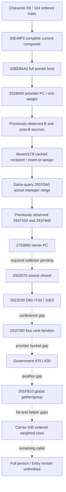

## Costs, validation and qualification

New physical frozen EXE reads owned by this lane and its children: prefix `6672 = 5568 code + 1104 pdata`; middle `2540 = 2168 code + 372 pdata` (includes preserved 120-byte unsuccessful metadata lookup); trait `336 = 240 code + 96 pdata`. Total own new I/O **9548 bytes**. Sibling cached absent source receipt contributes separately **5029 = 4669 code + 360 pdata**; aggregate source packets **14577 bytes**, without charging sibling reads twice. Trait search reuses sibling's existing 128-byte helper; no additional EXE read. Main caller/government source reused cache at zero new I/O. No full scan, full hash or runtime observations.

Implementation: Python contracts/shared normalizer `c688d593805db8540ea75eac58f02a77698c4057`; native same-query integration and new fixed-memory aggregate fixture `29572ee976a63ca2ff7796312cf7f95b49a63360`. Fixture-only followups `cfdfec4cfc38c38e54882f5d1c15a2cd5bd2708f` create output directories; `25a25dee5dd7531d41ed258877be09303de83565` fixes actual MSVC native-width fixture warnings. Sibling pure cached recipient prerequisites remain `a0f4d53a37eef2d7047a3cb669a4a664e62d5ef2` and `db8a174269305f96a6eff7954e7b4bdb04b462a0`.

The sole new focused Python case ran once on Oct6 00:03:55: **1/1 GREEN**, pytest 0.36s, receipt wall 0.85455s (`focused-python-attempt01.json`). First central native attempt `native-round4-core-01` was **harness RED 172.1268s** from two new fixture integer conversion warnings under `/WX`; the original log remains retained. Native compilation/first CTest and the one 26-wire production consumer are pending Root qualification. Do not label native integration static-ready until that qualification succeeds. No old test or actual-wire path was rerun.

The new CMake target and CTest are both `xar_ck3_12003_person_tail_sources_test`; actual wires go under `ck3_12003_person_tail_sources_wire/{tail-direct,tail-prefix,middle,trait,absent}` (4+3+3+4+12=26). Each fixture compares two complete same-frame snapshots with native callbacks null. `consume_actual_wires_once.py` will import Root production normalizer/emitters and the cached pure kernel only after Root reports native GREEN.

Readiness remains source-closed implemented candidate with one focused Python GREEN and central native qualification pending. Full current-person composition, Entry, forecast policy and production-live observations remain unfinished. Next exact functional inputs are collector `2922070`, conference `24B1D00`, signed provider bucket at caller `291C5B2`, qualifier `28BC0D0`, unknown list/helper stages after `291FB10`, and subsequent caller suffix after weighted `291CC49`. Uncached recipient `440=0` is being developed independently from sibling source ledger; no stale cache or initializer is used as its substitute.

## Qualification addendum, Oct6 00:16 Asia/Shanghai

Root's necessary incremental `native-round4-core-02` is **GREEN 9.400365s**, full DLL plus four new targets at exact source `89cb683dbed31bad3bc0c008ea525faf1db08db0`. First new CTest batch is **4/4 GREEN, total 0.51s**; this aggregate target is **GREEN 0.13s**. The original `native-round4-core-01` harness RED 172.1268s remains preserved. The only production candidate changes after the original build were the two fixture-only commits; no production model changed to suppress the warning.

Production consumption of the 26 unique new genuine serializer wires is now **GREEN**. `actual-wire-integration-attempt01.json` preserves a consumer harness RED 0.205563s after six successful absent wires: the scripted assertion read `recipient_source` inside `manager_range` instead of its actual parent helper field. The consumer path was corrected; `actual-wire-integration-attempt02.json` is GREEN 0.204498s and consumes only the failed member wire plus 19 previously unexecuted wires, explicitly skipping the six successful wire cases. No passed old or new wire was rerun.

The combined results verify direct-tail actual duplicates and weights; prefix signed count-zero index `-1` and unconditional empty requests; four independent rank families with zero weight and first duplicate key lookup; FB10 global reverse-last sequence `[empty,403,402,401]` with weights `[300000,100000,200000,200000]`; D460 occurrence-interleaved values `[112,300,200,400,112,300]`; independent composites during partial side input; and all 12 actual absent source cases. The available cached scalar `1300000` reaches the old manager-range selector and emits its actual PC value `777`. Both native and Python scalar kernels agree, including full-QWORD nonmember, empty, guard, owned model, decomposed signed minimum multiplication and lower-first clamp cases.

Qualified status is now **static-ready for these independently useful same-query input primitives**, supported by central fake-memory source/serializer and production consumers. There is no new paused artifact and no live readiness claim. Full current-person fold, Entry and forecast remain unfinished. Subsequent helper `2922070` has a concrete remaining comparator adapter source seam (`1A96FD0/1A97160/2922D20`); its prior source-only conclusion about the Character sort field requires the adapter closure, which is being corrected through necessary narrow frozen-file reads. This later package does not alter the current 26-wire qualification.

Root central compiled source89cb683d, four new CTests firstGREEN and 26 unique production wires qualified; final receipt/REDs are archived in `Z:\ck3_mod_rewrite_process_assets\g2-background-round4-20261005\source89cb683d-core-native-artifacts`. Whole suffix/Entry remains unfinished. Subsequent2922070 work found a concrete comparator-adapter source seam; earlier source-closed wording covers the known gather/admission portion, and complete sort operand/collector remains the next active package. No source or test is rerun for this adoption.

## Required input continuation adopted (2026-10-06T01:22:10+08:00)

The following candidate ledger preserves its original pending qualification. The dated central qualification immediately after it supersedes that pending status.

# Required 2922070, conference and uncached-recipient continuation

All work and first qualification for this continuation belong to 2026-10-06 / ISO week 2026-W41. CK3 remains untouched. Exact source remains 1.20.0.3 / Steam25652598 / pinned SHA `94B55397ABB687A3DCD436805A5D885E6BE90FA6C693FEB44A9E3BBEEADE02A6`. Source trees, Mermaid and query plans were sealed before code in `person-tail/helper-2922070/`, `person-tail/conference-24b1d00-source/`, and sibling `person-absent-recipient/UNCACHED-IMPLEMENTATION-SOURCE-PLAN.json` with its native topic.

`helper_2922070` closes the required source between 2753860 and 2922530. It preserves the government/land/SubC whole gate, physical recursive descendant walk and mapped holder filters, stable unsigned Character ID18 order, adjacent whole-pointer dedup, first matched membership and full DWORD output admission, then stable unsigned source ID10 order. The comparator adapters pass Character+10 or source+8 to the common +8 getter; this closes the earlier missing argument proof. Equal IDs retain stable order. Final source rows are not deduplicated. Native row order includes skipped ordinal gaps; signed count-zero indexing can select actual row index -1; empty initialized BA0 remains one unit request. Complete collection remains observed during a later PC read failure. The new pure forwarder is public at the existing tail-prefix module as well as its dedicated module.

`conference_24b1d00` corresponds to actual caller 291C548. Character1C8+80 supplies Conf ID, or exact -1 on null carrier; registry/fallback5D1EB78/5D1EB50, Conf magicC436F6E66/fullID8, and the helper's own Character magic1C/fullID18 gate reachability. Mapper327BB90 uses Conf38 and signed Conf60: active records are scanned backward and the first eligible reverse row selects the last physical threshold<=target. Otherwise actual inline54EBAB0 uses raw guard5D71B94; no initializer is called. Matching current/relation IDs, then conditional fullQWORD220 identity comparison, selects the first two PCs; owner/common selects third+570/+730; fourth is unconditional+8F0. Exactly FOUR unit requests appear in order `classified_owner`, `classified_common`, `owner_common`, `unconditional`. Last two remain independently available without Conf68/relationship equality; mapped records do not demand the unused inline guard. Guard0/-1 retains actual inline PC bytes and unavailable status.

`uncached_recipient_inputs` supplies the missing cache440=0 input families, without reading stale cached430/458 or executing their initializer. Dedicated physical seed, active, removed and associated-context observations feed the ordered reducer; derived temporary maps remain computation receipts. Actual cap, fallback key/object, native multipliers and nested physical downstream traits/membership/guard/aggregate/clamp inputs are observed in the same query. Active and seed-boost multiplication uses the separately source-closed MAX-operand native decomposition; cached downstream arithmetic keeps its MIN-operand kernel. Stable native priority/value/key ordering and exact tie behavior are preserved. The available uncached scalar forwards to old `helper_291f0a0.manager_range` with source tag `absent_1c8_2bfac30_uncached`; the original cached440zero raw leaf stays partial. Top-level readiness accepts the independently available uncached alternative rather than mislabeling a derived map as an actual cache. Its first new wire expects scalar660000 and actual managed PC777.

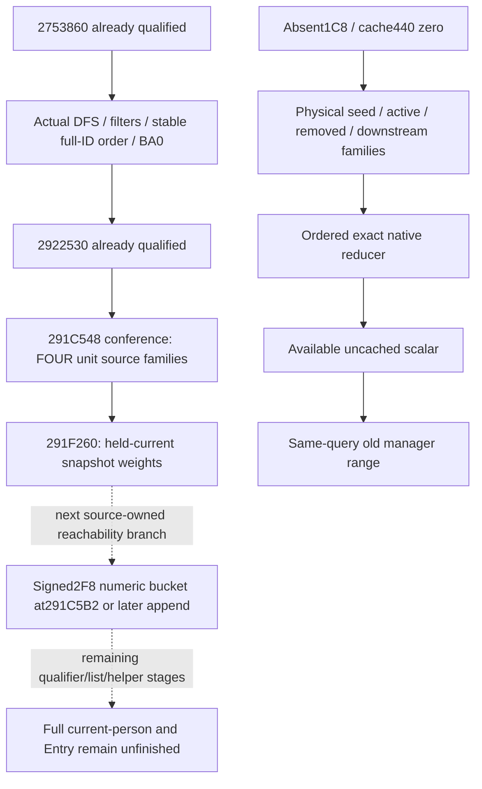

The 291F260 request weights qualify held-current, same-query snapshot operands. The current getter28C3AE0 proves Character1B0/carrier258/owned model8/model10 or guarded inline selection. It does not alone prove that this installed pointer equals a newly evolving caller R13+10 at each earlier helper during a future rebuild. Existing pure stage results therefore retain their conditional held-current scope. Newly source-proven stage operand re-evaluation is a separate functional increment; no old numeric/kernel test is rerun to manufacture that claim.

New source reads for required/helper and conference are **5962 bytes**: 2922070 adapters4330=3826code+504pdata; conference1632=1392code+240pdata. Their earlier frozen prefix6672 bytes remain separately preserved. Sibling uncached lane reports total19849 bytes including its earlier cached source; do not add the cached5029 again. Subsequent provider-bucket source reads87 bytes are a separate source-only next package and are excluded from this target's source costs.

Candidate dependencies: helper pure24b70e4b; conference pure754edac6; same-query native7066d25f; sibling uncached originalb5801f24 (its source-only prerequisitebf98a57f); shared uncached glue33d7d478. New target and CTest are both `xar_ck3_12003_person_tail_continuation_test`; output `ck3_12003_person_tail_continuation_wire/{helper-2922070,conference,uncached}` has **9+7+11=27 new wires**. This target has not yet run. Root owns the sole central fullDLL/newtarget /WX build; after GREEN, parent consumes only 16 helper/conference wires, sibling only 11 uncached wires. Prior 26 wires and prior focused cases are not rerun.

Independent pure-chain increments already reported by their owner: actual required2922070/through2922530 case 1/1 GREEN once, source-shaped singleton, immediate frontier `post2922530_pre291C4E2`; conference/held-current-rank case 1/1 GREEN once at00:50:44, frontier `post291F260_pre291C558`, with held-current scope stated above. Sibling uncached focused case33checks/1pass GREEN0.35s; original collectionRED and earlier pre-large-vector receipt remain preserved. Native and actual-wire qualification for this candidate remain pending. No production-live/full-person/Entry claim is made.

### Central compiled qualification (2026-10-06T01:22:10+08:00)

Exact source `3fb869c751d9050caffa790716a332ca71238c1a`: full DLL and three new targets GREEN in necessary incremental 8.0160481s after retained first harness RED179.2425943s. The conference fixture omitted the actual context-source declaration header; ed483d93→3fb869c7 adds that one include, with no production change. First three new CTests are 3/3 GREEN, total0.39s. This target is GREEN0.11s.

All27 new production wires qualify: parent16 helper/conference once GREEN0.2159496s, sibling11 uncached once GREEN75checks/process0.27675s. Old26 wires and old focused cases are not repeated. Physical uncached source gives660000 and actual manager-range PC777 through the source-tagged same-query forwarding. The original cached zero branch stays partial rather than using stale cache. Prior collection/fixture/consumer REDs remain preserved. Held-current weights, complete person/Entry and live boundaries above remain explicit. Archive and final seal: `Z:/ck3_mod_rewrite_process_assets/g2-background-round4-20261005/source3fb869c7-person-ordinary-association-native-artifacts/FINAL-PRODUCTION-QUALIFICATION.json`.

## First compiled and actual-wire qualification, 2026-10-06

The pending implementation snapshot above is preserved. Root exactsource `47ecd200e6ef72d46c4d58e1ed7378a76aebae21` passed the first /WX fullDLL+five-newtarget build in195.8294221s. First five new CTests passed5/5, reported total2.75s (wrapper wall2.7806436s), completed18:16:47UTC. No new harness/capability RED occurred in this batch.

Own first production consumer passed the six new provider wires in0.186941s. Sibling's separate first consumers passed qualifier18/172checks and list14/130checks. Thus **38 unique new actual wires passed exactly once**; old27/26/cached wires and prior focused cases were not rerun. Native/wire/module SHA receipts are indexed by `FINAL-PROVIDER-QUALIFIER-LIST-QUALIFICATION.json`; final Oct6/W41 fields are `FINAL-PROVIDER-QUALIFIER-LIST-DAY-WEEK-FIELDS-20261006.json`. Dedicated qualifier/list packets also retain their compiled qualifications and canonical appendices.

The real-normalizer pure stage chain now reaches `postList2530DD0_pre291C7A7` with prowess51 in its distinct new case. Unknown conditional row2 preserves prowess50 and the exact completed prefix; later rows remain independent, with actual root/named/evaluator identities. The known list output preserves duplicate IDs, ID0, sentinel skips, per-rowunit100000 and selected initialized PC bytes; actual heldscratch source can remain ready with the unused staticdefault guard0. Nonzero15C trigger evaluation and the actualfalse298 branch remain unobserved.

Qualification is **static-ready compiled readonly/fake-memory primitives and bounded held-current pure stages**. Complete future-person/Entry/forecast and production-live observations remain separate. Root owns its actual Robert runtime; this background package performed zero game actions. Next bounded source packet closesC7A7/C8AE FE20/2920020 temporary folds and refreshed slot168/170 inputs, with2710B new reads accounted separately.
