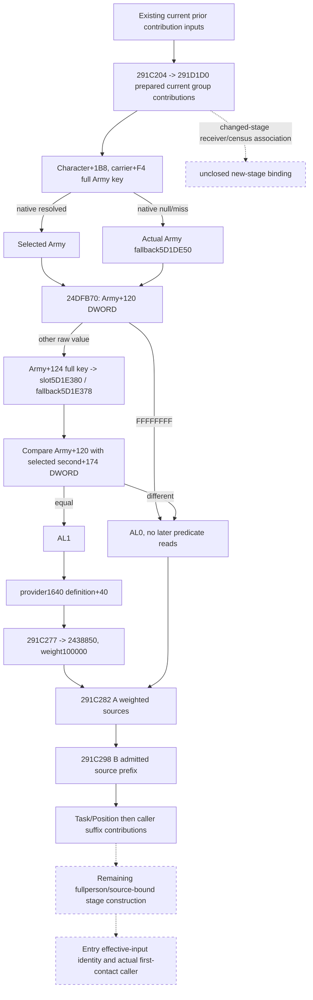
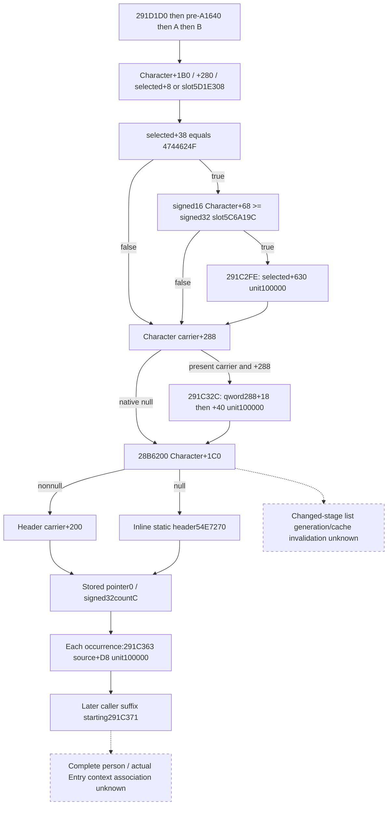

# First-contact person preparation frontier, exact 1.20.0.3

2026-10-05 / ISO 2026-W41. This source package closes one missing native predicate before the existing A/B context sources and specifies the smallest additional current observation. It does not change the source freeze or claim a constructed Combat Entry.

The exact build is CK3 1.20.0.3 / Steam25652598, frozen EXE SHA-256 `94B55397ABB687A3DCD436805A5D885E6BE90FA6C693FEB44A9E3BBEEADE02A6`, image base `0x140000000`. The reused source file is `Z:/ck3_mod_rewrite/artifacts/migrations/2026-10-02/installed-build/binaries/ck3.exe`. The package is at `Z:/ck3_mod_rewrite_process_assets/g2-resume-20261005/background-user-session-round02/battle-entry/`.

## Where the existing current prefix ends

The cached `291C0D0` caller sets `R13=model`, `R14=QWORD[model+8]` as the Character and `RSI=model+10` as the context. Existing current prior inputs observe the provider `+1530`, common `+1A48` and selected `+18F8/+19A0` contributions. The independently closed `291C204 -> 291D1D0` current contribution uses `context_branch_inputs`: actual `flag14`, selected index and seven group counts/property blocks. These are current prepared inputs; changed-stage receiver/held-title/qualifier reconstruction remains a separate dependency.

Between that prepared frontier and `291C282 -> 291E210`, the caller has an additional condition at `291C255`, followed by the unit contribution at `291C277`. Neither existing prior inputs nor A's four spans provide it. V86 closes the later A/B admission and prepared locale selection. R46's 21 observed empty current leaves are genuine observations of those leaves; they do not fill this missing caller contribution or construct a complete person/Entry.

## Exact predicate and contribution

`291C209` reads `Character+1B8`; a present carrier supplies its full DWORD Army key at `+F4`. The caller resolves it through Army storage slot `5D1DE48`, comparing the full DWORD object ID at `+10`. Readable native null/out-of-range/missing/generation-mismatch paths select `QWORD[5D1DE50]`. A null Character carrier also selects this fallback. It does not skip the predicate. Existing native binding metadata names `5D1DE48` as `army_internal_storage_slot`.

The actual call operand at `291C255` is VA `0x1424DFB70`, hence RVA **`24DFB70`**. The early FAST note dropped the leading `2`; this was corrected before any code read, and no bytes were sampled from RVA `4DFB70`.

`24DFB70` is a complete 88-byte frameless leaf. Adjacent `.pdata` records end at `24DFB70` and start at `24DFBD0`; the single captured 96-byte gap contains the leaf and eight bytes of INT3 padding. The leaf has no calls, writes or initialization:

1. Read DWORD `selectedArmy+120`. Exactly `FFFFFFFF` returns AL0 without reading `+124` or the second registry.
2. Otherwise read DWORD `selectedArmy+124` as the full requested key. Resolve it through storage slot `5D1E380`: low24 index, unsigned capacity `+2C`, slots `+20` with stride16/pointer `+8`, then exact full DWORD object `+10`. Native resolution failure selects `QWORD[5D1E378]`.
3. Return AL1 exactly when Army `+120` equals the selected second object's DWORD `+174`; otherwise return AL0. Upper EAX is not the boolean result. The second object's business type is not inferred.

An actual true result continues through `291C25E -> 8FD4E0`, reads `QWORD[provider+1640]+40`, and calls `2438850(model+10, property_block, 100000)` at `291C277`. False returns directly to the subsequent A call. The source therefore has an actual unit-weight merge in a precise place in the native construction order.

## Smallest current readonly construction

Add an optional `pre_291e210_1640` object under the existing `current_context_source_inputs` section, preserving its actor and outer frame provenance. No additional MCP query is required. The proposed fields and read order are specified in `OBSERVER-CONSTRUCTION-PACKAGE.json`.

| Required input | Current coverage | Minimal increment |
| --- | --- | --- |
| Validated current Character / source frame | Existing current-person observation | Reuse the actual actor/frame |
| Army storage `5D1DE48` and native fallback `5D1DE50` | Existing internal Army binding / native caller | Reuse the closed lookup and fallback |
| Character carrier `+1B8`, full Army key `+F4` | Existing source paths use this carrier; this contribution is not emitted | Sample the native selected Army for this branch |
| Army DWORDs `+120/+124` | Not emitted for this predicate | Emit raw32 operands; `+124` is not demanded when `+120==-1` |
| Second registry `5D1E380`, fallback `5D1E378`, selected DWORD `+174` | Not emitted for this predicate | Two binding slots and the consumed current operand |
| Exact AL admission | Missing | Project the closed read-only equality predicate |
| Provider `+1640` definition `+40` | Getter and paired-property reader already closed; this block absent | Read the property block only on actual true admission |
| Current A four spans / B admission/token prefix | Existing V85/V86 fields | Keep as later separate contributions |
| Current final stored context | Independently observed current final state | Preserve it as current final; it is not a before-A/B baseline |

The predicate can be implemented with ordinary readonly memory reads; calling the native predicate is unnecessary. Preserve full DWORD identities and signed raw32 wire bits. An actual zero operand can compare equal; positive IDs do not establish admission. A failed read must not be converted into a native lookup miss, fallback, null or false. False admission leaves the property block not demanded. True admission retains the existing paired-property observation's real counts, empty vectors and failure status.

A source-bound assembler adds this contribution after `291D1D0` and before A. It requires the explicit correct stage baseline. The current final stored context cannot be used as that baseline or receive the contribution a second time.

## Remaining complete-person/Entry distinction

The companion B ledger records the next unmapped current caller suffix at `291C2B3`: `Character+1B0`, actual fallback `5D1E308`, signed16 `Character+68`, signed32 threshold `5C6A19C`, and the conditionally merged property block `object+630` at `291C2FE`. The subsequent `291C32C` carrier contribution and `291C334 -> 28B6200` pointer-vector source are separate remaining inputs. Later fullperson auxiliary outputs also retain their exact callsite ledger.

Entry's `2C06D30` consumes Character EC and another context returned by `28BFC70`, passed to `2C06B00`. The existing sources do not prove that context is identical to `model+10` or establish the first-contact source-stage association. Current prefix contributions and current scalar values cannot establish a new Entry by themselves. These remaining branches are recorded with concrete xrefs in `branch-b-person/`, without a new broad audit or source capture.

## Work qualification

This round is native source research plus a concrete readonly construction contract. Two existing source lanes were reused. Only the single predicate leaf was captured from the frozen offline EXE, using bounded seek reads; `.pdata` absence is retained as a lookup diagnostic. No EXE scan or rehash, game/SDK/pipe/attach/window/profile activity, query-domain consumption, prepare/build/launch, compilation, test or game-day advance occurred. No implementation was installed and no current source-freeze bytes changed.

Oct5/W41 fields, exact source pins, byte/read logs, new Mermaid trees and the one-file documentation patch are in the parent `ROOT-DELIVERY.json`. No live, static implementation or complete Entry claim is made.

## Offline implementation increment, 2026-10-05

The vacation successor implemented the source-closed `pre_291e210_1640` leaf in the existing current-person query. The native DTO, exact-build bindings, readonly collector, serializer and strict Python normalizer now carry the same Character ID, native selections, signed32 raw operands, nullable AL admission and paired PropertyContainer. The two new registry bindings are `5D1E380/5D1E378`; Army `5D1DE48/5D1DE50` and the closed `8FD4E0` provider are reused. No query or command was added.

The actual demand order is retained. Null Character carrier selects the actual Army fallback. A readable null registry bypasses its requested-key read; bounds/null-slot/full-generation misses use its actual fallback. An unread registry/operand remains partial. `Army+120==-1` skips `+124`, the secondary registry and provider; other raw values, including zero and negative signed wire values, compare by exact DWORD bits. The provider and `1640` property block are demanded only on true admission. An empty key vector remains an available native observation without demanding unused value fields.

`emit_pre_291e210_1640_requests_from_current_source_inputs_12003` emits the admitted unit request, preserving the actual block and empty request. Its position is **current prior prefix → `291D1D0` → `pre_291e210_1640` → A `291E210` → B `291D7E0` → remaining suffix**. This increment emits a contribution; it neither selects a stage baseline nor writes or rebuilds a context. Observed current final storage remains current final storage.

Offline Python validation ran once: `py -m pytest -q ck3_autonomous_player/tests/unit/test_battle_pre_291e210_1640_12003.py`, with this checkout's `ck3_autonomous_player/src` on `PYTHONPATH`: **16 passed**. The new cases cover signed raw types, zero/negative equality, early false, fallback operands, partial read/PC status, actor join, older producer compatibility and unit-request block preservation. Receipt/log: `Z:/ck3_mod_rewrite_process_assets/g2-resume-20261005/background-implementation/battle-entry/python-tests.json` and `python-tests.log`. `open_kaishek` is not applicable: these are native-memory DTO/JSON observations and not Paradox script semantics.

The focused fake-memory native target is `xar_ck3_12003_pre_291e210_1640_test`, using the production collector and serializer. It additionally checks exact RVA binding, full-generation mismatch fallback and undemanded reads. This lane did **not** build or run it; the root integrator owns the one combined native build. Qualification at handoff is Python **static-ready**, native source implemented with compile/fixture execution pending; no new `fixture-live`, `production-live primitive`, `production-live loop`, game day, person or Entry credit. The user's current instruction forbids CK3 launch, attach, query, UI, Steam and stop activity; all implementation and testing here stayed offline.

The remaining exact breakpoints above are unchanged: post-A/B `291C2B3/C2FE`, `291C32C`, `291C334→28B6200`; changed-stage receiver/title/qualifier/count associations; scratch `430/438`; and `28BFC70→2C06B00` effectiveness-context identity plus the actual first-contact caller. The independently assigned suffix source research can add knowledge without turning this prefix into a complete Entry.

## Post-A/B person source suffix, exact 1.20.0.3

2026-10-05 / ISO 2026-W41. This bounded offline continuation closes the physical bindings of three native contribution families immediately after the current A/B stages. It extends the known pre-A `1640` frontier without replacing that contribution. Qualification remains **research**: no observer implementation, compiler, test, game query or live sampling occurred.

Reuse the existing exact CK3 1.20.0.3 / Steam25652598 pin, EXE SHA-256 `94B55397ABB687A3DCD436805A5D885E6BE90FA6C693FEB44A9E3BBEEADE02A6`, image base `0x140000000`. The frozen file is `Z:/ck3_mod_rewrite/artifacts/migrations/2026-10-02/installed-build/binaries/ck3.exe`. There was no full-file hash or scan. Source receipt and field contract are in `Z:/ck3_mod_rewrite_process_assets/g2-background-20261005/entry-next-stage-research/`.

### Caller stage order and direct guards

The reused `caller-after-A-B.asm` window is `[291C2B3,291C370)`; its existing text pin is `fe0974406968f2d63bdd6750c514cb0ea8f5915d3e86e3570dd743e1ed255787`. The same caller binds `R14=Character`, `RSI=model+10`. All three families call `2438850` with weight **100000**, in the following order after `291C282->291E210` (A) and `291C298->291D7E0` (B).

1. **`291C2FE` direct guarded property.** Read `Character+1B0` as a pointer. If it is nonnull and its QWORD `+280` is nonnull, select `QWORD[carrier280+8]`; otherwise select the actual native `QWORD[5D1E308]` fallback. At `291C2D8`, demand DWORD `selected+38 == 0x4744624F`. Only when equal, read `Character+68` as signed16 and the loaded `DWORD[5C6A19C]` as signed32; `JL` skips when sign-extended Character operand is smaller. True admission merges the property block **`selected+630`** at `291C2FE`. Null Character carrier does not by itself imply false: the fallback participates in both guards. The body does not add a null guard for `carrier280+8`; the observer must distinguish failure to read this selected object from a native null carrier/fallback choice. No business name is inferred from the magic, the Character operand or the fallback.
2. **`291C32C` second carrier property.** After the first admitted writer, native code rereads `Character+1B0` at `291C303`; on its skipped path the earlier carrier remains in RCX. The next family requires this carrier and its QWORD `+288` both nonnull. It selects `QWORD[carrier288+18]`, then merges the property block **`selected+40`** at `291C32C`. A null carrier or null `+288` skips this family; there is no native fallback. No extra positive-ID or source-pointer guard is present in this caller. This is a separate contribution from `+280/+630`.
3. **`291C334->28B6200`, then `291C363` ordered list properties.** The caller passes the same Character. Newly captured exact `.pdata` extent **`[28B6200,28B6279)` is 121 bytes**. On the common selection path, the getter reads `QWORD[Character+1C0]`. Nonnull returns **`carrier+200`**; null returns **the address of the static list header RVA `54E7270`**, from `LEA` at `28B623D`. This is an inline header address, not `QWORD[54E7270]` as a header pointer. The caller reads `header+0` as the source-pointer array and `header+C` as signed32 count, computes the end using sign-extension and stride8, and consumes every QWORD source pointer in native stored order. Each occurrence merges its own **`source+D8`** block at `291C363`, weight100000. Preserve duplicate occurrences; do not deduplicate or reorder. An observed zero count is a valid empty list. No current header was sampled in this research.

`28B6200` has a TLS/guard path before its carrier selection: signed comparison of `DWORD[5D679F0]` with TLS-derived `DWORD+10`, then calls at `28B6251->4223AA4`, condition `DWORD[5D679F0]==-1`, `28B6266->4223F44` with address `436B370`, and `28B6272->4223A44`. This resembles C++ static initialization bookkeeping; the helper semantics were not independently closed and that label is an inference. Every recorded path rejoins `28B6225`, where the Character carrier or static fallback header is selected. A readonly observer reads the actual selected current header; it does not invoke these helpers or manufacture an empty fallback from initial file bytes.

### Minimal observation and composition contract

Add an optional `post_291d7e0_sources` under the existing `current_person_state.current_context_source_inputs`, preserving the existing actor/full ID and source-frame provenance. `OBSERVER-CONSTRUCTION-PACKAGE.json` specifies physical field names and demand order. Reuse the existing paired PropertyContainer reader for `+630`, `+40` and `+D8`; no new MCP query or native function invocation is needed. New address bindings are the direct object fallback slot `5D1E308`, loaded signed32 threshold slot `5C6A19C` and the inline static ordered-list header `54E7270`. The global TLS initialization guard is source provenance, not an additional observer operand requirement.

Distinguish a readable native null/skipped family, a native zero/empty property container, and an unread demanded operand. Wrong magic stops before the signed threshold reads; low signed Character operand stops before the property read. Direct `+288` guards stop before its selected property; zero list count demands no occurrence. Read failure cannot establish known false or native zero. Both independent container arrays retain their actual counts and row order through the existing reader. A requested list count outside the existing reader's representable limits remains unavailable rather than becoming an empty list; the source count itself is still signed32.

Composition order is `291D1D0 -> pre-A1640 -> A -> B -> +630 guard -> +40 carrier -> ordered+D8 occurrences -> later291C371 suffix`. An assembler requires the exact source-stage starting context and all intervening contributions. **Observed current final storage cannot supply a pre-A/post-B baseline or receive these contributions a second time.** Current source bindings do not derive changed-stage list generation, held-title/qualifier/receiver inputs or future caches.

### Remaining precise construction gaps and receipt

The highest-value physical source-list binding at `28B6200` is now closed. List allocation/writes, source-object type/lifetime and invalidation for changed stages are not closed; the known physical follow-on is **writers of Character+1C0 and its inline+200 list**. Later caller contributions beginning **`291C371`** remain separate. Full-person scratch430/438 producers `2948DF0`/`2948F00`, postcopy `2949010`, changed-stage receiver/held-title/qualifier/census binding, and the actual Entry context `28BFC70->2C06B00` plus first-contact caller identity retain their previous gaps. No current-final baseline, forecast, complete person, Entry readiness, win rate or new live evidence is claimed.

New frozen-file I/O was exactly **121 code bytes plus four 12-byte `.pdata` rows = 169 bytes**, captured by bounded seek/read and retained in separate metadata/body attempts. `.pdata` body bounds were found before code was read. The read log records every new offset and byte count; prior cached `.pdata` rows were reused. Small cached caller windows were reused without new EXE bytes. No unwind body, initializer helper, list-write xref scan or whole EXE scan was captured. The separate research-plan consistency check records only file/record structure and is not a semantic test. The draft plan is explicitly offline-only and not suitable for live observation. Initial command-transport failures are preserved in `ATTEMPT-NOTES.json`; none read an incorrect source RVA or touched the game. Shared source/doc files and the runtime freeze were untouched.
