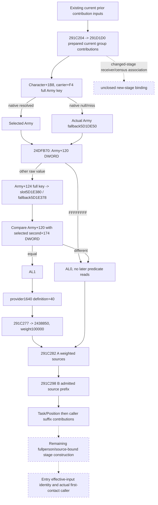

# First-contact person preparation frontier, exact 1.20.0.3

2026-10-05 / ISO 2026-W41. This source package closes one missing native predicate before the existing A/B context sources and specifies the smallest additional current observation. It does not change the source freeze or claim a constructed Combat Entry.

The exact build is CK3 1.20.0.3 / Steam25652598, frozen EXE SHA-256 `94B55397ABB687A3DCD436805A5D885E6BE90FA6C693FEB44A9E3BBEEADE02A6`, image base `0x140000000`. The reused source file is `Z:/ck3_mod_rewrite/artifacts/migrations/2026-10-02/installed-build/binaries/ck3.exe`. The package is at `Z:/ck3_mod_rewrite_process_assets/g2-resume-20261005/background-user-session-round02/battle-entry/`.

## Where the existing current prefix ends

The cached `291C0D0` caller sets `R13=model`, `R14=QWORD[model+8]` as the Character and `RSI=model+10` as the context. Existing current prior inputs observe the provider `+1530`, common `+1A48` and selected `+18F8/+19A0` contributions. The independently closed `291C204 -> 291D1D0` current contribution uses `context_branch_inputs`: actual `flag14`, selected index and seven group counts/property blocks. These are current prepared inputs; changed-stage receiver/held-title/qualifier reconstruction remains a separate dependency.

Between that prepared frontier and `291C282 -> 291E210`, the caller has an additional condition at `291C255`, followed by the unit contribution at `291C277`. Neither existing prior inputs nor A's four spans provide it. V86 closes the later A/B admission and prepared locale selection. R46's 21 observed empty current leaves are genuine observations of those leaves; they do not fill this missing caller contribution or construct a complete person/Entry.

## Exact predicate and contribution

`291C209` reads `Character+1B8`; a present carrier supplies its full DWORD Army key at `+F4`. The caller resolves it through Army storage slot `5D1DE48`, comparing the full DWORD object ID at `+10`. Readable native null/out-of-range/missing/generation-mismatch paths select `QWORD[5D1DE50]`. A null Character carrier also selects this fallback. It does not skip the predicate. Existing native binding metadata names `5D1DE48` as `army_internal_storage_slot`.

The actual call operand at `291C255` is VA `0x1424DFB70`, hence RVA **`24DFB70`**. The early FAST note dropped the leading `2`; this was corrected before any code read, and no bytes were sampled from RVA `4DFB70`.

`24DFB70` is a complete 88-byte frameless leaf. Adjacent `.pdata` records end at `24DFB70` and start at `24DFBD0`; the single captured 96-byte gap contains the leaf and eight bytes of INT3 padding. The leaf has no calls, writes or initialization:

1. Read DWORD `selectedArmy+120`. Exactly `FFFFFFFF` returns AL0 without reading `+124` or the second registry.
2. Otherwise read DWORD `selectedArmy+124` as the full requested key. Resolve it through storage slot `5D1E380`: low24 index, unsigned capacity `+2C`, slots `+20` with stride16/pointer `+8`, then exact full DWORD object `+10`. Native resolution failure selects `QWORD[5D1E378]`.
3. Return AL1 exactly when Army `+120` equals the selected second object's DWORD `+174`; otherwise return AL0. Upper EAX is not the boolean result. The second object's business type is not inferred.

An actual true result continues through `291C25E -> 8FD4E0`, reads `QWORD[provider+1640]+40`, and calls `2438850(model+10, property_block, 100000)` at `291C277`. False returns directly to the subsequent A call. The source therefore has an actual unit-weight merge in a precise place in the native construction order.

## Smallest current readonly construction

Add an optional `pre_291e210_1640` object under the existing `current_context_source_inputs` section, preserving its actor and outer frame provenance. No additional MCP query is required. The proposed fields and read order are specified in `OBSERVER-CONSTRUCTION-PACKAGE.json`.

| Required input | Current coverage | Minimal increment |
| --- | --- | --- |
| Validated current Character / source frame | Existing current-person observation | Reuse the actual actor/frame |
| Army storage `5D1DE48` and native fallback `5D1DE50` | Existing internal Army binding / native caller | Reuse the closed lookup and fallback |
| Character carrier `+1B8`, full Army key `+F4` | Existing source paths use this carrier; this contribution is not emitted | Sample the native selected Army for this branch |
| Army DWORDs `+120/+124` | Not emitted for this predicate | Emit raw32 operands; `+124` is not demanded when `+120==-1` |
| Second registry `5D1E380`, fallback `5D1E378`, selected DWORD `+174` | Not emitted for this predicate | Two binding slots and the consumed current operand |
| Exact AL admission | Missing | Project the closed read-only equality predicate |
| Provider `+1640` definition `+40` | Getter and paired-property reader already closed; this block absent | Read the property block only on actual true admission |
| Current A four spans / B admission/token prefix | Existing V85/V86 fields | Keep as later separate contributions |
| Current final stored context | Independently observed current final state | Preserve it as current final; it is not a before-A/B baseline |

The predicate can be implemented with ordinary readonly memory reads; calling the native predicate is unnecessary. Preserve full DWORD identities and signed raw32 wire bits. An actual zero operand can compare equal; positive IDs do not establish admission. A failed read must not be converted into a native lookup miss, fallback, null or false. False admission leaves the property block not demanded. True admission retains the existing paired-property observation's real counts, empty vectors and failure status.

A source-bound assembler adds this contribution after `291D1D0` and before A. It requires the explicit correct stage baseline. The current final stored context cannot be used as that baseline or receive the contribution a second time.

## Remaining complete-person/Entry distinction

The companion B ledger records the next unmapped current caller suffix at `291C2B3`: `Character+1B0`, actual fallback `5D1E308`, signed16 `Character+68`, signed32 threshold `5C6A19C`, and the conditionally merged property block `object+630` at `291C2FE`. The subsequent `291C32C` carrier contribution and `291C334 -> 28B6200` pointer-vector source are separate remaining inputs. Later fullperson auxiliary outputs also retain their exact callsite ledger.

Entry's `2C06D30` consumes Character EC and another context returned by `28BFC70`, passed to `2C06B00`. The existing sources do not prove that context is identical to `model+10` or establish the first-contact source-stage association. Current prefix contributions and current scalar values cannot establish a new Entry by themselves. These remaining branches are recorded with concrete xrefs in `branch-b-person/`, without a new broad audit or source capture.

## Work qualification

This round is native source research plus a concrete readonly construction contract. Two existing source lanes were reused. Only the single predicate leaf was captured from the frozen offline EXE, using bounded seek reads; `.pdata` absence is retained as a lookup diagnostic. No EXE scan or rehash, game/SDK/pipe/attach/window/profile activity, query-domain consumption, prepare/build/launch, compilation, test or game-day advance occurred. No implementation was installed and no current source-freeze bytes changed.

Oct5/W41 fields, exact source pins, byte/read logs, new Mermaid trees and the one-file documentation patch are in the parent `ROOT-DELIVERY.json`. No live, static implementation or complete Entry claim is made.
