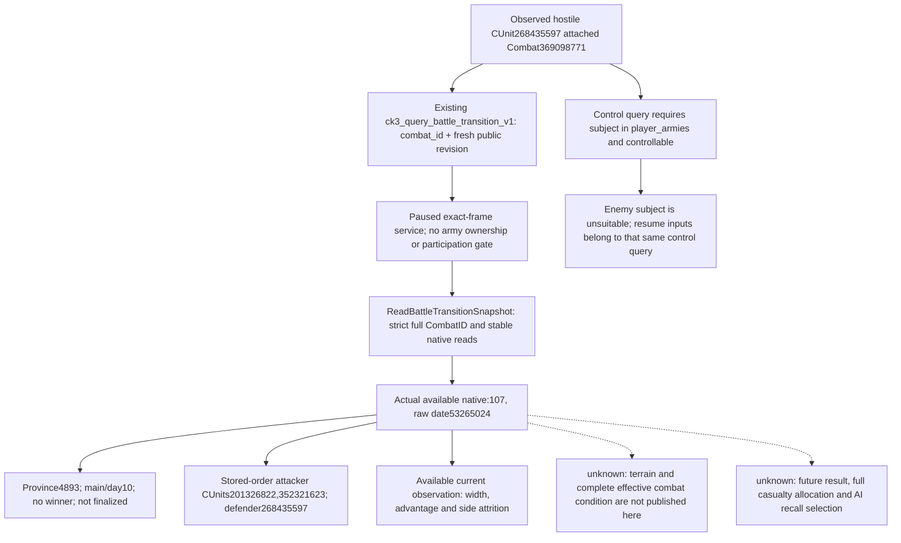

# R46: actual remote main-phase battle observation

This package reuses sealed CK3 1.20.0.3 source, bound to the frozen EXE SHA `94B55397ABB687A3DCD436805A5D885E6BE90FA6C693FEB44A9E3BBEEADE02A6`. Root executed the existing read-only ID-based query. No battle-control flag, ownership restriction or production code was changed. The result is a **production-live primitive** for a remote battle in Robert's ordinary R46 campaign; this package performed no player battle action or execution loop.

## Existing native query tree and recipe

The existing call is `ck3_query_battle_transition_v1(combat_id=369098771, expected_revision=REV)`, where `REV` is the current paused **public** revision. The actual query used public revision `2`; its response is bound to native revision `107`. A native revision must not be substituted for the public argument. The prior attached-Combat observation identifies the target; its old frame is not presented as the query frame.

Source references are the frozen `Z:/g77/ck3_autonomous_player/src/xar_autoplayer/bridge/mcp_server.py:2583` registration, `service.py:12501` ID-only service and `battle_transition_contract.py:33` published field contract. The sealed native cache is `Z:/ck3_mod_rewrite_process_assets/g2-resume-20261005/battle-trait-context-state-observer-v86/packaging-v2/private-preimage/ck3_autonomous_player/native_bridge/src/ck3_12002_battle.cpp`: `ReadBattleTransitionSnapshot` at line1901 has no ArmySubject ownership gate; the separate control entry at line1929 requires a matching `snapshot.player_armies` row, controllability and other current subject conditions.

The existing terminal alternative accepts `prior_combat_id=369098771`, `subject_public_cunit_id=268435597`, `expected_revision=REV`, `after_terminal_sequence=None`, `character_ids=None`. Its native subject resolution checks identity/backlink rather than control rights. Its active-not-terminal branch can observe primary character/participants/phase/province, subject to its existing journal, route and stable-frame conditions. Root did **not** execute that alternative in this package. `active_combat_resume_inputs_v1` is a field produced by the control query, not an independent tool or an ownership bypass. Neither lifecycle contract publishes terrain. If full current combat-condition data becomes necessary, the already sealed `ReadControlSample` at line585 is the concrete reader reuse point for an independent CombatID-based observation; no removal of the control entry's ownership restriction is implied.

## Actual frame

Root's SDK execution `20965` completed with the new `008-ck3_query_battle_transition_v1.json`. The sole original consumer read its complete bytes once and froze an identical 21322-byte cache, SHA `76ff08fb0c2ccf41717c6522d1fa65398323461d1a17574118480dd42e8d951d`. Three disjoint observers consumed only the decoded cache: participant identities/order, phase/frame and current numerical observation. No old frame, fixture, EXE body or SDK query was reread by those observers.

The response is accepted and `available`; `battle_transition_ready=true`. It reports `Combat369098771`, province `4893`, phase `main` (`phase_raw=1`), phase day `10`, `finalized=false`, winner and forced winner `none` (`-1`). `battle_result_id=402653203` is observed during this active battle and does not establish a completed result. The frame is paused, date raw `53265024`, public revision `2`, native revision `107`, snapshot ID `native:107`. Root separately supplies runtime `R46/g78d22` and saved-day count `5029`. The response's `source.game_version` and `source.executable_sha256` are genuinely `null`; those raw fields are preserved rather than filled from the independent runtime/source identity.

| Actual side and stored index | Full public CUnitID | Observed owner character | Full native CArmyID |
|---|---:|---:|---:|
| attacker 0 | 201326822 | 72883 | 184549554 |
| attacker 1 | 352321623 | 72883 | 134218070 |
| defender 0 | 268435597 | 35991 | 184549476 |

All three observed roster rows attach to this same CombatID and province. The side hard-ledger participant IDs are `72883` and `35991`, matching the separately observed owner groups; they are not relabeled as knight IDs or commanders. Robert `29829` is absent from these owner/ledger identities. The query does not publish every character role, so it does not prove his absence from every possible role.

## Current numerical observation

`current_observation.status=available`, `unavailable_reason=null`, fixed-point scale `100000`. Base/final combat width is `2684 -> 1342`. Base advantage raw is `-1900000` (display `-19`); resolved advantage raw is `100000` (display `1`). The difference is not used to invent missing rolls or modifiers. Half-width is not evidence of a named terrain.

| Side aggregate | Attacker raw | Defender raw |
|---|---:|---:|
| derived current fighting | 203394462 | 245105414 |
| derived soft casualties | 35540635 | 30928078 |
| derived main fighting-entry hard casualties | 12164903 | 9766508 |
| participant hard total | 12164903 | 9766508 |
| non-main start-minus-current-minus-soft remainder | 1000000 | 2000000 |

The raw current-fighting values display as `2033.94462` and `2451.05414`; soft values as `355.40635` and `309.28078`; main hard/participant-hard values as `121.64903` and `97.66508`. Each side has one hard-ledger row and its raw sum equals its participant-hard total and derived main-hard field. These are the query's derived fixed-point aggregates, not rounded CUnit soldier counts, a complete individual casualty allocation or proof of a winner. The two non-main remainder fields remain separate from the main hard ledger.

The additional owner-recall input primitive is `raw_inputs_ready=true`, but `native_context_prefix_status=unobserved_scheduler_context`, prefix admission is `null` and `native_selection_ready=false`. Observed owner activity records do not authorize a claim that native AI chose to retreat or recall. Terrain, selected commanders, complete current damage/backing inputs, future admission and battle outcome remain outside this query's published readiness.

## Artifacts, scope and progress

Package: `Z:/ck3_mod_rewrite_process_assets/g2-resume-20261005/r46-hostile-battle-observation-v87/`. Original Root packet: `Z:/ck3_mod_rewrite_process_assets/g2-resume-20261003/runtime-preparation/v73/root-results/v73-current8938-01/actual-r46-post-assault470-capture01/008-ck3_query_battle_transition_v1.json`. Identical complete bytes, decoded response and sole-read receipt are under `actual-cache/`; independent qualifications are under `participants/`, `phase-frame/` and `current-observation/`. The Root delivery pins those files and the topic patch.

This observation gives Root a current remote enemy battle, its actual sides and attrition to combine with the separately reported capture of province470 and the war-goal/movement work. It issues no movement decision or battle command and predicts no win odds. This package executed zero SDK calls, game days, process/window operations, code changes or tests; Root alone performed the actual query. No repeated source audit or new gameplay gate was introduced. Oct5 and ISO W41 report fields are supplied externally for the progress coordinator. Commit/push and further actual gameplay remain Root-owned.
