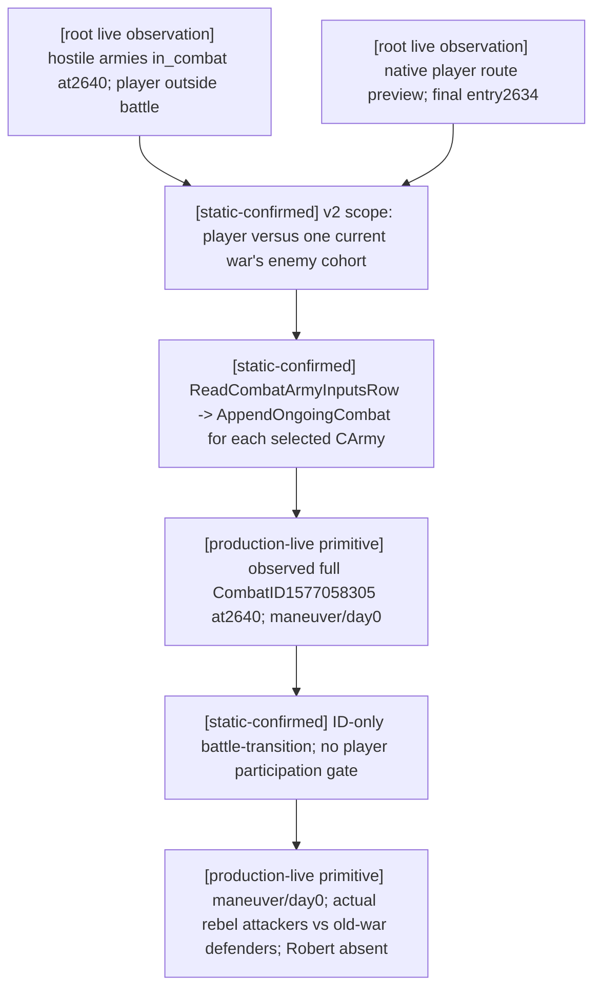

# Observe a hostile army's existing battle without joining it

The exact target remains CK3 `.3`, Steam `25652598`, EXE `94B55397ABB687A3DCD436805A5D885E6BE90FA6C693FEB44A9E3BBEEADE02A6`. This is file-only preparation using root-owned actual packets; no child SDK, process, action, window, source-tree edit or Git operation occurred.

After the root's successful refusal, saved `war-revolt-outcome/actual-refusal-v34-02/007-ck3_take_snapshot.json` shows new defensive War `50331736` against `70766`. Rebel CUnits `251658381`, `473`, `474` and old-war CUnits `50331920`, `83886484` are all `in_combat=true` at `2640`. Robert CUnit `83886367` remains regular, not in combat, at `2614`. The booleans do not prove these five units share a CombatID, reveal battle roles, or provide casualty/advantage values.

The root's next saved route/horizon and snapshot from `war-movement/actual-post-refusal-v34-01` bind public revision `2`, native revision `11`, connection `6`, paused date `53236608`. The player route preview to `2640` is `[2618,2617,2632,2613,8752,2628,2626,2627,2633,2634,2640]`; its final adjacent entry is **2634**. This is a native hypothetical route preview, not an issued movement order. The earlier enemy route's `2641` final entry must not be presented as the player's approach.

## Existing query composition



`ck3_query_combat_simulation_inputs` requires opposite player-relative coalitions sharing at least one current full WarID. Its native `ReadCombatArmyInputsRow` calls `AppendOngoingCombat` on **every selected army**, including hostile armies already in combat. That helper reads full `CArmy+0x128` CombatID and actual `CCombat` province, phase/day, width, current rolls and base/resolved advantage; it deduplicates by the complete CombatID. This is the existing discovery path. The hypothetical request's attacker/defender arrays do **not** become the actual current battle's sides.

The one concrete root call is in external `war-battle-phase/post-refusal-actual01/CALLS.json`:

```json
{
  "name": "ck3_query_combat_simulation_inputs",
  "arguments": {
    "target_province_id": 2640,
    "attacker_entry_province_id": 2634,
    "attacker_army_ids": [83886367],
    "defender_army_ids": [251658381, 473, 474],
    "expected_revision": 2
  }
}
```

The production pure `combat_simulation_encounter_scope` on the saved fresh snapshot returned `common_war_ids=[50331736]`; the canonical encoder returned `query-combat-simulation-inputs-v2-2640-2634-a-1-83886367-d-3-251658381-473-474`. This checks current published scope and query syntax only. Actual native/provider success is pending and must be attempted before a provider change is considered. Refresh the public revision if the root session has changed.

For each actually returned available `ongoing_combats[i].combat_id`, call `ck3_query_battle_transition_v1(combat_id=<that complete observed ID>, expected_revision=<fresh paused revision>)`. Both native `ReadBattleTransitionSnapshot` and the production service gate by exact paused world/full CombatID; they do not require the selected army or Robert to be in that battle. The transition can expose actual current roles/stored-order armies/winner and later deletion. A missing CombatID alone is not a normal terminal result.

The player-scoped methods have different contracts. `ck3_query_actual_contact_scope` requires a controllable subject at the queried current province; Robert at `2614` cannot use it to inspect remote `2640`, and rebels fail its controllability gate. `ck3_query_battle_control_snapshot_v1` requires a controllable army in `player_armies`, so a rebel ID is unsuitable. A v2 request mixing old-war and revolt enemy cohorts also fails the shared-WarID requirement. These source-known distinctions prevent spending the query attempt on the wrong existing method; they do not create a new gameplay restriction.

Current root strength readings are Robert `2334/2461`; rebels `2880/2880`, `300/300`, `10/10`; old-war armies at2640 `1362/1899`, `302/311`. These are current CUnit aggregates, not retained active battle entries or outcome probabilities. `win_probability=null`, `sample_count=0`; no battle result, actual participant order, commander, or loss ledger is fabricated.

Exact packet/source paths and SHA pins, route data, strengths, pure-scope result, query recipe and pending provider boundary are in external `post-refusal-actual01/STRATEGIC-INPUTS.json` and `ROOT-DELIVERY.json`. The failed initial inline Python quoting attempt was a syntax-only harness RED; corrected stdin execution passed the pure contract. No provider result or game action occurred in either command.

## 2026-10-03: preflight boundary superseded by actual results

The pending provider and side statements in the earlier preflight paragraphs describe that earlier attempt. Root subsequently completed the actual discovery and ID-only transition below; these dated results supersede those pending claims without changing the earlier harness RED.

## 2026-10-03: actual native discovery result

Root artifact `war-battle-phase/actual-battle-discovery-v34-02/004-ck3_query_combat_simulation_inputs.json` is accepted and available, queried `native:14`, public revision `2`, native revision `14`, date `53236608` paused. It returned exactly one available ongoing row: full CombatID **1577058305**, province **2640**, native phase **0 (maneuver)**, day **0**, base width **2412**, final width **1206**, rolls **0/0**, base advantage raw **-1200000**, resolved advantage raw **0**. The selected common war is `50331736`; Robert's selected army remains outside the battle at `2614`. This is production-live primitive evidence for hostile existing CombatID/phase discovery on the exact `.3` build. It is not battle-control or an outcome loop.

At the discovery frame, the actual current battle's ordered sides and owner identities remained pending the ID-only transition read; that subsequent result is now recorded below. Actual side-selected commanders are not included in the transition query. The old-war cohort was not selected in this request; current coexistence at `2640` is insufficient to assign those CUnits to this CombatID. The hypothetical scenario arrays are not reused as battle sides. No new native component is needed to reach the next observation.

Native hypothetical scenario inputs also show mountains at `2640`, terrain width multiplier `50000/100000`, player-entry `2634` crossing `none`, and precontact width `2762 -> 1381`. Robert has `2334` soldiers, `40` selected regiments, `14` eligible knights and absent army commander. The rebel cohort has `2880` levies, `300` pikemen and `10` mangonel soldiers, owner `70766`, and absent selected army commanders. Actual side-selected commanders are a separate observation. `input_observation_ready=true`, `monte_carlo_ready=false`, with missing native domains `damage_to_casualty_allocation`, `pursuit_transition`, `battle_end_and_retreat_transition`, `phase_event_rng_and_effects`. No win probability follows from this result.

Executable follow-up is external `actual-discovery-analysis01/TRANSITION-CALLS.json`. It contains one `ck3_query_battle_transition_v1` call for observed CombatID `1577058305` and binds `expected_revision` to the root runner's freshly read `revision`. `OBSERVED-COMBATS.json` pins both the native query packet and after snapshot; `STRATEGIC-INPUTS.json` retains the scenario inputs with their boundary. Root discovery attempt `v34-01` failed in the harness before any combat query; `v34-02` is the completed provider result. No repetition or capability RED is inferred from the harness failure.

## 2026-10-03: actual current sides and lifecycle

Root artifact `war-battle-phase/actual-battle-transition-v34-01/004-ck3_query_battle_transition_v1.json` is accepted/available with `battle_transition_ready=true`, queried `native:16`, public revision `2`, native revision `16`, still paused date `53236608`. Full CombatID `1577058305` is at `2640`, **maneuver/day0**, with actual stored attacker PublicCUnit IDs **[251658381,473,474]** and defender IDs **[50331920,83886484]**. Same-frame `005-ck3_take_snapshot.json` joins all three attackers to owner `70766`, defender `50331920` to owner `30097`, and defender `83886484` to owner `35357`. Robert `83886367` is absent from both actual sides and remains regular at `2614`. The native observation therefore identifies a battle between two enemy cohorts while Robert is outside it.

Both winner and forced winner are `none` (raw `-1`), and `finalized=false`. Allocated BattleResultID `1493172226` is an identity, not a completed result. These reads establish **production-live primitive** hostile battle discovery, actual ordered side identity and current lifecycle on exact `.3`. They do not establish a terminal outcome, retreat/control action or an autonomous battle loop.

The same-frame public war ledger lists the attacker cohort among Robert's enemy armies for War `50331736` and the defender cohort among enemy armies for War `16777231`. Those are actual army memberships in Robert's active wars; a direct `CCombat -> WarID` binding has not been published. War sides, player-relative army cohorts and native battle attacker/defender roles remain distinct.

The earlier native revision `14` ongoing row is retained as a separate same-date observation of width/roll/advantage. Its hypothetical Robert-versus-rebel target counters, commander context and approach crossing are not projected into this existing battle. ID-only transition does not expose actual selected side commander, per-entry damage/toughness/pursuit/screen or hard/soft loss ledgers. Basic player battle-control can read those ledgers once Robert has an actual player battle; exposing them for this hostile battle would require a separate actual need and observation extension. No such component is needed for the current move to `2610` or the successful existing lifecycle observation.

Final joined evidence and report fields are external `actual-transition-analysis01/ACTUAL-BATTLE.json` and `ROOT-DELIVERY.json`. Only root executed the two native queries; child consumed their saved packets once, generated config and updated this external tree. The actual battle lanes received these observed side identities; no query was repeated.
