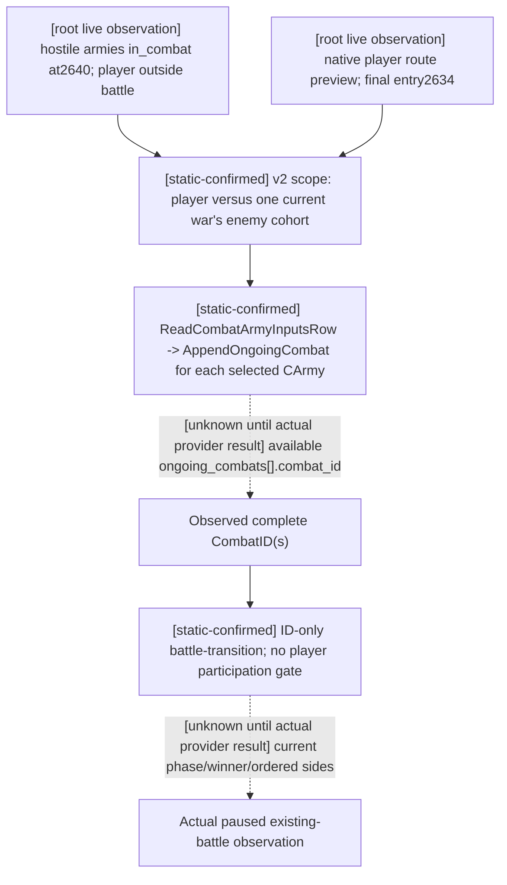

# Observe a hostile army's existing battle without joining it

The exact target remains CK3 `.3`, Steam `25652598`, EXE `94B55397ABB687A3DCD436805A5D885E6BE90FA6C693FEB44A9E3BBEEADE02A6`. This is file-only preparation using root-owned actual packets; no child SDK, process, action, window, source-tree edit or Git operation occurred.

After the root's successful refusal, saved `war-revolt-outcome/actual-refusal-v34-02/007-ck3_take_snapshot.json` shows new defensive War `50331736` against `70766`. Rebel CUnits `251658381`, `473`, `474` and old-war CUnits `50331920`, `83886484` are all `in_combat=true` at `2640`. Robert CUnit `83886367` remains regular, not in combat, at `2614`. The booleans do not prove these five units share a CombatID, reveal battle roles, or provide casualty/advantage values.

The root's next saved route/horizon and snapshot from `war-movement/actual-post-refusal-v34-01` bind public revision `2`, native revision `11`, connection `6`, paused date `53236608`. The player route preview to `2640` is `[2618,2617,2632,2613,8752,2628,2626,2627,2633,2634,2640]`; its final adjacent entry is **2634**. This is a native hypothetical route preview, not an issued movement order. The earlier enemy route's `2641` final entry must not be presented as the player's approach.

## Existing query composition



`ck3_query_combat_simulation_inputs` requires opposite player-relative coalitions sharing at least one current full WarID. Its native `ReadCombatArmyInputsRow` calls `AppendOngoingCombat` on **every selected army**, including hostile armies already in combat. That helper reads full `CArmy+0x128` CombatID and actual `CCombat` province, phase/day, width, current rolls and base/resolved advantage; it deduplicates by the complete CombatID. This is the existing discovery path. The hypothetical request's attacker/defender arrays do **not** become the actual current battle's sides.

The one concrete root call is in external `war-battle-phase/post-refusal-actual01/CALLS.json`:

```json
{
  "name": "ck3_query_combat_simulation_inputs",
  "arguments": {
    "target_province_id": 2640,
    "attacker_entry_province_id": 2634,
    "attacker_army_ids": [83886367],
    "defender_army_ids": [251658381, 473, 474],
    "expected_revision": 2
  }
}
```

The production pure `combat_simulation_encounter_scope` on the saved fresh snapshot returned `common_war_ids=[50331736]`; the canonical encoder returned `query-combat-simulation-inputs-v2-2640-2634-a-1-83886367-d-3-251658381-473-474`. This checks current published scope and query syntax only. Actual native/provider success is pending and must be attempted before a provider change is considered. Refresh the public revision if the root session has changed.

For each actually returned available `ongoing_combats[i].combat_id`, call `ck3_query_battle_transition_v1(combat_id=<that complete observed ID>, expected_revision=<fresh paused revision>)`. Both native `ReadBattleTransitionSnapshot` and the production service gate by exact paused world/full CombatID; they do not require the selected army or Robert to be in that battle. The transition can expose actual current roles/stored-order armies/winner and later deletion. A missing CombatID alone is not a normal terminal result.

The player-scoped methods have different contracts. `ck3_query_actual_contact_scope` requires a controllable subject at the queried current province; Robert at `2614` cannot use it to inspect remote `2640`, and rebels fail its controllability gate. `ck3_query_battle_control_snapshot_v1` requires a controllable army in `player_armies`, so a rebel ID is unsuitable. A v2 request mixing old-war and revolt enemy cohorts also fails the shared-WarID requirement. These source-known distinctions prevent spending the query attempt on the wrong existing method; they do not create a new gameplay restriction.

Current root strength readings are Robert `2334/2461`; rebels `2880/2880`, `300/300`, `10/10`; old-war armies at2640 `1362/1899`, `302/311`. These are current CUnit aggregates, not retained active battle entries or outcome probabilities. `win_probability=null`, `sample_count=0`; no battle result, actual participant order, commander, or loss ledger is fabricated.

Exact packet/source paths and SHA pins, route data, strengths, pure-scope result, query recipe and pending provider boundary are in external `post-refusal-actual01/STRATEGIC-INPUTS.json` and `ROOT-DELIVERY.json`. The failed initial inline Python quoting attempt was a syntax-only harness RED; corrected stdin execution passed the pure contract. No provider result or game action occurred in either command.
