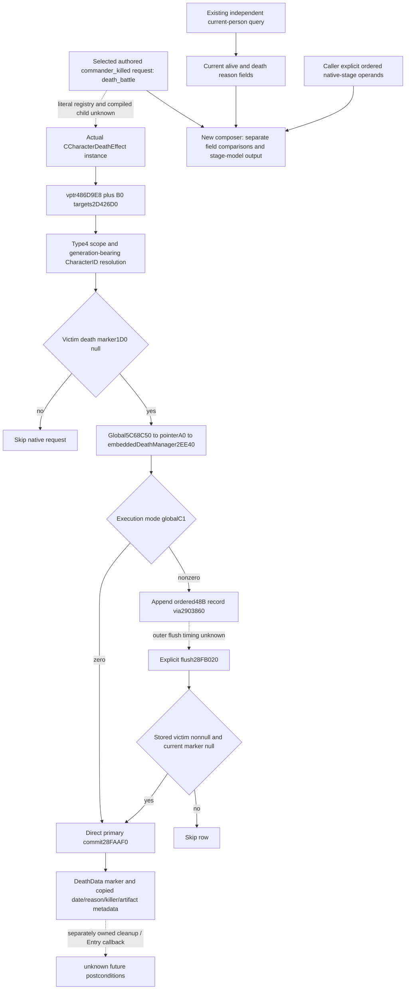

# Battle injury requests: native death stages and independent readback (2026-10-05)

Status: **static-ready / production-path offline fixture**. This increment connects the existing selected injury request interface to the adopted named-person conditional stage kernel and independent current-person readback. The bounded functional path is commander_killed; it does not execute native effects or supply their callback timing. No paused-game evidence or actual game day was added.

## Source-first exact build

CK3 1.20.0.3, Steam build25652598, EXE SHA-256 `94B55397ABB687A3DCD436805A5D885E6BE90FA6C693FEB44A9E3BBEEADE02A6`. v83's selected request producer/manifest/public feedback and topic were adopted as `ab8879f22b5975092c4963fc85fa9f3491f27a47`; this increment reuses their sealed postimages without changing them or rereading stock scripts. Four independent lanes own executor binding, person queue/commit source, the one new composer and the sole functional case. Future Character context preparation remains Dynamic's independent source ownership.

Source package: `Z:/ck3_mod_rewrite_process_assets/g2-resume-20261005/battle-injury-native-feedback-v84/`. `native-executor-source/API.json` SHA `e870facd23b819f8766a28d1d806a80d5cd67e9df6cfec2eadf795aa12b5c4c5`; `native-person-postconditions/API.json` SHA `e21bab4b201f58fc9d3f2cf42fabd183b1697c206cdcb51b3ff891af6f63995b`. Both source contracts and Mermaid trees preceded implementation. Evidence reuses pinned exact-build caches; new EXE reads, whole-EXE scans/hashes, installed-script reads and original SDK response reads are zero.



CCharacterDeathEffect's primary vptr is **486D9E8**, not the preceding COL qword486D9E0. Slot+B0 at486DA98 targets2D426D0. The handler resolves its type4 scope's full CharacterID through masked storage index/non-null pointer/Character+18 equality; failed resolution uses the native fallback object. Its victim+1D0 marker check precedes request28FAA40. The generic Event+160 root and3765780 return do not prove that this class instance was the selected child. Literal death registration/factory and actual container-child ancestry remain specific gaps, with existing parser/init2D41E00/2D42490 and dispatcher3766160 as next source entries.

## Concrete receiver, queue and commit data

At2D4283A the handler loads global pointer slot5C68C50; at2D42841 it takes global_object+A0, then at2D428D4 forms the embedded actualDeathManager at backing_object+2EE40. The request's date-object address is global_object+8; mode is uint8 global_object+C1. Mode0 calls28FAAF0 directly. Nonzero mode appends a record only when victim+1D0 is null; request/append preserves the current person state.

| Receiver | Offset | Type and meaning |
|---|---|---|
| actualDeathManager | +4E08 | qword pending data pointer |
| actualDeathManager | +4E10 | signed32 capacity |
| actualDeathManager | +4E14 | signed32 count |
| Each pending row, stride48 | +08 / +10 | victim Character pointer / reason object pointer |
| Each pending row | +18 | complete copied date-object uint64 bits |
| Each pending row | +20 / +28 | killer Character pointer / artifact pointer |
| Character | +1D0 | DeathData pointer, primary marker |
| DeathData | +04 | complete date-object uint64 bits |
| DeathData | +10 | nullable reason object pointer |
| DeathData | +18 / +1C | signed32 full killer CharacterID / artifactID, native?1 retained |

Flush28FB020 traverses the initial ordered48B rows. It calls primary commit only for a stored victim pointer that is nonnull and whose current death marker is null; a duplicate victim naturally skips after the earlier marker write. It destroys records and clears count while retaining capacity. Outer flush timing has not been supplied by this source package. Primary writer28FAAF0 has its own actual write-selection/early-return branch; a call alone is not the write. Actual cleanup289F310 and later callbacks remain independently owned.

## Minimum public composition

New module `xar_autoplayer.simulation.battle_current_injury_native_feedback_12003` exports:

```python
compose_selected_injury_native_feedback_12003(
    selected_execution, current_person_observation, ordered_outcomes,
    *, post_person_observation=None, source_context=None,
)
```

It delegates once, in caller supplied order, to the existing `apply_committed_named_person_outcomes_12003`. No CurrentBattleCondition or native queue model is reconstructed. It preserves original selected requests, native-stage inputs and before/post person observations. Death request/outcome links compare supplied operation, fullID and reason/killer tokens; authored omission, explicit null, serialized flat null and native?1 stay separate. Independent matching alive/reason fields are reported as field matches, not event causality, actual queue admission or callback proof. Other requested injury/resource effects remain available in the copied request sequence and partial for native execution.

Existing `ck3_query_battle_terminal_transition_v1` supports character-only reads with required nullable `prior_combat_id=None`, `subject_public_cunit_id=None`, actual `character_ids` and fresh `expected_revision`. It already publishes current alive/custody, eight injury flags, wound rank as ordinary0..3, prowess as signed32 points, and death_record status/reason_key. An available null/empty reason is legal; unavailable reason differs from no death record. Current observations are preserved independently of conditional primary writes. This module supplies neither complete feedback nor automatic public horizon resume, roster cleanup or Entry setter admission.

The next observation increments are concrete: extend that same person reader with DeathData+04/+18/+1C date/killer/artifact; bounded-copy mode and ordered pending rows through the exact global?A0?2EE40 receiver on the owning thread. Those fields are source-closed candidates but **are not published by this package**. A pending victim fullID match would still not prove which authored request created the row or when it will flush. No lasting null interface is counted as completed capability.

## Unique new functional validation

One new scenario reaches commander_killed through the existing production selected interpreter, then the new public composer. Six authored requests retain order: three battle-death variables, battle event, toast, death_battle request. No eligible enemy means no target tape and an omitted killer; explicit native-stage killer?1 remains distinct. Pending keeps primary model state; separately supplied source-qualified flush changes modeled alive to false and preserves all64 date bits and signed32 native-none IDs. Independent synthetic post alive/reason fields match without overwriting the before query, granting native causality, detach or Entry refresh.

Corrected attempt03 passed **20 Require checks** under Python3.13.2, `-B -O`. Unique scenarios=1; cumulative selected calls=3, composer calls=2, existing kernel delegations=2. Attempt01 lacked required explicit caller martial/risk trigger inputs and never called the composer. Attempt02 produced selected/composed output but expected descriptor loadindex2 rather than the actual commander_killed index3. Both Harness RED inputs/runners/results are preserved; corrections changed only the same fixture scenario, never production. No old tests or post-GREEN tests ran.

Fixture receipt `fixture/ROOT-DELIVERY.json`, SHA `d49be498dfb09b5688ccc648853ce289d9ce040bdd90f9fa07553f9b24f54a3e`; GREEN `fixture/attempt-03/RESULT.json`, SHA `7c4cb7f660163e82b7c36b3bfd7ee5085a864728117b3a697aec7e15e63f47d3`. Harness RED01 SHA `b17753863d623dd8414e1819013d374e6f4bb1babab0f4a92edd683c37f815be`; RED02 SHA `71c77ae58829323140bd4d9036eaa847b275e9f7a0faa95221e7d11f75db85cb`.

All stage operands and normalized observations in this case are explicitly synthetic/source-conditional. Real native queue/commit/callback execution, paused evidence, full future battle, RNG schedule, complete OODA and actual game days remain zero. Root-only source/topic packet and Oct5/W41 fields are under `root-packet/ROOT-DELIVERY.json` and `ROOT-DAY-WEEK-FIELDS.json` in the package above. Root owns all shared apply/Git/game operations; this work used no SDK, pipe, live memory or window and requires no native rebuild.
