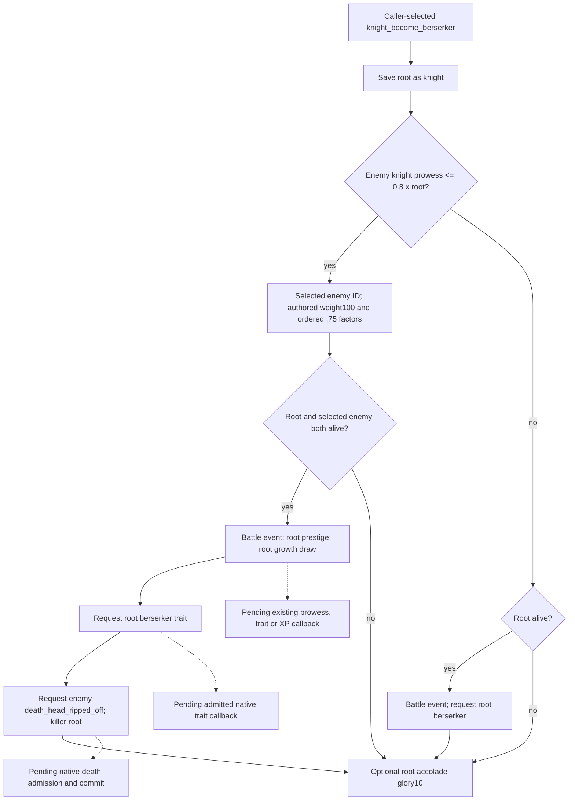

# Selected berserker effect, exact 1.20.0.3

`knight_become_berserker` is the next complete authored effect translated into the existing selected-event interpreter and phase-feedback public path. The g71/cd0 baseline exposed **9/13** selected effects. The sealed interpreter now exposes **10/13**, with typed requests and pending native feedback; it does not commit a trait or death from caller selection.

## Source first

CK3 **1.20.0.3**, Steam **25652598**, EXE SHA-256 `94B55397ABB687A3DCD436805A5D885E6BE90FA6C693FEB44A9E3BBEEADE02A6`. Root supplied frozen `g71/cd0`; no independent Git or live read was performed. The prior canonical thirteen-event manifest SHA is `609F94AADD131F6BAA9D20C78F598FEB39410D312261756DDC3FC03381D9C858`; the extended canonical manifest SHA is `88C2DDA5691B7D3A910BA716196786EEA7517D642C36BD8DBC8F0B01009F948C`. Event count and the other nine supported effects are retained.

The complete selected event is already frozen in `common/combat_phase_events/00_knight_phase_events.txt`, SHA-256 `6307140E6F0543D9C44CACF40771710032A050279B82B0074A86DF7B68E3CADF`: event **184-384**, validity **187-200**, chance **202-302**, effect **304-383**. Global load index **6**, knight index **2**, base weight **30**. Existing validity/chance AST is retained. The bounded original excerpt is **3722 bytes**, SHA-256 `9EC673009897A77FA4A048C073AC22ED2B2AF847CECC0356F22AFB2DD31E3385`; it preserves original CRLF bytes. Existing commander growth and basic/accolade values are reused from sealed .3 cache, without new installed reads, capture or pin rehash.

The [source receipt](Z:/ck3_mod_rewrite_process_assets/g2-resume-20261005/battle-next-selected-effect-v78/source/ROOT-DELIVERY.json) SHA is `8A8FDFF92C012066997E0BFBF62AE6BE8E5D504E79660FCA633E0FE11B49EA1A`; [API](Z:/ck3_mod_rewrite_process_assets/g2-resume-20261005/battle-next-selected-effect-v78/source/API.json) SHA is `DF07DA498EA68E64CE2754B831A341EEE983E3BAD75D9E3B2E141B3EFF5BE6AC`. These source artifacts were sealed before interpreter implementation.

## Ordered branches

The enemy filter has no alive clause. Candidate weight starts at **100**, then receives ordered **0.75** factors for acclaimed, `stalwart_leader_perk` and optional dynasty `warfare_legacy_3`. This is authored selection input; caller-supplied target/order does not establish native candidate compaction or RNG.

With an eligible selected enemy, both alive checks precede battle feedback, **root** prestige, **root** growth, root berserker request, and selected enemy `death_head_ripped_off` request with root killer. Prestige is `knight_prestige_gain_on_kill`: **150 x selected enemy positive primary-title tier**, halved for selected enemy lowborn. This is the selected enemy's value, unlike the inverse scope of `knight_killed`; growth also applies to root rather than enemy. The existing **60/30/10** growth helper and its exact ordered modifiers are reused, with root learning/traits/XP/dynasty/culture/court inputs. Target draw precedes growth draw.

With **no eligible enemy and living root**, the leaf emits `battle_event=berserker_rage_no_enemy`, then requests root `berserker`. It consumes no enemy or growth draw and contains no enemy death command. `battle_event.type=death` is an authored field and does not add a `death` operation to this branch. Failed alive checks do not fall through between branches. Optional root accolade `minimal_glory_gain=10` runs after every branch.

## Existing public interface and qualification

The extension uses `battle_phase_events_12003.py` and its existing stock JSON only. The admitted public wrapper remains `run_selected_phase_feedback_horizon_12003(initial_condition, *, day, selected, draw_state, caller_seed_provenance=None)` with existing `SelectedPhaseEventInput12003`. No new tool, observation schema, horizon model or native build is required. Requests retain `stage=requested`, `queue_admission_observed=false`, `committed=false`; pending callbacks preserve current person, trait, roster, Entry, backing and draw state.

The unique new offline case uses the deterministic no-eligible-enemy living-root leaf plus an explicit root accolade target. It checks battle-event, trait and glory request order, no draw or death request, unchanged current state, and partial feedback before main rolls/damage. The unique `Python -B -O` public wrapper execution was **FIRST GREEN: 1 invocation, 27 require checks, 0 reruns**. Its [result](Z:/ck3_mod_rewrite_process_assets/g2-resume-20261005/battle-next-selected-effect-v78/fixture/attempt-01/RESULT.json) is **6194 bytes**, SHA-256 `4D8D47FC298829EA8B1FB324A4719DFA22B3624CB94F09D2C88C2E22ACAED48F`. The three explicit refresh lists remain empty and `advantage.recompute_required=false`; full native callback/stat refresh remains partial. The [fixture receipt](Z:/ck3_mod_rewrite_process_assets/g2-resume-20261005/battle-next-selected-effect-v78/fixture/ROOT-DELIVERY.json) pins the actual runner, input, output and unchanged public wrapper. The executed new case remains reusable in that external package; no duplicate case was created or run. Enemy/guard branches are source-closed but have **0 runtime invocations** in this case.

The remaining placeholders are `knight_berserker_attack`, `knight_shieldmaiden_attack` and the full selected `knight_qualify_for_accolade` effect. The last already has its independently adopted condition-feedback seam; it is not wholly unknown, and that seam is not credited as full selected-effect coverage here.

## Native dependencies and report boundary

Native queued/committed state is supplied only by specific admitted callback and observable deltas. The current readonly current-person/trait/death-record inputs remain separate from authored requests. DynamicRefresh v77 owns the actual queued trait numeric seam `Character -> 0x28C3F60` (DL=1, R8D=0), its `0x28C3AE0` / `0x28C3D80` continuation and effective prowess/EC input ledger. This increment edits none of those modules or inputs and does not pre-admit its numeric result. Pending trait, growth and death callbacks are concrete next dependencies rather than invented current-state changes.

This is **static-ready / production-path offline fixture GREEN**. It is not fixture-live, a live primitive, a whole battle simulator, native RNG or full Monte Carlo. SDK/RPM/pipe/CK3/window/shared writes/Git/native builds/new actual days/live observations are **0**. Oct5/W41 fields link all three source/implementation/fixture lane records in the [Root packet](Z:/ck3_mod_rewrite_process_assets/g2-resume-20261005/battle-next-selected-effect-v78/root-packet/ROOT-DELIVERY.json). Integration commit/push is recorded by Root after applying the two production paths and this topic.
