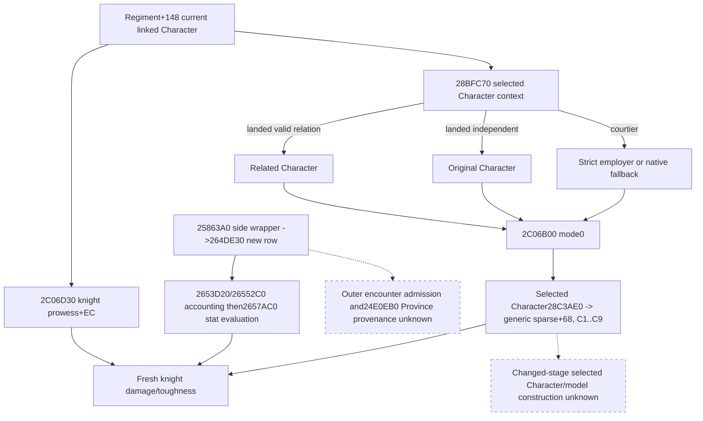

# Knight effectiveness Character context, exact 1.20.0.3

2026-10-05 / ISO 2026-W41. Source research precedes the additive current
observation. Frozen CK3 1.20.0.3 / Steam25652598 SHA-256 is
`94B55397ABB687A3DCD436805A5D885E6BE90FA6C693FEB44A9E3BBEEADE02A6`.
No game process, SDK, pipe, query, desktop or Steam operation is authorized
for this background round.

The previously closed `28BFC70` does **not** return `model+10`: it returns a
Character pointer. Reuse the exact 118-byte source in
[immediate_liege_self_12003_abi.json](../../ck3_autonomous_player/native_bridge/research/immediate_liege_self_12003_abi.json).
For landed input, `Character+1C0 -> carrier+1C0 -> relation+28` selects a
valid Character; an invalid tag or full ID `-1` returns the original
Character. For unlanded input, `Character+1B8 -> full employer ID+C8` resolves
through CharacterStorage, with the native canonical fallback on lookup failure.
This is the actual context selection consumed by the knight statistics path.

Existing `.3` source at `26344C0` checks `2634880` and resolves the linked
Regiment+148 Character, then calls `2C06D30` at `2634524`. `2C06D30` reads
the linked knight's signed prowess `+EC`, calls `28BFC70` at `2C06D46`, passes
the returned Character pointer in RDX, and calls `2C06B00` at `2C06D56`
with mode0. Thus the knight supplies prowess, while the selected context
Character supplies effectiveness. They can be different full IDs.

The exact `2C06B00` extent `[2C06B00,2C06D2E)` is558 bytes. For mode0 it
uses the selected Character's `28C3AE0` context and modifier ordinals
**C1..C9**, with the following operands. These are `.3` ordinals, distinct
from the old1.19 B6..BE diagnostics.

| Ordinal | Selected context Character operand | Scale |
| --- | --- | --- |
| C1 | Constant100000; contribution added to base100000 | Q100000 |
| C2 | `QWORD[QWORD[Character+1C0]+350]`, or0 for null carrier | Native Q64 |
| C3 | `QWORD[QWORD[Character+1C0]+358]`, or0 for null carrier | Native Q64 |
| C4 | Signed32 Character+EC times100000 | Q100000 |
| C5 | Signed32 Character+D8 times100000 | Q100000 |
| C6 | Signed32 Character+E4 times100000 | Q100000 |
| C7 | Signed32 Character+E8 times100000 | Q100000 |
| C8 | Signed32 Character+DC times100000 | Q100000 |
| C9 | Signed32 Character+E0 times100000 | Q100000 |

The necessary immediate helper `2C4D680` is a bounded573-byte body. Operand0
returns term0 before sparse lookup. Nonzero operand with mode0 calls
`24389A0`; the reused cached mode0 body adds **68 to the returned context**
before calling `2303700`. Each term uses native signed Q multiplication and
native truncation/large-value branches. `2C06B00` accumulates in caller order.
This observer will emit raw inputs; it introduces no replacement arithmetic
model and does not equate raw modifiers with weighted terms.

`28C3AE0` verifies `Character+1B0 -> carrier+258` and model+8 owner, returning
model+10 on match, or its actual native default context otherwise. Generic
sparse inputs therefore belong to **the selected context Character's prepared
model**, which may differ from the linked knight's model. Current final sparse
storage is legal input to this current final evaluator; it cannot be used as a
prestage source-construction baseline.

### First-contact caller, before later refresh

The reused complete `25863A0` constructor selects side wrappers `2586A80`
and `2586B80`; both call `264DE30` with the actual new Army. For a newly
admitted knight/MAA row, `264DE30` calls `2653D20` at264E075. This append
initializes new accounting through `26552C0`. It then obtains the Army's
`24E0EB0` result and **immediately calls `2657AC0` at264E099** on the new row:

`25863A0 ->side wrapper ->264DE30 ->2653D20/26552C0 ->2657AC0
->26344C0 ->2C06D30 ->28BFC70 ->2C06B00`.

The ordinary bucket also receives immediate stat evaluation at264E057.
Stat construction is not exclusive to later `258B510 ->2651070` refresh.
New accounting and six stat cache writes remain separate operations. Outer
encounter admission/timing and actual returned Province provenance of
`24E0EB0` remain unclosed; that precise leaf is the next seam if a complete
future first-contact constructor needs its Province association.
The special-knight branch of `26344C0` calls `2C06D30` with only its output
and resolved Character; it does not pass Province into the knight formula.
The unresolved Province getter therefore does not block these current knight
effectiveness inputs, while remaining necessary for a complete general Entry.

The completed source tree is persisted before observer implementation. New
frozen EXE reads total **1131 code bytes and240 pdata bytes=1371 bytes**;
seek offsets and cached metadata reuse are retained in
`Z:/ck3_mod_rewrite_process_assets/g2-background-round2-20261005/actual-entry-context/`.
`2C06B00` byte SHA is `30363761158b26f0bb5684478ed60e963f9ec74fa859e9586e002e74a5019ced`;
`2C4D680` byte SHA is `65e9e528c318e1af18fa37b052d67e144ed76abeee3bcfe14d5f2ff633cc3efa`.
The reused118B getter, current caller and mode0 lookup were not re-read from
the EXE. No broad scan, whole-file hash or runtime experiment occurred.

## Reachable current observer and qualification

The existing `.3` combat_v3 reader now publishes optional
`army.knights.members[].effectiveness_context`. It retains the actual selected
Character's full ID, explicit ordinal list193..201, signed `modifier_raw` and
`operand_raw` arrays, scale100000 and independent status/reason. The selected
identity is resolved by the current Character storage and tag. The raw generic
table is read at the selected Character's returned model context+68, using the
existing2303700 callback. C2/C3 carrier-null operands are observed0; signed
skills remain signed, including0 and negative values. All nine current raw keys
are observed even when an operand0 would short-circuit the native weighted term;
the arrays are source inputs, not a trace of executed helper calls.

The linked knight's `character_id` and prowess remain separate. The same query
frame supplies their provenance; no extra MCP query, runtime flag or capability
is introduced. Failed identity/table observation returns the optional object's
unavailable status, retaining a validated context ID when known, while both
arrays serialize null. It does not discard an otherwise available native
effectiveness scalar, add an input gap, change current stat crosschecks or grant
future construction readiness. Old receipts without the object remain accepted.

The one new focused production-normalizer test passed **1/1**, Python `-B -O`,
1.489seconds. It covers differing selected-owner and linked-knight identities,
self selection, signed/zero arrays, independent unavailable diagnostics,
old-field absence and `.3` ordinal identity. Receipt:
`Z:/ck3_mod_rewrite_process_assets/g2-background-round2-20261005/actual-entry-context/consumer-attempt01/RESULT.json`.
This is a consumer test only: native compilation and its independent fixture
remain for Root's centralized build. Current source/observer qualification is
**implementation candidate with consumer GREEN; native static-ready pending**.

The new native fixture target/CTest is
`xar_ck3_12003_knight_effectiveness_context_test`. It calls production
`ReadCombatSimulationInputs` through source-only reuse of the combat fake-memory
setup, with explicit callable leaves. Four cases check selected full ID
`0x0300000D` versus linked knight `0x0100000A`, self selection, signed C1..C9
modifier/operand mapping including carrier-null0 and zero skills, selected model
context+68, and missing C5/model diagnostics while the native scalar125000 and
knight stats remain available. Memory copies are compared before/after reads.
The scalar callable is deliberately independent of the raw-table diagnostic;
this fixture does not prove the native weighted formula or natural encounter.

At build time `tests/project_knight_context_serializer.py` projects literal
production `AppendCombatKnights` and its three JSON helpers from `bridge.cpp`.
The fixture checks exact context JSON bytes and preserved scalar/stat bytes.
Generated projection hashes and four wire files are written under
`<build>/ck3_12003_knight_effectiveness_context_wire/`:
`SERIALIZER-PROJECTION.json`, `selected_character.json`, `self_character.json`,
`missing_key.json`, and `missing_model.json`. This follow-up adds fixture and
source-qualification documentation only; it does not alter the reader/query.
It was prepared without configuring, compiling or running native code. Root
owns the first centralized focused build/run and must record its result before
native static-ready qualification; no old case or consumer test was rerun.

No CK3 launch, attach, live pipe, SDK, query, UI, Steam, profile, save, cache,
runtime preparation or game-day operation occurred. There is no new live or
complete Entry claim. The concrete forecast increment is explicit current
effectiveness source identity and numerical inputs; changed-stage context/model
construction and outer first-contact Province/admission remain separate gaps.

# Current knight effectiveness context: offline qualification update

Root integrated the source/observer package as `122d1eb7` and focused native
fixture as `9a92c24e`. The central `/WX` native DLL plus five new targets built
GREEN at source `96e4c6a688d95dc326db4cd3b7cd25961e3c40c6` in153seconds. Root ran
the five new CTests once, GREEN5/5 in0.73seconds. The context test is
`xar_ck3_12003_knight_effectiveness_context_test`; its four new fake-memory
cases passed through production `ReadCombatSimulationInputs`, the new context
reader, production DTO and literal production `AppendCombatKnights` projection.
The scalar leaf remains explicit and independent of diagnostic table reads.

After Root supplied native GREEN, the external integration consumer ran once
with Python `-B -O` and passed4/4 in0.984seconds. It read the four actual emitted
native files under
`Z:/ck3_mod_rewrite_process_assets/g2-background-20261005/native-build/ck3_12003_knight_effectiveness_context_wire/`,
then called the integrated production `_normalize_knights` from `Z:/gb0`.
The selected Character full ID50331661 stays distinct from knight16777226;
self selection retains the same ID; signed C1..C9 inputs remain unchanged.
Missing C5/model cases retain selected identity, null diagnostic arrays and the
available native scalar125000 plus damage312500000/toughness31250000, adding
zero consumer input gaps. Every case preserves loaded coefficients100/10.

The integration receipt pins the normalizer, external consumer script, native
serializer projection receipt/functions and actual four input bytes:
`Z:/ck3_mod_rewrite_process_assets/g2-background-round2-20261005/actual-entry-context/native-wire-integration/attempt01/RESULT.json`.
Root's central receipts are `round2/native-person-holy-01.json` and
`round2/native-person-holy-ctest-01.json`; the Root report should use its canonical
full paths. No old Python/native case was rerun by this consumer, no replacement
fixture JSON was synthesized, and no production/native source changed during
the central build or consumer pass.

This qualifies the focused current effectiveness-context observer as
**static-ready**, with native reader/DTO/serializer/production-consumer evidence.
It supplies current selected Character identity and exact current numerical
inputs. It does not qualify the native weighted formula, changed-stage model
context construction, outer natural first-contact admission/Province, full
Entry forecast, fixture-live, production-live or complete gameplay. No CK3
launch/attach/query/live pipe/SDK/UI/Steam/profile/save/cache/runtime preparation
or game-day operation occurred.

# Exact .3 first-contact Entry Province, Character and initialization stages

2026-10-05, CK3 **1.20.0.3 / Steam25652598**, frozen EXE SHA reused:
`94B55397ABB687A3DCD436805A5D885E6BE90FA6C693FEB44A9E3BBEEADE02A6`.
Readiness of this new package is **research**. It changes no bridge/query,
policy, canonical document or runtime state and executes no test.

## The Army Province getter is closed

Known `24E0EB0` is a76-byte leaf, `[24E0EB0,24E0EFC)`, with return at24E0EFB.
No runtime-function pdata row covers this leaf. A bounded128-byte window includes
its entire body, four padding bytes and48bytes of the next function; those
next-function bytes are not used as source evidence. Exact source:

| Source | Native selection |
| --- | --- |
| `24E0EB0 RCX` | Actual incoming CArmy pointer supplied by264E07A. |
| `QWORD[RVA5D1E380]` | CUnit storage root. Null storage takes the native fallback. |
| `DWORD[Army+124]` | Full CUnitID, not CharacterID or ProvinceID. Low24bits index the16-byte storage slot after capacity+2C check. |
| Root+20 / slot+08 | CUnit pointer; nonnull and CUnit+10 must equal the full ID. Otherwise `QWORD[RVA5D1E378]` supplies the fallback CUnit. |
| `QWORD[CUnit+20]` | Current Province pointer. Null pointer selects `QWORD[RVA5D1E390]` fallback Province. |

This leaf does not read Combat+6B8, an arrival destination, previous Province,
terrain, an owner/knight Character or a contact eligibility flag. Its null/ID
failure behavior is the native fallback described above. The existing query
publishes a validated real map ProvinceID, so a query `current_province_id=null`
must not be relabelled as a known real fallback ProvinceID.

## New-row initialization source and order

Reuse the frozen `.3` `264DE30` source. It first rejects an already stored full
ArmyID. A new Army is appended to Side+10; its Army+38/+44 full RegimentID array
is then visited in native order. Each Regiment is resolved by full ID. Initial
result-ledger row+40 and Side+A8 receive wholecurrent*100000 before bucket
selection; the result row is keyed by the type pointer and Regiment+148 knight
ID. These separate baseline accounts are not cached effective stats.

MAA-like bucket selection at264DF72..264E065 is true if the type+38 GDbo tag is
valid, or if Regiment+148 resolves to a Character with Char tag+1C and full
ID+18 other than−1. Otherwise the ordinary/levy bucket is used. No extra
Character alive predicate appears in this routing block.

`2653D20 ->26552C0` constructs the new96-byte row before effective stat filling.
The constructor sets Entry+08 full RegimentID, Entry+10 starting count from
Regiment+38 wholecurrent*100000, Entry+18 current count to starting only when
`BYTE[QWORD[Regiment+18]+98A] !=0`, otherwise genuine0; soft+20 is0.
This is main-phase participation eligibility, separate from admission to a new
Combat and separate from valid linked-knight identity. A valid row with current0
can still be constructed and have its stat cache evaluated.

At264E075 the MAA-like row is appended. At264E07D the actual incoming Army is
passed to24E0EB0; its returned Province becomes RDX at264E082. At264E099
`2657AC0(new row, returned Province)` resolves Entry+08 back to the full Regiment,
calls `26344C0(Regiment, temporary Stats38, Province)` at2657B0F, and copies the
six values into Entry+30/+38/+40/+48/+50/+58. The ordinary branch at264E00C..045
performs the same Army+124 full CUnit resolution inline, takes CUnit+20/fallback
Province, and calls the same setter at264E057. There is no source disagreement
between the ordinary and MAA-like Province paths.

The closed knight subbranch of26344C0 calls2634880, resolves Regiment+148 full
CharacterID, and calls2C06D30 with the linked Character and output pointer. Its
Province argument is unused in that subbranch.2C06D30 takes linked prowess+EC,
then `28BFC70` selects the separate effectiveness Character passed to2C06B00.
The previously delivered current observer publishes both identities and current
C1..C9 inputs. This package does not newly close the whole ordinary/MAA formula
inside26344C0; the linked-knight predicate and formula-source boundaries retain
their own frozen evidence.

## Initial constructor cache and returned new-contact cache differ by stage

The existing frozen first-contact chain is
`2479180 ->247971D247A330 ->247A8B62AD81F0 ->25863A0`.
At247A8A5 the builder passes its actual Province pointer as argument5; the Combat
constructor stores that pointer at+6B8. The incoming Army and ordered opponent
Army pointer list go through the role-selected wrappers2586A80/2586B80, then the
new-only initializer above. For a defender initiator, the already closed
constructor-kind0 branch skips incoming adjacency; it is not an enemy-history
lookup. The factory/constructor argument binding is reused from the exact `.3`
projected-contact native tree, not inferred from a `.2` address match.

The cached `.3`247A820..247AB8D continuation is significant: after the factory
returns, the builder selects/writes both commanders, refreshes both current sums
and width, adds adjacency effects, adds Province terrain effects, calls both
2650A80 accolade context updates, then2586ED0. Finally it calls
**2651070(side0, Combat+6B8) at247AB32 and
2651070(side1, Combat+6B8) at247AB41**, before returning.
The existing refresh tree walks levy then MAA rows and reevaluates the six cache
fields through2657AC0/26344C0 under the Combat Province and the updated context.

Thus24E0EB0 closes the **first initialization stage** at each Army's current
Province. It does not alone identify the returned new-contact cache as that
stage. The builder's later whole-side refresh uses the separate Combat Province
and changed battle context. Equal Province pointers in a particular frame do not
remove the intervening context/effect/commander operations. New first-stage
source credit cannot stand in for complete first-contact Entry preparation or
forecast readiness.

## Admission and the existing query construction seam

Reused2479180 source first tests the raw Province+20/+1B admission byte, the
global mode+1C0/+28 flag and2C16770(incoming CUnit,true), then incoming owner
identity. The one necessary new admission leaf2C16770 is fully captured as143B
`[2C16770,2C167FF)`. It returns false when incoming Unit+18!=0 or Unit+170>0;
otherwise Unit+178 resolves to a full CArmyID through `QWORD[RVA5D1DE48]`, with
native fallback `QWORD[RVA5D1DE50]`. It rejects24E83C0(Army). With its actual
second argument=true it also rejects24E8360(Army), then returns true. Those two
existing Army predicates are the published empty/in-combat query bindings.
No additional hidden Character, Province or stat predicate occurs in this leaf.
It scans stored Province+758/+764 CombatIDs for existing join before
scanning Province+740/+74C UnitIDs for a new hostile seed. Existing-join forward
hostility selection and reverse side choice remain distinct. New-contact seed
candidates exclude same owner, raw Unit+18!=0, Unit+170>0, and the two native
Army predicates24E83C0/24E8360; the initiator must have positive valid Regiment
whole counts before247971D calls the builder. The builder preserves candidate
order and uses the reverse owner relationship for opponents before holder/fallback
role classification. These are source-defined current conditions. Future
calendar/route/contact admission time and future relationship changes remain
unclosed; no new runtime-admission observation is claimed.

Existing `ReadActualContactScope` mirrors current-Province contact branches and
requires subject current Province==requested target. Existing combat input
publishes each Army's validated `current_province_id`, full native CArmyID,
Regiment full IDs/current whole counts/kind/main eligibility, target effective
stats with `source_target_province_id`, and current knight Character/context.
No additional raw admission field is needed for that current contact preflight.

For an explicitly admitted, frozen-current join, existing same-query effective
stats can supply the first-stage six values **when their source_target_province_id
equals that incoming Army's current_province_id**. The values remain current
readonly evaluations, not proof that the initializer ran or a future final cache.
If the target differs from an incoming Army's current Province, the present
target-only stat tuple does not supply that first-stage tuple. The concrete
minimal next observer seam is within the same `ReadCombatSimulationInputs`
Regiment loop: resolve the already published current Province pointer, reuse
`ReadEncounterEffectiveStats` at that pointer, and publish an additive optional
`initialization_context_stats` with its source ProvinceID and six current values.
It need not launch a new query, invoke24E0EB0's mutator callers, reproduce source
generators or infer future admission. Root should choose that observer only for
a concrete caller whose existing target tuple differs from the needed current
Province; the equality case already has the required inputs.

For full create-new final cache preparation, the next separate functional seam
is the **247A9CC..247AB41 battle-effect/accolade/commander context then whole-side
refresh**. The current-final model is not a pre-effect source baseline. This
package deliberately does not implement or fabricate that changed-stage model.

## Read and execution receipt

Fresh EXE I/O: **271 code bytes +132 pdata bytes=403 bytes**: the known128B
Province window plus143B admission function,60B getter pdata lookup plus72B
admission pdata lookup. The getter lookup reused530 prior cached rows; lack of
a covering row is preserved in its receipt. The final76-byte leaf and its exact SHA are derived from the captured
window without another EXE read. All callers, quantity/eligibility and outer
continuation are reused frozen source. No whole EXE scan/hash, native build,
test, process/pipe/query, SDK, UI, Steam, profile/save/cache operation or game day.
The initial plan checker rejected `--for-observation` because this is offline
only; that attempt is preserved. The offline check is plan-consistent and
expressly does not verify semantics or authorize live observation.
