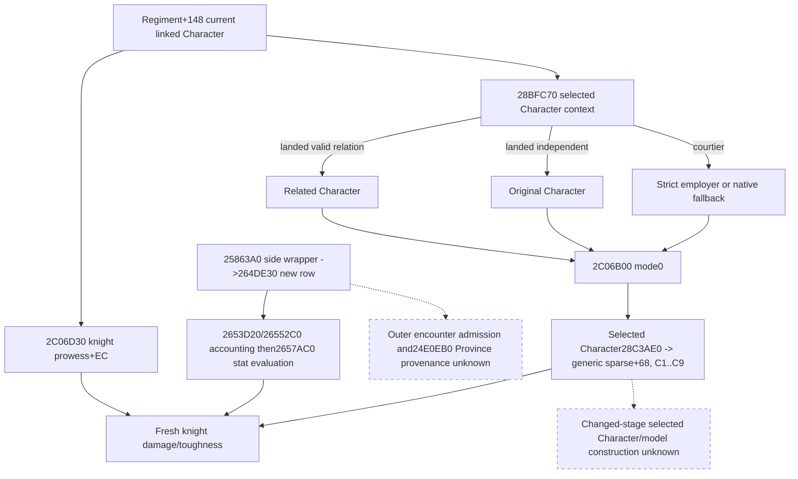

# Knight effectiveness Character context, exact 1.20.0.3

2026-10-05 / ISO 2026-W41. Source research precedes the additive current
observation. Frozen CK3 1.20.0.3 / Steam25652598 SHA-256 is
`94B55397ABB687A3DCD436805A5D885E6BE90FA6C693FEB44A9E3BBEEADE02A6`.
No game process, SDK, pipe, query, desktop or Steam operation is authorized
for this background round.

The previously closed `28BFC70` does **not** return `model+10`: it returns a
Character pointer. Reuse the exact 118-byte source in
[immediate_liege_self_12003_abi.json](../../ck3_autonomous_player/native_bridge/research/immediate_liege_self_12003_abi.json).
For landed input, `Character+1C0 -> carrier+1C0 -> relation+28` selects a
valid Character; an invalid tag or full ID `-1` returns the original
Character. For unlanded input, `Character+1B8 -> full employer ID+C8` resolves
through CharacterStorage, with the native canonical fallback on lookup failure.
This is the actual context selection consumed by the knight statistics path.

Existing `.3` source at `26344C0` checks `2634880` and resolves the linked
Regiment+148 Character, then calls `2C06D30` at `2634524`. `2C06D30` reads
the linked knight's signed prowess `+EC`, calls `28BFC70` at `2C06D46`, passes
the returned Character pointer in RDX, and calls `2C06B00` at `2C06D56`
with mode0. Thus the knight supplies prowess, while the selected context
Character supplies effectiveness. They can be different full IDs.

The exact `2C06B00` extent `[2C06B00,2C06D2E)` is558 bytes. For mode0 it
uses the selected Character's `28C3AE0` context and modifier ordinals
**C1..C9**, with the following operands. These are `.3` ordinals, distinct
from the old1.19 B6..BE diagnostics.

| Ordinal | Selected context Character operand | Scale |
| --- | --- | --- |
| C1 | Constant100000; contribution added to base100000 | Q100000 |
| C2 | `QWORD[QWORD[Character+1C0]+350]`, or0 for null carrier | Native Q64 |
| C3 | `QWORD[QWORD[Character+1C0]+358]`, or0 for null carrier | Native Q64 |
| C4 | Signed32 Character+EC times100000 | Q100000 |
| C5 | Signed32 Character+D8 times100000 | Q100000 |
| C6 | Signed32 Character+E4 times100000 | Q100000 |
| C7 | Signed32 Character+E8 times100000 | Q100000 |
| C8 | Signed32 Character+DC times100000 | Q100000 |
| C9 | Signed32 Character+E0 times100000 | Q100000 |

The necessary immediate helper `2C4D680` is a bounded573-byte body. Operand0
returns term0 before sparse lookup. Nonzero operand with mode0 calls
`24389A0`; the reused cached mode0 body adds **68 to the returned context**
before calling `2303700`. Each term uses native signed Q multiplication and
native truncation/large-value branches. `2C06B00` accumulates in caller order.
This observer will emit raw inputs; it introduces no replacement arithmetic
model and does not equate raw modifiers with weighted terms.

`28C3AE0` verifies `Character+1B0 -> carrier+258` and model+8 owner, returning
model+10 on match, or its actual native default context otherwise. Generic
sparse inputs therefore belong to **the selected context Character's prepared
model**, which may differ from the linked knight's model. Current final sparse
storage is legal input to this current final evaluator; it cannot be used as a
prestage source-construction baseline.

### First-contact caller, before later refresh

The reused complete `25863A0` constructor selects side wrappers `2586A80`
and `2586B80`; both call `264DE30` with the actual new Army. For a newly
admitted knight/MAA row, `264DE30` calls `2653D20` at264E075. This append
initializes new accounting through `26552C0`. It then obtains the Army's
`24E0EB0` result and **immediately calls `2657AC0` at264E099** on the new row:

`25863A0 ->side wrapper ->264DE30 ->2653D20/26552C0 ->2657AC0
->26344C0 ->2C06D30 ->28BFC70 ->2C06B00`.

The ordinary bucket also receives immediate stat evaluation at264E057.
Stat construction is not exclusive to later `258B510 ->2651070` refresh.
New accounting and six stat cache writes remain separate operations. Outer
encounter admission/timing and actual returned Province provenance of
`24E0EB0` remain unclosed; that precise leaf is the next seam if a complete
future first-contact constructor needs its Province association.
The special-knight branch of `26344C0` calls `2C06D30` with only its output
and resolved Character; it does not pass Province into the knight formula.
The unresolved Province getter therefore does not block these current knight
effectiveness inputs, while remaining necessary for a complete general Entry.

The completed source tree is persisted before observer implementation. New
frozen EXE reads total **1131 code bytes and240 pdata bytes=1371 bytes**;
seek offsets and cached metadata reuse are retained in
`Z:/ck3_mod_rewrite_process_assets/g2-background-round2-20261005/actual-entry-context/`.
`2C06B00` byte SHA is `30363761158b26f0bb5684478ed60e963f9ec74fa859e9586e002e74a5019ced`;
`2C4D680` byte SHA is `65e9e528c318e1af18fa37b052d67e144ed76abeee3bcfe14d5f2ff633cc3efa`.
The reused118B getter, current caller and mode0 lookup were not re-read from
the EXE. No broad scan, whole-file hash or runtime experiment occurred.

## Reachable current observer and qualification

The existing `.3` combat_v3 reader now publishes optional
`army.knights.members[].effectiveness_context`. It retains the actual selected
Character's full ID, explicit ordinal list193..201, signed `modifier_raw` and
`operand_raw` arrays, scale100000 and independent status/reason. The selected
identity is resolved by the current Character storage and tag. The raw generic
table is read at the selected Character's returned model context+68, using the
existing2303700 callback. C2/C3 carrier-null operands are observed0; signed
skills remain signed, including0 and negative values. All nine current raw keys
are observed even when an operand0 would short-circuit the native weighted term;
the arrays are source inputs, not a trace of executed helper calls.

The linked knight's `character_id` and prowess remain separate. The same query
frame supplies their provenance; no extra MCP query, runtime flag or capability
is introduced. Failed identity/table observation returns the optional object's
unavailable status, retaining a validated context ID when known, while both
arrays serialize null. It does not discard an otherwise available native
effectiveness scalar, add an input gap, change current stat crosschecks or grant
future construction readiness. Old receipts without the object remain accepted.

The one new focused production-normalizer test passed **1/1**, Python `-B -O`,
1.489seconds. It covers differing selected-owner and linked-knight identities,
self selection, signed/zero arrays, independent unavailable diagnostics,
old-field absence and `.3` ordinal identity. Receipt:
`Z:/ck3_mod_rewrite_process_assets/g2-background-round2-20261005/actual-entry-context/consumer-attempt01/RESULT.json`.
This is a consumer test only: native compilation and its independent fixture
remain for Root's centralized build. Current source/observer qualification is
**implementation candidate with consumer GREEN; native static-ready pending**.
No CK3 launch, attach, live pipe, SDK, query, UI, Steam, profile, save, cache,
runtime preparation or game-day operation occurred. There is no new live or
complete Entry claim. The concrete forecast increment is explicit current
effectiveness source identity and numerical inputs; changed-stage context/model
construction and outer first-contact Province/admission remain separate gaps.
