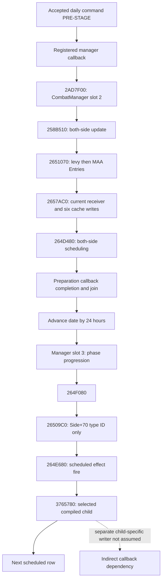

# Knight Entry callback timing in CK3 1.20.0.3

This source closure separates accepted daily manager preparation, phase-event firing, and the six stored Entry attributes. It extends the [v81 current-observation contract](battle-current-knight-entry-refresh-12003-2026-10-05.md); the current Character prowess or a selected effect request does not itself identify a native cache update.

Exact build: CK3 **1.20.0.3**, Steam build **25652598**, EXE SHA-256 `94B55397ABB687A3DCD436805A5D885E6BE90FA6C693FEB44A9E3BBEEADE02A6`. Source reuse and the necessary bounded additions are pinned in the external v82 package. This package makes no new game observation and advances no game day.

## Source order

The actual CombatManager secondary interface is registered from `GameData+2E9D8` by `2ADBA27/2ADBA3D -> 880340`. The daily bound callback `476C9D0+10 -> 2989C10 -> 110CD00` invokes actual CombatManager slot 2 `2AD7F00`. Serial and dispatched preparation callbacks finish before the accepted daily command advances the date by 24 hours and invokes slot 3. Its Combat manager callback `0x2AD7F00` runs `0x258B510`, which visits both sides, refreshes accolades, and runs `0x2651070` over levy and MAA Entries. `0x2657AC0` independently resolves the current receiver and writes the six cached attributes. Both `264D480` side schedulers then select scheduled rows; neither the cache update nor its receiver selection is conditional on a selected event numeric delta.

The phase-event wrapper `0x264F080` calls `0x26509C0`, which validates or replaces `Side+0x70` RegimentTypeID. It does **not** write these six Entry cache fields. It then reaches `0x264E680` to fire scheduled rows. The old refresh label must not be interpreted as an Entry-stat writer. The direct fire body returns from `0x3765780` to continue rows; no direct `0x2657AC0` follows that return. An indirect selected-child writer is a separate script/native dependency.

## Receiver boundaries

| Stage | Stored or resolved identity | Character checks |
|---|---|---|
| Schedule `264D480` | Row stride 16: event pointer at 0, full RegimentID at 8 | Resolves schedule-time Character identity; only event and RegimentID are retained |
| Fire `264E680` | Re-resolves Regiment, Army and Combat association; reads current `Regiment+148` as type-4 root token | Direct body does not look up Character storage or check Character generation/magic/alive |
| Setter `2657AC0` | Re-resolves actual `Entry+8` Regiment and current special-knight Character | Strict current Character resolution; no separately proved alive or observer reciprocal predicate |
| Current query association | Current reciprocal Character/link/Regiment identity | Publication validity; does not grant schedule, fire, or callback execution |

The schedule-time Character, later fire root token, and later setter receiver may differ. None is a frozen pointer in the scheduled row. The event root also differs from the CUnit owner unless the actual data associates them.

The setter writes `Entry+30` signed int32 maximum size and `+38/+40/+48/+50/+58` signed int64 siege/damage/toughness/pursuit/screen raw values, scale 100000. Knight arithmetic uses setter-time Character `+EC` signed int32 prowess points, current int64 effectiveness raw, and loaded signed int32 whole damage/toughness coefficients at `5C699A8/5C699B0`. Identity, starting/current fighting, soft casualties, bucket membership and backing soldiers are preserved.

## Delivery qualification

The existing public `run_selected_phase_feedback_horizon_12003` now accepts `pre_date_knight_refreshes`, whose `KnightCachedStatRefresh12003` descriptor can carry `KnightEntryCallbackWindow12003`. Its explicit `admitted_manager_preparation` window identifies the independently resolved setter-time Regiment/Army/public Unit/Character receiver, current arithmetic operands, and source coordinates. Optional prior schedule/fire provenance retains its own receiver token. Preparation is applied after the public calendar preflight confirms this modeled command is accepted, before the continuing-main check, selected phase effects and numeric main body; the delegated horizon does not apply it twice. The existing numeric-aftereffect path retains its prior affected-character limit.

Only one existing producer file changes: `battle_phase_event_feedback_12003.py`. No native DTO, bridge, observer, current-context getter or generic horizon file is added or modified. The native setter writes six cache slots; this pure DTO carries damage/toughness/pursuit/screen. Maximum size and siege are zeroes in the special-knight six-value projection trace, with `max_size_and_siege_in_shared_DTO=False`; the immutable original observed six-cache source row remains separate. This is a selected provided-knight preparation projection, not a complete refresh of every native Entry.

The unique new production-path offline case is **CORRECTED GREEN: 20 Require checks**. An explicit historical fire root token `29829` differs from the current setter receiver `35791`, and the selected-effect list and old numeric allowed-receiver set are empty. Preparation produces damage `1000000` and toughness `1500000` using synthetic prowess 4, effectiveness raw 125000, and whole coefficients 2/3. Those values enter the same numeric main body: effective attack raw `10000000`, outgoing damage raw `100000`, and an available enemy-loss kernel. These fixture coefficients and IDs are synthetic inputs, not claims about currently loaded runtime values or a real Character callback. Observed source rows, pre-stage quantities/backing, and the input draw state remain preserved; the later modeled main body may apply its modeled loss/carry.

One scenario was called through the public wrapper twice. Attempt 01 is retained as **HARNESS RED**: the fixture counter row omitted `native_carmy_id`, causing the existing counter refresh to raise `KeyError`. Corrected attempt 02 supplied the required explicit native Army, soldier-count and full-side counter data. Production code was unchanged by that correction. No v81 or other old case was rerun.

Qualification is **static-ready / production-path offline fixture**. The one accepted modeled day advances the model from raw `100080` to `100104`; actual game days advanced are **0**. Native callback invocation, native queue admission and requested-effect commit are **false**. Current trait context construction, native RNG, native selected-child writers and real callback attribution remain independent dependencies. A future callback receipt or Root-owned native passage is required to promote this seam to live evidence.

## Source and delivery links

Callback timing closure: `Z:/ck3_mod_rewrite_process_assets/g2-resume-20261005/battle-knight-entry-callback-timing-v82/callchain-source/API.json`, SHA-256 `ae54500b87c88df6ccdbc50d63da1a5a612eb00d916d22f4a8b9062fd170b2b1`; `TREE.md`, `SOURCE-CONTRACT.md`, and `SOURCE-PINS.json` retain registration, daily dispatcher, callback completion, and date/phase edges. Only two missing callees added 3328 machine-code bytes from an independently frozen exact-build image; installed EXE reads and full-EXE scans/hashes were 0. Source harness metadata/extent and a preliminary vtable candidate were corrected before the final source signature; their historical attempts are retained and are not capability failures.

Receiver/data closure: `Z:/ck3_mod_rewrite_process_assets/g2-resume-20261005/battle-knight-entry-callback-timing-v82/receiver-data-source/API.json`, SHA-256 `569a4b7dc2d982d475148f7f7f58f9cc482477f61aec644aa9efa6e8318d6aeb`; associated `TREE.md`, `SOURCE-CONTRACT.md`, and `SOURCE-PINS.json` retain exact source and scope.

New readiness is limited to a source-bound conditional preparation seam and its necessary production-path offline case. It does not predict native random draws, commit generic script effects, construct future trait context, or establish live native callback parity. Oct5 / W41; new live observations 0, game days 0, SDK/pipe/game/window/shared writes/Git/native full builds 0.

Implementation receipt: `Z:/ck3_mod_rewrite_process_assets/g2-resume-20261005/battle-knight-entry-callback-timing-v82/implementation/ROOT-DELIVERY.json`, SHA-256 `dde2c844737b021648b6a59269e417d07f7e769826c9768e179a534255f559ea`; one-file source pins and the source-frozen qualification addendum retain represented-field boundaries.

Sole fixture receipt: `Z:/ck3_mod_rewrite_process_assets/g2-resume-20261005/battle-knight-entry-callback-timing-v82/fixture/ROOT-DELIVERY.json`, SHA-256 `ad112beda809c2a7c6be8141518f16487f72398f076a7d60aa160be56b7bc77e`; corrected result SHA-256 `1684df5ac079e67551405b012fd3a36ff6916d9b59077b87afe6dea461d5c692`. The original Harness RED and source capture corrections remain linked by the source and fixture receipts.
