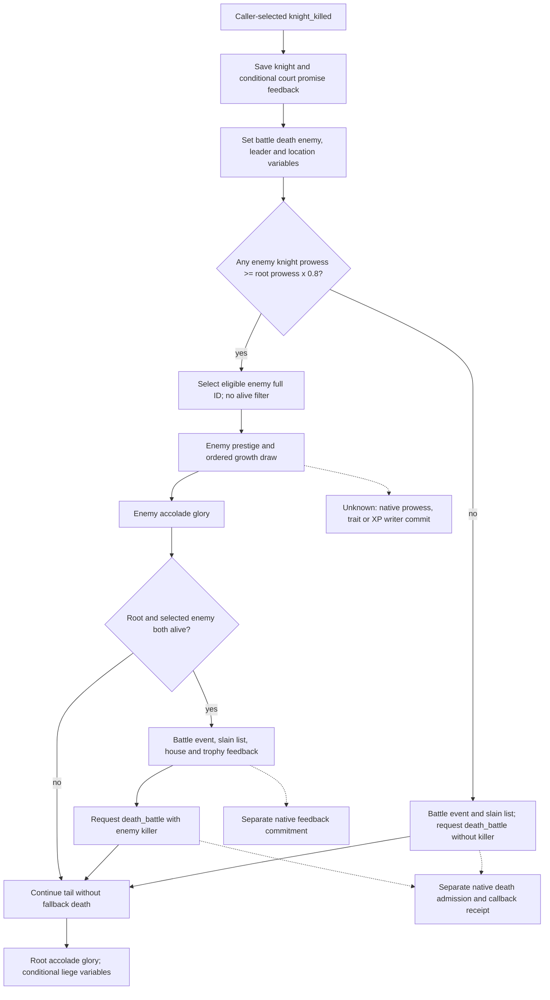

# Selected knight death script, exact 1.20.0.3

The complete authored `knight_killed` event and its direct helpers are now source-closed. The previous selected interpreter published seven event effects while this eighth effect was unavailable. This increment uses the existing selected-event interpreter and admitted phase-feedback horizon; it separates authored requests from native queue admission and committed character changes.

## Source binding

- CK3 **1.20.0.3**, Steam build **25652598**, EXE SHA-256 `94B55397ABB687A3DCD436805A5D885E6BE90FA6C693FEB44A9E3BBEEADE02A6`.
- Root froze `g68` (head prefix `60a`); development source was `17b12baa`. Root supplied environment `feaaa`: XAR autoplayer selftest mod and 30 official DLC, no third-party mod. This is supplied environment metadata, not an independent full playset scan.
- `common/combat_phase_events/00_knight_phase_events.txt`: **41733 bytes**, SHA-256 `6307140E6F0543D9C44CACF40771710032A050279B82B0074A86DF7B68E3CADF`; complete event lines **968-1428**, effect lines **1216-1427**.
- Global load index **11**, knight event index **7**, base weight **30**, no authored `is_valid` block. The previous thirteen-event stock manifest SHA was `38BB943E208F53D106B90A2F6B895189ECA6471ED7B9888AC5A8454E7CD60240`; the extended canonical AST manifest SHA is `024D5618BB3AD8AE633AB127669441DD1AB6C2344C3745B0FAE310E515ADE7C4`. Event count and existing seven effect rows remain unchanged.
- Seven exact files were reconstructed from already frozen source plus sealed deltas and matched current pins once. One unchanged helper reused frozen bytes. Under explicit Root authorization, six necessary missing helper files were read from the installed official game directory, copied to the external cache, and matched their already declared .3 pins. No entire stock or mounted playset was scanned.

External source seal: [ROOT-DELIVERY.json](Z:/ck3_mod_rewrite_process_assets/g2-resume-20261005/battle-knight-killed-selected-ast-v65/source/ROOT-DELIVERY.json), SHA-256 `A5AF597DE502C331DFF7B6999B3BA212DC2A21A9C613E9C2C3BEA66E9C337FE1`. The [API](Z:/ck3_mod_rewrite_process_assets/g2-resume-20261005/battle-knight-killed-selected-ast-v65/source/API.json), [ordered syntax](Z:/ck3_mod_rewrite_process_assets/g2-resume-20261005/battle-knight-killed-selected-ast-v65/source/ORDERED-SOURCE-AST.json) and [direct helper contract](Z:/ck3_mod_rewrite_process_assets/g2-resume-20261005/battle-knight-killed-selected-ast-v65/source/SCRIPT-CONTRACT.md) preserve repeated keys, source order and scopes.

## Authored dispatch order

The enemy filter has **no alive clause**. Prestige, the growth draw and enemy accolade glory run **before** the both-alive guard. A failed alive guard does not execute the no-enemy `else`; the root accolade and liege tail still run. Battle-death variables are requested before opponent selection. Delayed `hold_court.8053 days=1` and `court.5061 years=4` remain authored queue commands; this selected adapter does not execute future event bodies.

The two selected draws are ordered: eligible enemy `random_side_knight`, then that enemy's growth `random_list`. Its authored base weights are **60/30/10** with ordered modifiers in the pinned helper. Branch 0 requests no growth; branch 1 requests `add_prowess_skill=1`; branch 2 requests blademaster addition when absent, or XP **+10** below **100**. Caller-supplied branch selection does not reproduce native RNG or establish probabilities after engine normalization.

Current cranial trophy eligibility is the `killing_bestows_heads` **rite parameter OR personal-tenet flag**. The helper suppresses artifact creation for Tengri / greatest-of-khans / nomadic philosophy. `beheaded_warrior_cooldown` is membership in the liege's **variables**, and this event does not write that cooldown. Exact helpers also supply inverse kill prestige **150 x positive primary title tier**, halved for lowborn; minor glory **25**; medium house damage **-0.2**; piety `max(victim prestige,0) x 0.25`; spiritual fulfillment `min(max(victim prestige,0) x 0.01, minor_spiritual_fulfillment_value)`. The final cap is a required caller-resolved numeric leaf when that branch is selected.

## Input and outcome boundary

Use the existing `run_selected_phase_feedback_horizon_12003(initial_condition, *, day, selected, draw_state, caller_seed_provenance=None)` and `SelectedPhaseEventInput12003`. The existing context references are `combat_side.character_membership`, `enemy_side.character_membership` and `combat_side.commander`. No new tool, admitted protocol or parallel horizon model is needed.

| Stage | Evidence | Current-person state consequence |
| --- | --- | --- |
| selected | Caller chooses an admitted event and supplies the ordered outcome tape | None by itself |
| requested | Exact authored command with actor, target and source order | Kept pending; no invented trait, prowess, death or roster update |
| queued | Separate actual native queue-admission receipt | A queue entry still does not prove death |
| committed | Specific admitted callback and observable state delta | May update the corresponding modeled state through the existing seam |

The current readonly `current_person_state` / `death_record` query remains the concrete observation input for alive status and current recorded reason. Its earlier observed `death_battle` key is not an attribution to this synthetic selected event. Specific native `add_prowess_skill`, `add_trait` and `add_trait_xp` writer dispatch, commit and order remain the next source/receipt dependency. The concrete next entry is the already archived exact .3 phase-event execution seam (`0x264E680` / `0x3765780`): resolve the requested operation's character handler and retain its admitted callback, identity and actual state delta. See [named-person casualty](battle-named-person-casualty-12003-2026-10-04.md) and [current death reason](battle-current-death-reason-key-12003-2026-10-05.md).

## Validation and readiness

The three existing production files are sealed in the [implementation receipt](Z:/ck3_mod_rewrite_process_assets/g2-resume-20261005/battle-knight-killed-selected-ast-v65/implementation/ROOT-DELIVERY.json). Execution publishes ordered `effect_requests`; the existing feedback ledger carries them with `stage=requested`, `committed=false` and `queue_admission_observed=false`. There is no new tool or native build dependency. The single necessary public-horizon case is sealed in the [focused receipt](Z:/ck3_mod_rewrite_process_assets/g2-resume-20261005/battle-knight-killed-selected-ast-v65/focused/ROOT-DELIVERY.json). The one case uses a living root and an eligible enemy whose current alive flag is false, growth branch 2 and an absent blademaster trait. It supplies an explicit root accolade target while court, trophy, house and liege branches are false. This distinguishes the source's lack of an alive filter, the growth request before the failed both-alive guard, no fallback death request, and root glory after that guard. Its saved actual public output retains alive/trait/prowess/Entry/backing state and stops before commander rolls and main damage when callbacks are pending. All-alive death delivery and native commitment are not covered by this case.

The original `Python -B -O` wrapper execution occurred **once** and passed **29** meaningful `require` checks. It returned **6 ordered requests**, with no native queue or commit evidence. The final overbroad harness check treated a nonempty `advantage` metadata object as a refresh and exited **HARNESS RED**; [attempt-01](Z:/ck3_mod_rewrite_process_assets/g2-resume-20261005/battle-knight-killed-selected-ast-v65/focused/attempt-01-result.json) is preserved unchanged. A corrected review of that saved output checked the three explicit empty recompute lists, `advantage.recompute_required=false` and the four remaining original checks; [cached-output qualification](Z:/ck3_mod_rewrite_process_assets/g2-resume-20261005/battle-knight-killed-selected-ast-v65/focused/corrected-output-review.json) is **GREEN** with **0 additional wrapper calls**. The final reusable repository test contains the same fixture and corrected checks, with artifact overlay/hash/logging removed; that final file itself was not rerun. This is bounded **static-ready** SCRIPT request visibility and public pending-stop composition, rather than a claim that the original harness execution was GREEN.

This work adds **0 actual game days and 0 live observations**. No SDK, pipe, RPM, CK3 process, window, shared edit, Git operation or native build is part of this package. Source closure and a focused Python case do not establish native RNG, trait writer commitment, a complete combat simulator or a production battle loop. Integration commit and push are owned by Root.
