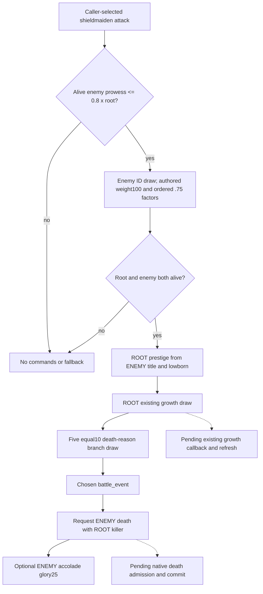

# Selected shieldmaiden attack, exact 1.20.0.3

The complete `knight_shieldmaiden_attack` event and its five-reason helper are source-closed for the existing selected interpreter. Frozen `g72` already supports **10/13** event effects; the sealed interpreter now supports **11/13** with a concrete selected enemy reason, killer and ordered feedback requests. Native death/trait/growth commitment and refresh remain separate.

## Source before implementation

CK3 **1.20.0.3**, Steam **25652598**, EXE SHA-256 `94B55397ABB687A3DCD436805A5D885E6BE90FA6C693FEB44A9E3BBEEADE02A6`. The Root-supplied frozen baseline is `g72`; prior canonical thirteen-event manifest SHA is `88C2DDA5691B7D3A910BA716196786EEA7517D642C36BD8DBC8F0B01009F948C`; the extended canonical manifest SHA is `4991A7DD79EF1453EFC69838DBAE762308D0DF79E66F67E0D283DB8B482491F9`. No independent Git, mounted-playset dump or live observation is claimed.

Event `common/combat_phase_events/00_knight_phase_events.txt` lines **386-513**, effect **461-512**, global load index **7**, knight index **3**, base weight **30**. Existing validity requires root shieldmaiden and an alive enemy knight at or below **0.8 x root prowess**; current validity/chance AST is retained. The source file is already pinned to `6307140E6F0543D9C44CACF40771710032A050279B82B0074A86DF7B68E3CADF`.

Direct `shieldmaiden_kill_version_randomisation_effect`: `common/scripted_effects/00_commander_effects.txt` lines **321-409**, already pinned file SHA `AB943C4AD0B68E2305F958A0031125EE7FA2543C47CF312C07BDBC8EAA7163F8`. The new bounded cached excerpts preserve original CRLF: event **2475 bytes**, SHA `F9A2951CDD845EA96ECFB60DFA50033EA46C178B697CD39D5249B70A36775937`; helper **1908 bytes**, SHA `9535BD2DC5A0118A15F934B325584985685FD94C5C0F1F57FC5F7D1FB1C977D5`. There are **0 new captures, installed reads or source-pin rehashes**.

[Source receipt](Z:/ck3_mod_rewrite_process_assets/g2-resume-20261005/battle-next-selected-effect-v79/source/ROOT-DELIVERY.json) SHA `D5439D7AA59300FDF8CD68A1A2B192D7C309DC155CC1AB79829976978A9F09C9`; [API](Z:/ck3_mod_rewrite_process_assets/g2-resume-20261005/battle-next-selected-effect-v79/source/API.json) SHA `CA3DC05906297D9F229AC350621A22F9B55200DD42AE0CD93FA292FA7D0893F6`. This single-leaf seal preceded implementation; previous selected-effect source packages and cases are reused without re-execution.

## Ordered execution

Both `any_side_knight` and `random_side_knight` require **alive=yes** and prowess at most **0.8 x root**. Candidate weight **100** receives ordered **0.75** factors for acclaimed, `stalwart_leader_perk` and optional dynasty `warfare_legacy_3`. The caller supplies the selected ID; authored weights are not a claim of native candidate ordering or RNG.

After both-alive checks, root prestige uses **150 x selected enemy positive primary title tier**, halved for selected enemy lowborn. **ROOT** receives the existing **60/30/10** growth helper using root learning/traits/XP/dynasty/culture/court inputs. The next draw selects one of five unconditional helper branches, each authored weight **10**:

| Branch | Death reason | Battle-event key |
| --- | --- | --- |
| 0 | `death_decapitated` | `shieldmaiden_skill_killed_enemy_no_trait_v1` |
| 1 | `death_cloven_in_half` | `shieldmaiden_skill_killed_enemy_no_trait_v2` |
| 2 | `death_viciously_dismembered` | `shieldmaiden_skill_killed_enemy_no_trait_v3` |
| 3 | `death_piteously_cut_down` | `shieldmaiden_skill_killed_enemy_no_trait_v4` |
| 4 | `death_chopped_to_pieces` | `shieldmaiden_skill_killed_enemy_no_trait_v5` |

Each chosen helper branch requests the battle event **before** enemy death. Battle event uses root left portrait, selected enemy right portrait, `type=death`, `target_right=yes`; enemy death names root as killer. Optional **ENEMY** accolade `minor_glory_gain=25` follows death inside the both-alive branch. There is no outer tail or trait addition. No eligible alive enemy yields zero commands/draws. A failed inner alive guard yields zero commands even though the enemy-ID draw may already have occurred; it does not fall back.

## Existing caller interface and case

Only the existing `battle_phase_events_12003.py` and stock JSON are extended. The public path stays `run_selected_phase_feedback_horizon_12003(initial_condition, *, day, selected, draw_state, caller_seed_provenance=None)` with `SelectedPhaseEventInput12003` and the existing explicit outcome tape. No tool, schema, horizon or native build is introduced.

The necessary new offline case selects an eligible living enemy, root growth branch **0**, and reason branch **4**, with an explicit enemy accolade target. It therefore exercises the new helper and reason/killer scopes instead of repeating the previous no-enemy trait leaf. Source order is root prestige, growth selection, matching battle event, enemy pending death, enemy glory25. The corrected actual public output retains current alive/trait/roster/Entry/backing/DrawState and stops before main rolls/damage when native callbacks are pending.

The context preserves independent source aliases: `candidate.alive` is used for selection, while `selected_enemy_knight.alive` is used after selection by the inner guard. Attempt01 supplied the former but omitted the latter; its real **HARNESS RED** and original input/spec/runner/factory pins are preserved. Root authorized the minimal fixture correction of the selected-scope alias to `true`, matching this explicitly living selected enemy. Producer source was unchanged.

The same single case ran corrected02 under `Python -B -O` and passed **29 require checks**: **CORRECTED GREEN**, **1 unique case / 2 total public wrapper invocations**. It consumes exactly three caller outcomes and publishes four ordered requests: root prestige, `shieldmaiden_skill_killed_enemy_no_trait_v5` battle feedback, enemy `death_chopped_to_pieces` with root killer, and enemy glory25. Root growth branch0 produces no immediate growth request. Five helper weights equal10; specific recompute lists stay empty and the advantage refresh flag stays false. Other guard or reason branches have **0 runtime invocations** here.

[Corrected result](Z:/ck3_mod_rewrite_process_assets/g2-resume-20261005/battle-next-selected-effect-v79/fixture/attempt-02/RESULT.json): **6679 bytes**, SHA `906A3FDFEF4C28E7F84E1BCADB104C8FDC2333D5AEC9A3FE7A1ACDAB7232EA67`. [Original failure](Z:/ck3_mod_rewrite_process_assets/g2-resume-20261005/battle-next-selected-effect-v79/fixture/attempt-01/RESULT.json): **5539 bytes**, SHA `1B8713602F4EFAEC7B791E1D96CF9592BB52D54C43636E780240D9C34E360292`. [Fixture receipt](Z:/ck3_mod_rewrite_process_assets/g2-resume-20261005/battle-next-selected-effect-v79/fixture/ROOT-DELIVERY.json) pins the executed case and input/output; it remains an external reusable artifact, with no duplicate repository case added.

Requests retain `stage=requested`, `queue_admission_observed=false` and `committed=false`; execution and the feedback ledger report `native_queue_admission_observed=false`. The readonly current-person/death-record observation remains an independent actual state input; a requested reason is not a new recorded death. Exact admitted callback identity/order plus observable state/stat deltas supply death, prowess/trait/XP and refresh commitment. Existing numeric trait source ownership remains separate; this increment supplies no such writer or queue model.

The remaining full selected-effect placeholders are `knight_berserker_attack` and `knight_qualify_for_accolade`; the latter's already adopted condition-feedback seam is credited independently. The berserker helper has nine reasons plus brave/craven predicates, which this five-reason leaf does not need.

This is **static-ready / production-path offline fixture CORRECTED GREEN**. It does not establish native candidate equivalence/RNG, all helper branch runtime coverage, queued/committed death or growth, full future simulation or Monte Carlo. No actual paused-game artifact is created. SDK/RPM/pipe/game/window/shared edits/Git/native builds/old tests/new live/new game days are **0**. Each lane supplies Oct5/W41 fields through the [Root packet](Z:/ck3_mod_rewrite_process_assets/g2-resume-20261005/battle-next-selected-effect-v79/root-packet/ROOT-DELIVERY.json); Root alone applies and records commit/push. Original failures and the second actual invocation remain in the validation record.
